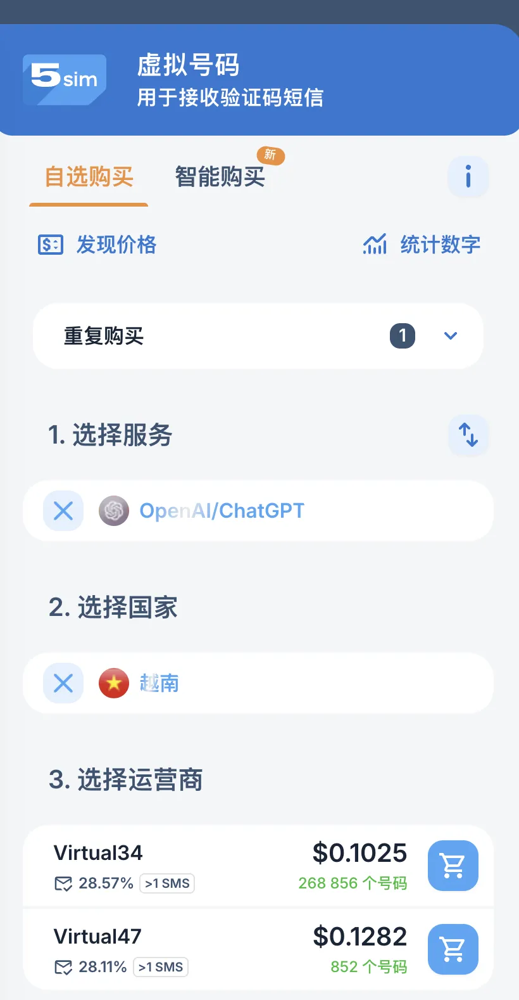
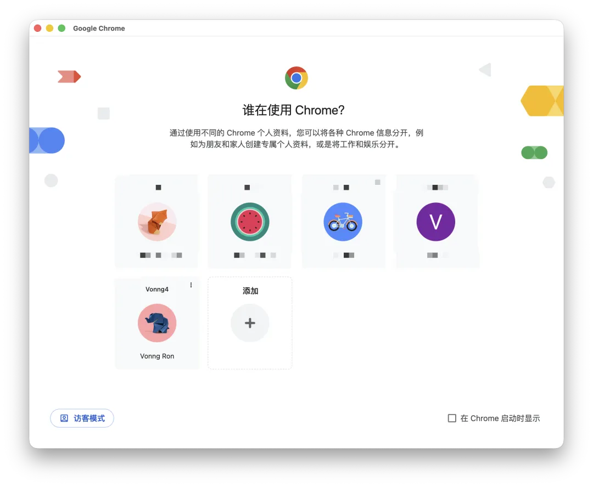
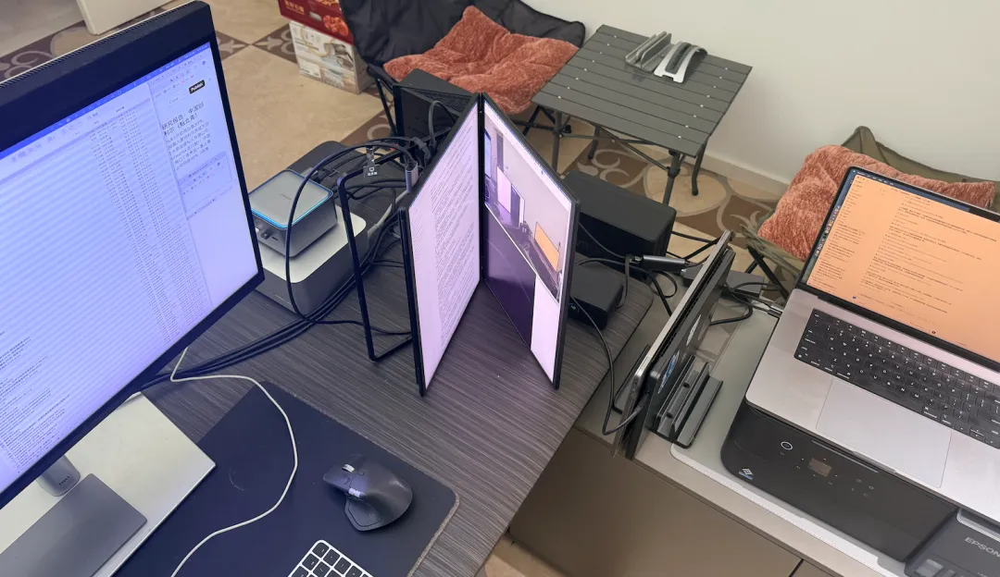
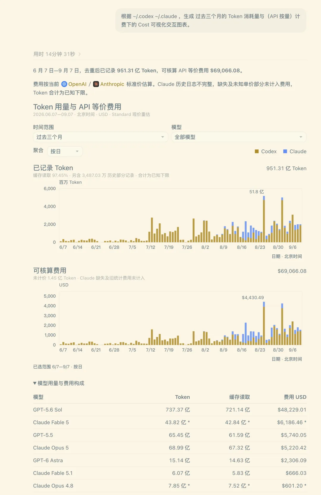

People often ask in the comments on my articles: How did you get 10 subscriptions, and how could you possibly use them all up? Here's the practical version. It really comes down to two steps: buy 10 subscriptions, then use up 10 subscriptions.

Buying them just takes a little money. **A problem you can solve with a little money isn't much of a problem.** The hard part is this: do you have problems worth spending 10 subscriptions on?

## 1. First, Make Sure You Can Buy Them

To hold 10 AI subscriptions at once, you need six things:

1. An internet connection that can reach these services from China.
2. Email addresses.
3. A phone number (**possibly**).
4. A foreign-issued payment card that works.
5. A browser that lets you switch identities quickly.
6. One or more machines to run everything on.

### Email: The Easy Part

Set up email on your own domain. Microsoft's, Alibaba Cloud's, and Google's business email services all work, as does Apple's iCloud+. Once you own a domain, you can create as many email addresses as you like. For up to five subscriptions, the easiest option is to connect five custom domains to iCloud+. It takes a few minutes.

### Phone Numbers: More Trouble, but Manageable

Numbers from mainland China and Hong Kong generally don't work. Fortunately, **not every subscription requires a phone number**. OpenAI usually only prompts for a one-time verification when an account triggers its risk checks. If that happens, a service that receives SMS verification codes can get you through it. It's a one-time check; a 5-yuan top-up can last a long time.

A 28% success rate. Give it a few tries.

### Payment: Where Most People Get Stuck

For a single subscription, Apple's U.S. store may be the easiest route: link a U.S. Apple ID to PayPal, then link PayPal to a Visa card issued in China. I've tested this; the payment goes through. I've heard Google Play works much the same way. Gift-card options have also appeared recently. Having someone buy one and send it to you should work, too.

But that setup won't stretch to 10 subscriptions. At that point, you need a proper credit card issued abroad. I use an Airwallex card through my company, with payments and invoicing handled in one place.

### Browser: Chrome Is Enough

Chrome profiles are almost tailor-made for this: each profile has its own login sessions, and you can switch with a click. I keep two ChatGPT accounts and one Claude account in each profile. When I exhaust a quota and need another account, I just switch.

### Machines: The Limit on Parallelism

Many tasks need an actual environment to run in.

The command line is easy. With Codex, changing the `CODEX_HOME` environment variable lets you switch identities on the same machine under the same OS user. You can also use this trick to warm up accounts in batches. Desktop apps and Computer Use don't work that way, though, so the most straightforward way to run them in parallel is to have more devices. OpenAI previously said it had bought tens of thousands of Mac minis. My guess is that this is what they're for.

An aside: people keep tinkering with [Omarchy](https://mp.weixin.qq.com/s?__biz=MzU5ODAyNTM5Ng==&mid=2247492948&idx=1&sn=7980b550ad292eae81a2bc613cab99a3&scene=21#wechat_redirect) or Windows. If you're working with AI, skip the tinkering and use macOS on the desktop. The reason is simple: the developers all use macOS, and toolchains always get optimized for the machines their developers use first. The Computer Use experience on macOS is in a different league from the other platforms.

I have quite a few computers at home. Right now, I run five local machines and five cloud computers, with one account on each. The local machines also need to stay active.

That's the whole setup. Don't ask me for the fine details, or to buy subscriptions on your behalf—that sort of arrangement breaks the rules. I've pointed out the route; you'll have to work out the rest. **If you're willing to find a way, there's always a way.**

(I've covered all of this in detail in earlier articles, but they were taken down one by one.)

---

## 2. The Real Question: Can You Use Them Up?

Before you think, “I want to buy 10 subscriptions,” consider the more useful question: can you actually use all 10 up?

I consume roughly **four weekly quotas per day**. I'm talking about the $200 subscriptions with the full quota. Without any resets, my normal weekly consumption is 4 × 7 = 28 weekly quotas—the equivalent of 28 subscriptions at $200 each.

Here's the usage on my main computer. I haven't bothered tallying the other machines. I'd estimate I've burned through 300–400 billion tokens over three months.

Fortunately, Tibo, our patron saint of quota resets, keeps hitting the reset button for us. For a while, that was just enough to keep up. Recently, I added a few Plus subscriptions specifically to collect reset credits. I've stockpiled more than 20 of them. When I need the capacity, I can upgrade an account to the $200 tier and immediately have four full weekly quotas available.

Do the arithmetic and there's only one conclusion: **subscription fees aren't the bottleneck. Compared with hiring people to do the work, AI subscriptions are absurdly cheap. I can't imagine a company being unable to afford this much.**

**The real bottleneck is how efficiently you turn that capacity into useful output.**

Sure, you can ask AI to read a codebase 10 times over and burn through tokens quickly. But what's the point? Productivity has never been about how many tokens you consume. It's about how much useful work you get out of them.

This is the awkward position many companies and organizations find themselves in: the only thing they can quantify is their employees' token consumption. But once you make token consumption a performance metric, token consumption is all you'll get. Require everyone to burn 100 million tokens a day, and they'll find a way to burn 100 million tokens a day. **Goodhart's law.**

---

## 3. Scale Yourself

So what does it take to put all that capacity to work? Using up 10 subscriptions doesn't feel difficult to me; I still have time for other things. If I really pushed it, I estimate it would take 20 to 30 subscriptions at the 20× tier to meet my demand.

There's one key principle: **keep automating steps in the process so the system does the work for you.**

Take one example from my own work. Building a new PostgreSQL extension used to be a struggle. I had to check, edit, and validate everything by hand, one item at a time. But after accumulating hundreds of working examples and getting the entire process running, updating an extension now takes a single sentence:

> This extension has a new release. Follow the SOP to update it.

It fetches the latest source, compiles and builds it, runs thorough smoke tests, and publishes it straight to the production package repository. Almost the entire process is automatic. A daily background scan finds new extension releases. Maintaining my other content sites, assigning work after updates to the PostgreSQL website, and processing news and blog posts all follow the same pattern.

In fact, I don't even need to say that sentence. A scheduled task searches PGXN, GitHub, and Google every day, finds new extensions, watches existing ones for updates, and automatically triggers the build and maintenance process.

Building systems like these is where most of my effort goes now.

**The key is to do work whose returns compound.**

And to get those compounding returns, you first have to do a lot of things that don't scale. Building a fully automated delivery pipeline takes a daunting amount of manual work up front. I've spent two full years building this up, with a substantial share of that time going into manual maintenance of the pipeline. But once the automation is in place, the ongoing maintenance cost can become astonishingly low.

As I've said before: **AI multiplies your capabilities; it doesn't just add to them.** In capable hands, it can go beyond multiplication and deliver exponential, compounding returns. Don't approach it with linear thinking. Use it to build more—and more capable—systems that put AI capacity to work.

The approach really comes together when those systems can run on their own and start expanding your cognitive bandwidth. The central task is to **scale your own critical resources**: your time, your attention, and your ability to judge whether the results are good enough. Those are the truly scarce resources. Detailed checks used to require human review. As models improve, we'll be able to delegate those checks entirely and review only the overall result ourselves.

---

## Epilogue

Today is September 7, the date my quotas were due to reset on their normal schedule after the last Tibo reset. So I went back to my usual all-out routine and burned through four 20× subscriptions in a day, plus a Claude subscription.

With the release of Astra 6 in particular, many projects built using SOL or even earlier models deserve another pass. For example, I ran Astra over SILO, the object storage system I maintain, and found and fixed a batch of previously undetected problems. This is where improvements in model capability become most tangible.

Ultimately, neither buying 10 subscriptions nor using them all up is the hard part.

**The real challenge is this: what work do you have that could burn through all 10?**
