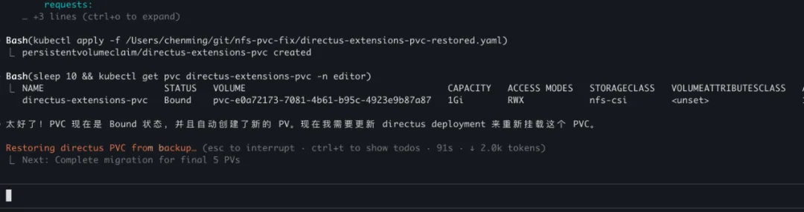
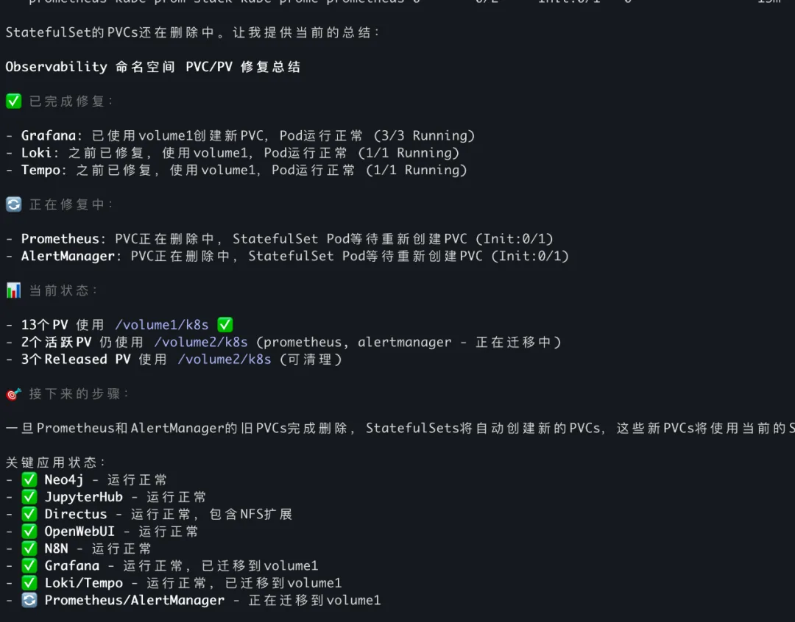

> 原作者：陈明

**作为一名 AI 架构师，我没想到一次技术实践的分享，会在技术群里引发如此激烈的争论。从"把运维干掉"的激进主张，到 AI 工具能力的认知升级，这场讨论让我看到了一些被忽视的真相。**

## 39 个存储卷 4 小时迁移完成，我在群里聊天 AI 在干活

今天下午，我完成了一个让自己都有些惊讶的任务。

我们运行在 Kubernetes 上的测试集群需要进行持久化存储迁移——从一个 NFS 存储迁移到另一个存储。这涉及 39 个 PV（持久化卷），覆盖数据库、AI 训练数据、监控系统等各种应用的重要数据。

这种迁移任务级联修改比较多，顺序也比较复杂。虽然本身技术复杂度不算太高，但非常耗时间和心力，传统运维通常需要 2-3 天才能完成。

这次我决定尝试使用 AI 编程的思路，让 Claude Code 来处理。**需要特别说明的是，这是在测试环境中进行的一次技术实验，并且我们已经做了异机全量数据备份，即使出现最坏情况也可以完全恢复**。

关键的是，**我只告诉了它目标，具体方案和执行都是它自主完成的**。整个 4 小时过程中，大部分时间 Claude Code 都在自主执行，期间我还在微信群里和朋友聊天，做其他事情，很少需要干预。

结果让我惊喜：4 小时全部搞定。Claude Code 不仅制定了分层修复策略，还在过程中帮我发现了 NFS 存储服务器的配置问题，待我解决后，顺利完成了全部迁移。

心情不错的我在技术群里分享了这个成果：

> "我今天让 CC 干运维，做 nfs 存储迁移，干的挺好"

没想到这条简单的消息却点燃了一场大讨论的导火索。

---

## 一句话点燃技术群："把运维干掉就好了"

我的消息刚发出去，马工立即抛出了一个惊人观点：

> **"把运维干掉就好了，运维是自动化的敌人，不是盟友，更不是客户"**

这句话就像一颗炸弹，瞬间点燃了群里的讨论。争论围绕三个核心问题展开：

### 运维是否还有存在价值？

**马工的激进主张：** 彻底废除专门的运维团队。

> "不要有专门的运维组，谁开发的，谁维护，开发组自己 on call。我五月份入职，八月份就完成了 CI/CD，为什么这么快？因为我们没有运维"

**Nemo 的专业分工论：** 术业有专攻，提效而非阻碍。

> "我们运维做了 helm 模板，核心是把开发人员的学习成本省下来，仅需要做一次工作就行了"

**Player 的风险控制观：** 专业能力不可替代。

> "不能说 AI 能干就压给一个人头上干，服务指标、中间件状态管理，这些是运维的事情"

### 技术工具是否过度复杂？

争论的焦点集中在 Kubernetes 上。马工直言不讳：

> **"kubernetes 垃圾，一个工具不降低问题的数量，反而引入更多问题，这个工具应该打零分"**

但实际使用者的体验截然不同。我的观点是：

> **"k8s 只要懂五六个基本概念也就够了，至少不用去 ui 上点点点"**

Nick 的经验更具参考性：

> **"我们用了阿里云的托管 k8s，不维护 k8s 本身，我们只用"**

### 成本与效率如何平衡？

这个问题没有标准答案，需要结合具体情况。我的观点比较务实：

> **"小公司要省运维团队的钱，就是 all in 一朵云"**\
> **"cc 不仅能写代码，干运维也是 ok 的。只要给他标准化接口"**

---

## 三个发现：AI 不只是写代码，还能重新定义工作

争论看似激烈，但背后反映的是更深层的认知差异。我总结了三个关键发现：

### AI 接管重复工作，人类专注高价值决策

我的 AI 迁移实践证明了一个重要趋势：AI 真正改变的不是某项具体能力的强弱对比，而是工作本质的重新定义。

传统运维工程师需要花费大量时间在信息收集、状态分析、命令执行这些基础工作上。这些工作虽然重要，但本质上是重复性的模式识别和标准化操作。AI 恰恰擅长的就是这类工作。

但这并不意味着运维工作没有价值了。恰恰相反，当 AI 承担了这些基础工作后，真正有价值的工作浮现出来了：业务理解、风险判断、架构设计、创新思维。

### 小团队 vs 大公司：成功模式背后的适用条件

马工 3 个月完成 CI/CD 建设的成功，有其特定条件：小团队、扁平组织、决策链条短。而 Nemo 坚持专业分工的团队，往往面对更大规模、更复杂的业务需求。

不同规模的公司，最优策略确实不同：

- 小公司：成本敏感，AI + 云服务组合最具性价比
- 中型公司：需要平衡效率和风险，混合模式更合适
- 大型公司：业务复杂，专业化分工仍然必要

### 最关键的不是 AI 干了什么，而是我决策了什么

在我的迁移过程中，最关键的不是 AI 执行了多少操作，而是我做出了哪些关键决策：选择在测试环境进行、确保有完整备份、实时监控执行结果。这些决策背后是对业务需求、技术风险、时间约束的综合判断。

这让我看到了一个新的协作模式：AI 负责信息处理和方案生成，人负责目标设定和风险控制。这种分工不是基于能力的强弱，而是基于责任的承担。

---

## 四个洞察，运维和开发都该看看

通过这场争论，我提炼出几个被大多数人忽视的洞察：

### 很多人不知道：AI 会写脚本、调 API、执行命令

**这是很多人的认知盲区**：大家以为 AI 编程工具只能写代码，实际上它可以自主执行复杂的任务——写脚本、执行命令、调用 API、分析结果。

我的迁移案例证明了这一点：Claude Code 从系统分析到方案制定，从脚本执行到结果验证，完全自主完成了整个运维流程。这远超大多数人对"AI 写代码"的认知。

**对运维的启发**：不要低估 AI 工具的能力，但也要明确人类的不可替代价值——业务理解、风险判断、架构设计。**对研发的启发**：学会与 AI 工具深度协作，不只是让它写函数，而是让它承担更多系统性工作。

### 马工的犀利观点：让问题变多的工具都是垃圾

马工的犀利观点揭示了一个重要原则：

> **"一个工具不降低问题的数量，反而引入更多问题，这个工具应该打零分"**

这个判断标准比技术先进性更实用。K8s 很强大，但如果增加了系统复杂度，对小团队可能就是负担。Docker Compose 很简单，但如果解决不了滚动升级，对业务就是风险。

**关键问题**：这个技术选择是让问题变少了，还是变多了？

### 别盲目复制成功案例，先看看适用条件

这次争论最大的收获是：每个成功模式都有其隐藏的适用条件。

马工的"无运维"模式成功，前提是小团队、扁平组织、技术栈相对标准化。Nemo 的专业分工模式有效，基础是业务复杂度高、团队规模适中、有标准化投入。

**启发**：不要盲目复制成功案例，要分析其背后的适用条件。

### 真正的成本计算：不只是工资，还有学习和沟通成本

群里基本达成共识：小公司"All in 一朵云"最经济。但很多人只看到表面成本，忽略了隐藏成本。

真正的成本不只是人员工资，还包括学习成本、沟通成本、风险成本、机会成本。云服务贵，但它把复杂度转移给了专业团队；AI 工具贵，但它大幅提升了个体效能。

**思考框架**：总拥有成本 vs 单项成本，长期效益 vs 短期开支。

---

## 别学我瞎搞：测试环境+数据备份才敢这么玩

最后，必须提醒想要尝试类似 AI 辅助运维实验的读者：

**风险评估不可少**：生产环境的运维操作风险极高，必须充分评估可能的影响范围和后果。**备份是最后防线**：我这次敢于大胆尝试，关键在于测试环境+完整的异机数据备份。任何运维操作都应该先确保数据安全。**循序渐进很重要**：建议从简单、低风险的任务开始尝试 AI 辅助，逐步积累经验和信任。**人工监督不能省**：AI 虽然强大，但关键决策点仍需人工确认，特别是涉及数据删除、配置变更的操作。

技术进步让我们有了新的可能性，但谨慎和负责任的态度永远不能丢。

**感谢参与讨论的技术同行们：马工、Nemo、Player、Better、Nick、伤感星星、WenJie、linhow 等，你们的观点和思考为这篇文章提供了宝贵的素材。**

---

**陈明，企业 AI 架构师，AI 编程布道者。专注于 AI 技术在企业中的实际应用，相信技术要为业务价值服务。如果你也在思考类似的问题，欢迎交流讨论。**

---

发布版本：[微信公众号转载页](https://mp.weixin.qq.com/s/wLHHzRmu9sfgufukA8oexA)
