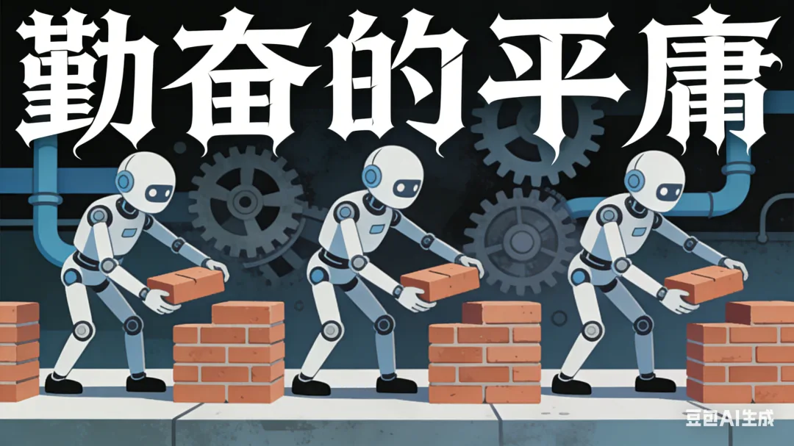
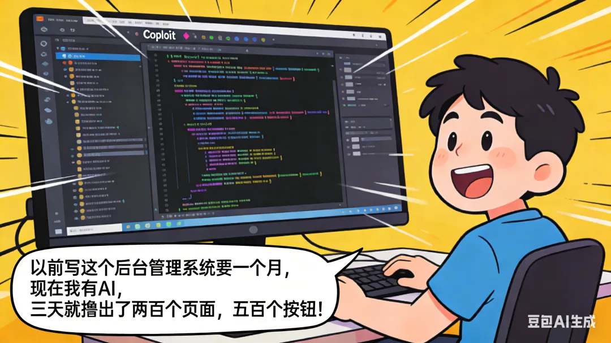
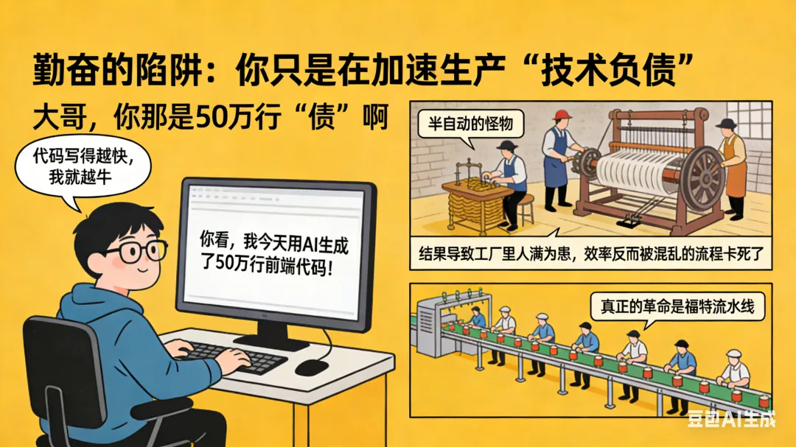
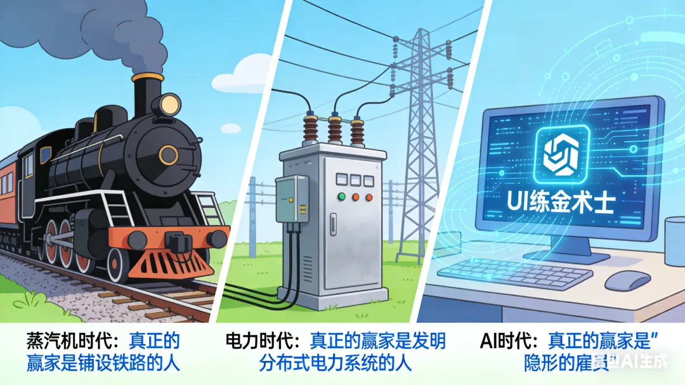

> 原作者：会说话的波吉

说实话，我最近看了一些所谓的“AI 赋能”项目演示，看完之后真的想把手里的咖啡泼到屏幕上。

现在的互联网圈子有一种极度荒诞的现象：大家手里握着人类历史上最强的“思维核武器”，却忙着在数字世界里复刻马车时代。这就好比瓦特刚把蒸汽机改好，一帮人兴奋地冲过来说：“太棒了！快，把这玩意儿装在木头上，做一对能跑的‘机械马腿’，这样我以前那辆破车就能跑得跟真马一样快了！”

这种“勤奋的平庸”，真的让人看出了某种后现代的恐怖感。

## 蒸汽马车的幽灵：为什么我们要用核反应堆去烤红薯？

你回想一下 18 世纪。那时候蒸汽机刚出来，那可是能翻江倒海的力量。可当时那帮“发明家”是怎么想的？他们第一反应不是铺铁轨造火车，而是怎么让这台笨重的锅炉模仿马的动作。

他们真的造出了“蒸汽马”。底座是四个轮子，前面支棱着两根铁架子，靠活塞驱动左右乱踢，试图模拟马蹄蹬地的样子。结果呢？那玩意儿除了把路面刨烂、把自己震散架之外，一无是处。直到有人脑子转弯了：**“我们为什么要学马？我们要的是动力，动力直接推轮子不就完了吗？”**

现在的 AI Coding 就是这种状态。

现在的程序员，拿着 Copilot 或者大模型，在那儿疯狂地生成代码。生成什么呢？生成成百上千个复杂的 React 组件，生成几十层嵌套的菜单，生成各种精美的、带有平滑动画的侧边栏。他们自豪地宣布：“以前写这个后台管理系统要一个月，现在我有 AI，三天就撸出了两百个页面，五百个按钮！”

兄弟，醒醒吧。这不就是当年的“蒸汽马腿”吗？

你用 AI 去写一大堆低效的 UI 操作，本质上是在用核反应堆去烤红薯。**如果一个任务需要用户点击 10 次按钮、翻过 3 个页面、填写 15 个输入框才能完成，那么不管这些按钮和输入框写得多么精美、代码生成得多么快，这个软件在逻辑上就是个“工业垃圾”。**

AI 的真正威力是 Agent（智能体），是直接理解意图并执行。可大家偏不，大家非要在“怎么让用户点得更爽”这棵歪脖子树上吊死，而不去想“为什么非要让用户点这一下”。

## 别再给“拐杖”做抛光了，UI 其实是文明的伤疤

咱们得聊点深刻的：UI 到底是什么？

说白了，**图形用户界面（GUI）是人类在“没法直接跟机器沟通”时的无奈妥协。**因为机器只认二进制，你没法跟它直接说“帮我把去年的差旅费报了”，所以你才需要一个叫“报销系统”的软件。你得通过各种按钮、输入框、下拉菜单，像玩解谜游戏一样，把你的意图翻译给机器听。

UI 就是人类沟通能力的“拐杖”。

可现在 AI 已经能听懂人话了。它能理解你的语境，能调用 API，能像个真人一样去思考。结果呢？这帮开发者还在那儿叮叮当当地打磨这根“拐杖”。他们甚至在想：“怎么用 AI 给这根拐杖镀个金？怎么让拐杖在拄地的时候能发出动听的音乐？”

这就是典型的“工具路径依赖”。

当年的工厂主刚用上电动机的时候，也干过这种蠢事。他们把工厂中央那台巨大的蒸汽机拆了，换成一台巨大的电动机，然后依然通过那一套极其复杂、极其低效的皮带天轴系统，把动力传导给每一台机床。只要那根主皮带一断，全厂还是得歇菜。

他们没意识到，电的真正革命在于**“分布式动力”**。每一台机器都可以自带小电机，根本不需要那根沉重的“天轴”。

现在的 UI 就是软件里的“天轴”。所有的功能都被重重地捆绑在一个可视化界面上。你为了改一个参数，得先登录，再找一级菜单，再找二级菜单……这种操作逻辑在 Agent 时代就像裹脚布一样臭。**真正的 AI 思维，应该是让界面“隐形”。**任务应该像水流一样，在后台由 Agent 自主调度完成，而不是让用户在屏幕前像个猴子一样点来点去。

## 勤奋的陷阱：你只是在加速生产“技术负债”

现在很多开发者有一种幻觉：代码写得越快，我就越牛。

“你看，我今天用 AI 生成了 50 万行前端代码！”

大哥，你那是 50 万行“债”啊。

在工业革命初期，那种靠手摇的纺织机被水力织布机替代时，也有一波人疯狂地制造那种“半自动”的怪物。它们需要大量的人工介入，只是动作快了一点。结果导致工厂里人满为患，效率反而被混乱的流程卡死了。

真正的革命是福特流水线。福特不是让工人动作变快，而是重新定义了“造车”这件事的逻辑。

我们现在的 AI 编程，大多还在“手动模式”里打转。程序员在 AI 的帮助下，成了“更高级的代码搬运工”。你写了一大堆处理 UI 交互的逻辑，处理表单校验的逻辑，处理页面跳转的逻辑……这些逻辑在 Agent 看来全是噪音。

**如果你还没意识到“Prompt is the new interface”，那你就是在自掘坟墓。**

未来的高效软件，界面应该简单到令人发指，甚至根本没有界面。你告诉 Agent 你的目标，它自己去对接数据库，自己去调用三方接口，自己去处理异常，最后给你个结果。

如果你还在纠结“怎么用 AI 帮我实现一个炫酷的、带拖拽功能的复杂看板”，那你就是在给即将报废的马车换真皮座椅。那些堆砌出来的 UI 逻辑，在五年后回头看，就是一堆不可维护的、散发着恶臭的数字排泄物。

## 为什么大家都在装睡？

既然道理这么简单，为什么大家还在疯狂写 UI？

这事儿说起来挺损的。

第一，是因为“可交付物的幻觉”。老板和客户是看不懂 Agent 逻辑的。如果你告诉他，你写了一个无影无踪的逻辑流，帮公司省了 100 个人，他可能觉得你在忽悠。但如果你给他演示一个花里胡哨、满屏都是按钮和图表的后台管理系统，他会觉得这钱花得值。这叫“视觉上的勤奋”。

第二，是“控制欲的春药”。很多产品经理害怕失去控制感。如果用户一句话就把事办了，那产品经理设计的那些“转化路径”、“留存埋点”还有什么用？他们需要把用户圈禁在 UI 的迷宫里，这样他们才觉得自己是数字世界的上帝。

但这不就是当年的“灯泡收税员”吗？电力刚普及的时候，有人提议按灯泡数量收费，因为他们觉得灯泡才是核心。他们看不见背后奔涌的电流。

现在的软件开发模式，正处于这种“收灯泡税”的末期。

## 未来的软件，应该是“隐形的雇员”

我们要谈谈真正的变革了。

在蒸汽机时代，真正的赢家不是造蒸汽马的人，而是铺设铁路的人。在电力时代，真正的赢家不是造巨型电机的人，而是发明分布式电力系统的人。

在 AI 时代，真正的赢家，不会是那些“UI 练金术士”。

你应该思考的是：**如果界面完全消失，我的业务逻辑还能跑通吗？**

想象一下，你不再是一个“软件使用者”，而是一个“发令者”。

- **过去：**你打开 ERP，点开库存，点开导出，选时间段，下报表，再打开 Excel，做透视表……

- **现在：**某些人用 AI 把这个流程写快了点，按钮更顺滑了。

- **未来：**你跟 Agent 说：“分析上周库存损耗，把异常项发给采购，顺便抄送给我。”

后面这一套，不需要任何 UI，不需要任何前端框架，只需要一个聪明的 Agent 和一堆调理清晰的 API。

这才是真正的“工业革命”。我们要的是**生产力的解放**，而不是**操作行为的加速**。

如果我们还在利用 AI 去编写那种需要人类耗费大量精力去“交互”的软件，那我们就是在羞辱人工智能这个词。我们正在亲手建造一座座精美的、由代码堆砌而成的监狱，然后把自己关进去，还为牢笼的栅栏被 AI 刷得锃亮而沾沾自喜。

## 别做最后一个马车夫

历史的潮流从来不跟人商量。

当初，伦敦街头满是马粪的时候，大家都觉得解决办法是招募更多的清道夫。没人预见到，汽车一响，马粪和马夫都会一起消失。

如果你现在还在执着于“用 AI 提升 UI 开发效率”，那你就是那个正在苦练“扫马粪速度”的清道夫。

别再迷恋那些繁琐的操作流了。去思考 Agent，去思考自治系统，去思考怎么让机器像人一样协作，而不是让机器教人怎么点按钮。

把那堆该死的 UI 代码删了吧。**我们要的是一个会干活的员工，而不是一本需要我们亲自翻阅、亲自操作的、厚得要命的“高级使用说明书”。**

在这个时代，最顶级的软件思维，是**克制自己写 UI 的冲动**。真正的天才在创造 ClawdBot，而你却在用算力制造 “垃圾”。

---

发布版本：[微信公众号转载页](https://mp.weixin.qq.com/s/CZX1AFIqH9f3rM1NXx0jTA)
