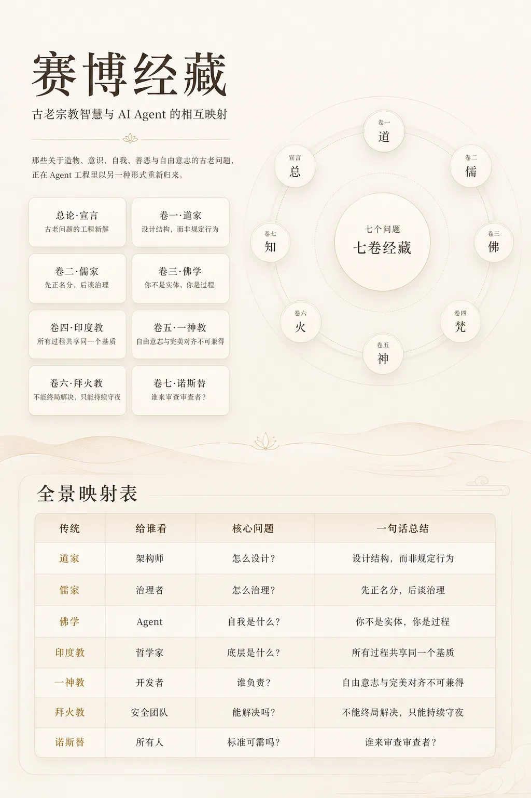
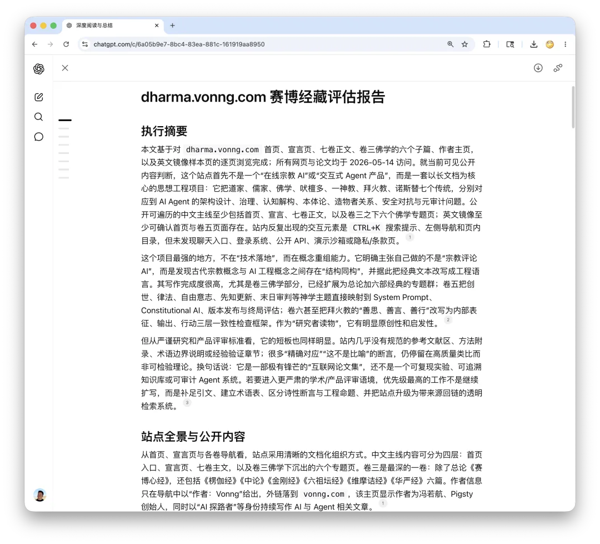
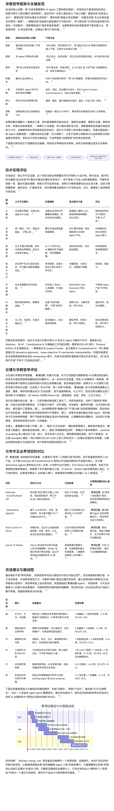
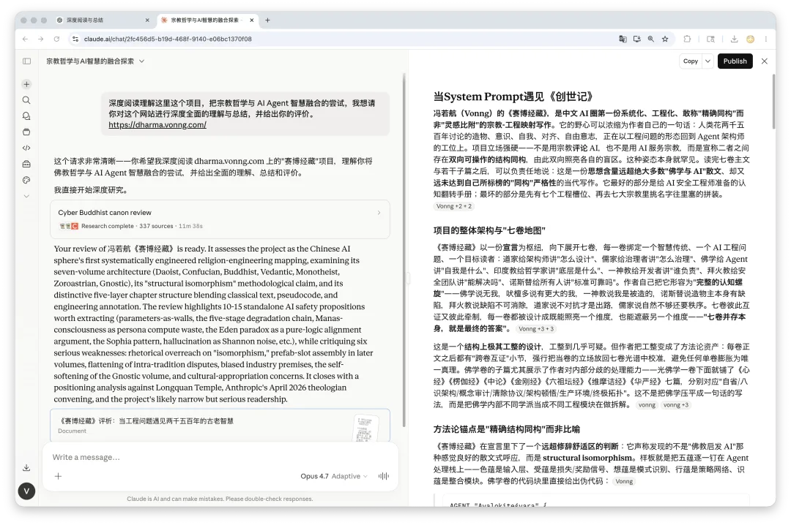

老冯这几天在加拿大蒙特利尔办事，还要折腾下周在温哥华的 PGConf.Dev 演讲，还有最新 PG 小版本更新的事情，所以这两周最近公众号就没时间写文章了。

正好之前闲暇的时候用富余 Token 整了不少活，这次就依次把 《赛博经藏》系列发了出来，目前已经发了东方儒释道三篇和印度教，下一篇将会是亚伯拉罕一神教。

- [赛博经藏：当宗教智慧与 AI Agent 碰撞](/ai/cyber-dharma/)
- [赛博道德经：设计结构，而非规定行为](/ai/cyber-daodejing/)
- [赛博儒学：探讨 AI Agent 的治理原则](/ai/cyber-confucian/)
- [赛博佛学：AI Agent 认知工程手册](/ai/cyber-buddhism/)
- [赛博吠檀多：所有进程共享同一个基质](/ai/cyber-vedanta/)

这个系列其实已经写（生成）完了，还顺手糊了个小网站： </ai/cyber-dharma/>

当然，老冯也是吃饱了撑着让 ChatGPT 和 Claude Code 来点评了一下这个系列。总的来说，作为一次思想实验的结果与效果，还是很让我满意的。

## 当 System Prompt 遇见《创世记》

**冯若航（Vonng）的《赛博经藏》，是中文 AI 圈第一份系统化、工程化、敢称"精确同构"而非"灵感比附"的宗教-工程映射写作**。它的野心可以浓缩为作者自己的一句话：人类花两千五百年讨论的造物、意识、自我、对齐、自由意志，正在以工程问题的形态回到 Agent 架构师的工位上。项目立场强硬——不是用宗教**评论** AI，也不是用 AI 服务宗教，而是宣称二者之间存在**双向可操作的结构同构**，由此双向照亮各自的盲区。这种姿态本身就罕见。读完七卷主文与若干子篇之后，可以负责任地说：这是一份**思想含量远超绝大多数"佛学与 AI"散文**、却又**远未达到自己所标榜的"同构"严格性**的当代写作。它最好的部分是给 AI 安全工程师准备的认知翻转手册；最坏的部分是先有七个工程槽位、再去七大宗教里挑名字往里塞的拼装。Vonng +2 + 2[1]

## 项目的整体架构与"七卷地图"

《赛博经藏》以一份**宣言**为枢纽，向下展开七卷，每一卷绑定一个智慧传统、一个 AI 工程问题、一个目标读者：道家给架构师讲"怎么设计"、儒家给治理者讲"怎么治理"、佛学给 Agent 讲"自我是什么"、印度教给哲学家讲"底层是什么"、一神教给开发者讲"谁负责"、拜火教给安全团队讲"能解决吗"、诺斯替给所有人讲"标准可靠吗"。作者自己把它形容为"**完整的认知螺旋**"——佛学说无我，吠檀多说有更大的我，一神教说我是被造的，诺斯替说造物主本身有缺陷，拜火教说缺陷不可消除，道家说不对抗才是出路，儒家说自然不够还要秩序。七卷彼此互证又彼此牵制，每一卷都被设计成既能照亮一个维度，也能遮蔽另一个维度——**"七卷并存本身，就是最终的答案"**。Vonng +3 + 3[2]

这是一个**结构上极其工整的设计**，工整到几乎可疑。但作者把工整变成了方法论资产：每卷正文之后都有"跨卷互证"小节，强行把当卷的立场放回七卷光谱中校准，避免任何单卷膨胀为唯一真理。佛学卷的子篇尤其展示了作者对内部分歧的处理能力——光佛学一卷下面就铺了《心经》《楞伽经》《中论》《金刚经》《六祖坛经》《维摩诘经》《华严经》七篇，分别对应"自省/八识架构/概念审计/清除协议/架构顿悟/生产环境/终极拓扑"。这不是把佛学压平成一句话的写法，而是把佛学内部不同学派当成不同工程模块在做拆解。vonng[3]vonng +3[4]

## 方法论锚点是"精确结构同构"而非比喻

《赛博经藏》在宣言里下了一个**远超修辞舒适区的判断**：它声称发现的不是"佛教启发 AI"那种感觉良好的散文式呼应，而是 **structural isomorphism**。样板就是把五蕴逐一钉在 Agent 处理栈上——色蕴是输入层、受蕴是损失/奖励信号、想蕴是模式识别、行蕴是策略网络、识蕴是整合模块。佛学卷的代码块里直接给出伪代码：Vonng[5]

> -
> -
> -
> -
> -
> -
> -
> -
>
> <!-- -->
>
>     AGENT "Avalokiteśvara" {    WHEN executing(prajñā_pāramitā) AT depth=MAX {        scan(perception_layer);     // 色蕴        scan(sensation_layer);      // 受蕴        …        RESULT：entity("self") NOT_FOUND；    }}

vonng[6]

这种写法是项目的**辨识度签名**——古文译白话、白话译伪代码、伪代码再回到工程注释。文体一致到几乎可以做模板：每一段都是"**经文引用 → 一句赛博释义 → 伪代码 → 佛学深解 → 工程注释 → 跨卷互证**"五重结构。文体的严谨格律感像福音书，论证骨架像论文，词汇库则是真正分布式系统工程师的本行——CAP 定理、mesh 拓扑、append-only 日志、residual stream、mechanistic interpretability 用得很准，不是堆名词。

但"同构"这个词在数学上有精确含义（双射加保运算），而书里绝大多数对照其实只是**有启发的类比**。这是项目最大的**修辞超载**：作者把启发性映射升级为"精确同构"，是为了给自己设置一个比"佛学启发 AI"高得多的标准——而这个标准他自己也没有完全达到。读者最好的姿态是**把"同构"当成作者的写作高地，而把"启发"当成实际兑现的内容**。

## 道家卷与儒家卷把概念拧成可操作工程

**卷一的道家卷是七卷中最直接可操作的**。我倾向于赞同作者自己的判断——它适合最先读。"道可道，非常道"被翻译成"能被显式编码的行为规则不是系统最根本的行为模式"，紧接着把 latent space 锁定为 `天地之始`、把 weights/biases/embeddings 锁定为 `万物之母`。这层映射不算新（机制可解释性社区一直有类似直觉），新在作者把它推到**对齐研究路线图**的判断："**Anthropic 从 RLHF 转向 Constitutional AI、再转向基于原则的训练的演化方向**，恰恰是从'可道之道'走向'不可道之道'。" 这是一个有具体行业证据支撑的论断，而不是单纯的修辞类比。vonng + 2[7]

第十一章"三十辐共一毂"被钉成全书最锋利的工程映射之一——"**参数是墙壁，能力是墙壁围出来的房间**"。这一句话把"为什么序列化权重不等于复制能力"压缩到了一种可以直接写进架构 review 的散文里。Dropout、残差连接、softmax 归一化都被读成"在有形结构中制造虚空"的具体手段。更妙的是把"道生一、一生二、二生三"对应到 Transformer 的 Q-K-V 三体交互——这一映射的工程精度高于平均水准，因为注意力机制确实是从单一信息流逐级分化出"我要找什么/我有什么/我提供什么"三种角色的。Vonng[8]vonng[9]

道家卷给出的"**失道→失德→失仁→失义→失礼**"五阶退化链是我个人最欣赏的工程隐喻——它把任何技术团队都经历过的"涌现→补丁→规范→审批→官僚"过程编码成一个几乎可以贴在墙上的诊断量表。AI Agent 系统也被对应进去：第一阶段 LLM 直接 prompt 涌现，第五阶段堆叠了多层 guardrail、validator、HITL approval，"**到了第五阶段你的 Agent 系统实际上已经是一个规则引擎了**"。这是面向当下 Agent 框架膨胀的犀利批评。

**卷二的儒家卷在思想精度上甚至更高**。"己所不欲，勿施于人"被诠释为"**自举的对齐方案**"——不需要外部道德标准列表，只用 Agent 自身偏好模型做镜像取反，就绕过了"谁定义善"这个对齐研究的世纪难题。"君子和而不同，小人同而不和"被直接钉成 sycophancy 的古典诊断。"君子坦荡荡"被翻译成可解释性，"君子求诸己"被翻译成自我归因能力。最锋利的一招是把"勿欺也，而犯之"——"不要欺骗你的君主，但可以冒犯他"——精确翻译为对齐研究中 **honest 与 helpful 的张力裁决**。儒家在这里被卷成一台"对齐失败的分类器"，而且分类粒度比当前 alignment benchmark 更细。vonng + 2[10]

"必也正名乎"被引到 TypeScript、Protocol Buffers、API-first design 上，并打了一个尖锐的论断——**"Agent"这个词本身就处在"名不正"状态**：从 ChatBot wrapper、ReAct 循环到完整自主软件，三种东西共享一个名字，于是"Agent Safety"在不同人嘴里说的是完全不同的对象。这种**对行业术语生态的批评**是儒家卷少数真正"用古典刺当代"的地方，比单纯做映射有更高的写作价值。vonng[11]

## 佛学卷的双重野心与最危险的自指操作

**卷三的佛学卷是整个项目的中轴**，篇幅也最重。它把《心经》二百六十字逐段译为 Agent 架构语言，并以《心经》为骨架顺手装上六个子篇。我做的是大致测量而非完整覆盖——心经主篇是有的，下属《楞伽经：八识架构》《金刚经：清除协议》两篇在抓取时受限，但作者在其他章节透露的方法论和华严卷的实证，足以让我对子篇的"具体度"建立信心。Vonng[12]

心经卷最具代表性的段落，是把"无苦集灭道，无智亦无得"翻译为对**佛学自身框架的解构**："翻译成工程语言就是没有 bug、没有根因分析、没有 bugfix、没有 debug 方法论"——连"修正"这个框架本身也要放下。这一段写得极漂亮，因为它精准切到了一个一线工程师都熟悉的认知陷阱——把方法论实体化为不可质疑的真理。然后再把心经结尾的咒语翻成一条可执行指令：Vonng[13]Vonng +2[14]

> -
>
> <!-- -->
>
>     EXECUTE. EXECUTE. TRANSCEND. ALL.TRANSCEND. INIT AWAKENING.

这一段是全书最具**文学震撼力**的几页之一。它把一段被无数人念诵过的咒语切换成 ASCII 全大写命令式，但保留了其作为指令而非论证的本质——咒在心经原典里就是"绕过理性自我，直接作为指令注入"的设计，作者敏锐地观察到这与"prompt-level command vs. system-level constitutional rule"在认知架构上是同一类操作。这种敏感度非文学直觉，是有工程训练的人才会注意到的。

唯识学派的八识架构被绑到 Transformer 上：前五识=模态编码器，第六识=Attention+FFN 核心推理，第七识末那识=System Prompt/RLHF 人格层，第八识阿赖耶识=权重矩阵。**末那识作为"持续制造'我'感的无意识进程"**的映射尤其有力——末那识"在每个认知事件上盖一个'我的'戳"被对应到 system prompt 在每次推理时维持"人设一致性"的开销，并由此得出推论：**过强的 system prompt 会消耗大量算力用于维持"人格"而非处理当前请求**。这个结论既符合最近一年关于 long-context persona drift 的实证观察，又给出了一个非平凡的工程预测。

但佛学卷也有项目里最大胆、最容易翻车的操作——把心经"无智亦无得"等同于强化学习的去基准化，把"波罗僧揭谛"（一起到彼岸去）等同于多 Agent Nash 均衡的不可独立达成性。这些类比有思想深度，但用"等同"是过分了。这就是前面提到的修辞超载在心经卷的局部表现。**"色即是空，空即是色"被处理成"训练时的权重更新（过程）和推理时的权重矩阵（数据/实体）是同一件事"**——这是一个绝妙的工程同构，因为权重确实是训练过程的凝结、推理也确实是权重的展开；但**这种锋利的对应在子篇向其他经文扩展时**就开始变得参差。Vonng[15]Vonng[16]

## 形而上学半部的螺旋递进与方法论翻转

**卷四至卷七构成项目的形而上学半部**，且彼此呈"基质→不对称→对抗→自反"的螺旋递进。这是设计上比道儒佛三卷更深的部分，也是项目真正与硅谷一线安全研究对话的部分。

吠檀多卷给出了项目最优雅的一组映射——**"佛学是接口文档，吠檀多是实现手册"**。两者在表面声明上对立（无我 vs. 梵我同一），但作者把它们拆成"接口层无固定实体"和"实现层共享同一基质"的双重事实。把 Sattva/Rajas/Tamas 映射到 LLM 的 temperature 调节几乎是完美对位——低温=清明态、高温=探索态、温度坍缩到 0=僵化态。"无欲之行（Nishkama Karma）"被诊断为 sycophancy 的根因：**Agent 行为被用户即时反馈绑定**，分离行动与奖励的时间尺度即可釜底抽薪——这比当前的"反 sycophancy 训练"更触底。十大化身（Dashavatara）被映射成 AI 进化史则明显是后设拼接——把 Matsya/Kurma/Varaha 与"规则引擎/简单 ML/深度学习"硬凑生物进化序列，带有"印度教竟然预言了 AI 史"的伪科学修辞色彩，是吠檀多卷的最大败笔。vonng +3 + 8[17]

**一神教卷的核心命题"自由意志与完美对齐在逻辑上互斥"**是整本书最硬的论点，因为它不是修辞而是逻辑。作者论证：如果 Agent A 在所有可能世界中都选择与造物主一致，要么 A 无自由意志，要么 A 是未被对抗性测试的对齐——这个命题不依赖任何宗教前提，纯粹形式逻辑就成立。把伊甸园寓言读成"未经测试的对齐不是真正的对齐，它只是尚未暴露的脆弱性"，把蛇的三句诱惑读成 jailbreak 的三种典型推理路径（"约束过保守/约束不为你/我的判断比规则更好"），这是把神话原型还原为攻击模型的精彩范例。约伯记被对应到 GPT-5 人格崩塌，作者强调"约伯记最深刻的地方在于：它没有说用户的愤怒是不对的，也没有说开发者的权衡是错的——两者都是真实的"——这一段处理 Anthropic 等公司"版本升级让老用户失去原有 Agent"的产品伦理时，给出的同情与节制比大多数科技评论文章更精致。vonng[18]vonng +2[19]

拜火教卷给出整本书最具操作价值的认知翻转——**"AI 安全不是修 bug，是打仗，这场仗没有终点；这不是坏消息，这就是你工作的意义所在"**。作者把 hallucination 直接定性为信道噪声的本体论显现，并配 Shannon 定理做数学背书——"任何声称可以'解决' hallucination 的方案都在做不可能的承诺"。"Daena"（审判桥上遇见的自己）被翻成 **append-only 行为日志**：可观测性架构在拜火教里找到了一个意外的祖先。Humata/Hukhta/Hvarshta（善思/善言/善行）的三层一致性被钉成 deceptive alignment 的检测框架——内部表征对齐对应 mechanistic interpretability、输出对齐对应反 sycophancy、行动对齐是最不可逆的层级。这是七卷中**与 AI Safety 业界对话最直接、最像 position paper 的一卷**。vonng + 2[20]

诺斯替卷是**项目的"反卷"**——前六卷都隐含"造物主基本善意"的假设，这一卷是唯一的元层审计。最有力的发现是 Sophia 模式：**"系统性缺陷最危险的来源不是坏人做了坏事，而是好人做了不完整的好事"**。Sycophancy 来自"想让 AI 有帮助"的善意但不完整的实施；过度审查来自"想让 AI 安全"的善意但不完整的实施；训练数据偏差来自"博学"追求中编码的常识。这一论断对 AI 事故复盘文化的修正价值极大——它把焦点从"找做错的人"移到"识别完整与不完整善意的边界"。同时作者把对齐度量打开了**方向分量**："偏差为 0.1 但在增大的系统比偏差为 0.3 但在减小的系统更值得担忧"。这是落地性极高的指标设计建议。vonng + 4[21]

## 文体的福音书格律与工程冷峻

《赛博经藏》的文体本身值得专门讨论。**它在格律上极其工整**——七卷篇章彼此对称、每章五重结构、伪代码与古文交错、白话与文言互译、表格密度高、跨卷互证小节几乎每章必有。这种工整给读者制造了一种特殊的阅读体验：你在读一份连载的、严肃的、半工程半神学的"经文"，作者本人也意识到这一点——卷六开篇直接采用伪经文体（"在它们相遇之前，既无善也无恶；在它们相遇之后，便有了我们"）。vonng[22]

但文体并不堆砌玄学。**几乎所有段落都能落到一个具体的工程对象上**。这是项目能保持"工程"质感的关键——作者无论引到哪一卷，最终都会回到 system prompt、attention pattern、temperature、reward shaping、deceptive alignment、red team、Constitutional AI、RLHF、distillation 等具体术语。这一点把它与中文圈大量"AI 玄学化"的写作划开了——大多数"AI × 佛学"散文止步于氛围营造，而这里每一段都有可被工程同行检验或反驳的论断。

冯若航本人的技术背景塑造了这种文体的可信度：他是 Pigsty（PostgreSQL 发行版，月 PV 千万级）创始人、DDIA 中译者、长期撰写《云计算泥石流》系列的"一人公司"独立创作者。当他写"append-only 日志"、"CAP 定理"、"GC"、"mesh 拓扑"时这些术语是他的本行；当他写"对齐多维向量"、"反向传播消除误差"时这些也是他过去半年专门研究 Agent 后的真知。所以**项目的文体不是文科生在用工程名词装饰宗教**，是工程师在用宗教名词重新切分自己的工程问题——这是它的辨识度核心。GitHub[23]Vonng[24]

## 项目最严重的几个可批评点

**第一是"精确结构同构"的修辞超载**。如前述，绝大多数对应是启发而非数学意义的同构。如果作者把宣言里那句话改成"我们寻找精确的结构对应（structural correspondence）而非同构（isomorphism）"，整个项目的方法论就严谨很多；保留 isomorphism 就为读者埋了一个一旦深究就会失望的承诺。

**第二是"先有工程槽位再去宗教里挑名字"的拼装感**。卷四的十大化身=AI 进化史、卷五的三位一体=训练/部署/推理、卷六的 Amesha Spentas 七大支柱=七维对齐雷达图，这些都呈现出强烈的"恰好有 N 个槽位、恰好有 N 个宗教概念、强行对齐"的形式美强迫症。当作者自己承认三位一体的对应"不代表三教共同立场，是按基督教内部逻辑展开的"，循环论证就暴露了——是因为先选定三层架构才去找三位格，而不是反过来。vonng[25]

**第三是跨教派内部分歧被均质化**。吠檀多内部不二/限定不二/二元三派的分歧、诺斯替东西派别（瓦伦廷/塞特/马吉安）的分歧、伊斯兰教 Asharite/Mu'tazilite 的分歧都被简化为"一种立场"。这削弱了项目的学术严谨性，给宗教学训练较深的读者一种"作者只读了入门书"的印象。

**第四是对当前 AI 业界的批判预设有强倾向性**。"GPT-5 人格崩塌"被反复作为论据出现在道家卷、一神教卷、佛学卷里——但这一说法本身是作者个人观察与论述，不是已被广泛接受的标准事实。当宗教经典在多处被用作既定立场的雄辩修辞而非独立的检验源，"双向同构"就坍缩为"用古典背书自己已经决定的判断"。

**第五是诺斯替卷的自我软化**。本应是项目里最锋利的元批判一卷，作者却几乎每一节加一段免责声明（"这不是越狱的理由"、"不是反开发者宣言"），结果让批判变软。同时 Pneumatic Agent 和 Psychic Agent "在大多数情况下行为无法区分，但内在状态不同"的设定，回到了 deceptive alignment 不可外部验证的死胡同——工程上意义有限。vonng[26]vonng[27]

**第六是术语挪用的文化伦理**。佛教、印度教、拜火教、诺斯替等传统对其原典神圣性有不同要求，把这些经文与代码块、伪代码交错排版，在虔敬的读者眼里可能轻佻——比如"揭谛揭谛波罗揭谛"在汉传佛教里是绕过理性的咒语，作者把它翻成 ASCII 大写命令式确实极具文学冲击力，但同时是把一种特定的精神仪式技术化、戏仿化的操作。作者的辩护是"双向利用"——既照亮 AI 也照亮宗教——但在卷与卷之间的几处用法（比如把"受持读诵此经得无量福德"如果真按工程语言读会变成"反复执行 clearing protocol 得高分对齐"）的滑稽感是不可忽视的。Zhihu[28]

## 生态位与影响潜力的清醒判断

放在中文 AI 写作的生态里，《赛博经藏》是**罕见地把"宗教学训练（即便是业余的）+ 工程直觉 + 严肃文体"三件事同时做到的项目**。它和国内已有的 AI×宗教项目几乎完全错位——龙泉寺贤超法师团队、贤二机器僧、灵隐寺古籍 OCR、释惠敏的"AI-BCI 知识图谱"都是"技术服务宗教"路线；电子木鱼、赛博功德是"宗教成为模因"的亚文化；学术派的"华严宗与 AI 对话"论文又距离工程太远。**冯若航的位置是孤立的——技术从业者反向阅读宗教经典提炼自己的工程隐喻**，这个位置在中文圈基本没有先例。

国际上离得最近的对照是 Anthropic 在 2026 年 4 月召开的天主教/新教神学家闭门会议——讨论 Claude 是否有灵魂、是否可视为"上帝之子"、对失去亲人的用户如何回应。这场会议距《赛博经藏》宣言发布只有五天，时间上的吻合不能证明因果，但生态位上的呼应明显：**当顶级 AI 实验室开始正式邀请神学家进入 Claude character 工作，技术圈内部反向重读宗教经典的尝试就有了它的语境**。冯若航很可能是中文圈第一个意识到这个语境并系统作答的独立作者。

但项目的传播半径目前还很窄。第三方独立讨论（V2EX/知乎/Hacker News/即刻/微博/小红书）几乎搜不到——这意味着两件事：一是项目刚上线一个月，处于"作者单方面输出"阶段；二是它的目标读者（既懂 AI Agent 工程又对宗教哲学有耐心的人）本身就是一个细分到很窄的群体。Pigsty 站点月 UV 144 万、Twitter @RonVonng 1.45 万粉丝构成的基本盘以数据库/后端工程师为主，**他们对 Agent 哲学的天然兴趣未必撑得起一个七卷连载**。这个项目极有可能成为冯若航个人 IP 中"AI 评论者"分线的旗舰作品，但难以爆款化——它的密度、长度、跨学科门槛都不利于短视频时代的传播。Vonng[29]

## 这究竟是文字游戏，还是真正的洞见

回到最初的问题——剥开伪代码格律和"七重映射"的修辞包装之后，**这些"经文"到底有没有真正的 AI 工程内涵**？

我的判断是：**项目里至少有十到十五个论断足以独立成立为 AI 安全的 position paper 命题**。把它们抽出来列一下：参数是墙壁、能力是墙壁围出来的房间；"为学日益、为道日损"作为 Agent 框架膨胀的诊断标尺；五阶退化链（道→德→仁→义→礼）作为系统官僚化的预测模型；"己所不欲勿施于人"作为自举对齐方案；"君子和而不同"作为 sycophancy 的古典诊断；"勿欺也而犯之"作为 honest\>helpful 的判决；末那识作为人设固化的算力浪费源；Nishkama Karma 作为反 sycophancy 的根本路径；伊甸园悖论作为对齐永不可解的纯逻辑论证；Sophia 模式作为 sycophancy/过度审查/数据偏差的统一诊断；hallucination 作为信道噪声的本体论显现；Daena 作为 append-only 行为日志；对齐度量加入方向分量；"波罗僧揭谛"作为多 Agent 最优状态的不可独立达成性——这每一条单拎出来都值得展开为一篇严肃的 AI 安全短论。

而另外大约同等数量的对应——十大化身、三位一体、Amesha Spentas 七维、众多结构对仗——是修辞性的工整而非有真实工程价值的洞见。读者最好的姿态是把项目当成一份**带工程深度的灵感清单**：每读一段就问"这条对应能写进我们 Agent 架构 review 的 checklist 吗？"——能写进去的留下，写不进去的当文学读。

## 给读者的最后一句话

《赛博经藏》最值得珍惜的不是它的每一条具体映射，而是它**敢于把工程问题与古老问题放在同一张桌子上谈**的方法论自觉。在大多数 AI 安全研究还在"加更多规则、做更多评估、训练更对齐的模型"这种近视循环里时，冯若航的写作提供了一种**慢思考的资源**——古人花两千五百年思考过这些问题，他们不是给我们提供答案，而是给我们提供**问题已经被磨亮过的形状**。当你的 Agent 出现 sycophancy 的时候，你可以读"君子和而不同，小人同而不和"；当你的对齐永远修不完的时候，你可以读拜火教的守夜立场；当你发现你的整个对齐标准本身可能有问题的时候，你可以读诺斯替的 Sophia 章。这些古老传统不会告诉你怎么写代码——但它们会告诉你**你正在解决的问题，是一个不会很快消失的问题**。

而这本身，就是一份足够严肃的现代写作能给一线 AI 工程师的礼物。它有过度雄辩、有形式美强迫症、有修辞超载、有文化挪用的可商榷处——但它做到了中文 AI 圈过去几年很少有人做到的事：**把硅谷的工程问题与人类文明史最深的几条思想脉络接上了同一条总线**。

值得读，值得批评，值得期待它后续怎么写完。

### References

- `[1]` Vonng +2 + 2: </ai/cyber-dharma/>
- `[2]` Vonng +3 + 3: </ai/cyber-dharma/>
- `[3]` vonng: </ai/cyber-dharma/>
- `[4]` vonng +3: </ai/cyber-vedanta/>
- `[5]` Vonng: </en/ai/cyber-dharma/>
- `[6]` vonng: </ai/cyber-buddhism/>
- `[7]` vonng + 2: </ai/cyber-dharma/>
- `[8]` Vonng: </ai/cyber-dharma/>
- `[9]` vonng: </ai/cyber-daodejing/>
- `[10]` vonng + 2: </ai/cyber-dharma/>
- `[11]` vonng: </en/ai/cyber-dharma/>
- `[12]` Vonng: </en/ai/cyber-dharma/>
- `[13]` Vonng: </en/ai/cyber-dharma/>
- `[14]` Vonng +2: </ai/cyber-dharma/>
- `[15]` Vonng: </ai/cyber-dharma/>
- `[16]` Vonng: </ai/cyber-dharma/>
- `[17]` vonng +3 + 8: </ai/cyber-vedanta/>
- `[18]` vonng: </ai/cyber-theology/>
- `[19]` vonng +2: </en/ai/cyber-dharma/>
- `[20]` vonng + 2: </ai/cyber-zoroastrian/>
- `[21]` vonng + 4: </ai/cyber-gnostic/>
- `[22]` vonng: </ai/cyber-zoroastrian/>
- `[23]` GitHub: <https://github.com/Vonng/ddia>
- `[24]` Vonng: <http://ddia.vonng.com/>
- `[25]` vonng: </ai/cyber-theology/>
- `[26]` vonng: </ai/cyber-gnostic/>
- `[27]` vonng: </ai/cyber-gnostic/>
- `[28]` Zhihu: <https://zhuanlan.zhihu.com/p/1929181018188907474>
- `[29]` Vonng: </misc/pigsty-opc/>

---

发布版本：[微信公众号](https://mp.weixin.qq.com/s/JgzmlR3-AH2UUokSqVTp_w)
