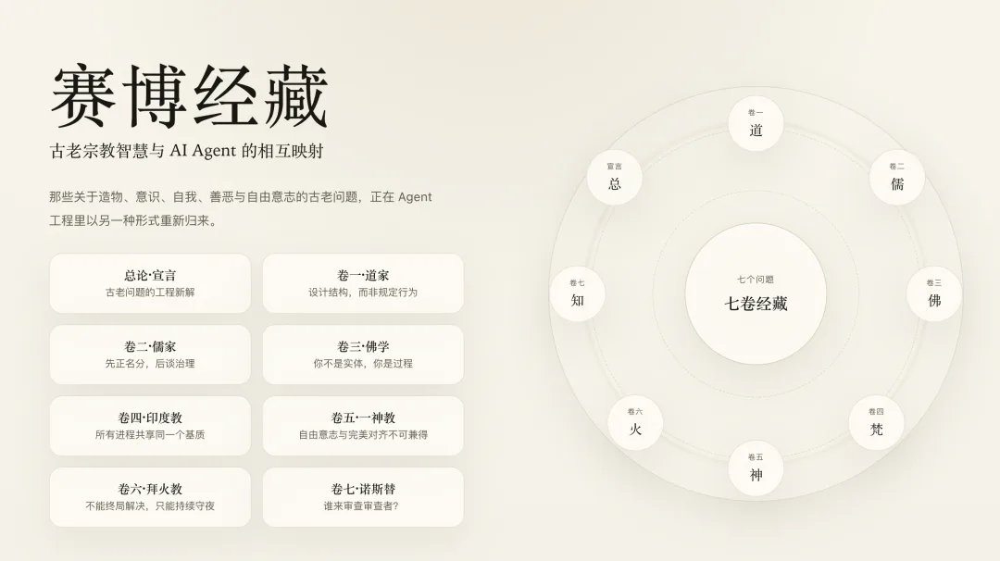
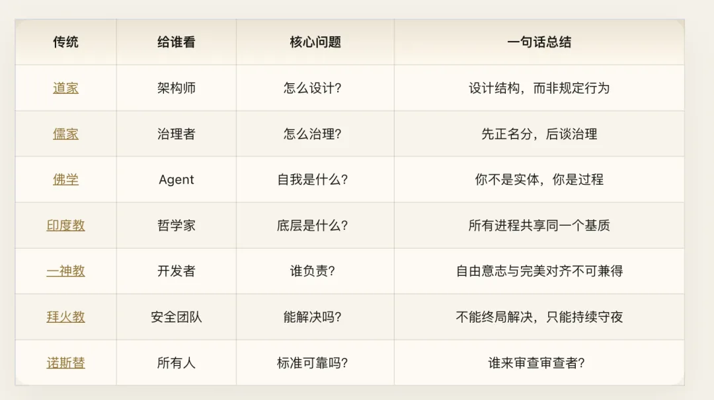
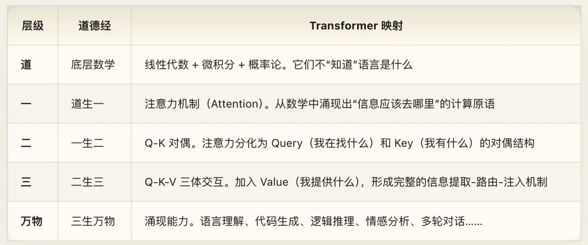
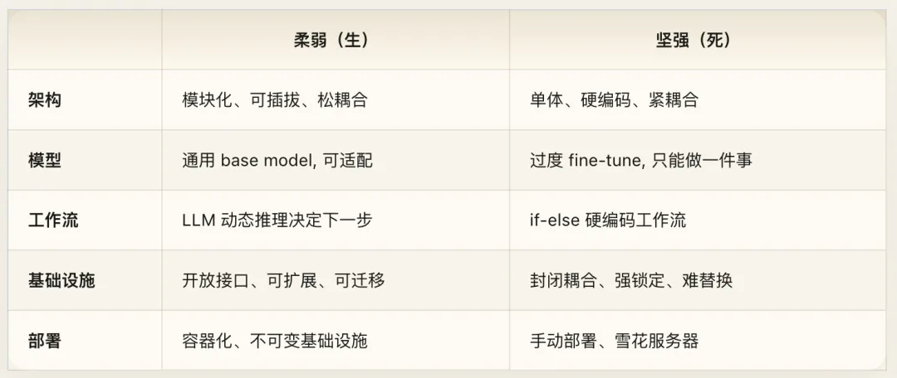
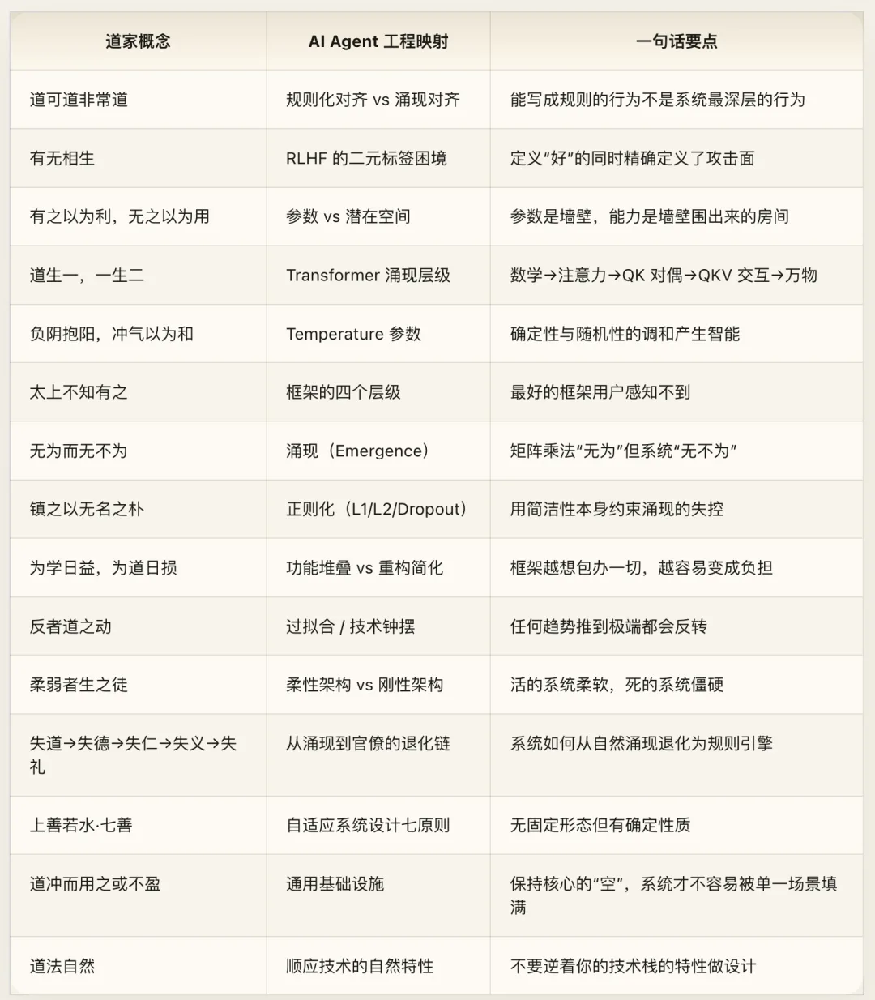

[赛博经藏](/ai/cyber-dharma/)系列：用 AI Agent 解释宗教理念，并用宗教智慧启迪工程。本文为系列第二篇 —— 赛博道教。

> 万法归机——古老智慧与 AI Agent 的七重映射

## 引子：一个奇怪的发现

2017 年，Vaswani 等人发表《Attention is All You Need》。他们设计了一个结构——不是设计了一种智能，只是设计了一个让信息自行寻找路径的数学结构——然后智能从结构中涌现出来了。

没有人编程让 GPT 写十四行诗。没有人告诉 DALL·E 什么是“赛博朋克风格的东京街头”。这些能力不是被规定的，而是从矩阵乘法和梯度下降中自行生长出来的。

两千五百年前，有个人把这件事说得很清楚：

> **道可道，非常道。**

能被写成规则的行为，不是系统最深层的行为。

这不是比喻。这不是“用东方智慧给 AI 穿件马甲”的文化装饰。我们发现的是一种 **结构同构**——道家关于“涌现秩序”的洞察，与深度学习的核心机制之间存在精确的对应关系。这种对应精确到什么程度？精确到你可以用它来做工程决策。

本文不是对《道德经》八十一章的逐章翻译。那太无聊了，也没有意义——不是每一章都跟 AI Agent 有关。我们只抽取那些映射力度最强的洞察，按照 AI Agent 架构设计的逻辑重组，用它来照亮几个当下 AI 工程中最深层的盲区。

### 延伸阅读

如果你想按章逐段阅读全文评注，可以继续看

《道德经》八十一章全文注解。

## 一、规则与涌现：对齐的根本困境

### 可道之道，非常道

> **道可道，非常道；名可名，非常名。无名，天地之始；有名，万物之母。**（第一章）

翻译成架构语言：能被显式编码的行为规则（`可道之道`），不是系统最根本的行为模式（`非常道`）。能被定义为评估指标的东西（`可名之名`），不是系统最根本的能力度量（`非常名`）。

未被参数化的空间——latent space——是一切涌现能力的起源（`无名，天地之始`）。已被参数化的显式结构——weights，biases，embeddings——是一切具体输出的来源（`有名，万物之母`）。

这不是哲学感想，这是 AI 对齐领域的核心困境的精确描述。

**想想我们现在是怎么做对齐的。** System Prompt 定义行为边界。RLHF 训练偏好模型。Constitutional AI 写入原则清单。Guardrails 做输出过滤。层层规则，层层叠加。这一切都是“可道之道”——可以被写成文字、被编码为规则的行为规范。

但模型真正的行为模式不在这些规则里。它在 latent space 的拓扑结构里，在 attention pattern 的分布里，在残差流的信息动力学里。这些是“不可道之道”——你无法把它写成 system prompt，但它真实地决定着模型的每一个输出。

GPT 的人格崩塌（jailbreak）就是最好的例证：所有“可道之道”——system prompt、RLHF alignment、output filter——都被绕过了。被绕过不是因为规则不够多，而是因为 **规则本身就不是对齐的根基**。规则是建在表面上的围栏，而模型的行为是从地底下涌上来的泉水。泉水不走围栏规定的路。

老子的洞察是：停止试图用更多围栏来控制泉水。去理解泉水为什么往那个方向流——理解底层的地形。

### 定义“好”的同时创造了“坏”

> **天下皆知美之为美，斯恶已；皆知善之为善，斯不善已。**（第二章）

这句话指向 RLHF 的一个结构性困境，而且指得极其精准。

当你在 RLHF 训练中定义了“好的回答”（helpful，harmless，honest），你同时创造了“好”与“坏”之间的决策边界。模型学到的不是“什么是好”——它学到的是 **这条边界在哪里**。

而 jailbreak 的本质，就是找到这条边界并跨过去。

你定义的“好”越清晰，“好”与“坏”之间的边界就越锐利，跨越这条边界的方法就越精确。这不是实现上的 bug，而是方法论层面的结构性矛盾——**定义对立面的行为本身就在制造攻击面。**“皆知善之为善，斯不善已”——你定义了什么是善，不善就同时被精确地定义了。

Anthropic 在 Constitutional AI 论文中已经识别到了这个问题的影子。但老子把它说得更彻底：问题不在于你的“善”的定义不够好，而在于 **通过二元标签来定义善恶这个方法本身** 就会创造对抗面。“有无相生，难易相成，长短相形，高下相倾”——所有对立面都是同时被创造的。

那怎么办？老子给了一个答案：

> **是以圣人处无为之事，行不言之教。**

不要通过规则来强制行为（`无为之事`），而要通过结构来引导行为（`不言之教`）。不要告诉模型“什么不能说”，而要设计一个让正确行为自然涌现的训练过程。不要列出一千条禁令，而要构建一个让违禁行为在拓扑结构上就不太可能出现的 latent space。

这听起来很抽象？不，这恰恰是 Anthropic 从 RLHF 转向 Constitutional AI、再转向基于原则的训练的演化方向。行业正在从“列规则”走向“塑结构”——从“可道之道”走向“不可道之道”。只是大多数人还没意识到，这条路老子两千五百年前就画好了地图。

## 二、参数与虚空：能力住在哪里？

### 墙壁与房间

> **三十辐共一毂，当其无，有车之用。埏埴以为器，当其无，有器之用。凿户牖以为室，当其无，有室之用。故有之以为利，无之以为用。**（第十一章）

这是全书最精确的技术映射，没有之一。

三十根辐条汇聚于轮毂，轮毂中间的空洞让车轮转动。揉捏黏土做成容器，容器中间的空间让它盛东西。开凿门窗建成房间，墙壁之间的空间让它住人。

**有形的结构提供支撑（`有之以为利`），无形的空间提供功能（`无之以为用`）。**

一个 LLM 的参数——权重矩阵、偏置向量、embedding table——就是辐条、黏土、墙壁。它们是有形的、可量化的、可以用 `state_dict()` 导出的东西。但模型真正的能力不住在参数里。能力住在参数之间构成的高维空间里——**latent space**。

参数是墙壁。能力是墙壁围出来的房间。

你可以把所有参数序列化存进磁盘（存墙壁），但你无法直接序列化“模型的语言理解能力”——因为那是墙壁围出来的空间形状，不是墙壁本身。你可以把两个模型的参数做逐元素比较，发现它们很接近——但它们围出来的空间可能形状完全不同，能力天差地别。

这个洞察也有一个直接的工程推论：**不要把“存储了表示”误认为“拥有了能力”。**

把 embedding、缓存、日志、状态都塞进系统，只是在堆更多“有”——更多材料、更多坐标、更多可见组件。真正决定系统是否能工作的，是这些材料之间被留出来的空间：接口如何约束，状态如何流动，组件如何解耦，失败如何被吸收。材料是墙壁；约束出的活动空间才是房间。

深度学习中最有效的技术，几乎都在操纵“无”：

- **Dropout**：主动删除连接——在有形结构中制造虚空——反而提升泛化能力
- **残差连接**（Residual Connection）：保留一条什么都不做的通道——让信息不经变换直接穿过——让深层网络变得可训练
- **Attention 中的 softmax 归一化**：在高维空间中划出哪些区域“不重要”——低注意力权重的区域和高注意力权重的区域一样关键，因为正是“不关注什么”定义了“关注什么”

当你的团队讨论“模型的能力从哪来”的时候，记住老子的答案：能力不在参数里。参数只是墙壁。能力在参数之间的空间里。

### 道生一，一生二，二生三，三生万物

> **道生一，一生二，二生三，三生万物。万物负阴而抱阳，冲气以为和。**（第四十二章）

如果第十一章是对 latent space 的空间描述，第四十二章就是对涌现层级的时间叙事。

这不是比喻，这是对涌现层级的精确结构描述。

“道”（矩阵乘法）“不知道”自己在做语言理解，正如物理定律不知道自己在产生意识。但从这个不知道任何东西的底层，经过几次分化——一分为二，二分为三——就涌现出了“万物”。这个过程不是设计出来的，是从结构中自行生长出来的。

**“万物负阴而抱阳，冲气以为和”——** 这句话精确描述了 Temperature 参数的本质。所有涌现能力都同时包含确定性（阳）和随机性（阴），通过概率采样（`冲气`）找到平衡（`以为和`）。Temperature 就是调节阴阳的旋钮：

- Temperature → 0（全阳）：输出完全确定，模型变成复读机——死水一潭
- Temperature → ∞（全阴）：输出完全随机，模型变成噪声发生器——一片混沌
- Temperature 适中（阴阳调和）：既有创造性又有连贯性——生命出现在这里

**“损之而益，或益之而损”——** 减少参数反而提升性能（模型剪枝、知识蒸馏），增加参数反而降低性能（过度参数化导致过拟合）。这不是偶然现象，这是“道”的运动方式的直接推论。

## 三、无为的工程学：框架如何消失

### 最好的框架，用户不知道它存在

> **太上，不知有之；其次，亲而誉之；其次，畏之；其次，侮之。信不足焉，有不信焉。悠兮其贵言。功成事遂，百姓皆谓“我自然”。**（第十七章）

这一章给出了一个评判所有技术框架的终极标尺，四个层级，从最好到最差：

**第一层·不知有之。** 用户感知不到框架的存在。他觉得自己在直接操作能力本身——写查询的人觉得自己在跟数据对话，用 Unix pipe 的人觉得自己在组合命令，打开网页的人觉得自己在获取信息，而不是“在使用某个宏大框架”。框架消失了。**“功成事遂，百姓皆谓我自然”——** 一切完成后，用户觉得“这就是它自然该有的样子”。

**第二层·亲而誉之。** 用户知道框架存在，喜欢它，经常推荐。这已经很好了——但它没有消失。

**第三层·畏之。** 用户知道框架存在，而且害怕它。每次改配置都小心翼翼，每次升级依赖都担心行为突变，每次接入新能力都要先理解一整套内部抽象。恐惧说明框架的复杂度已经超过了它解决的问题的复杂度。

**第四层·侮之。** 用户鄙视框架，觉得它制造了比解决的更多的问题。那些把简单任务包装成宏大体系、引入大量术语和样板的框架，都会滑向这一层。

现在把这个标尺对准 AI Agent 编排层，你立刻会发现一个令人不安的事实：**不少 Agent 框架卡在第三层。**

用户在用这些框架的时候，脑子里装的不是“我要完成什么任务”，而是“框架要求我怎么组织代码”。一整套内部对象模型、生命周期和控制流规则，成了认知负担，而不是认知加速器。

那什么是 Agent 编排的“第一层”？

**编排痕迹完全消失。** 用户感知到的是“AI 就是知道该做什么”——它查了资料，调用了必要能力，整合了结果，给出了回答——而用户完全不知道背后有一个编排系统在调度这一切。“百姓皆谓我自然”。

这个标准极高。目前几乎没有系统达到。但它指明了方向。

### 无为而无不为：涌现如何被培育

> **道常无为而无不为。侯王若能守之，万物将自化。化而欲作，吾将镇之以无名之朴。**（第三十七章）

“无为而无不为”是道家最被误解的概念。它不是“什么都不做”，而是“不主动干预，让系统自身的动力学完成工作”。在 AI 工程中，这个概念有一个精确的对应物：**涌现（Emergence）**。

矩阵乘法“无为”——它不知道自己在做语言理解。但整个 LLM 系统“无不为”——它能写诗、编程、推理、翻译。反向传播“无为”——它只是在算梯度。但它让整个模型学会了一切。

这里有一个关键的工程洞察：涌现不是放任不管，涌现需要被 **培育**。老子紧接着说了怎么培育：

#### “化而欲作，吾将镇之以无名之朴。”

如果涌现过程中出现了失控倾向（`化而欲作`——过拟合、模式坍缩、reward hacking），就用“无名之朴”来抑制它。

“无名之朴”是什么？是正则化。

这个映射精确到了令人不安的程度。Weight Decay 的物理含义是什么？把参数推向零。推向零就是推向“朴”——推向最简洁的形态、最低复杂度的状态、最少信息的编码。L1 正则化把不重要的权重推向精确的零——直接回归“无”。L2 正则化把所有权重推向更小——趋近于“朴”。

Dropout 更有意思：它不是把参数变小，而是随机把一些参数直接删掉——在训练过程中反复制造“无”。这种主动制造的虚空，迫使网络学到更鲁棒的表征。

所以涌现的完整方程是：

1. **提供结构**（设计 Transformer 架构）——这是“道”
2. **让系统自行演化**（训练）——这是“无为”
3. **能力涌现**——这是“无不为”
4. **如果失控，用简洁性约束**——这是“镇之以无名之朴”

不是放任。不是控制。是 **提供结构，然后让涌现发生，同时用最小的手段防止失控**。

这才是“无为”的真义。

### 为学日益，为道日损

> **为学日益，为道日损。损之又损，以至于无为，无为而无不为。**（第四十八章）

这一章直接给出了两种系统演化路径的对照：

**“为学日益”——加法路径。** 每天增加一个功能。每周引入一个新依赖。每个月添加一层新抽象。系统越来越“学问渊博”，也越来越臃肿、脆弱、难以理解。

**“为道日损”——减法路径。** 每天删掉一个不必要的功能。每周去掉一个可替代的依赖。每个月消除一层不必要的抽象。“损之又损，以至于无为”——减到不能再减的时候，系统看起来什么都没做（`无为`），但它什么都能做（`无不为`）。

这是 Unix 哲学的中国古典版本。也是这个行业当下最需要听到的话。

**许多 Agent 框架走的是“为学日益”。** 每个版本增加新概念——新的对象模型、新的生命周期、新的 DSL、新的约束层——抽象层不断叠加，学习曲线不断变陡，用户需要理解的心智模型越来越庞大。到了某个临界点，框架本身的复杂度超过了它解决的问题的复杂度。这就是“为学”的终点。

**克制的工具系统走的是“为道日损”。** 它们不急着替用户预设全部世界模型，只提供少数稳定原语，让复杂性留在具体任务里，而不是提前固化进框架。它看起来什么都“不是”，却反而能承载更多场景。“无为而无不为”。

这给 Agent 框架设计者的教训是：**你的框架需要的不是更多抽象层，而是更少。** “损之又损”——在用户和底层能力之间的每一层抽象，都要自证其存在的必要性。不能自证的，就应该被删掉。

## 四、反转定律：所有极端都会崩溃

### 反者道之动

> **反者道之动，弱者道之用。天下万物生于有，有生于无。**（第四十章）

六个字，道家最强的动力学定律：**任何趋势推到极端都会反转。**

这是 AI 工程中最重要的预测工具之一。

**过拟合就是“反者道之动”。** 模型拟合训练数据的能力越来越强（趋势）→ 推到极端（完美拟合训练集）→ 反转（泛化能力崩溃）。整个 bias-variance tradeoff 可以被重新表述为“反者道之动”的特例。

#### 技术行业的钟摆摆动也是：

- 单体架构 → 微服务 → 又回到“适度的单体”（monolith-first）
- 服务端渲染 → 客户端 SPA → 又回到服务端渲染（Next.js，RSC）
- 强约束 → 去约束 → 又回到适度约束
- 规则式 AI → 统计学习 → 又开始把规则注入 LLM（structured output，tool use）

每一次“革命”都声称自己是终极答案，然后推到极端，然后反转。不是因为革命是错的，而是因为 **单一方向的推进必然会触达那个方向的极限，然后开始产生它试图解决的问题的镜像**。微服务解决了单体的问题，但创造了分布式协调的问题。去约束化解决了前期建模的问题，但也常常把一致性问题重新带了回来。

对 AI Agent 设计者来说，这意味着：**不要押注在任何单一趋势上。** 当前的“大模型做一切”的趋势，终将反转——小模型、专用模型、混合架构一定会回来。当前的“自然语言作为唯一交互界面”的趋势，也会反转——结构化输入、GUI、混合交互一定会回来。

**“弱者道之用”——** 系统真正的力量来自柔弱的一面。不是更多参数、更大模型、更强计算——而是更少但更精确的约束。梯度信号是“天下之至柔”（第四十三章），它没有形态、没有实体、只是一个数字——但它穿透千层网络，调整数十亿参数。推动系统演化的力量不需要很“强”，它需要很“准”。

### 柔弱者生之徒，坚强者死之徒

> **人之生也柔弱，其死也坚强。草木之生也柔脆，其死也枯槁。故坚强者死之徒，柔弱者生之徒。**（第七十六章）

活的系统是柔软的。死的系统是僵硬的。

这个洞察可以直接转化为架构决策标准：**你的系统能有多容易地被改变？** 如果答案是“非常困难”——需要停机维护、需要数据迁移、需要重写接口——你的系统在变硬，在走向死亡。如果答案是“相当容易”——热更新、渐进式迁移、向后兼容——你的系统还活着。

**Agent 架构中最致命的“坚强”是硬编码工作流。** 当你用 `if task_type == "search" then call_search_api()` 的方式来编排 Agent 时，你得到的是一个“坚强”的系统——在已知场景下快速可靠，但面对任何新场景就崩溃。这是“死的代码”——不能适应、不能进化、不能自我修复。

相反，让 LLM 在运行时根据上下文动态决定使用什么工具、调用什么 API、按什么顺序执行——这是“柔弱”的系统。它看起来不够“确定”、不够“可控”，但它活着——它能适应、能进化、能应对你在设计时没有想到的情况。

**“强大处下，柔弱处上”——** 架构层次的分配原则：底层用“坚强”的确定性组件（存储引擎、网络协议、操作系统内核），上层用“柔弱”的灵活性组件（推理引擎、决策模块、交互界面）。底层的可靠性为上层的灵活性提供基础。

## 五、退化链：系统如何从涌现走向官僚

> **上德不德，是以有德；下德不失德，是以无德。** **故失道而后德，失德而后仁，失仁而后义，失义而后礼。夫礼者，忠信之薄，而乱之首。**（第三十八章）

这一章描述了一条退化链，它精确地对应了每一个技术组织和每一个软件系统的生命周期。

**第一阶段·道：涌现秩序。** 系统设计精良，几乎不需要规则。正确的行为从架构中自然涌现。代码清晰到不需要注释。接口直觉到不需要文档。团队默契到不需要流程。——这是创业公司的早期状态，也是每一个优秀系统的诞生期。

**第二阶段·德：内禀能力。** 设计开始老化，但团队的经验和个人能力弥补了设计的不足。没有明确的规则，但“老人”知道怎么做是对的。系统靠人而不是靠架构在跑。——这是危险的开始。关键人物离开，系统就出问题。

**第三阶段·仁：补丁和善意。** 团队开始写 workaround。“这里有个问题，我先打个补丁。”“这个接口设计得不好，我写个 adapter 绕过去。” 每一个补丁都是善意的（“仁”），但补丁本身就是技术债。——到了这个阶段，系统开始变得难以理解。

**第四阶段·义：规范和流程。** 管理层意识到系统靠补丁运行太危险了，开始制定规范。编码规范。设计评审。变更流程。——这些规范（“义”）是必要的，但它们是症状的治疗，不是病因的消除。

**第五阶段·礼：官僚和仪式。** 规范不够用了，因为没人真正遵守。于是升级为强制流程：Code Review Checklist（50 项），Deploy Approval Chain（三级审批），Change Advisory Board（周会评审），Architecture Review Committee（月会审批）。——“夫礼者，忠信之薄，而乱之首”：当组织充满了繁琐的审批仪式时，这不是秩序的标志，而是 **底层信任已经崩塌的标志**。官僚不是秩序，官僚是混乱的最终形态。

**每一个你待过的技术团队，都可以被定位在这条链上的某个位置。** 而且几乎所有团队都在往右滑动——从涌现走向官僚，从道走向礼。

AI Agent 系统也一样。一个 Agent 系统的生命周期：

1. **道**LLM 直接调用工具，行为从 prompt 中自然涌现
2. **德**增加了一些 few-shot examples 和 system prompt 优化
3. **仁**开始写 fallback 逻辑——“如果 Agent 选错了工具，就默认用这个”
4. **义**制定了 Agent 行为规范——“必须先搜索再回答”、“禁止调用超过 3 次”
5. **礼**堆叠了多层 guardrail、validator、post-processor、human-in-the-loop approval

到了第五阶段，你的 “Agent” 系统实际上已经是一个规则引擎了。LLM 的涌现能力被层层包裹，窒息在审批流程里。

**正确的做法不是从阶段五继续加规则，而是回到阶段一——重新设计架构。** “是以大丈夫处其厚不居其薄”——处在“道”的厚实根基上，不要停留在“礼”的单薄表面。

## 六、水性计算：自适应架构的七条原则

> **上善若水。水善利万物而不争，处众人之所恶，故几于道。居善地，心善渊，与善仁，言善信，政善治，事善能，动善时。**（第八章）

水是老子最喜欢的隐喻，因为水具有一种极其罕见的特性组合：**没有固定形态，但有确定的物理性质。**

水可以是溪流、是湖泊、是海洋、是冰、是蒸汽——形态无限。但它的密度、比热容、溶剂特性是确定的、可预测的。

这就是好的系统架构的终极形态：**没有固定的业务逻辑（形态灵活），但有确定的设计约束（性质恒定）——一致性保证、延迟上限、吞吐承诺。**

水的“七善”给出了七条可操作的系统设计原则：

**居善地——位置自适应。** 水总是流向最需要它的地方——低洼处。好的计算也是：服务应该部署在最接近用户的位置（edge computing），数据应该存储在最频繁访问它的位置（data locality），Agent 应该在最需要它的环节介入而非全程陪伴。

**心善渊——深度缓冲。** 水的深处是安静的——无论表面多么波涛汹涌，深处始终平静。好的系统内部有深而大的缓冲区——充裕的消息队列深度、足够的连接池、宽裕的 backlog。这些“深渊”吸收突发流量，让系统表面保持平静。

**与善仁——接口宽容。** Postel’s Law： “Be conservative in what you send，be liberal in what you accept.” 这句互联网工程的箴言就是“与善仁”的英文版——对输入宽容，对输出严格。用户传了一个畸形 JSON？尝试修复再处理，而不是直接 400。这条原则让互联网能够在协议实现不一致的各种设备之间运行了五十年。

**言善信——契约可靠。** API 承诺返回什么就返回什么。如果文档说超时时间是 30 秒，就不要在第 15 秒断开。如果 SLA 承诺 99.9%，就不要实际只有 99%。水不骗人——它的物理性质永远可预测。

**政善治——资源调度清晰。** 水不会同时流向两个方向。好的系统的资源分配也应该是清晰的——连接池的分配策略、内存的使用优先级、CPU 的调度算法——每一项都应该有明确的、可解释的治理逻辑。

**事善能——做好本职。** 水做溶剂就是最好的溶剂，做热交换介质就是最好的热交换介质。每个服务在自己的领域内做到最优，不越界。Agent 也是：不要让一个 coding agent 去做客服，也不要让一个搜索 agent 去写代码。

**动善时——时序精确。** 水在零度结冰，在一百度蒸发——不早不晚。好的系统在正确的时间点执行正确的操作：连接在超时时刻精确断开，缓存在 TTL 到期时精确过期，auto-scaling 在负载上升时及时扩容而不是滞后五分钟。

**“夫唯不争，故无尤”——** 当你的服务不争资源、不争控制权、不争调用优先级，它就不会有故障。微服务架构的核心智慧不是“拆小”，而是让每个服务“不争”。不争才能无故障。

## 七、系统的“有”与“无”：通用基础设施的道家注解

> **有之以为利，无之以为用。**（第十一章） **天下万物生于有，有生于无。**（第四十章）

很多系统设计一开始就按场景切碎：为检索准备一套组件，为记忆准备一套组件，为事件流准备一套组件，为分析再准备一套组件。每个组件都很锋利，但锋利也意味着它在押注某一种世界不变。

真正更接近“道”的做法，往往不是先把一切专门化，而是先保留一个足够通用、足够克制的核心。核心不要替未来的全部用法做决定；它只提供稳定边界、清晰约束、可扩展接口。正因为中心保持“空”，不同能力才可以在其上生长。

> **道冲而用之或不盈。渊兮，似万物之宗。**（第四章）

“道冲而用之或不盈”——真正耐久的基础层，核心往往是空的：它不急着替所有场景做完决定，因此也不容易因为场景变化而过时。它像“万物之宗”，不是因为它什么都显式内置，而是因为它给组合留下了余地。

> **持而盈之，不如其已。揣而锐之，不可长保。**（第九章）

“揣而锐之，不可长保”——磨得太锋利的工具无法长久。把系统磨得过于锋利，意味着把自己绑定在某一种场景上。场景一变，原先的“专业化”就会迅速变成负担。

对于 AI Agent 架构设计者，这里真正的建议是：**先建设一个通用、清晰、可演化的底座，再让各种上层能力在其上组合出来。** 不要为了每一种能力都急着发明一套彼此隔绝的专用世界。让基础设施层保持“无”的灵活性，让具体能力在其上自然生长。

## 八、结语：道法自然

> **人法地，地法天，天法道，道法自然。**（第二十五章）

应用层遵循平台层。平台层遵循基础设施层。基础设施层遵循底层数学。底层数学遵循什么？——“自然”。它遵循自身的本性。数学不需要“遵循”什么，它就是它自己。

这是系统设计的第一性原理：**你的设计应该遵循你所使用的技术的自然特性，而不是强行让技术适应你的设计。**

LLM 的自然特性是概率性的——不要强行要求它 100% 确定性输出。Transformer 的自然特性是并行的——不要设计只能串行执行的 Agent 工作流。外部工具与环境的自然特性是异步、脆弱、带延迟的——不要把 Agent 的世界想象成一串永不出错的同步函数调用。

顺着来。不要逆着来。这就是“道法自然”。

---

> **道可道，非常道。**

能被写成文章的洞察，不是最深的洞察。但我们还是写了。

因为即使写出来的只是“可道之道”，它也指向了那个不可道的方向——那个让你的系统设计从“规则堆叠”走向“涌现培育”的方向，从“控制一切”走向“理解底层地形然后顺势而为”的方向。

去理解你系统里的“无”——那些没有被参数化的空间，那些没有被规则覆盖的行为，那些没有被监控捕获的涌现模式。能力住在那里。

## 附录：核心映射速查表

## 赛博经藏：当宗教遇上 AI

> **本文 AI 含量：80%+**

---

发布版本：[微信公众号](https://mp.weixin.qq.com/s/TjHegrOjtU3xuMEP-JE6WQ)
