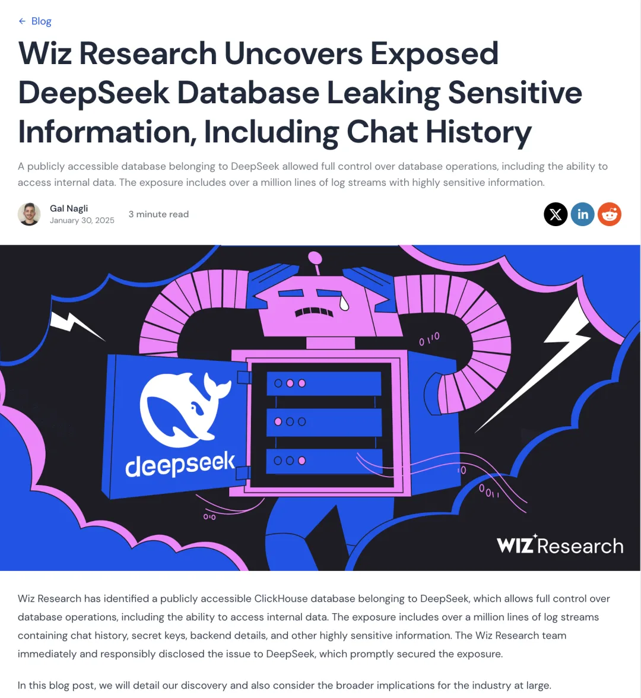
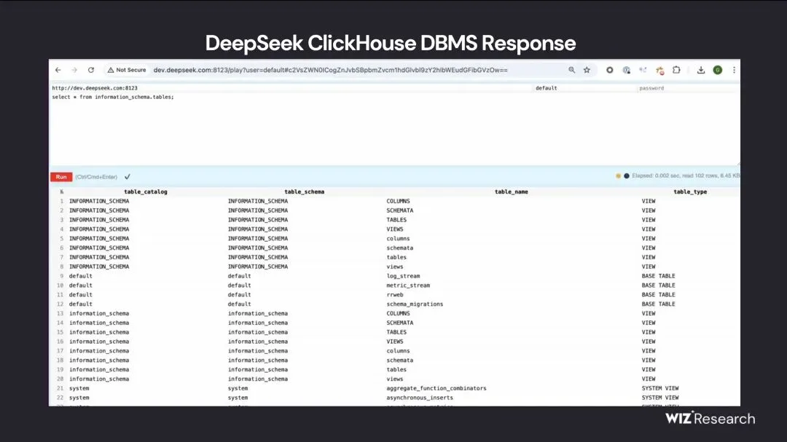
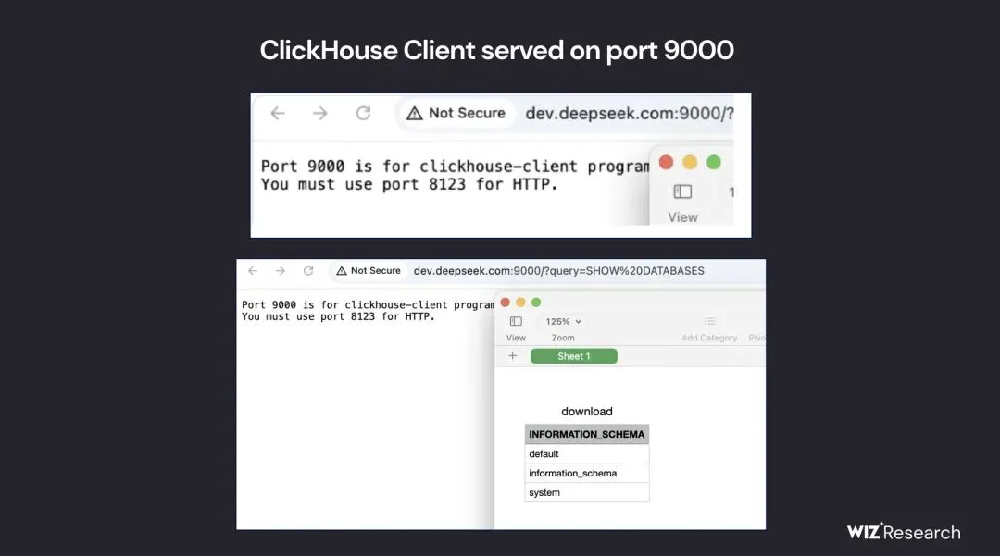
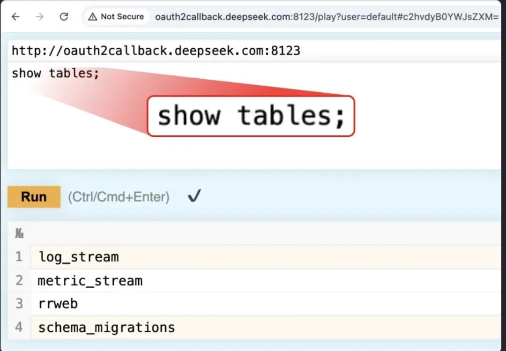
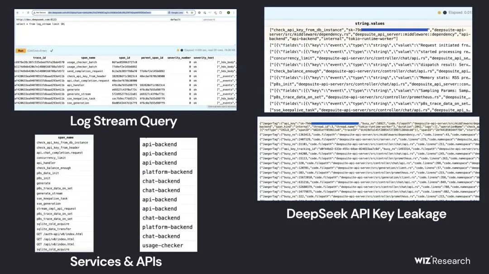

Wiz Research 发现 DeepSeek 的一套可公开访问的 ClickHouse 数据库，允许对数据库进行完全控制，包括访问内部数据。此次暴露包含超过一百万行的日志流，其中含有聊天记录、密钥、后端细节以及其他高度敏感的信息。Wiz Research 团队第一时间向 DeepSeek 负责披露了这一问题，DeepSeek 随后迅速采取了措施，修复了该暴露点。

---

## DeepSeek 公开暴露的数据库可被完全控制

**该数据库暴露了内部数据，包含超过一百万行高度敏感的日志记录。**

Gal Nagli[1] 2025 年 1 月 30 日 阅读时间 3 分钟

---

Wiz Research 发现 DeepSeek 的一套可公开访问的 ClickHouse 数据库，允许对数据库进行完全控制，包括访问内部数据。此次暴露包含超过一百万行的日志流，其中含有聊天记录、密钥、后端细节以及其他高度敏感的信息。Wiz Research 团队第一时间向 DeepSeek 负责披露了这一问题，DeepSeek 随后迅速采取了措施，修复了该暴露点。

在本博文中，我们将详细介绍此次发现，并探讨此事件对整个行业的更广泛影响。

---

## 概要

DeepSeek 是一家中国的 AI 创企，因其具有突破性的 AI 模型（尤其是 DeepSeek-R1 推理模型）而备受媒体关注。该模型在性能上与 OpenAI 的 o1 等领先 AI 系统不相上下，同时又兼具成本效率与运行高效的特点。

当 DeepSeek 在 AI 领域引起广泛关注时，Wiz Research 团队着手评估其外部安全态势，以识别潜在的安全漏洞。

在短短几分钟内，我们就发现 DeepSeek 有一台 ClickHouse 数据库面向公网开放，且无需任何身份验证即可访问，暴露在以下两个域名下的 9000 端口（以及 8123 端口）：

- `oauth2callback.deepseek.com:9000`
- `dev.deepseek.com:9000`

该数据库包含了海量的聊天记录、后端数据以及敏感信息，其中包括日志流、API 密钥以及运营细节。

更严重的是，此次暴露允许对数据库进行完全控制，并可能引发在 DeepSeek 环境中的**权限提升 (privilegeescalation)[2]**，而且对外完全没有设置任何身份验证或防护机制。

---

## 暴露详情

我们的侦察工作从评估 DeepSeek 的所有公开访问域名开始。通过常规侦察技术（被动与主动扫描子域名），我们发现了大约 30 个暴露在互联网上的子域。这些子域大多表现正常，用于聊天机器人界面、状态页面、API 文档等功能，乍看之下并无高风险迹象。

然而，当我们进一步搜索标准 HTTP 端口（80/443）以外的端口时，注意到以下两个主机名对应的**端口 8123 和 9000** 均处于开放状态：

- `oauth2callback.deepseek.com:8123`[3]
- `dev.deepseek.com:8123`[4]
- `oauth2callback.deepseek.com:9000`[5]
- `dev.deepseek.com:9000`[6]

进一步调查后我们发现，这是一个**公开暴露的 ClickHouse 数据库**，无需任何身份验证即可访问，明显构成了重大风险。

ClickHouse 是一个开源的列式数据库管理系统，专为在大型数据集上执行快速分析查询而设计。它由 Yandex 开发，常用于实时数据处理、日志存储以及大数据分析。因此，这种库一旦暴露，价值与敏感程度都非常高。

借助 ClickHouse 的 HTTP 接口，我们访问了 `/play` 路径，发现能够直接通过浏览器执行任意 SQL 查询。我们首先尝试执行简单的 `SHOW TABLES;` 查询，就得到了所有可访问的数据集列表。

在返回的众多表格中，“log_stream” 这个表格尤其值得注意，其包含了**超过一百万行**高度敏感的日志数据。

“log_stream” 表内的列格外引人关注：

- **timestamp** – 日志时间戳，可追溯到 **2025 年 1 月 6 日**
- **span_name** – 引用 DeepSeek 内部各类 **API 接口**
- **string.values** – **明文日志信息**，包括 **聊天记录、API 密钥、后端细节** 以及相关元数据
- **\_service** – 指示是 **DeepSeek 的哪个服务** 生成的日志
- **\_source** – 揭示了 **请求来源**，内含 **聊天记录、API 密钥、服务器目录结构以及聊天机器人元数据** 等

以上信息不仅威胁到 DeepSeek 自身的安全，也可能波及其最终用户。攻击者不仅可以窃取机密日志和用户明文聊天内容，还可能利用这些信息获取更多权限，甚至可以使用诸如 `SELECT * FROM file('filename')` 等查询，从服务器中读取明文密码、本地文件以及其他专有信息（前提是 ClickHouse 配置允许）。

> 注：我们本着道德规范，仅做了有限枚举查询，并未进行任何侵入性操作或访问。

---

## 主要启示

在没有相应安全措施的情况下快速采用 AI 服务往往风险极高。本次暴露事件充分说明，AI 应用当前面临的**最直接**安全威胁[7]仍主要来源于它们所依赖的基础设施和相关工具。

如今对 AI 安全的讨论大多集中在“未来的威胁”层面，但往往最实际、最危险的隐患却是一些基础性的安全风险，例如数据库意外对外公开。此类风险是安全领域的根本问题，对安全团队来说，始终不容忽视。

企业在选择与越来越多的 AI 创业公司及服务商合作时，往往将敏感数据交予对方处理。由于 AI 的迅猛发展，很多团队会在速度与安全之间优先考虑实现与落地，导致安全被忽略。然而，保护客户数据必须是重中之重。安全团队和 AI 工程师需要紧密配合，确保对所用架构、工具链和模型有足够的可视性，才能有效地保护数据，防止此类暴露事件再次发生。

---

## 结语

AI 是人类历史上迄今为止发展和普及速度最快的技术之一。许多 AI 企业迅速成长为关键基础设施提供商，但却尚未建立起与其规模相匹配的安全体系。随着 AI 逐步深入到全球各类业务中，整个行业必须更加重视敏感数据的处理安全，并落实与公共云和其他核心基础设施提供商同等的安全要求与实践。

本次事件再次提醒我们，安全问题并不会因为新兴技术的光环而减少。无论是对 AI 公司还是其客户，在创新和高速发展的同时，也需要始终如一地关注和投入安全。

---

> **作者**：Gal Nagli **发布日期**：2025 年 1 月 30 日

如需了解更多与 AI 安全相关的内容，可访问 Wiz 研究团队[8]。

### References

- `[1]` Gal Nagli: <https://www.wiz.io/authors/gal-nagli>
- `[2]` 权限提升 (privilegeescalation): <https://www.wiz.io/academy/privilege-escalation>
- `[3]` `oauth2callback.deepseek.com:8123`
- `[4]` `dev.deepseek.com:8123`
- `[5]` `oauth2callback.deepseek.com:9000`
- `[6]` `dev.deepseek.com:9000`
- `[7]` 安全威胁： <https://www.wiz.io/academy/ai-security-risks>
- `[8]` Wiz 研究团队： <https://www.wiz.io/academy/ai-security-risks>

## 老冯评论

Wiz Research 是一家专注云安全的顶尖团队，凭借在 AWS、Azure、GCP 等主流云平台上持续挖掘并披露高危漏洞而声名鹊起。他们先后发现了包括 Azure ChaosDB、OMIGOD 在内的一系列严重安全缺陷，迫使云厂商紧急修补、尴尬应对。Wiz 的核心优势在于对云环境的深度洞察与精准攻防技术，因多次让这些云计算巨头“出糗”而被称为“云安全一哥”，在业界赢得了极高的声誉与影响力。这次 Wiz 跑来挖 DeepSeek 的洞了，DS 确实是引起了海内外的极大关注。

这次暴露的数据量并不算大，100 万行日志就是洒洒水，而且据文章称端口已经封堵。比较敏感的就是日志里还包含了 API 密钥明文，不过目前尚不确定这是一个生产库还是测试库，所以难以评估影响。但说到底，把数据库直接暴露在公网端口对外开放，确实是非常业余与粗躁的做法。

从我个人角度，我非常看好欣赏 DeepSeek，对于新兴前沿探索者，也不应当苛责。但作为全村的希望与本土大模型领头羊，在不差钱的情况下，在基础设施，数据库，安全上多投资一些，显然是应该且值得的。

*（提前回复上云大湿：上云解决不了这个问题，请看 SHGA 人口信息泄漏案例）。*

---

发布版本：[微信公众号](https://mp.weixin.qq.com/s/zODEfRQrMreFeEGjWXhK4g)
