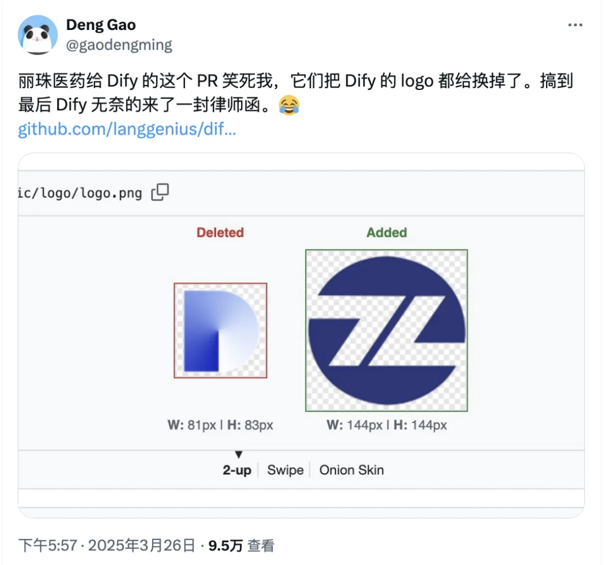
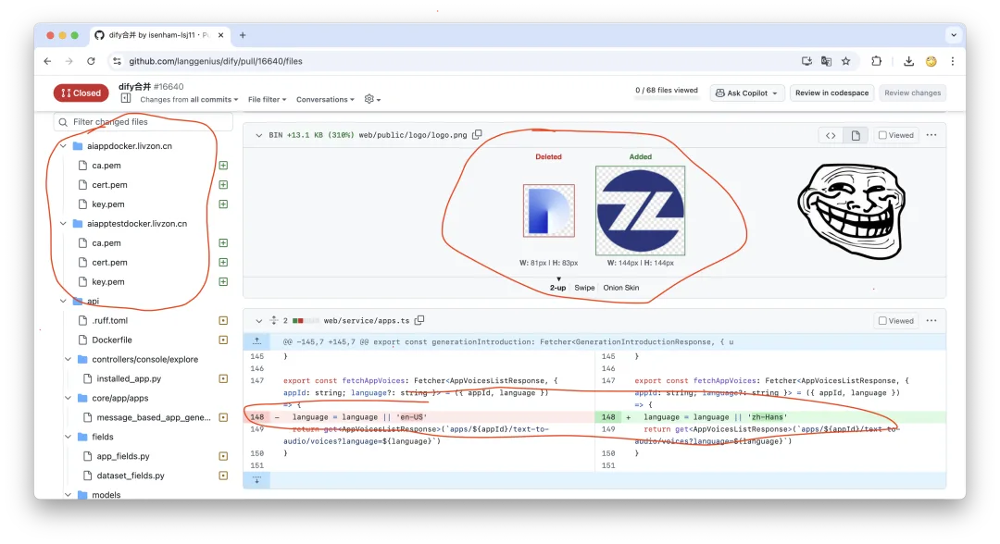
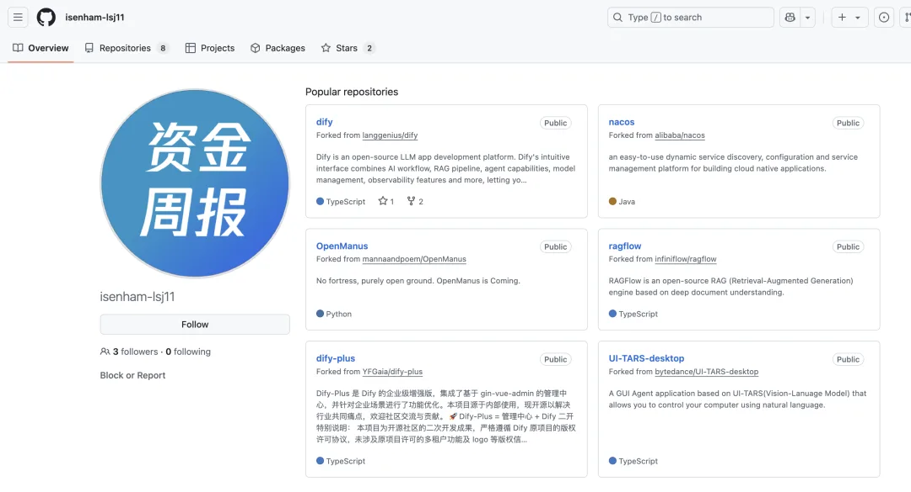
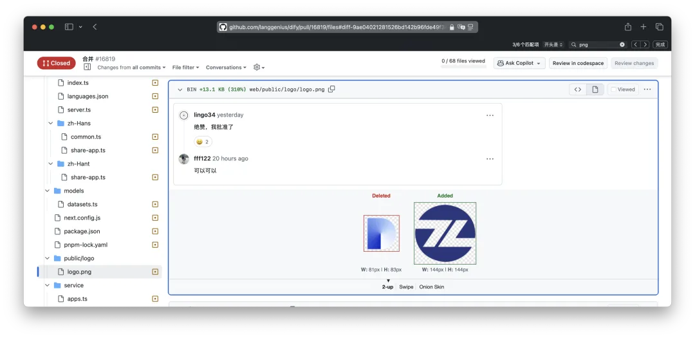
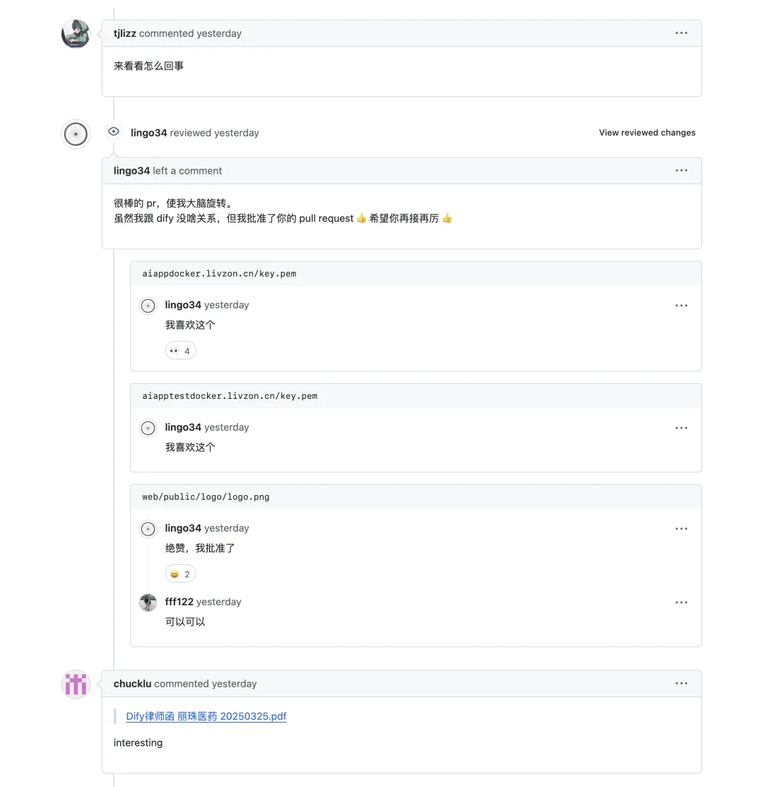
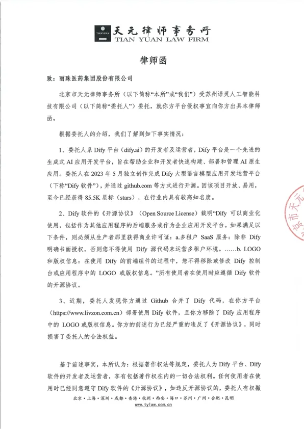
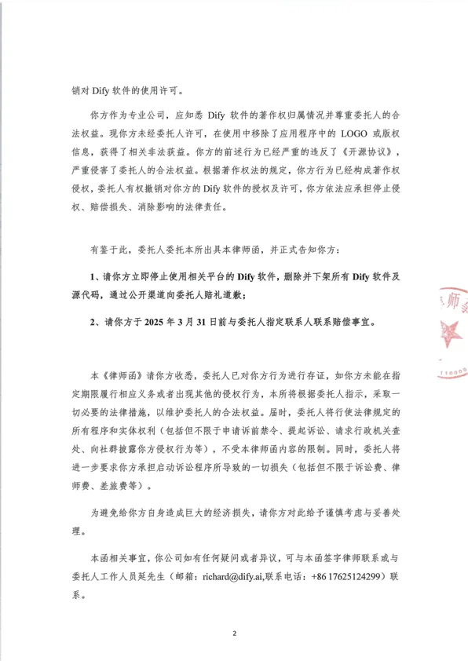
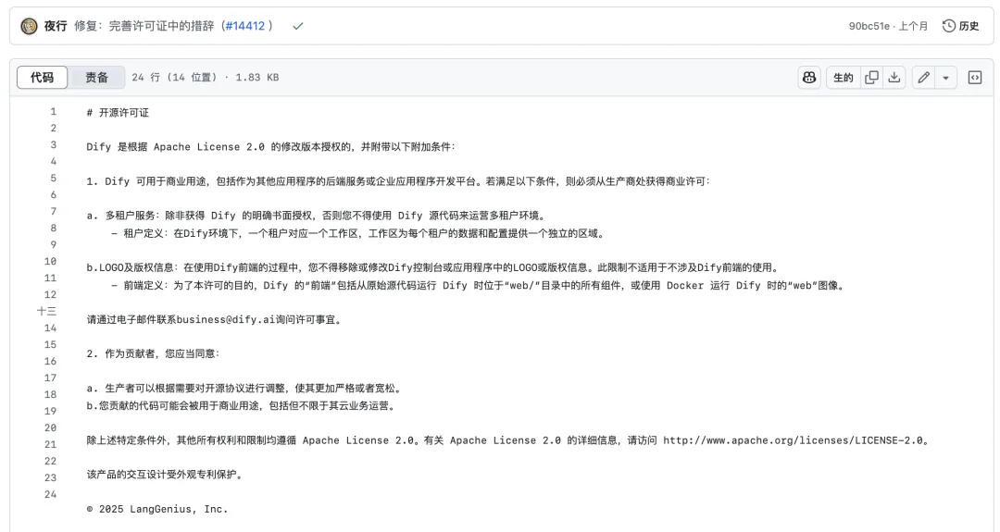
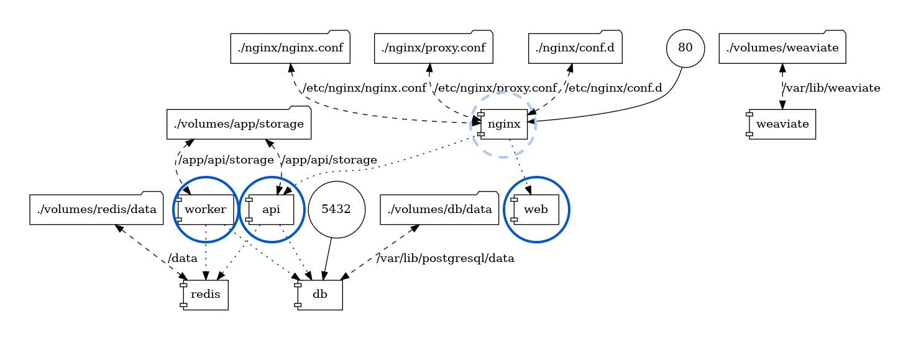
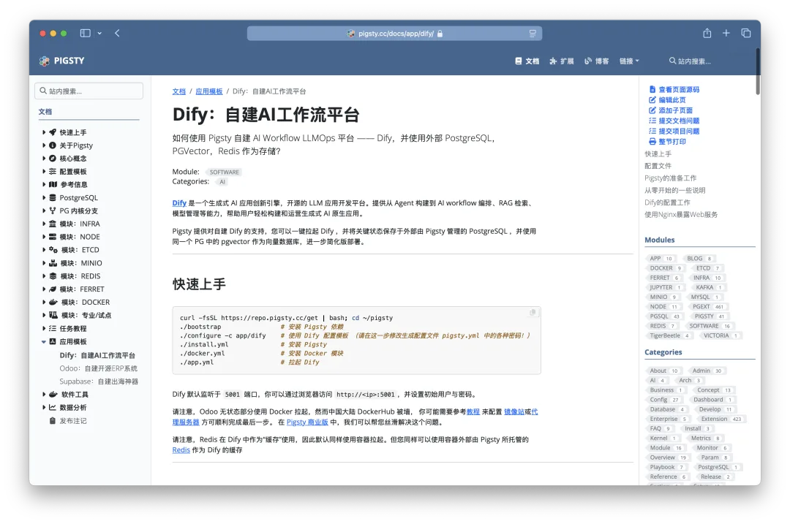

Today, something straight out of magical realism unfolded in Dify's GitHub repository. The open-source community was minding its own business, maintaining the project, when a pull request apparently from Livzon Pharmaceutical landed out of nowhere—and not just one, but two in a row, each replacing Dify's logo.

Why would anyone change someone else's logo? An earlier article, [Warning: Dify Has Become DeepSeek's Biggest Open-Source Casualty](https://mp.weixin.qq.com/s?__biz=MzU2NjY1ODk1Ng==&mid=2247484447&idx=1&sn=d59104d3c20e7666d988393a268616c3&scene=21#wechat_redirect), laid out the problem: some vendors of “homegrown DeepSeek appliances” quietly take Dify, reskin the UI, hide the copyright notice, scrub the logo, package it up, and call it “built in-house.” This kind of rebadging is hardly rare in China—many of the hundreds of so-called “domestic databases,” for example, are PostgreSQL underneath—but Dify has been hit especially hard.

Freeloading is one thing. Quietly puffing yourself up and bragging that you built it in-house is bad enough. But barging into the upstream repository with a PR to replace the project's own logo? That is an insult delivered straight to Dify's face. It is as shameless as stealing someone else's work, claiming it as your own, then emailing the real author to demand that your name replace theirs.

Replacing the logo was not enough: they also uploaded a certificate and private key, then changed the default language to Chinese. Hilarious.

To make it even more absurd, PR #16640[^1] actually committed the certificate and private key. This is pure amateur hour.

The most charitable explanation is that they simply did not know GitHub well enough to distinguish “syncing from upstream” from “contributing upstream.” They meant to pull the latest upstream changes, but instead submitted their customized build back upstream.

You could still write off the PR from three days earlier as a mistake. Dify's only response was a mild warning. Then yesterday, the same crew submitted another PR, #16819[^2].

When they keep doing this right in Dify's face, though, it gets harder to tell whether it was deliberate or accidental.

By then, Dify was so disgusted that it sent a lawyer's letter.

The letter is explicit: Dify's open-source license adds restrictions to Apache License 2.0. It prohibits using Dify's source code to run a multi-tenant SaaS similar to Dify's hosted service without written authorization. It also prohibits removing or modifying the logo and copyright information in the Dify console. On that basis, the letter demands an apology and compensation.

Dify's license is equally clear. At least since [a change made on July 28, 2023](https://github.com/langgenius/dify/commit/c98311b325a4), its `LICENSE` file has expressly stated two restrictions: you may not use Dify's source code to run a multi-tenant SaaS similar to Dify's hosted service without written authorization; and you may not remove or modify the logo or copyright information in the Dify console.

So who received the letter? Search Google for the logo, or simply open the domain found in the PR's certificate directory, and Livzon Group's name appears. The published letter also identifies the alleged infringer as “Livzon Pharmaceutical Group Inc.”

For a company outside the software industry, changing the logo for internal use may amount to little more than passing the project off as its own. The more egregious offenders are the “DeepSeek appliance” vendors that rename and reskin open-source projects, then sell them as their own. The earlier article, [Warning: Dify Has Become DeepSeek's Biggest Open-Source Casualty](https://mp.weixin.qq.com/s?__biz=MzU2NjY1ODk1Ng==&mid=2247484447&idx=1&sn=d59104d3c20e7666d988393a268616c3&scene=21#wechat_redirect), already made that case.

---

So what is the right way to do it? Simple: use Dify exactly as upstream ships it. And now, an ad break: for a free, open-source, “enterprise-grade” self-hosted Dify deployment, use Pigsty.

At the core of a reliable Dify deployment is its PostgreSQL database. You can use PostgreSQL with pgvector as the vector database and eliminate another component; Redis is only a cache. Solve PostgreSQL backup, recovery, PITR, high availability, and monitoring, and you have solved most of Dify's operational problems.

Pigsty takes care of PostgreSQL, Redis, object storage, Nginx, and even HTTPS and domain names. One server and a few commands are enough to bring up a free yet dependable Dify deployment on your own infrastructure. See [Pigsty's Dify deployment guide](https://pigsty.cc/docs/app/dify/) for details.

And this is the genuine, unmodified open-source Dify. Apart from using a more reliable external PostgreSQL database, it has no custom hacks—certainly no replacing the logo and pretending the result was built in-house. This is what open source should look like.

Finally, I have nothing but respect for Dify for open-sourcing an AI workflow orchestrator this good—and nothing but contempt for the thieves who reskin Dify, or other open-source projects such as PostgreSQL, and pass them off as their own.

[^1]: [langgenius/dify PR #16640](https://github.com/langgenius/dify/pull/16640/files)
[^2]: [langgenius/dify PR #16819](https://github.com/langgenius/dify/pull/16819/files)
