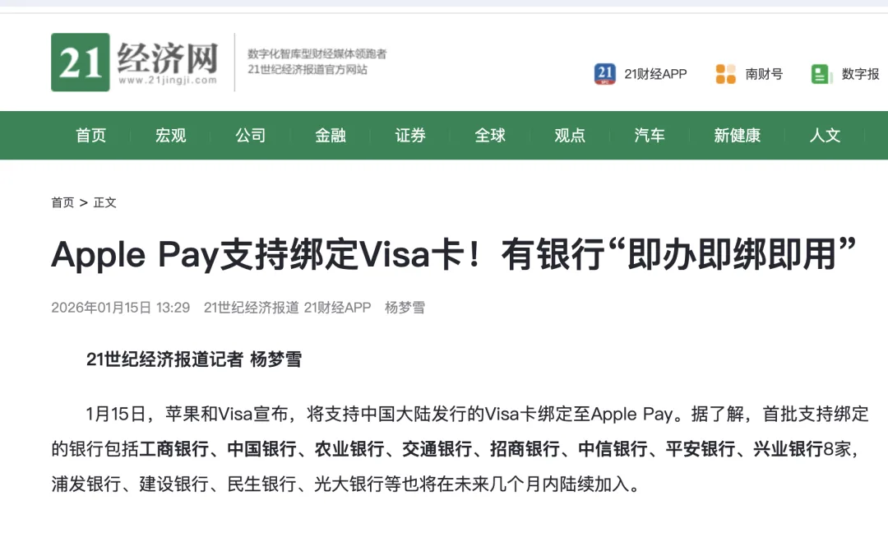
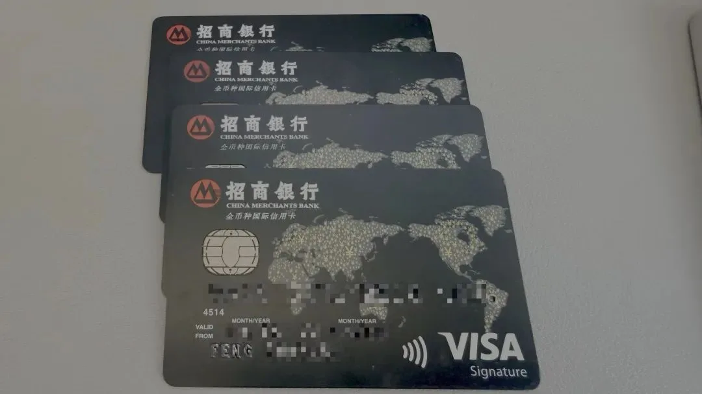
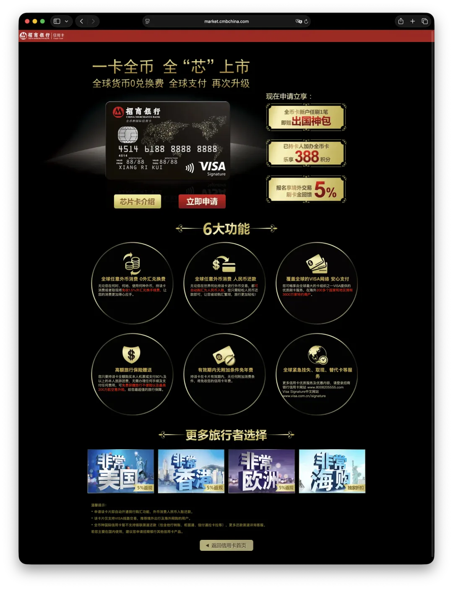
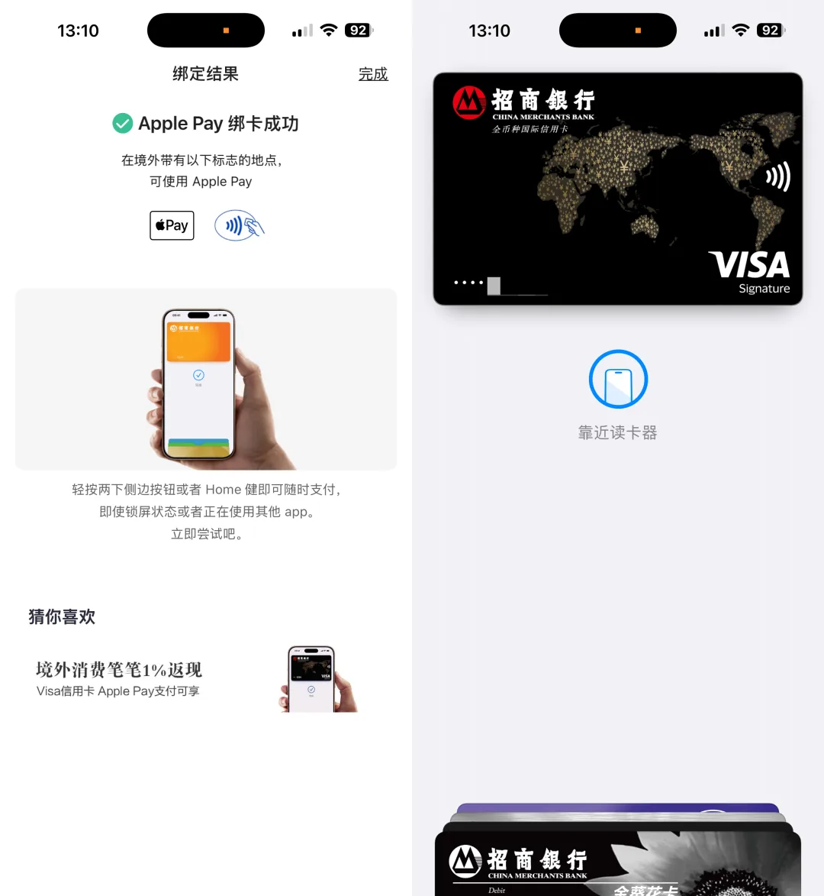
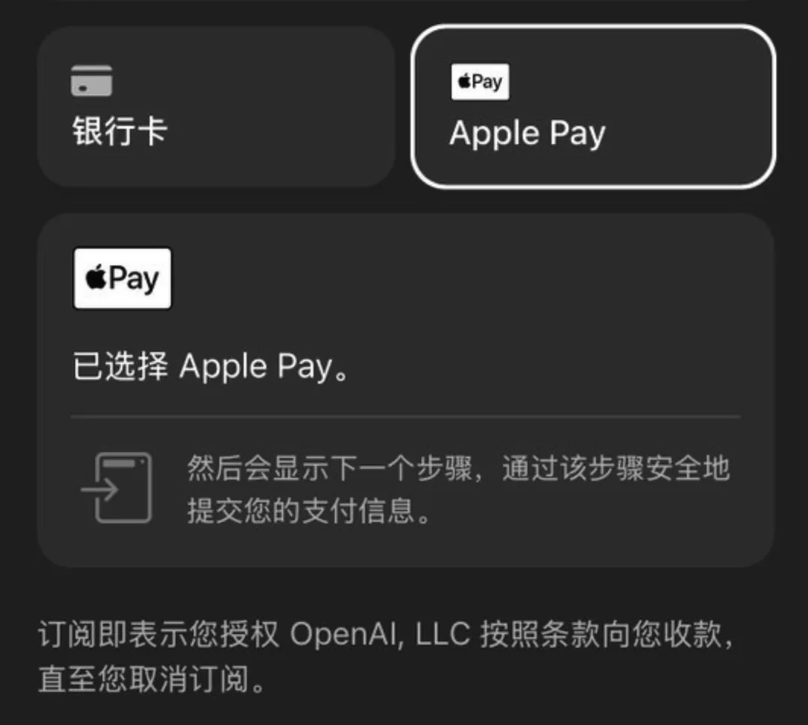

> 2026 年 1 月 15 日起，Visa 信用卡正式支持绑定 Apple Pay。这可能是目前国内用户方便、安全、低成本订阅 ChatGPT，Claude 等海外服务的新路子

老冯在《[Claude Code 免翻墙上手指南](/ai/claude-code-intro/)》中提到过，国内用户想要使用顶级 AI 模型，有两条拦路虎 —— 翻墙和外卡。科学上网其实相对好解决，每个月十几块钱随便找个就行了，但外卡一直是个不小的门槛。

你拿着银联、甚至很多国内和香港 Visa/Master 的卡，到了 ChatGPT / Claude 这种“境外数字服务”，经常就是一句话——**风控拒绝**。然后你只能去找各种“代充/中介”，贵、慢、还容易把账号信息交出去。

所以不少朋友问我：“Claude/GPT 这么牛逼，你怎么付费的？” 我说我就直接信用卡买的啊。对方一脸懵：“我也有信用卡啊，怎么就不行？” 我只能补一句大实话：**你那张卡“理论上能用”，但在这类商户上经常“实际上被风控”**。

以前的办法是“套一层美区 AppleID + PayPal”，但也容易继续套娃：这俩玩意又怎么搞…？好在，今天（**2026 年 1 月 15 日**）出现了一个非常关键的新变化：中国大陆的 Apple Pay（Apple 钱包）开始支持添加本地银行发行的 Visa 卡，并用于境外线下拍卡、App 内和线上网站支付。

Visa 本来就能跨境刷，这件事的意义是：你终于可以把“国内办的 Visa”塞进 Apple Pay 这条更顺滑的支付通道里，避免被风控了。Apple Pay 苹果手机自带，特点是交易时 **不把真实卡号直接给商户**，而是用设备账号/动态安全码（更像“令牌化”的支付凭证）；所以那些 “不允许国内/香港卡支付” 的服务就没法用卡号来风控了。

（声明：老冯不是说，你用这个卡就一定不会被风控，这玩意谁说的准，不过我确实看到有人实操绑卡，买了 GPT）

## 那么到底哪家强？

今天这波首批支持的银行一共有 8 家： **工行、中行、农行、交行、招行、中信、平安、兴业**。当然在国内用户体验最好的，老冯觉得就是 **招行**，没有之一。

老冯是从来不接商单的，但如果是我自己在用的，别人也能用上的好东西，我也很乐意推荐一下。比如这张卡是俺 15 年刚毕业的时候申请的。每次出国的时候都是主要刷它，一卡在手，走遍美加，要买点什么线上境外服务之类的很好使。你也就不用操心出国没有支付宝怎么办的问题了。

老冯已经用了 11 年，换过三次卡了…

当然，它的特点就是：朴实无华的强，没有那些什么花里胡哨的权益大礼包，就俩核心要点：免年费也不收外汇兑换手续费，花外币但人民币还款。没啥持有成本。但是注意，这玩意在国内银联体系是刷不了的，这是纯 VISA。而且它还有个 bug —— 申请门槛不高，老冯刚毕业就申请了，但是在 VISA 体系里面是 **Signature（御玺卡）级别**——高于白金卡等级。

最近也有不少人问老冯 GPT / Claude 这些东西到底怎么买，俺寻思这玩意你们应该也能用上。所以老冯的推荐链接也放到下面了，你要是用俺的推荐链接办卡，俺就能领个行李箱，哈哈哈哈。

[招商银行信用卡申请页面](https://res.cc.cmbimg.com/itafront/Frog/#/mgmLogin/api3xxmgmlj4/remote?webAddress=SOUSUOZQ_M1&where=zs9_jd2&pageName=MRecContract&activityTitle=MGMXSDS202509JD2&appChn=05&dsid=&dscontr=&pretrackno=6cb0929b83974d21ad4134cebd6554f8&pretrack=10403788&mgmSm2Flag=1&mgmSource=share&m1TraceId=6cb0929b83974d21ad4134cebd6554f8)

至于怎么办，就不用老冯多说了，你可以直接在网页里面打开填写信息就能申请了，简单粗暴。然后你打开 招商银行 “掌上生活 App” 搜索 Apple Pay，就能绑定 Apple Pay 了。这玩意很简单，有手就行。老冯花了一分钟，自己就绑上了：

绑定了之后呢，你如果去 chatgpt.com 这些网页上（还是要科学上网），里面有 Apple Pay 选项，你就可以直接用了。老冯看到已经有人实测过这张卡绑定到 Apple Pay 里直接买 ChatGPT 订阅成功。

不过 Claude 直接买依然不行，但是可以通过 Appe Pay 购买美区 Apple 礼品卡来充值，绕过风控。但这个路子还是需要你有个美区 AppleID，哈哈。那个就是另外的教程了，这个倒也不难。老冯实话说我没也试过直接买，因为我是走 PayPal+美区的老路，不过看到有人试过成功了，应该也没啥问题。

有了这个，基本上能解决很大一部分 “卡被拒绝”，“您所在的地区不支持”，之类的问题。当你发现自己为了一个订阅要绕 N 层、交 N 次智商税、还得把账号交给别人代充—— 就会发现：支付能力本身，就是数字时代的生产资料。\

今天这波 Apple Pay + 国内 Visa 的放开，确实降低了普通人的使用世界领先水平 AI 的门槛。你不需要认识谁、不需要开境外户、不需要把账号交给中介——你只需要一张正经的 Visa 卡，以及一条更稳定的支付通道就好了。

---

发布版本：[微信公众号](https://mp.weixin.qq.com/s/QswTVFKt7UpkSf4BPCIphQ)
