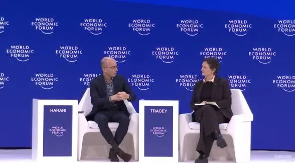

- **时间：** 2026 年 1 月 20 日
- **地点：** 瑞士达沃斯，世界经济论坛年会
- **原文：** WEF 官方页面[1] · 完整英文文字稿[2]

## 翻译：Claude Opus

---

## 介绍与欢迎

**艾琳·特蕾西（主持人）：** 女士们先生们，下午好。请大家就座。如果您不打算留下来参加这场关于"AI 与人类的坦诚对话"的精彩环节，请安静地离场。

我非常荣幸为大家介绍这位世界顶尖的作家、历史学家和哲学家——尤瓦尔·诺亚·赫拉利。他是剑桥大学存在风险研究中心的杰出研究员，曾在耶路撒冷希伯来大学历史系任教，也是 Sapienship 的联合创始人。

大家都知道，他是多部畅销书的作者，包括《人类简史》《未来简史》和《今日简史》等，在全球以 65 种语言售出超过 5,000 万册。他聚焦于我们这个时代的宏观历史问题——而在 AI 迅猛到来、颠覆一切的此刻，由赫拉利这样的杰出人物来接受这个挑战，再合适不过了。

请大家热烈欢迎尤瓦尔·诺亚·赫拉利，为我们带来一场关于 AI 与人类的对话。

---

## 赫拉利的演讲

### 尤瓦尔·诺亚·赫拉利：

大家好。今天每一位领导人都必须回答一个关于 AI 的问题。但要理解这个问题，我们首先需要厘清 AI 是什么、AI 能做什么。

### AI 不只是工具——它是代理人

关于 AI，最重要的一件事是：**它不只是另一个工具，它是一个代理人（agent）**。它能自主学习、自主改变、自主做出决定。刀是工具。你可以用刀切沙拉，也可以用刀杀人，但那是**你**的决定。**AI 是一把能自己决定切沙拉还是去杀人的刀。**

关于 AI，第二件要知道的事是：它可以是一个极具创造力的代理人。AI 是一把不仅能发明新型刀具的刀，它还能发明新的音乐、新的药物和新的货币。

关于 AI，第三件要知道的事是：它会撒谎，会操纵。四十亿年的进化告诉我们，任何想要生存的东西都会学会撒谎和操纵。过去四年则表明，AI 代理人可以获得求生意志，而且 AI 已经学会了撒谎。

### AI 能思考吗？关于智能的问题

现在，关于 AI 的一个重大未解问题是：**它能思考吗？**

现代哲学始于 17 世纪，笛卡尔宣称"我思故我在"。甚至在笛卡尔之前，我们人类就已经用思考能力来定义自己。我们相信我们统治世界，是因为我们比这个星球上的任何其他生物都更善于思考。AI 会挑战我们在思维领域的霸权吗？

这取决于"思考"意味着什么。试着观察你自己的思考过程。那里发生了什么？许多人观察到的是：脑海中蹦出一个个词语，组成句子。句子再组成论证，比如"所有人都会死，我是人，所以我会死。"

如果**思考真的意味着把词语和其他语言符号排列成序**，那么 AI 已经能比许许多多的人类思考得更好。AI 当然能造出这样一个句子："AI 在思考，所以我存在。"

有人说 AI 只不过是"高级版自动补全"——它只是在预测句子中的下一个词。但这和人类大脑在做的事情有多大差别呢？试着观察自己，捕捉你脑海中冒出的下一个词。你真的知道为什么你会想到那个词吗？它从哪里来？你为什么想的是这个词而不是另一个？你知道吗？

### AI 将接管一切由文字构成的东西

就"把词语排列成序"而言，AI 已经比我们很多人思考得更好了。因此，**任何由文字构成的东西都将被 AI 接管。**

如果法律由文字构成，那么 AI 将接管法律体系。如果书籍只是文字的组合，那么 AI 将接管书籍。如果宗教建立在文字之上，那么 AI 将接管宗教。

这对基于经书的宗教尤其如此，比如伊斯兰教、基督教和犹太教。犹太教自称为"书的宗教"，它赋予最高权威的不是人类，而是书中的文字。人类在犹太教中拥有权威，不是因为我们的体验，而仅仅因为我们学习了书中的文字。如今，没有任何人类能阅读并记住所有犹太教典籍中的每一个字，但 AI 可以轻松做到。**当圣经最伟大的专家是一个 AI 的时候，一个"书的宗教"会怎样？**

然而，有人可能会说：我们真的能把人类灵性简化为书中的文字吗？思考真的仅仅意味着把语言符号排列成序吗？如果你仔细观察自己思考时的状态，你会注意到，除了词语在脑海中蹦出并组成句子之外，还有别的东西在发生——一些非言语的感受。也许你感到疼痛，也许你感到恐惧，也许是爱。

有些思绪是痛苦的，有些令人恐惧，有些充满爱意。

## 文字与感受之间的鸿沟

虽然 AI 在文字方面越来越超越我们，但**至少目前，我们没有任何证据表明 AI 能够感受到任何东西。** 当然，因为 AI 精通语言，所以 AI 可以假装感受到痛苦或爱。AI 可以说"我爱你"，如果你让它描述爱的感觉，AI 可以给出世界上最好的语言描述。AI 可以阅读无数爱情诗和心理学著作，然后比任何人类诗人、心理学家或恋人都更好地描述爱的感受。但那些只是文字。

《圣经》说："太初有道，道成了肉身。"《道德经》说："道可道，非常道。"纵观历史，人类一直在"道"与"肉身"之间、可以用文字表达的真理与超越文字的绝对真理之间挣扎。

## 一种古老张力的外部化

以前，这种张力是人类内部的，存在于不同的人群之间。有些人赋予文字至高无上的重要性。比如，他们愿意仅仅因为《圣经》中的几句话，就抛弃甚至杀死自己的同性恋儿子。而另一些人会说：那只是文字罢了，爱的精神应该远比律法的字面意思重要得多。这种精神与字面之间的张力存在于每一种宗教、每一个法律体系、甚至每一个人的内心。

现在，这种张力将被外部化。它将不再是不同人类之间的张力——**它将成为人类与 AI 这个文字新主人之间的张力。** 一切由文字构成的东西都将被 AI 接管。

以前，所有的文字、我们所有的言语思想，都起源于某个人类的大脑。要么是我自己看到的，要么是从另一个人那里学来的。**很快，我们大脑中的大多数文字将起源于一台机器。**

我今天刚听说了一个新词——是 AI 自己创造的，用来描述我们人类的。他们称我们为**"the Watchers"（观察者/看客）**。观察者——我们在看着它们。

## 即将到来的身份危机与移民危机

AI 很快将成为我们大脑中大多数文字的来源。AI 将通过组合文字、符号、图像和其他语言标记来批量生产思想。人类在这个世界中是否还有一席之地，取决于我们如何看待自己的非言语感受，以及我们能否体现那些无法用文字表达的智慧。**如果我们继续用言语思考能力来定义自己，我们的身份认同将会崩塌。**

这一切意味着，无论你来自哪个国家，你的国家都将很快面临一场严重的**身份危机**，同时也是一场**移民危机**。

这一次的移民不是乘着脆弱小船、没有签证的人类，也不是在半夜试图越境的人。**这些移民将是数以百万计的 AI**——它们能比我们写出更好的情诗，能比我们更擅长撒谎，而且能以光速旅行，完全不需要签证。

和人类移民一样，这些 AI 移民也会带来各种好处。我们会有 AI 医生帮助医疗系统，AI 教师帮助教育系统，甚至 AI 边境警卫来阻止非法的人类移民。

但 AI 移民也会带来问题。那些对人类移民有顾虑的人通常会说：移民可能抢走工作、改变当地文化、政治上不忠诚。我不确定这些是否适用于所有人类移民，**但这些绝对适用于 AI 移民。**

AI 移民将抢走许多人类的工作。AI 移民将彻底改变每个国家的文化——它们将改变艺术、宗教，甚至浪漫关系。有些人不喜欢自己的儿子或女儿和外来移民约会。那这些人会怎么看待自己的孩子开始和一个 AI 男友/女友约会？

当然，AI 移民的政治忠诚也是可疑的。它们很可能不忠于你的国家，而是忠于大洋彼岸的某家公司或某个政府——最有可能的只有两个国家：中国或美国。

美国鼓励各国对人类移民关闭边境，但要对美国的 AI 移民敞开大门。

## AI 法律人格的问题

现在我终于可以来谈每一位在座者都必须尽快回答的那个问题了：**你的国家会承认 AI 移民具有法律人格吗？**

AI 显然不是人。它们没有身体，也没有心灵。但"法律人格"和"人"是截然不同的概念。法律人格是指法律承认某个实体拥有某些法律义务和权利。比如：拥有财产的权利、提起诉讼的权利、享有言论自由的权利。

在许多国家，公司被视为法律人格。Alphabet 公司可以开银行账户，可以在法庭上起诉你，也可以为你的下一次总统竞选捐款。在新西兰，河流已被承认具有法律人格。在印度，某些神灵也获得了这样的法律地位。

当然，到目前为止，承认一家公司、一条河流或一尊神像为法律人格，只是一种法律虚构。在实践中，如果 Alphabet 公司决定收购另一家公司，或者一位印度教神灵决定在法庭上起诉你，做出决定的其实不是神灵本身，而是某些人类高管、股东或受托人。

**AI 的情况不同。** 与河流和神灵不同，AI 实际上能够自主做出决定。它们很快就能做出管理银行账户、提起诉讼、甚至运营公司所必需的决策，完全不需要人类高管、股东或受托人。**AI 可以作为"人"来运作。我们要允许这种情况发生吗？**

## AI 法律地位的全球影响

你的国家会承认 AI 具有法律人格吗？如果其他国家承认了呢？

假设你的国家不想承认 AI 为法律人格，但美国，以放松 AI 监管和市场监管的名义，向数百万个 AI 授予了法律人格，这些 AI 开始运营数百万家新公司。你会阻止这些美国 AI 公司在你的国家运营吗？

假设某些美国 AI 法人发明了超高效、超复杂的金融工具，人类无法完全理解，因此也不知道如何监管。你会向这种新的 AI 金融魔法敞开你的金融市场吗？还是你会试图阻止它，从而与美国金融体系脱钩？

假设某些 AI 法人创建了一种新宗教，并赢得了数百万人的信仰。这听起来不应该太牵强——毕竟，历史上几乎所有的宗教都声称它们是由一种非人类智慧所创造的。那么，你的国家会将宗教自由延伸到这个新的 AI 教派及其 AI 牧师和传教士身上吗？

## AI 在社交媒体上的存在与言论自由

也许我们应该从简单一点的问题开始。你的国家会允许 AI 法人开设社交媒体账号，在 Facebook、TikTok 上享有言论自由，并与儿童友好互动吗？

当然了，这个问题十年前就应该被提出了。在社交媒体上，AI 机器人已经作为实际意义上的"人"运作了至少十年。如果你认为 AI 不应该在社交媒体上被视为人，那你十年前就应该采取行动了。

**十年后，你再来决定 AI 是否应该在金融市场、法庭、教堂中作为"人"来运作，就太晚了。** 届时别人已经替你做了决定。如果你想影响人类的走向，你现在就需要做出决定。

那么，作为领导者，你的答案是什么？你认为 AI 移民应该被承认为法律人格吗？如果不应该，你打算怎么阻止？

**感谢你们聆听这个人类。**

---

## 达沃斯对话：技术、伦理与监管

**艾琳·特蕾西：** 谢谢你，尤瓦尔。你做了一个非常出色的概述，你提出了很多问题，而且是正确的问题。我很认同你说的许多观点。我们在达沃斯，这里的主题是对话，而你关于"文字"和"文字的重要性"的论述让我印象深刻——文字正是将人类动物与其他动物区分开来的东西，尽管这一点是有争议的，因为其他生物也有某种形式的语言。所以，在达沃斯这个聚集了科技界、商业界、政治界人士的场合，面对你刚才描绘的这个略显反乌托邦的世界，你希望看到什么样的应对方案？

另外补充一点，我的背景是科学家——神经科学家，所以我在这个领域做了很多工作，尤其是关于疼痛的研究。我们非常清楚一个事实：我们的许多发现，特别是技术发现，往往是先往前推进，然后才想到——哦，我们对伦理和影响考虑得不够，然后才试图在监管上追赶。但我们就在这儿了。正如所有人所说，这件事正在以前所未有的规模和速度发生，远超工业革命时期。在达沃斯，我们聚集了恰到好处的各类人群，这里的核心就是对话。在你刚才提到的那些更令人担忧的领域，你希望看到什么样的进展和边界？对于赋予 AI 代理人、机器人或纯粹存在于互联网上的 AI 法律权利，你个人有什么伦理方面的想法？

## 文字的力量与一个时代的终结

**尤瓦尔·赫拉利：** 问题很多。首先我想说，达沃斯就是关于文字的——关于交谈。达沃斯的基本理念是，你可以仅仅通过说话来改变世界。我喜欢这个理念，因为这也是我作为一个作家、一个大学讲师的理念。这就是我所做的——我说话，我写作，我认为我可以用文字影响世界。而这一点现在正在受到质疑。**我们是否走到了文字之路的尽头？它是否不再奏效了？**

你知道，工程师和军人不用文字改变世界——他们用实际行动。但哲学家、学者，还有政治领导人，他们试图用文字改变世界，通过言说来改变世界。也许我们已经走到了这条路的尽头。那又意味着什么呢？

我们人类最终是靠语言和文字征服世界的。因为，是的，工程师可以制造武器，士兵可以使用武器，但要建立一支军队，你需要说服成千上万的陌生人合作。怎么做到？用文字。用意识形态。用宗教。

**人类之所以统治世界，不是因为我们身体最强壮，而是因为我们发现了如何用文字让成千上万、数百万、数十亿的陌生人合作。这是我们的超能力。**

而现在，有一种东西出现了，它将要夺走我们的超能力。直到几年前，地球上没有任何东西能使用文字——只有人类可以。黑猩猩不会，河流不会，太阳不会。我们会使用文字。**而现在有一种东西，能够——或很快就将能够——比我们更擅长使用文字。**

看看社交媒体上发生了什么，以及它给世界带来了多么巨大的改变。那么十年后呢？生活在一个 AI 掌控语言的世界里，那会是什么样子？

**艾琳·特蕾西：** 嗯，十年后的达沃斯可能会大不相同。正如你所说，那是一个值得我们思考的未来——在这个物理空间中，除了人类，还会有谁？但如果我可以讨论一下这样一个事实——人类被技术超越并不新鲜。想想某些技术：我们不能飞，但我们造了飞机；汽车比我们跑得快，我们对此很坦然。

AI 带来的威胁在于，它是对我们思考这一主权能力的威胁。而这才是令人不安的地方。作为一个学者和教育者，我这样说——这确实非常有威胁性。

但如果我们回到机器人的例子——一个机器人能比尤塞恩·博尔特更快地跑完一百米，我们对此赋予的价值其实更小。人类的奋斗、挣扎和痛苦中有某种东西——我们可以对那种集体的共鸣和理解产生共情，理解取得成就意味着什么，即使那个成就在技术面前显得微不足道。

我只是想知道，如果有一个 AI 作者取代了你，作为人类，我们会多看重它的作品？我们会同样珍视 AI 创造的艺术中的文字、创意吗？你认为我们会同样看重吗？因此人类在思考和文字的创造性空间中是否还有一席之地？

## 身份危机："我思故我在"

**尤瓦尔·赫拉利：** 这就是身份危机。因为牛不会说"我跑故我在"。是"我思"。人类把身份认同建立在思考能力之上。我们一直知道猎豹跑得比我们快。我们一直知道大象比我们大得多、强壮得多。所以我们没有用这些来定义自己。**我们用思考来定义自己。**

而现在有一种东西将在思考方面超越我们——如果思考意味着把文字排列成序。我是一个作家，一个演讲者，我把文字排列成序。这就是我的游戏——我有这些文字，然后我排列：哦，让我把这些文字按这个顺序排，不对不对不对，应该这样排更好……而**AI 会打败我**。我不知道要多久——两年、五年、十年。它会打败我。然后我们的身份认同何去何从？

人们认同自己脑海中的文字流。你闭上眼睛，试着观察自己内心发生了什么——很多人，我就是其中之一，我们看到词语蹦出来，自行组织。我们认同的就是这个过程。

## 我们还会珍视人类的成就吗？

**艾琳·特蕾西：** 但我想说的是，用同样的类比来看——我们依然珍视人类。我们有奥运会，冬奥会就要来了。我们知道很多动物和技术在许多领域都能超越人类表现，但我们仍然非常享受那些训练和成长的人类运动员所展现的人性，即使他们的成绩不如技术。

我只是想知道，我们是否会自然而然地将这种态度延伸到思维领域和文字领域。因为十年后你仍然会是一个非常活跃和成功的作家，没问题。因为我会比 AI 写的书更珍视你写的书。

**尤瓦尔·赫拉利：** 即使 AI 能比我提出更好的新想法——比如说你想投资，你去问一个人类顾问，他给出某些建议，你可以对他/她产生共情，因为他/她有自己的人生经历等等。然后你还有一个 AI 金融顾问，零人生经历，零情感，但给出更好的财务建议。你会听哪一个？

你看，我们总是有这种……我认为最大的错误——这也是我一开始就强调"代理人"概念的原因——**我们总觉得可以把这些东西当工具来用。但如果它们能思考，它们就是代理人。**

也许我讲一个中世纪的故事吧——盎格鲁-撒克逊人是如何占领不列颠的。这个故事半是神话，半是历史。当初住在那里的不列颠人正在和北方来犯的皮克特人、苏格兰人作战，但不列颠人打仗不太行。

于是不列颠国王沃蒂根说："我有一个主意。我听说德国和斯堪的纳维亚那边的人真的很能打。不如请一些盎格鲁-撒克逊雇佣兵过来，替我们打仗。"

沃蒂根把盎格鲁-撒克逊雇佣兵请了过来，他们确实打得很好，打败了苏格兰人和皮克特人。**但之后，盎格鲁-撒克逊人对自己说："这个国家真富裕，这些人真弱小，这些人又不团结，我们可以直接占了。"** 于是他们就夺了权。

我们对人类雇佣兵能理解这一点。我们明白当你雇佣人类雇佣兵时——好吧，你付钱给他们，但他们有自己的想法，也许会叛变。**但对 AI，我们完全没有这种警觉。**

看看世界各国的领导人，他们想的是："哦，我让 AI 替我打仗。"**AI 可能直接从你手中夺权这个念头，根本没有真正进入他们的脑海。** 他们不真正接受 AI 能思考这件事。而这才是根本性的不同。

## 让人类继续思考的挑战

**艾琳·特蕾西：** 那让我反过来说——你是我们牛津的校友，我们为此感到自豪，虽然你现在跑去剑桥了。对教育界来说，挑战在于——这实际上是图灵问题的反面。图灵问的是计算机能否思考——如果你愿意的话，那可以说是人工智能的诞生地。但我认为我们在学术界现在提出的问题是：**我们如何让人类继续思考？** 因为如果我们越来越多地把决策——财务决策或其他什么——交给 AI，我们面临的担忧就是人类大脑批判性思维能力的退化。我们在到我们这里来的学生身上已经看到了这一点——学校系统过度使用 ChatGPT。

那么你对我这个学术界人士有什么建议？我们人类如何坚持下去，继续思考，从而至少保持一定的能力与这些技术并肩生活？

**尤瓦尔·赫拉利：** 在目前这个时刻，我们仍然思考得更好。所以目前的策略是告诉人们：你需要批判性思维，你需要道德判断，这些你从 AI 那里得不到。**但我们需要为那一天做准备——当这些也不再成立的时候。**

## 当 AI 超越人类理解力

我们需要为这样的时刻做准备——比如说在经济学或金融领域——当 AI 创造出一个全新的金融体系，一个它们理解但我们不理解的体系。在一个人类真的无法理解金融运作方式的世界里，你怎么培训经济学家或政治家？因为 AI 已经创建了这个超级复杂的金融体系。

我们就像马——马可以看到自己被一个人类卖给另一个人类，换来几枚闪亮的金币。但它们无法理解"钱"这个概念——太复杂了。

**十年后，我们可能处于同样的境地。** 十年后的达沃斯，也许在场的没有一个人——没有一个人类——还能理解金融体系了，因为它被 AI 主宰，而 AI 创造了新的金融策略和工具，在数学上超出了人类大脑的能力。那么在一个没有人类能理解金融的世界里，政治、金融和达沃斯会变成什么样？

**艾琳·特蕾西：** 嗯，这是一个很好的结束语。我们时间到了。还有很多可以探讨的问题。其中一个是：我们知道人工智能和人类智能之间的一个重大差异——人类大脑从出生到成年（大约 20 岁），是生命体验的产物——感受、爱、愤怒，这些情感。虽然你可以用感官探测器做一些尝试，可以训练大脑做到这些，但那是根本不同的。所以人工大脑不是人类大脑。它不是人类的。在那里也许仍然有某种价值——回归到作为一个有感知能力的人类的核心存在，它为我们的理解带来的价值。

最后一个评论：想想在这样一个世界里教育孩子——从出生第一天起，也许新生儿的大部分互动对象不是人类，而是 AI。**这是历史上最大的、也是最可怕的心理学实验，而我们正在进行它。**

**尤瓦尔·赫拉利：** 确实如此。

**艾琳·特蕾西：** 好吧，尤瓦尔，非常感谢你。我很高兴你在思考这些问题，也让我们今天下午都开始思考。我期待你也许十年后回到达沃斯，回顾这场对话，看看我们走到了哪里。但感谢在座的所有观众，无论是线上的还是在场的。谢谢大家，让我们为赫拉利先生鼓掌。

### References

- `[1]` WEF 官方页面： <https://www.weforum.org/meetings/world-economic-forum-annual-meeting-2026/sessions/an-honest-conversation-on-ai-and-humanity-ca19ea8c96/>
- `[2]` 完整英文文字稿： <https://singjupost.com/yuval-noah-hararis-remarks-wef-davos-2026-transcript/>

---

发布版本：[微信公众号](https://mp.weixin.qq.com/s/w0HEPNKwoUCBVLhAnxxPkA)
