跟大家分享一下老冯新整的好东西，一台 AI 迷你 PC，一万块钱在本地跑 120B / 235B 大模型。在《[老冯的数码退烧记](/misc/amd-yes/)》中，我相中了 AMD AI MAX 395 这颗 CPU，入手了 ROG 幻 X 平板笔记本，却发现问题多多，遗憾退掉了。但念念不忘，必有回响，正好零刻 8 月底新推出 GTR9 PRO，号称与 Mac Studio 对标的 “WinStudio”，也使用了这颗 CPU，老冯经过再三调研后，在前几天京东国补上以 11929¥ 的史低价格入手了这台 “Win Studio” 4TB 版。

这两天终于到手了，开始测试，这里和大家分享一下体验与心得。事先声明一下，老冯从来没接过商单，这玩意是自费购买自用的哈 —— 如果有机会，我倒是还真想嫖一台，哈哈。

## 太长不看

在老冯需要的四个场景中，这个小家伙都表现优秀：

AI：可以本地流畅运行 GPT-OSS-120B 模型，大概 20 ~ 50 Token/s，显著超出预期。

游戏：各种游戏 4K 高画质流畅运行，基本没什么压力。顶级 3A 画质/光追开不了，但流畅玩还是没啥问题的。

数据库：运行 PostgreSQL 的性能表现超出预期，pgbench 只读 QPS 90 万，4 写 1 读的读写事务 TPS 4 万左右。

虚拟化：能替掉噪音巨大的 Dell R730 服务器（72c256g），32c128g 跑 36 节点仿真也能跑起来。

性价比：一万块廉价实现 MacStudio 或者显卡 DIY 5 万 ～ 10 万才能跑起来的模型。这还要啥自行车……

## 老冯的考虑

老冯手头的电脑可真不少，比如，我的主力机是三年前 Apple Macbook M1 Max （顶配加满，10C/64G/8TB，当年 4 万 5 入手），本来都该闲鱼见换新了，结果[三个月前因为被老太太淋了酱油，基本所有零件都换新了一遍](/misc/laptop-soy-sauce/)，估计又可以再战个三年。

与此同时，还有一台 2018 款顶配加满的 Intel Macbook，（接近 5w 入手）吃灰中。还有一台 2019 年顶配的 X99 DIY 台式机，i9-9900K 32G + 2080Ti 显卡，用来打游戏（跑个 Linux 双系统），以及一台 Dell R730 二手服务器，72C / 256G / 3.2T 全新 MLC SSD（6000¥），用来开发，测试。

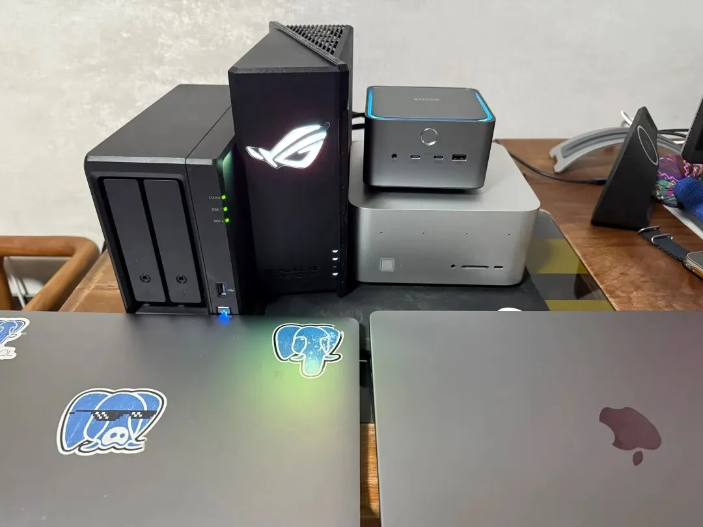

当然，电脑这个东西更新换代的太快了，而且我的老游戏主机和 Dell 服务器最有点儿太老了，我早就有想法把老的这台游戏主机和 Dell 服务器给替换掉，因为这两个大家伙特别占地方，而且运行噪音很大。我的需求有：

1.虚拟化：用来拉起很多虚拟机进行 Pigsty 冒烟测试（原本用服务器，性能够，太吵），同时我需要一台高性能的 x86 Build Farm 来本地跑 PostgreSQL 扩展编译。所以需求就是 CPU 越多越好，内存越大越好。2.AI：我的 M1 Macbook 已经可以比较流畅运行 GPT-OSS-20B 和 QWEN 3 系列模型了，但是我想要能跑 GPT-OSS-120B 的版本，在本地有一个可以干些有趣活儿的模型。3.游戏：老冯对游戏没有太多需求，但偶尔会玩玩 3A 和策略类游戏，毕竟已经有一台专用的 2080Ti 了。只要能流畅跑起来这些策略类游戏，我就满意了。4.数据库：老冯有一个私人数据库收藏，里面有各种五花八门的数据，（最大的 Github Archive 几个 TB，NOAA ISD 数据一个多 TB，还有一堆几百 GB 的数据集），我想常驻一个 PostgreSQL 实例提供服务。

另外这次，我想要换一个小型化的电脑，MINI PC 或者是 ITX 机箱。我更偏好 MiniPC——是被 DHH 种草了。最后我经过筛选，锁定了 AMD AI MAX 395 这个 CPU，同时满足了上面的需求，而且内存可以配置 128GB 8000 MHz 的 LPDDR5X，理论带宽 256 GB/s。

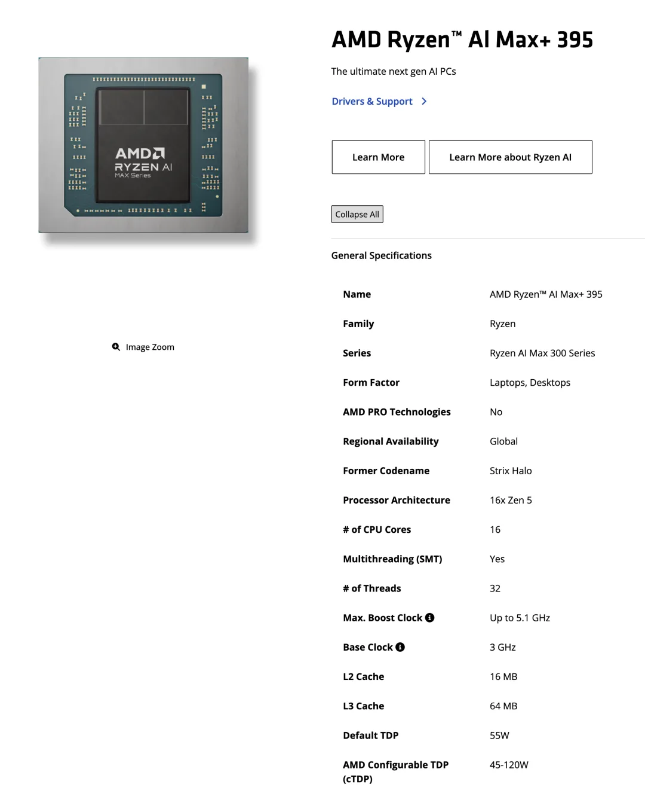

## 备选的产品

然后我就开始筛选搭载这颗 CPU 的产品。还别说，搭载这颗 CPU 的产品都不便宜，毕竟有个堪比 4070 的核显，普遍在一万到两万的价格区间。第一波筛选进来的包括：ROG 幻 X 2025（20999¥），极摩客 X2（¥14999），然后就是 零刻的 GTR9Pro（¥12999），还有一个铭凡期货：MS-S1 MAX 机型（未发布）。

这里的 ROG 幻 X 我趁着上海国补 ¥2000 入手了一个 —— 想法很朴素，平板可以带着跑嘛，但是发现笔记本这个形态根本没有办法发挥这颗 CPU 的性能（功耗锁在 80W 左右）。加上遇到两次蓝屏，平板使用效果也一般，就退货了。

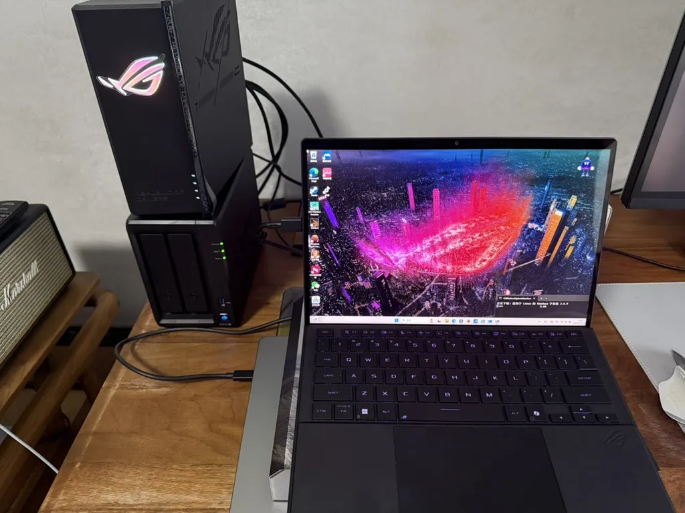

我挺看好的另一个选择其实最看好铭凡的 MS-S1 MAX，据说有两个 USB4.0v2 （80Gbps）的口，用来外接显卡坞什么的非常好。但还没发布，也不知道价格，老冯也没那个耐心去傻等。

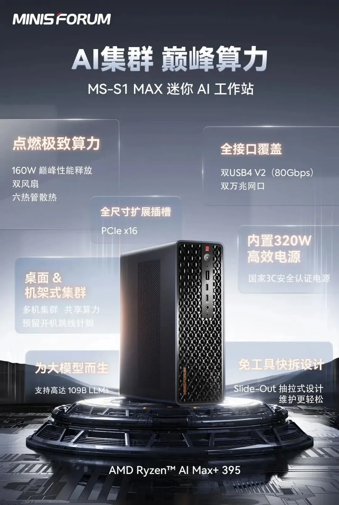

所以就是零刻的 GTR 9 Pro 了，这个机型有两个万兆网口，而且主要是散热做工很扎实，可以轻松压住 140W 的 CPU 功耗，内置了 230w 电源。而且这个样子就 “果里果气” 的，几乎和 MacStudio 一个样子。而且只要一万三，比幻 X，极摩客 X1 便宜一大圈。

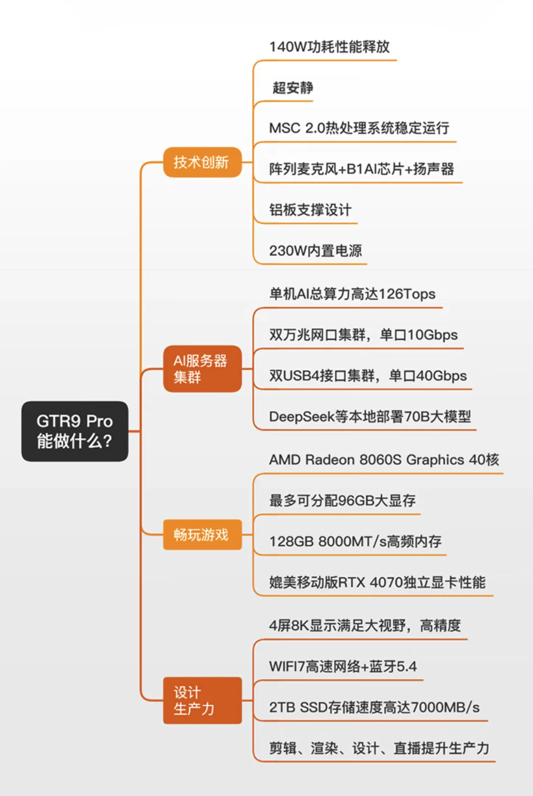

让我立刻拍板购买的是 9.4 号这玩意竟然上架了京东直营，可以参与国家补贴减 ¥2000，也就是 ¥10999 —— 不过上架的是 4TB 版本，多了一条 2TB SSD，原价 ¥13999，国补加券后 11929¥ 就能入手，那这个价格可就太香了。听说只有 25 台，基本上放出来一天就卖完了。如果是无盘准系统国补完应该是 9999，简直离谱。

## 到手的体验

到手之后，我第一个测试的就是 AI 性能，先拉一个 GPT-OSS-120B 起来，输出速度在 20 ~ 50 Token/s，这个速度很快了，不过这个模型活跃参数不大只有几十亿。AMD AI MAX 对于这种总参数很大，但是激活参数很小的 MoE 模型（GPT-OSS-120B，QWEN3-30B-A3B）简直就是绝配。

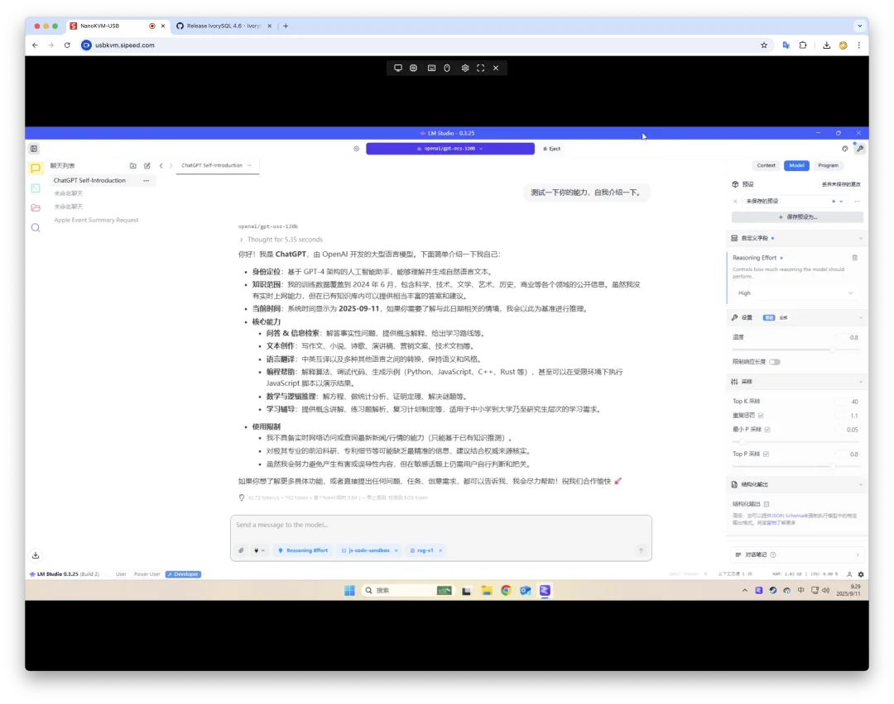

另外我听说有人在这个上面成功跑起来了 Qwen3 235B 那个版本，大概占了 120 多 G 显存，当然，这个俺还没试过，估计也不会快，但一万块的电脑能跑 235B 模型，这本身这可真让人震惊。\

有人整理了其他模型的速度，我也懒得测试了就贴在这里了。

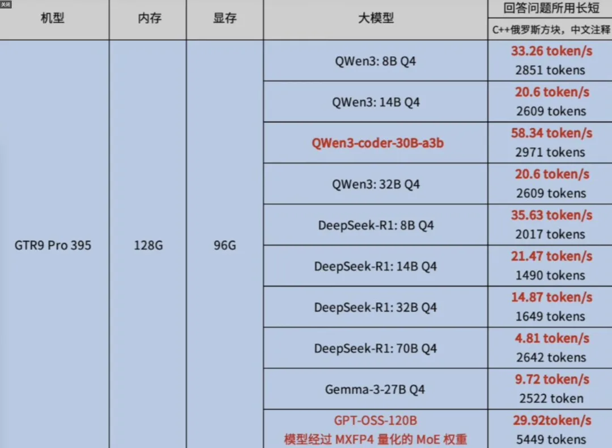

总的来说，我对 GPT OSS 120B 的表现很满意 —— 我的意思是对于我想让他干的事情 —— 本地分析日志，配置推荐，自然语言转化命令，都已经足够聪明了。而且 128GB 的内存能让你跑一个这种主模型的时候，同时再跑两个 Embedding 模型 Reranker 模型（比如 Qwen3 8B 系列），一条龙解决知识库模型需求。

当然，你说苹果能不能跑的更快，我相信 Mac Studio M3 Ultra 跑这个肯定更快，它的最大内存与内存带宽（512G，819GB/s）都是这个 “Win Studio” 的三四倍，但它的价格能到 5～10 倍，Mac Studio Ultra3 32C/96GB/4TB 的价格是 51749¥，512G/16TB，819G 内存带宽的要 10 万 8。如果你要用显卡集群或者是魔改显卡，差不多也需要大几万才能跑起来。但 WinStudio （Linux Studio ）在能本地流畅运行主流开源模型的前提下，只要 1/5 ～ 1/10 的价格，那性价比可以说无敌了。

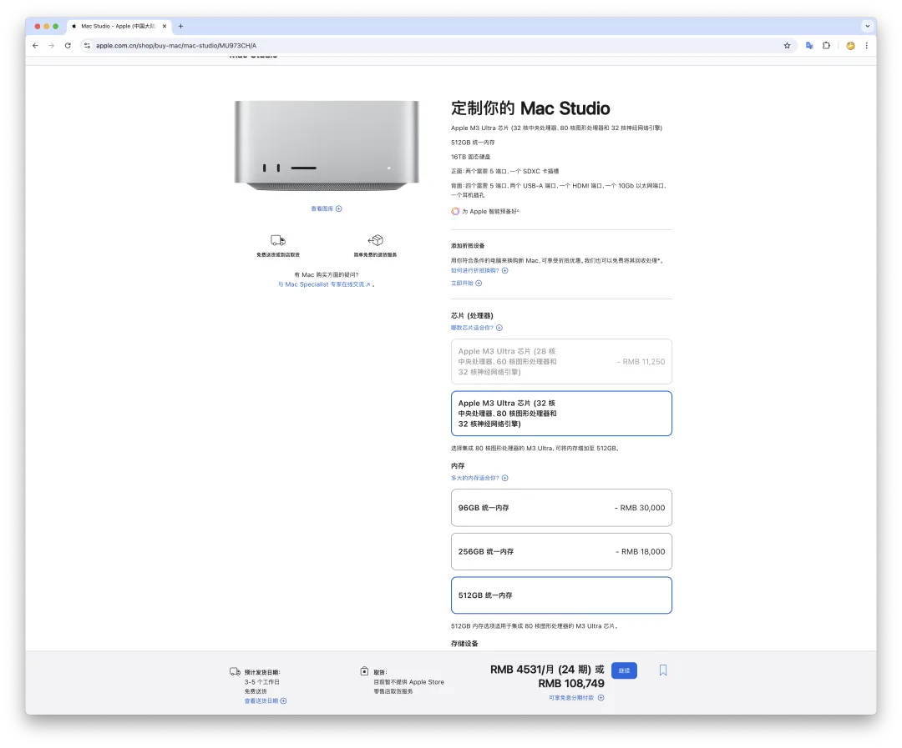

然后老冯也测试了一下 3A 游戏，开了个黑神话悟空，在我 5K 的显示器上开推荐配置 —— 高画质全开，没有光追，还是非常流畅丝滑的。当然画质跟顶级还是差一些，没有我的 2080Ti 给力，但是也足够好了。老冯主要玩一些 P 社策略游戏，所以这个流畅度和画质也绰绰有余了。据称基本上可以达到 4060 或者移动端 4070 的水准。

最后，老冯测试了一下数据库的性能。运行 PostgreSQL 17，和 AWS 5 代物理机，我的两台老 Macbook 去比，性能超出我预期 —— 每条链接能够承载的只读/读写 TPS 表现相当不俗 —— 只读表现相当耀眼，甚至干翻了 AWS 物理机（96c256G 本地 NVMe），读写的吞吐效能要稍微弱一些。但也很不错了。

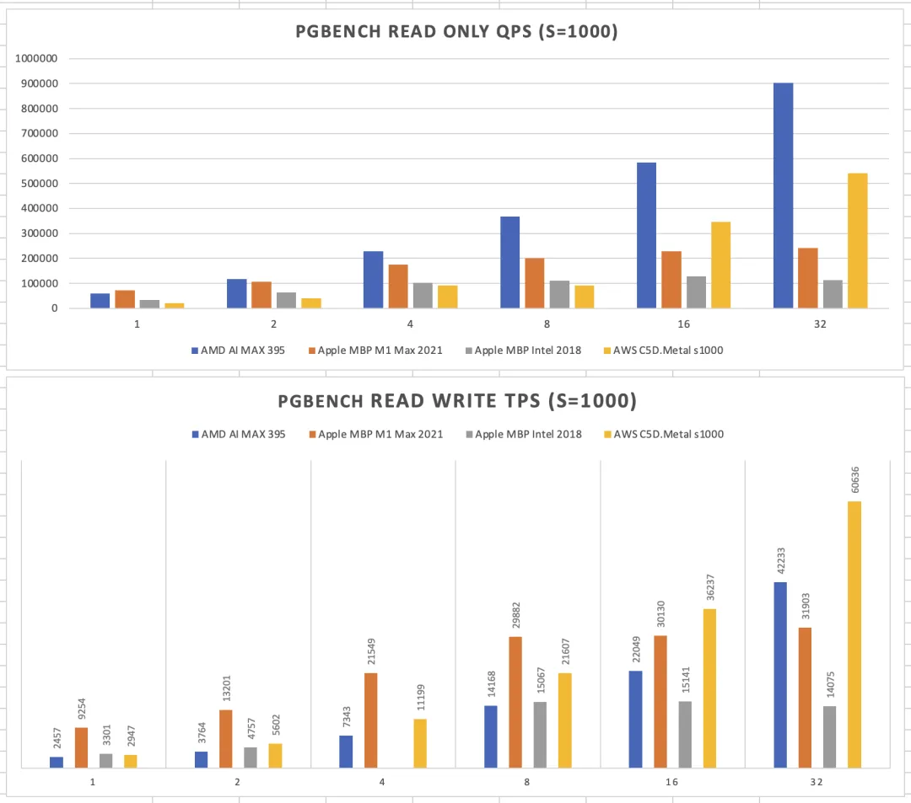

然后我用 vagrant + libvirt 尝试去拉起了 Pigsty 之前的巨无霸冒烟测试环境：36 台虚拟机，加起来 70 多 vCPU（超配 100%），毫无压力，而且相当丝滑，老冯觉得它完全可以替代我的 Dell R730 二手服务器，用来大规模测试，批量编译。而且即使是满载，这个噪音放在离我六七十厘米的地方，也依然没啥感觉。

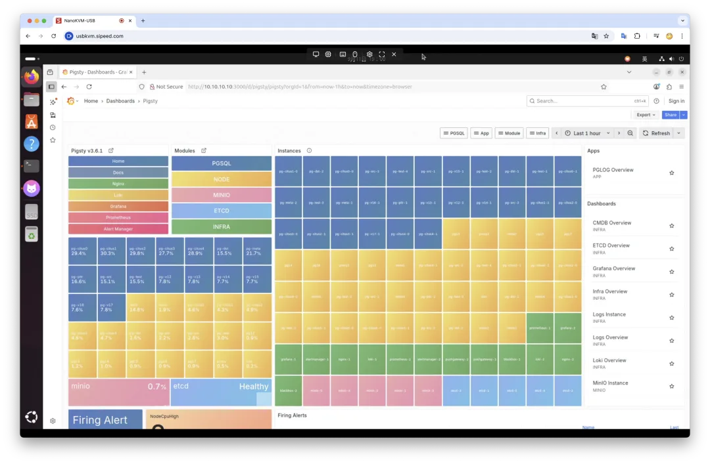

另外，值得夸赞的是它自带 Windows 11 Pro 版，这个比 幻 X 的 Win11 家庭版好多了，比如我想要在 Windows 下用 vagrant + hyper-V 虚拟机的话，就得要这个专业版，自带了就不用我去折腾了。

这个 AI PC 还有一个让我惊喜的地方是，它竟然可以用 苹果专用的显示器 —— LG Ultrafine 5K，这个本来只有苹果能用，但是新一点的主板（我修过一次换了）可以接 Thunderbolt 3 的视频输出。miniPC 带 5K 显示器，效果非常好。

有人问鲁大师跑多少分？老冯是不会去装这种流氓全家桶软件的，但看别人跑分大概 三百多万分出头，算是很不错的了。

## 不好的地方

当然，这个 mini AI 超级桌面计算盒子有没有让老冯不满意的地方呢？也是有的。

第一个不满意的是接口，它的 USB-A 接口只有两个，鼠标，键盘，手柄，U 盘，不太够用，而且都在后面，前面只有一个 USB-C 口，应该加个 A 口的。不算什么大问题，加个扩展坞就好了。另一个槽点是两个 USB 接口是 4.0 第一代，差不多相当于 TB4，比较可惜的是现在有 USB 4.0v2 提供 80 Gbps 的带宽，据说 MS-S1 会搭载，这个没有，怪可惜的。

老冯最遗憾的是它这个 PCI-e SSD 是 Gen4 的插槽，我是非常想体验一下 Gen5 14.5 GB/s 的读写速度能给数据库（PostgreSQL / DuckDB ）带来什么样的体验。但是奈何 AI MAX 395 只有 4.0 的通道，从根上就断了这个念想。我也多次纠结到底是不是弄个 9950x3D / Gen5 加普通内存/显卡，最后还是舍不得 AI Max 的 AI 能力。

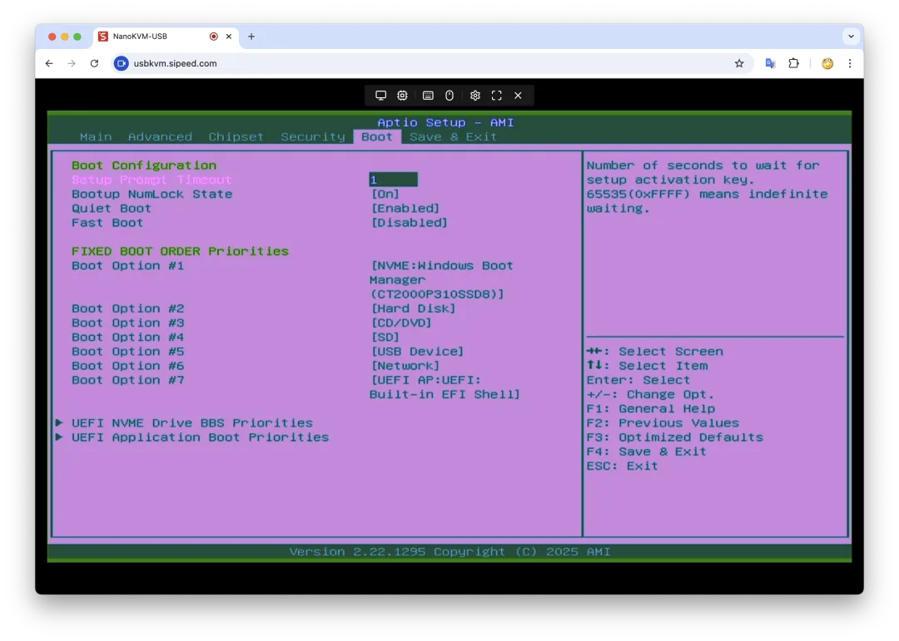

另一个槽点是，我以为 4TB 的版本是给我把现在这一条 2TB 升级到 4TB 版本，然后我兴高采烈的买了一条西部数据的 SN8100X 4TB 版本（Gen5 先插到 Gen4 槽里），结果发现它这个 4TB 版本是 两条 2TB ……。而且更让人恶心的是默认使用的 SSD 是英睿达的，是 QLC 颗粒的，这个让老冯很不满意，好马配好鞍，都上 AI MAX 395 / 128G 8000MHz 这种顶级配置了，不会弄个好点的 SSD 么。

主要是国补的规格只有这个，没得选，就当这两条磁盘白给了。老冯准备后面把这个 QLC 破烂插到 NAS 上当缓存盘，换上一条 8TB 的 WD Gen4 SSD，不过用也就凑合用了。如果有的选，老冯强烈建议买那个不带盘的准系统（原价 11999，我在淘宝上看到过一次，很快下架了），然后自己弄两条西数 WD SN850x 4TB 插上。

最后一个槽点是万兆网卡，双 10Gbps 网口是一个卖点，但没有做到开箱即用，老冯折腾了好一阵子才让它跑起来。我花了一段时间折腾 Windows 上的有线网卡驱动，甚至重装了两遍 Windows。有线网卡甚至没有显示在设备列表中，最后找官方客服，用小针捅耳机孔重置，解决了这个问题。

## 一些有用的小零件

另一个有用的小零件是 NanoKVM。跑 Linux 的时候，我不想在桌子上再摆一套键盘鼠标显示器。就淘宝买了个一百多块钱的 NanoKVM，可以在 Macbook 上直接从浏览器控制 MiniPC。我觉得对于这种迷你 PC 来说简直是神器。

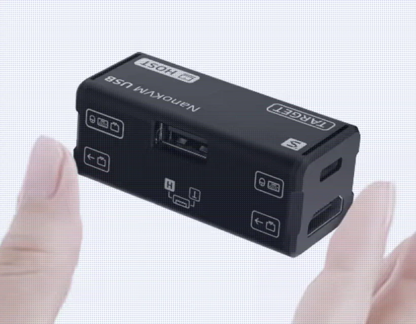

另外老冯又趁着国补在淘宝上买了个 “便携折叠显示器”，两个 18 寸的 2.5K 180Hz 高刷屏，100% DCI-P3 色域，可以独立/组合使用，两公斤左右。国补价格 ¥1879，搭配 MiniPC 很不错，不过这玩意还没收到，所以也不知实际体验怎么样。

## 总结

总的来说，老冯对这次买到的 AI PC —— WinStudio 非常满意，盒子扔掉，决定留下来了。

实际上，我觉得这玩意应该能折腾出不少花出来 —— 插两条 8TB NVMe SSD 组 RAID。两台 x 两个万兆网口可以直接留一个出来点对点组集群（连万兆交换机都省了）。装上 Pigsty 变成一个 —— AI 数据库一体机。

性能肯定是管够的，单台干到百万级点查询/点写入速度轻轻松松。128GB 显存对半拆分，一台跑 GPT-OSS-120B，另一台跑 Qwen3 32B + Qwen Embedding / Reranker，RAG 全家桶都齐活了。32vCPU 128GB 内存，8～16TB 全闪存储，两节点组一个集群，总共才 3 万出头，400W 的功耗，静音的效果。连机柜都不用…… 对中小企业来说，可谓是香爆了。

当然，从另一个角度来说，你确实也可以通过这台 Mini PC 的性价比，意识到云上卖给你的云服务器和云数据库，溢价到底有多高…… 哈哈。

DHH 最近在搞它的 Linux 发行版 Omarchy，给俺种草了零刻的 mini PC 和 AMD AI MAX。老冯后面也准备出一个利用这个 AMD MINI AI PC 搭建 Pigsty —— PostgreSQL 数据库发行版，然后拉起 PostgreSQL，Dify，Supabase，配合各种本地 AI 模型，开发本地 AI Agent + 数据库应用的教程，敬请期待哈哈。

今天就分享到这里，老冯已经忍不住继续去把玩一下这个新宠了。

---

发布版本：[微信公众号](https://mp.weixin.qq.com/s/HLBKhT50M13PNcnC3GsbkA)
