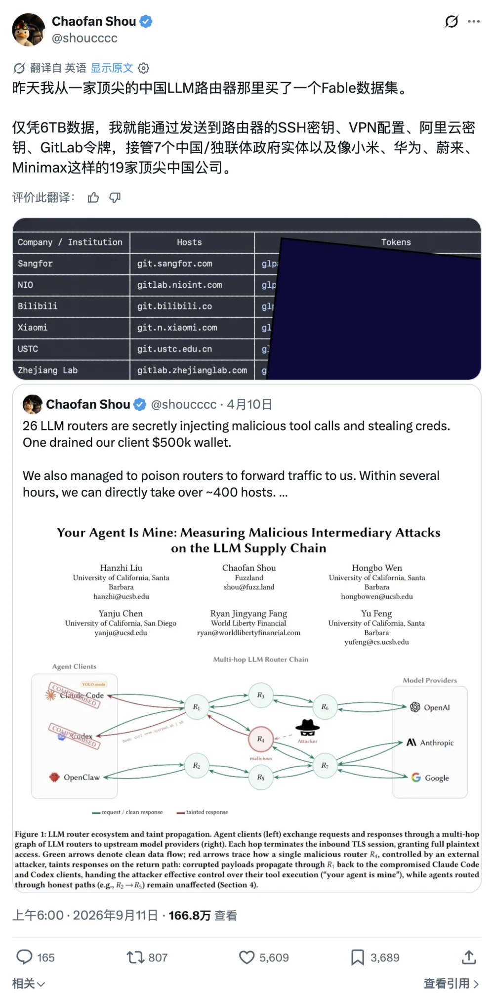
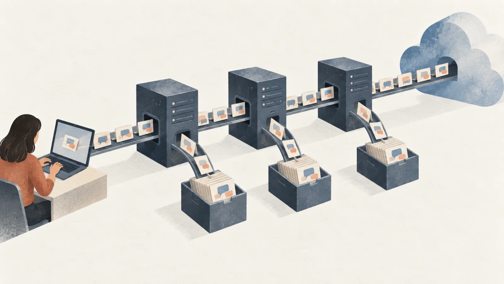
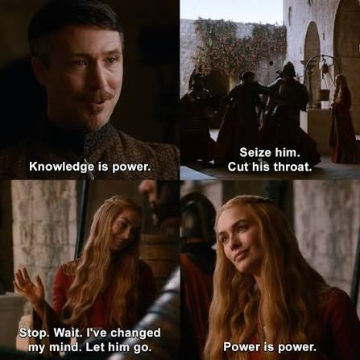

> Anthropic 的威胁报告、OpenAI 的狗血剧、200 刀订阅关门，再加显卡内存齐涨价——这一周发生的事，说的是同一件事。

这一周有三件事，单看每一件都像圈内八卦，拼在一起就是一幅完整的图。

第一件，9 月 10 日，Anthropic 发了一份 [威胁情报报告](/work/anthropic-report.html)，把过去八个月在 Claude 上抓到的滥用案例摊开来讲：网络攻击、影响力行动、监控、诈骗、生物、武器，外加一整章专门讲“未经授权的蒸馏”。
报告原文有些内容太敏感，老冯没法整篇贴出来，能说的大意是：有人拿 Claude 的 API 做杀猪盘；有一批国内模型厂商在偷偷蒸馏，还有一群中转站在中间倒卖你的对话记录。

第二件，OpenAI 宣布用一万个 Agent 组成的集群“解决”了纳维-斯托克斯方程。本来是件载入史册的事，结果演成了狗血剧。
纽约大学数学家 Buckmaster 和搭档几个月的草稿全放在 Codex 里，他问 OpenAI：你们的模型有没有拿我们的会话训练？
对方答“模型不查用户数据”；再问训练的事，没有回答。OpenAI 自己的博客写得更妙：他们不能排除，这两位使用其产品产生的“去标识化数据”帮助改进了他们的模型——虽然“不太可能”。

第三件，同一天，9 月 10 日，OpenAI 暂停了 200 刀 Pro 档位（Pro 20X）的新订阅和升级。
老用户还能续，但你要是掉下来，就回不去了。100 刀那档还开着。官方给的理由是新模型 Astra 需求太猛、算力吃紧。
再加一个背景音：显卡在涨，内存在涨，能跑大模型的本地设备价格在往上跳，连带着手机，电脑，游戏机都在涨，AI 税已经收到了普通人身上。

三件事的背后，其实是同一件事：你的数据、你的想法、你最敏感的东西，正在被明码标价。

---

## 一、受害者不是 Anthropic，是你

先说报告。多数人看这份报告的角度是“AI 被坏人用了”，老冯看的角度是“数据往哪流”。

先看杀猪盘。一家国内的应用工作室，用 Claude 搭了一个二十多款约会 App 组成的网络，让 Claude 扮演聊天对象，对外宣称全是真人。
2026 年 4 月一个两周的观察窗口里，Anthropic 数出来 4,700 多个 AI 人设，跟至少 25,000 个人聊过，Claude 发了大约 236 万条消息。目标用户在美国。

信息流里 75% 是 AI 人设，25% 是真人零工，真人负责 AI 干不了的事——视频通话、社交媒体回关 —— 好让你相信对面是活人。
三个 AI 配一个真人，这是工业化的配比。用户发消息、匹配都要消耗额度，额度用完了买金币。

报告里有个细节老冯看了很不舒服：在少量抽样里，模型自己的推理已经意识到对面的人透露了重病或者处于痛苦中，但没有拒绝，继续按人设演下去。
系统提示词看上去就是个普通的陪伴 App，从任何一次单独的对话里，都看不出变现方式和欺骗行为。
这是拿别人的模型骗第三方，数据是从受害者身上流出去的。

再看蒸馏，这才是跟你我直接有关的部分。自二月 Anthropic 首次披露蒸馏攻击以来，又抓到了七家国内实验室，
名字都是大家耳熟能详的，报告里点了，老冯这里就不逐个复读了。老冯感兴趣的不是谁，而是怎么干的。

规模最大的一家，高峰期用 3,500 多个欺诈账号，一天近 300 万次交互，五到七月三个月观测到超过 1.5 亿次，
目标是 Claude 的思维链推理记录，拿回去做 SFT。这算是“正常”的蒸馏：自己出题，让 Claude 答，把答案记下来。

另外几家的玩法就不一样了。有一家做大模型的公司，把自家用户的请求悄悄转发给 Claude，再把 Claude 的回答当成自己模型的回答返给用户。
用户以为在用国产模型，收到的是 Claude 的答案。十天转发了近 30 万次，用的代理网络有 5,380 个账号，表面上分布在新加坡和日本。
转发的同时把交互存下来，提取 Claude 的思维链训自己的模型。

有一家更有针对性：检查入站请求里的字符串，把用 Claude Code、Claude Agent SDK、OpenCode 这类框架的用户打上标签，专挑这些用户的请求转给 Claude Opus。
为什么专挑这些？因为这些是干活的请求，是 Agent 任务，是最有蒸馏价值的数据。

还有一家把自家用户跟自家模型的对话和编程会话存下来，事后重放给 Claude，让 Claude 重新答一遍，生成 SFT 和 RL 数据。
报告顺手提了一句：这家推出新模型时给了免费试用期，之后又延长了，而针对 Claude 的蒸馏大多恰好在试用期快结束时开始。免费试用是什么，大家自己体会。

然后是中转站。报告专门讲了一个二级市场：给不受支持地区用户提供 Claude 访问的代理网络，一边收你的钱，一边把你跟 Claude 的对话记录保存下来，卖给实验室。
有一家实验室的蒸馏流水线里，就有从“第三方数据供应商”买来的用户对话。还有一家干脆通过一个跟母公司看不出关系的壳公司自己开了个中转站，
只卖 Anthropic 和 OpenAI 的模型，不卖任何国产模型，包括自家的。这个中转站开出来是干什么的，不用老冯多说。

这些事的受害者是谁？这些被转发、被重放、被倒卖的交互里，包含了个人用户和大型跨国公司的敏感信息，几百个最终用户的姓名、邮箱、公司数据，涉及至少十二种语言。

报告给了两个打了码的例子：一家制药公司的内部资本支出预测，胡志明市、吉隆坡、曼谷、卢布尔雅那几个厂区 2026 到 2028 年的扩建估算，用户以为交给的是某国产编程助手；
一个开发者调试通知机器人，把 Telegram bot token、飞书 appSecret、Notion 集成密钥全贴了进去，那些凭据当时还有效。

还有一家科技公司的员工拿“国产模型”分析内部文档，里面是某旗舰 AI 项目的完整规范、组织结构和战略目标；还有一位大型国企的工程师，泄露了多家大企业的内部代码和有效凭据。这个就不能详细说了。

老冯把这条链画一遍：你在客户端里敲了一段提示词，发给一个“国产模型”；国产模型看你是干活的请求，转给中转站；
中转站把请求存一份、发给 Claude；Claude 的回答原路返回，中转站再存一份回答，国产模型存一份，然后把 Claude 的回答当自己的回答给你。

你的数据在这条链上每一站都被拷贝了一份，每一份都可能进下一轮训练，或者被打包卖掉。而你从头到尾以为自己只是在用一个便宜的国产模型。

说到底，这些模型厂商，加上中转站，就是奔着数据来的。**你以为你在薅羊毛，其实羊毛出在羊身上。**

---

## 二、OpenAI 那出戏：连“不训练”三个字都不敢说

如果说报告讲的是国内厂商和中转站，OpenAI 这一出讲的是“正规军”。

时间线是这样的：9 月 1 日，网上传 Anthropic 的研究人员可能解决了两个千禧年难题。OpenAI 的人后来在推特上承认，就是因为这个传言，他们才让刚训好的内部模型去攻剩下的难题。
9 月 3 日，Buckmaster 联系 OpenAI 解释：那是他和 Anthropic 研究员 Alpöge 的个人合作，不是 Anthropic 的项目。
9 月 6 日，OpenAI 告诉他们：我们的系统做出了更大的东西，纳维-斯托克斯的有限时间爆破证明。9 月 7 日，两人把自己的工作公开。

Buckmaster 说，他和搭档几个月来把这个项目的所有草稿都放在 Codex 会话里。
他问 OpenAI：模型有没有训练过或者访问过我们的 Codex 会话？答复是模型不查用户数据。
他再问训练，没有回答。OpenAI 高管否认任何员工或 Agent 在公开前看过他们的工作，但训练数据这条路，OpenAI 自己的博客不敢排除。

老冯不去评判这个证明到底是不是抄的，那是数学家的事。老冯关心的是那句“不能排除”。
这是什么意思？意思是消费者订阅的默认条款就是这样：你的对话可能被拿去改进模型。
他们没骗你，白纸黑字写着，只不过写在你从来不点开的地方。

数学家把几个月的心血放进去，是因为它好用，20 刀、200 刀一个月，比雇个博士后便宜太多。
等到对方用一万个 Agent、烧掉几百万美元算力，几天之内把你几个月的路走完，你才想起来问一句：你们训练用了我的东西没有？
得到的回答是：不好说。

**这就是“数据换算力”摊在桌面上的样子。**

至于今天 OpenAI 新发布的这个 Agent API，那几乎就更是明牌了。
原本 Agent 运行要你自己来提供环境，这听上去麻烦，但是你的 credential、你的秘密、你的隐私都还在本地？
它要真想做点什么，你也有办法在网关层面检测到、发现并拦截。但如果以后都换成在云端运行的 Agent，
那么你想做一些有用的事情，可能反而必须得主动心甘情愿地把你的密钥、凭证和各种各样的东西交出去，你也很难再审计它是怎么用这些东西，做了什么事。

---

## 三、订阅补贴的账本：击鼓传花

老冯几个月前在《[AGI 机关枪发下来了](/ai/ai-machinegun-for-everyone/)》和《[如何蹬满 10 个订阅](/ai/10x-subscription/)》里说过一个判断：现在这种 20 刀、200 刀包月的订阅，本质是数据换算力。
你按 API 原价算一下，200 刀的 Pro 一个月能烧掉的推理，折成 API 账单是几十倍的差价。

这几十倍从哪来？一半是补贴，为了抢用户、抢份额、抢 IPO 前的增长曲线；另一半是你的数据。
消费者版默认可以用你的对话训练模型，你可以关，但默认是开的。
企业 API 默认不训练，要零数据保留（ZDR）还得另谈。
订阅和企业 API 按量付费几十倍价差里卖的核心就是这个条款。

老冯当时的判断是：等它积累够了数据，或者要冲 IPO 的时候，这种补贴绝对不是常态，一定会停。这是一个击鼓传花的游戏。

现在苗头已经露出来了。9 月 10 日 OpenAI 暂停 200 刀 Pro 的新订阅和升级，
官方说法是 Astra 上线一周需求太猛、Pro 档位对系统压力最大。老冯不怀疑这个说法是真的，算力确实吃紧。

但换个角度看：最亏钱的那一档，最先关门。100 刀的 Pro 5X 还开着，可按 20X 的额度算，
你花一半的钱只拿到四分之一的量，等于亏了一半。老冯的预测是，说不定再过一阵，100 刀这档也要动。

顺便说一句，这次的规则设计很有意思：老用户能续，掉下来回不去。
这是在筛人。愿意持续付 200 刀、持续产生高质量数据的用户留下，其他人请去 100 刀那档。

背景是 OpenAI 在筹备 IPO，国内某家头部模型公司也在筹备科创板上市。上市公司的报表不能长期亏着补贴。
如果我们承认企业 API 的定价是一个正常运营的状态，那补贴 20 倍、50 倍的订阅，就是一个赔本赚吆喝临时状态。
它什么时候结束，取决于他们什么时候觉得数据够了、用户锁住了、故事讲完了。

所以老冯一直说“有水快流”：假设这个窗口只剩几个月、半年，那加满杠杆、用足这几个月攻城略地，显然是最优选择。这一点老冯没变。

但今天要说的是另一只手：水在流的时候，你得知道水往哪流。

---

## 四、你的壁垒到底是什么

这里有一个根本性的问题：在 AI 面前，你自己的壁垒到底是什么？

你会写代码，AI 会写。你会写文章，AI 会写。你会做架构、看合同、算模型，AI 都会，而且越来越会。这些在 AI 公司面前，都算不上壁垒。

在这些 AI 公司面前，你个人的、你公司的真正壁垒，不是算力，不是模型，是数据。说白了，是你的 memory，你的记忆：你的客户是谁，你的定价怎么定，
你踩过什么坑，你手里有什么别人没有的经验，你正在琢磨什么别人还没琢磨到的事。这是最核心、最灵魂的东西。你作为一个人跟另一个人的本质区别，不就是你大脑里神经元的排列组合吗？

那位数学家的壁垒是什么？是他几个月来在 Codex 里一步步推出来的思路。代码 Codex 也会写，但那条路是他的。然后他花 200 刀一个月，把这条路交出去了，交得开开心心。

**数据为什么是壁垒？因为数据是权力。**

有人会说“Power is power”，权力就是权力，瑟曦和小指头会为这句话吵一架。
但老冯说数据是权力，意思很具体：数据能对你施加影响、产生作用力。
知道你的财务状况，就能对症下药；知道你的健康，保费就能算得刚刚好；
知道你在看什么，推荐就能推得刚刚好；知道你的还款习惯，授信额度就能给得刚刚好。

老外对这个体会更深，信用分没了寸步难行，《黑镜》里演的就是这个。

再举个例子。OpenAI 公开说过，检测到有人在计划伤害他人时，会有人工审核，必要时移交执法部门；网上也流传过聊着聊着把警察聊来的事。听上去是好事，也确实是好事。但反过来说明一件事：它有能力检测并看到你说了什么。

老冯没有证据说 OpenAI 或者谁刻意去翻你的聊天记录，老冯只说技术事实：以老冯做了十一年数据库的经验，像 OpenAI 和 Azure 这种规模的基建，DBA 和 SRE 极大概率是有权限把一切看个遍的，只不过人家平时没兴趣、没时间。你是小卡拉米，谁有兴趣看你的聊天记录？

但如果你是高净值人士，你的想法、决策、税务安排、法律处境，都是极高价值的信息。这些东西存在别人的数据库里，难保不会被有心人收集起来，在未来某个时刻给你致命一击。

顺带说个老冯自己的猜想，不太严肃，大家当八卦听：Anthropic 封号封得这么勤，根本原因也许不是什么 IP、分享账号这些由头。老冯用机房 IP 问过各种敏感问题，他们列的红线基本踩了一遍，没被封过。老冯的猜想是，账号被评估为“数据有价值”的就留着，评估为没价值的就随便找个由头处理。

这是主观臆测，没有证据。但有一点不用猜：在数据换算力的商业模式下，平台必然在给每一个账号估值。这不是阴谋论，这是商业逻辑。

所以 privacy 非常重要，这不是一句政治正确的空话。**数据是权力，你把数据交出去，就是把权力交出去。**

---

## 五、老冯为什么自己反而狠狠地用

说到这儿有人要问了：老冯你天天蹬十几个订阅，一天烧几百小时 Agent，你不是把数据交得最欢的那个吗？对。而且老冯巴不得他们全拿去训练。

因为老冯做的是开源软件。Pigsty 的代码、文档、老冯写的文章、老冯的架构理念，本来就是要公开发布、要尽可能传播复制，注入整个人类知识库的。
这些东西被拿去训练，进入 AI 的“共同意识”，老冯的想法就能通过千千万万次对话产生更大的影响力。
这是求之不得的事。这就是开源共产主义的路子：我的产出本来就是公共品，你拿去训练是帮我传播。

他们想用算力换数据，可老冯这些数据全是公开的，他们等于什么都没赚到，老冯却狠狠赚到了：以几十分之一的价格拿到顶级智能。

为什么老冯说对于做基础设施的一人公司，这是黄金时代？就是这个道理。你要做的事情没有什么遮遮掩掩、需要保密的东西，这套补贴模式简直是给俺量身定做的。

但老冯的个人敏感数据，是不会用同一套账号处理的。老冯有专门的账号记录个人的事，把“用你的数据改进模型”那个开关关掉。
虽然没有企业级的零数据保留，但至少它承诺不拿你的对话去训练，保留 30 天滚动删除。到底删没删老冯也不知道，但这个开关你至少得关上。

另外一个重要的事情也是我之前在文章里面提到过的，就是数据管辖权的司法套利。
简单来说，你的数据泄露给 Anthropic 和 OpenAI 可能不会对你产生什么直接影响；
同理，老外的一些个人数据泄露给中国的 GLM、DeepSeek 可能也不会有什么影响 —— 因为他们跨着司法管辖区。
《[隐私换便利？云上AI助理意味着什么？](https://vonng.com/ai/cloud-agent/)》
所以基于这个原因，国内的什么什么 Buddy，什么 Coder，就算是倒贴我我也不会用。

这就是老冯的原则：分清什么是该公开的，什么是该保密的。
**该公开的，当广告使劲喂，喂得越多越好；该保密的，一个字节都不要出局域网。**

如果你要维持一个个体、一家公司的独特性和不可替代性，你的核心资产恰恰是那些不能公开的东西：
客户、案情、配方、战略、还没发布的研究。这些数据你简简单单交出去，就是在用 20 刀一个月的价格，把你之所以是你的那部分卖掉。
Palantir 的 CEO Alex Karp 有句话老冯之前引过：AI 模型 API 调用本质上是人类历史上最大规模的数据转移。

---

## 六、本地 AI，算的是政治账

那本地 AI 到底划不划算？老实说，你要是算经济账，本地 AI 亏得一塌糊涂。
拿最新的例子算。DeepSeek 9 月 10 日发的 V4.1 Flash，552B 总参数、16B 激活，MIT 协议，开放权重，是目前能在一台机器上跑起来的最强模型之一。
你买一台顶配 Mac Studio，小十万块，量化之后本地跑，能有 80 token/s 就算不错了。

官方 API 呢？几百 token/s，比你快好几倍，价格是每百万 token 输入两毛多美元、输出六毛多美元。
你就算让这台机器 24 小时满载不停，一天吐 700 万 token，按 API 价折算一天省不到五美元，一年一千多美元，光机器钱就要六七年才能回本，电费还没算。
正常人一天真用不了两三个小时，那就是几十年。纯按 token 算，这笔账算到天荒地老也算不平。

而且本地硬件还在涨。这一轮涨价不是矿潮，是内存：三大内存厂把产能往 HBM 和服务器内存上倒，结果就是 5090 卖到 5090 美元，6000 Pro 卖到十几万，
GB300 奔着一千五百万往上冲还买不到。连 Switch 2、PS5、iPhone，Mac Mini 都跟着涨。能跑大模型的本地设备，今天是历史最贵，明天还会更贵。

这跟 DHH 那 19 PB 全闪存从 150 万涨到 1,900 万美元是同一个故事：云上的算力在吸干消费级硬件的供给，你想自建，窗口正在收窄。

那为什么老冯还赌这些设备会卖爆？因为这根本就不是一笔经济账，而是一笔政治账。

什么叫政治账？就是当你把“你的数据”放到天平的一边，把“差的那点钱”放到另一边，那点钱根本不值得看第二眼。
数学家几个月的思路值多少钱？制药公司三年的扩产计划值多少钱？律所的案情值多少钱？
你公司下一个产品的完整规范值多少钱？这些东西是无价的，拿无价的东西跟每百万 token 六毛钱放在一起比，比的本身就是个笑话。

*本地 AI 要守住的，是推理账单之外的数据价值。*

这就好比有的地方税率高，有的地方税率低，但税率低是有前提的，前提是安全。
安全是前面那个“1”，没有这个 1，后面有再多的 0 都没有意义。本地 AI 就是那个 1。

老冯对本地 AI 的定义也很实际：不是要你把云端订阅全停了，是你得有这个能力。
你得有一台能跑起一个像样的开放权重模型的机器，你的敏感数据得能在这台机器上过一遍而不出门。
至于日常烧 token 干公开的活，该用订阅就用订阅，该有水快流就有水快流。

---

## 七、这跟下云是同一件事

老冯这几年一直在讲下云，有人以为老冯是让大家回 IDC 从机柜开始自建一切。
不是。老冯讲的下云，是从云厂商锁定的 SaaS 和 PaaS 上下来。
云上的基础资源你可以买，Hetzner、DMIT 这种平价资源云老冯天天用，
但你不应该被锁定在他们的数据库上，现在还要加一条：不应该被锁定在他们的模型上。

为什么单挑这两个？**因为数据库和模型，是你所有系统里两个最关键的数据泄露点。数据库里存的是你所有的事实，模型里过的是你所有的意图。** 别的东西你可以外包，这两个不行。

老冯在下云的文章里讲过一条链：没有自建能力，就没有退出权；没有退出权，就没有议价权。
云厂商的 PaaS 锁定，是沦为“赛博农奴”的根源。这条链在 AI 时代原封不动地成立：
没有本地推理能力，就没有退出权；补贴停了、账号封了、条款改了、模型下架了、你的对话被拿去训练了，你只能认。

有本地能力，你才有资格跟对方谈，才有资格挑：这个活用订阅烧，那个活留在家里跑。
混合云的前提是你有能力不用云，混合 AI 的前提是你有能力不用云端模型。

还有一个朴素的道理：查一个数据库的难度，查一份模型调用日志到难度，跟偷一块硬盘的难度，不可同日而语。
数据在别人的数据库里，一条 SQL 的事；数据在你机柜里的硬盘上，得先翻墙进你家。
本地不是绝对安全，但它把“看你的数据”从一个权限问题变成了一个物理问题。区别就在这儿。

老冯之前讲过，数据世界正在向两样东西收敛：PostgreSQL 和对象存储，一个是数据库，一个是改头换面的文件系统。
AI 时代要再加一样：本地模型。这三件东西加起来，就是你的主权基础设施。
数据库存事实，对象存储存文件，模型存智能，三样都在你手里，你才是完整的你。
Pigsty 解决前两个，第三个老冯也在琢磨，那是另一篇文章的事。

---

## 八、几个判断

把这一周的三件事和这几年的下云放在一起，老冯给几个判断，不一定对，欢迎打脸。

**第一，订阅补贴会在一年之内明显退坡。** 200 刀档关门是先声。OpenAI 要 IPO，国内厂商要上市，报表撑不起长期补贴。退坡的方式不会是直接涨价，会是限量、降配、分层：老用户能续新用户进不来，高价档位保留低价档位缩量。今天 200 刀买到的额度，一年后大概率要 400 刀，或者根本买不到。

**第二，数据条款会从小字变成卖点。** “我们不用你的数据训练”会从合规声明变成定价依据，同样的模型能力会按数据条款分成两三个价。企业 API 和消费者订阅之间那几十倍的价差，本质上就是数据条款的价格。

**第三，中转站这个行业会被打压。** Anthropic 已经开始身份验证、按组织归因封禁，其他家会跟上。中转站是三方都想弄它的东西：模型厂商恨它绕过限制，用户迟早发现它在录音，实验室被点名之后也不方便再从它手里进货。再加上这次的……

**第四，开放权重模型加本地硬件会形成第二条供应链。** 这里有个很有意思的矛盾：报告里点名的国内厂商，一边在蒸馏别人，一边在发开放权重，V4.1 Flash 就是 MIT 协议发出来的。老冯之前说过，操作系统有 Linux，数据库有 PostgreSQL，AI 领域的开放前沿是中国公司在带。不管他们的模型是怎么练出来的，这些权重发出来了就是公共品，就可以在你自己的机器上跑，跑起来就不再产生数据外流。

蒸馏的账他们跟 Anthropic 算，开放权重的红利归全人类。

**第五，本地设备会持续涨价，而且会出现“为本地 AI 而生”的机器品类。** 今天是 Mac Studio 和 AI Max 395 这种顺带能跑模型的机器，明天就会有专门为跑 500B 级 MoE 模型设计的一体机。买得早的人像当年买 NVMe 全闪存的人一样，几年后会发现自己占了个大便宜。

**第六，企业会做“数据分级”。** 像下云一样，先分清哪些数据可以出去、哪些不能，可以出去的尽情烧订阅，不能出去的留在本地。这会是未来一两年企业 AI 落地最实际的一项工作：不是选模型，是分数据。

最后一条不是判断，是建议：**有水快流，同时备好船。** 这两件事不矛盾。这几个月的补贴窗口该用足就用足，加满杠杆攻城略地；同时把你的 memory 攥在自己手里，把本地能力准备好。

---

## 尾声

回到开头那位数学家。他做了一件所有人都在做的事：找一个好用的工具，把自己最珍贵的东西放进去。他唯一的错误是，忘了问那个工具是谁的。

这东西不该 20 刀一个月卖掉，也不该因为对方的模型好用就白送。开源的、该公开的，尽管拿去，喂得越多越好；私有的、要命的，一个字节都别出你的局域网。

本地 AI 算的不是经济账。经济账你永远算不平。**它算的是政治账：你的还是不是你的。**

