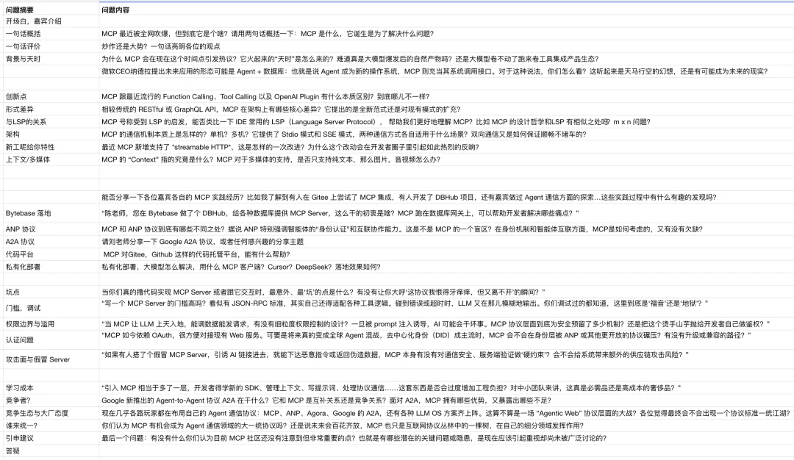
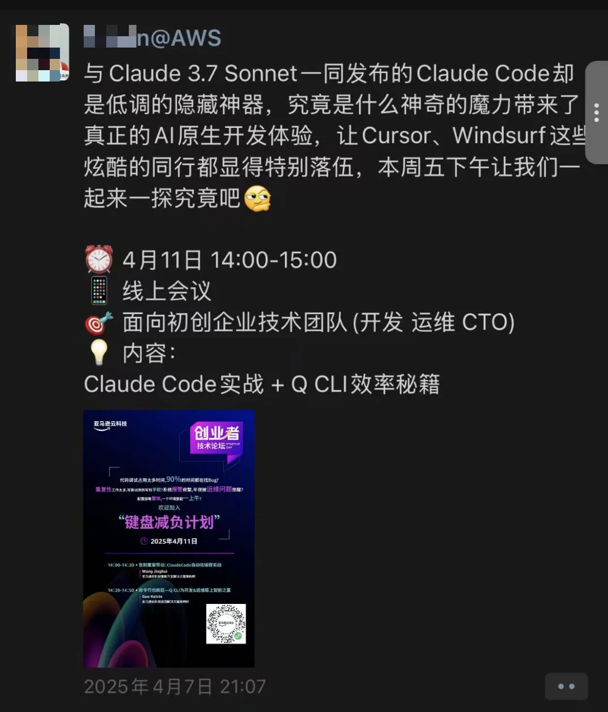
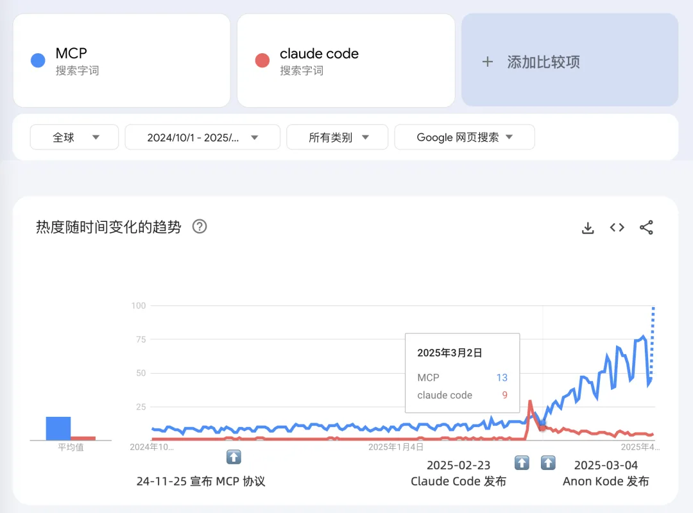
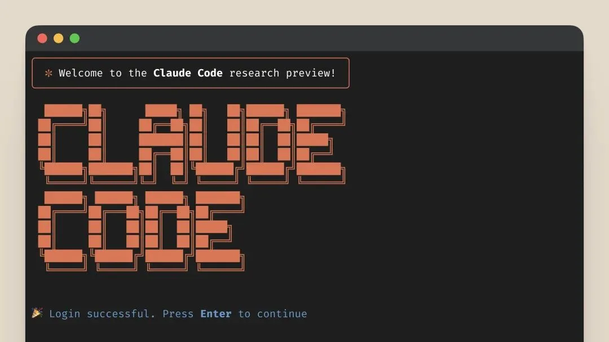
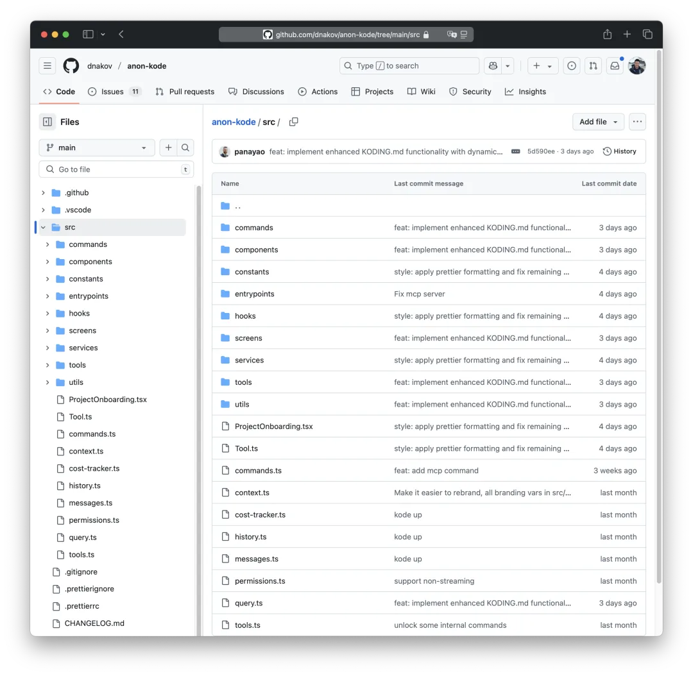
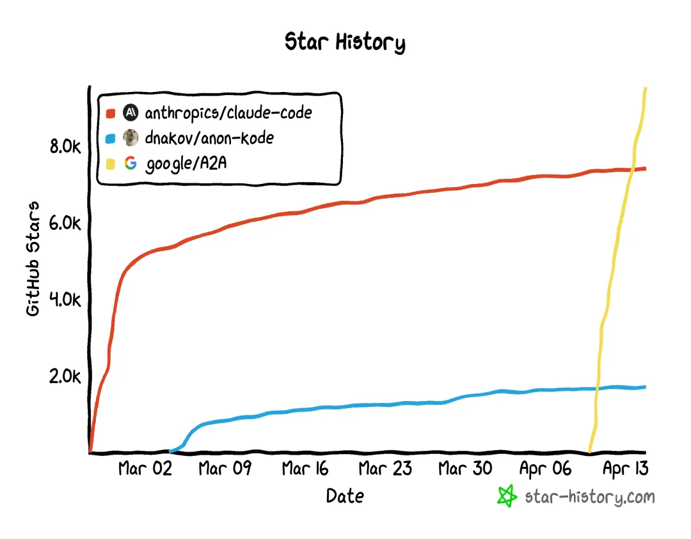
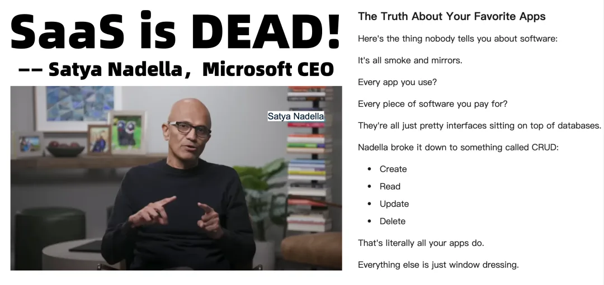
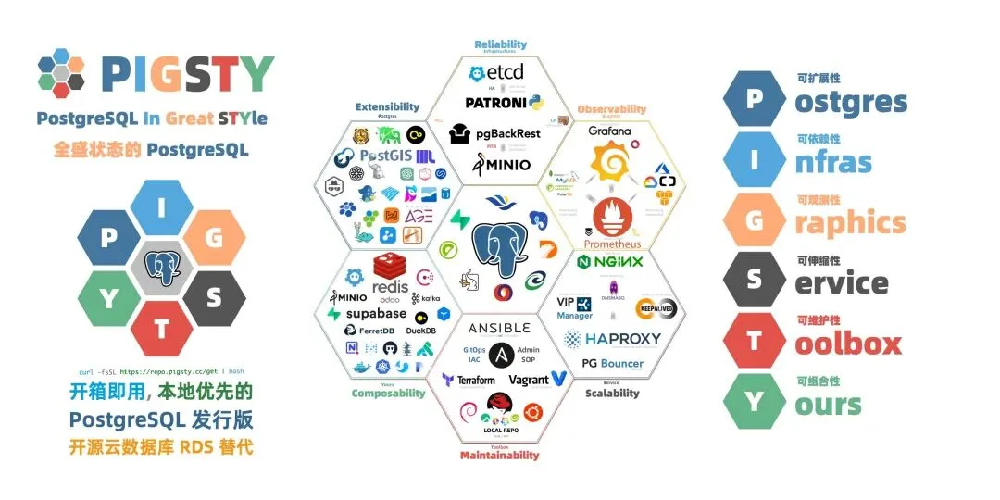

中文互联网还没看到有人说对 MCP 爆火背后的真正原因 —— Claude Code 的发布与代码泄密。SOTA 编码 Agent 给出了一个能实用能打的 Agent 案例，但更重要的是，其拼装思路被逆向并开源（anon-kode），Agent 成功的关键方法泄漏，让各种大模型都能用于智能体构建。者也导致 Google 翻盘后来居上 —— 而这些只不过是更加波澜壮阔的 Agent 时代的序幕而已。

## 引子：抛"砖"引玉

上周五，我主持了一场名为《[全网爆火的 MCP 到底是什么？](https://mp.weixin.qq.com/s?__biz=MzU5ODAyNTM5Ng==&mid=2247489458&idx=1&sn=e4454538d288aab9e92c989b05d50c60&scene=21#wechat_redirect)》的直播活动，我准备了很多问题，场面也热闹非凡。然而当摄像头关闭后，我却感到隐隐失落—— 真正让我困惑的几个核心问题，嘉宾们似乎都未能给出满意的答案。

意外的是，第二天，一位负责 B 站 MCP 与 Agent 项目的神秘专家（L 大师）主动找到我，向我娓娓道出了 MCP 爆火背后的真实故事。这番叙述刷新了我对 MCP 的全部认知—— 原来 Claude Code 才是这一切的引爆点。

为何去年底发布的 MCP 协议一直不温不火，直到今年 3 月突然炙手可热？为何各家 AI 巨头在短短数日内纷纷宣布拥抱 MCP，即使这意味着为竞争对手 Anthropic 做嫁衣？这场意外的“泄密事件”，揭开了 AI Agent 时代序幕的一角。

目前中文互联网里，我只看到与 Claude 有紧密联系的 AWS 在暗搓搓的私下分享 Claude Code 的秘密。其他地方几乎是一片静悄悄。要么是无知盲目跟风凑热闹，要么在闷声大发财。不过我是搞数据库，不是搞 AI 的，所以在此非常乐意与读者分享并探讨 MCP 爆火背后的真相。

## 默默无闻的 MCP

2024 年 11 月 25 日，Anthropic 团队悄然发布了名为 MCP（Model Context Protocol）的协议。它旨在让 AI 模型能够像插件一般调用外部工具和数据源。Anthropic 的目标很明确：赋予旗下 Claude Desktop 能够真正替人类完成任务的能力，比如读取文件、执行命令甚至与外部服务交互。

然而，这次发布却如石沉大海，鲜少引起波澜。彼时，Claude 名气远未达到 GPT 的流行程度。更重要的是，MCP 的文档稀疏简陋，没有典型的应用案例，社区几乎无人响应。据知情人士透露，这份协议竟只是两名新入职数月的工程师主导完成的实验性项目。

这沉寂持续了整整三个月——直到 2025 年 3 月。

> MCP 这个缩写在其他领域的自然搜索流量早在 2024-11-25 之前就已经存在了，所以可以认为，Model Context Protocl 从 11 月底发布到今年三月基本上没什么热度，而是在今年 3 月 1 号才突然爆火。

## Claude Code：开启潘多拉魔盒

2 月 23 日，Anthropic 高调发布 Claude 3.7，同时推出了名为 Claude Code 的 AI 编码助手。与传统的“代码补全”工具不同，Claude Code 展现出了前所未有的自主性——它能浏览本地代码仓库、执行命令、实时调试，甚至像真正的程序员一样独立完成编程任务。

开发者社区瞬间沸腾。Reddit 和 Hacker News 上涌现出大量亲身体验后的狂热评价：“这是第一个真正能用的 AI Agent！” 一位开发者兴奋地写道，“它甚至可以自己 debug！”

然而，很快就有人发现，Claude Code 在发布时竟然意外地包含了大量未被严格保护的源码，其中最关键的 Agent Prompt 逻辑与工具调用策略更是被一览无遗地暴露出来。原来，Claude 写代码这么牛逼的秘密关键不在模型（其实也有一部分），而在 Agent 设计与 Prompt 工程上！

Anthropic 想要撤回，但是已经来不及了。只能丧事喜办，”被开源“ 了。这场意外的“源码泄密”引发了社区内的集体狂欢：人们开始疯狂研究这些泄露的 Agent 设计与 Prompt，分析 Claude Code 如何精准地控制 AI 模型去执行实际任务。

> 大模型本身的发展已经出现了瓶颈，Scaling Law 开始失效，堆参数带来的能力高速增长已经基本结束。下一个能带来显著改进的地方在于 Agent —— Prompt Engineering。
>
> 以前大家觉得 LLM 不够聪明就力大砖飞用更多神经元就可以，那么现在真正前沿的发展将会发生在“细分结构”上 —— 大象的大脑的总神经元数量比人类多 4 倍（2500 亿 vs 860 亿），但是人类的大脑有着更精细的分工结构，比如各种各样的皮层区域，特别是人类大脑皮层的神经元数量是大象的三倍。这种精细结构才是人类智能的来源。而对于赛博电子大脑来说，精心组织的 Agent Prompt 就是一种精细结构。

## anon-kode 的诞生与 MCP 的爆发

趁着这场热潮，开发者 Daniel Nakov 发起了开源项目 anon-kode，将泄露的 Claude Code 核心逻辑抽象为通用 Agent 框架。不再局限于 Anthropic 的 Claude，anon-kode 允许任何兼容 OpenAI API 的模型都能实现类似的能力。一夜之间，GitHub 和开发社区被这个项目点燃了，开发者争相尝试移植到各种大模型上。

Claude Code 泄露的真正意义在此刻才显现出来：它提供了第一个真正“能打”的、可复制的 Agent 范本。还是用来 “辅助”（顶替）程序员本身！

此前 MCP 协议只是一个模糊的概念，如今它终于拥有了一个生动具体的示例，社区迅速意识到：“我们也能用 **自己的模型** 做到这一点（而非仅仅用 Claude Desktop 客户端来实现）！” MCP 的价值骤然提升，热度随之爆炸式增长。

所以，原来 MCP 是 Anthropic “嫖” 社区，大家没啥兴趣。现在用 MCP 的杀手应用 “被开源” 了，那么大家就非常有兴趣了。在 Claude Code 的示范下，Agent 领域一下子有了大家急切想要的“参照样板”。其他厂商也跟着往这条路上涌。

而 Claude Code 用来调用工具的 MCP 协议从一文不名，开始成为各家 Agent 框架争相兼容的 “新标准”。各家大厂，甚至包括 Anthropic 的核心竞争对手 OpenAI 都在 3 月份的时候官宣支持/拥抱 MCP 了。各种各样的 MCP Registry，Market，Server 实现也开始爆发涌现。

## Google 入场，Agent 战争全面打响

就在社区还在热烈讨论 anon-kode 和 MCP 的同时，Google 于 4 月初高调发布了 Agent Development Kit（ADK）和 Agent-to-Agent（A2A）协议，同时将旗下模型 Gemini 升级至 2.5，其编码能力据不少用户评测已达到 SOTA 领先水平。

社区议论纷纷，这种进步速度令人怀疑 Google 是否也吃透了 Claude Code 的核心逻辑。凭借其卓越的工程能力，Google 展现出了在新一代 AI 代理领域领跑的雄心——MCP 虽然火爆，但本质上只是 Agent 生态中的一小块拼图与功能子集而已。

可以想见，Google 很可能再次运用经典的 “Embrace，Extend，Extinguish” 三步走战略，像 Kubernetes 曾经取代 Docker 那样，重新定义 Agent 生态的规则，让 MCP 在未来的 Agent 生态中 变为无足轻重的边缘角色。

## 未来已来：Agent 时代的变革与冲击

未来三个月，我们或许将看到成熟的 Agent 框架与最佳实践出现，我猜测最大的赢家将是具有无双工程能力的谷歌 —— 推出的 ADK/A2A 体系。届时，大模型厂商们将逐步退化为 Token 的基础设施供应商，而利润丰厚的 SaaS 和 PaaS 生态则由百花齐放的各种行业 Agent 占据。

用云计算类比的话，大模型厂商变为一种新的 IaaS 资源供应商，以卖 Token 资源作为核心的商业模式，在互卷与价格战中打到 IaaS 的毛利水平。而 Agent 行当（AI 程序员，AI 设计师，AI DBA……）则相当于毛利 70%+ 的 SaaS，而通用的 MCP 工具大概会占据 RDS 这样毛利 50%+ 的 PaaS 生态位。

AI Agent 将不再局限于绘图、翻译或简单问答，而是大规模地取代现有绝大多数白领工作岗位。Agent 在编程领域/插画设计领域已经展示出其惊人的潜力，而这种冲击力将迅速在 Agent 时代蔓延至其他所有行业。

## Agent 时代数据库的命运

微软 CEO 纳德拉最近公开表示：“未来的应用，将是 AI Agent 直接连接数据库进行 CRUD 操作。” 我非常赞同这一观点——AI 时代的应用离不开数据库，“后端开发”或许会逐渐消失，但数据库将依然重要。

作为数据库从业者，我不会去跟风追逐 Agent 热潮，但我在思考新一代 Agent Web 将需要怎样的数据库。在我看来，具备部署简单、开箱即用、功能丰富特性的数据库将成为主流。目前具备这样能力的主要就是 SQLite（用于嵌入式和移动端）和 PostgreSQL（更复杂场景）。

我的开源项目 Pigsty 提供了一个开源免费 PostgreSQL 发行版，囊括了 400+扩展插件的全功能 PostgreSQL，RDS 开箱即用。希望能为即将到来的 Agent 时代提供强有力的数据存储支撑，帮助开发者抓住新的机遇，抢占先机。

## 后记：我们站在时代的门槛

朋友们，一场千年未有的大变革真的来了，我们处在 Agent 爆发的前夜，即将目睹机器替代 “人” 本身这一波澜壮阔的宏伟进程，这究竟会将我们带入生产力极大发展的地上天国，还是赛博朋克的反乌托邦？我们应该在有生之年就能知道，愿我们扶稳方向盘，系紧安全带，共同见证这场壮阔而激烈的时代巨变。

PS：欢迎关注老冯云数（非法加冯），我将在后续进一步跟进并解读 Agent / MCP 领域的最新进展。

 参考阅读：[AI 神教狂想曲](/ai/ai-cult/)

---

发布版本：[微信公众号](https://mp.weixin.qq.com/s/xaeVafPxUfAgQSzl-n3w2w)
