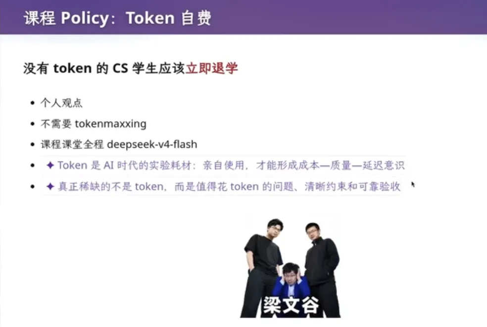

开学第一天，看到一条新闻。南京大学一门新课的课件截图，一行字标红：**没有 Token 的 CS 学生应该立即退学**。截图从 B 站流到微博、知乎、贴吧，上了热搜，知乎问题底下攒了四百多个回答。技术圈的人多半说讲得好，圈外的人多半说这是何不食肉糜。毁誉参半。

老冯这周把手里十个订阅全蹬完烧干了，才腾出手来写这篇。我想说的很简单：这位老师一看就是有真东西、真懂行的。而且这位老师说得对。不光对，我觉得他还说得太客气了。

---

## 截图外面的东西

这张截图来自南京大学一门新课的课件，红字写着：“**没有 Token 的 CS 学生应该立即退学**。”截图随后出现在 B 站、微博、知乎和贴吧等平台，[知乎上的相关问题](https://www.zhihu.com/question/2075868388124004913)很快有了数百个回答并登上热榜。赞同和质疑都有，其中一个绕不开的问题是：让学生自费买 Token，算不算“何不食肉糜”？

出事的这门课叫《生成式软件工程》，2026 年秋季第一次开，不计分，只有通过和不通过。我把这位老师公开的两讲、三个多小时的录像快进看了一遍。课堂准则一共三条：

1. 禁止古法编程；
2. Token 自费；
3. 但不需要 Tokenmaxxing。

他原本打算找厂商拉一笔赞助，觉得让学生自掏腰包说不过去；后来看了选课人数，觉得没必要为这点钱去开口，索性写成自费。全课用的是 `deepseek-v4-flash`，他建议学生去充一百块，还调侃大家挑“梁文谷”做作业。然后加了一句：**实在有困难的同学，来找我。**

这句话，在传播里被砍得干干净净。“退学”那句也不是开场白，是接在一大段铺垫后面说的。他先讲了 CS 学生的三种集体焦虑：老师用豆包出题、学生用豆包做作业，全程只有学生没受到训练；认真学四年，发现学会的东西 AI 全会；秋招简历千篇一律。

他收到过一份“完美简历”——CCF 期刊论文、Accept、在投，样样齐全——他给的是零分：没有 GitHub，没有个人主页，连一篇 Preprint 都没有。

然后才是那句：

> 我有个个人观点，手上没有付费 Token 的同学，就应该立即退学。

他真正的意思是：**Token 是 AI 时代的实验耗材**。你要吃计算机这碗饭，就得像化学系买试剂一样，把它当成理所当然的投入，而不是等着谁发给你。

---

## 凭什么让学生掏钱？

有人说：化学系的试剂是实验室出的，物理系的器材是学校买的，凭什么到了计算机系，Token 就得学生自己掏？南大经费那么多，连几十块钱的 Token 都发不起？

这拳打得不歪。但我的回答是：**因为学校根本不知道该发多少、发给谁、怎么教**。高校的算力长期攥在头部课题组手里，本科生想碰大规模训练环境基本没门，“本科生耗材”这个科目在预算表里压根不存在。这不是南大抠，是整个高等教育体系还没来得及给这件事立项。

如果一门课把某种付费工具列为必要条件，学校就有责任保证基本可及性，不能把教育机会简单交给个人支付能力。老师个人兜底值得肯定，却不能替代稳定的课程预算。

已经有一些地方看到了为年轻一代提供 AI 能力的重要性。台北市青年局在 7 月 29 日公布了[青年 AI 工具补助计划](https://youth.gov.taipei/announcement/news/53606034-2305-44ea-bb00-82a40719c1d1)：符合设籍、学籍和课程条件的 18 至 35 岁青年，每年最高可核销 4,000 新台币的个人版 AI 工具订阅费，低收入户及中低收入户最高 8,000 新台币。新竹市则更早在 4 月开办[同类计划](https://dgservice.hccg.gov.tw/serviceNotice.do?id=1323&rule=guest)。

厂商也在做教育优惠。Google 8 月 19 日宣布，符合条件的美国高校学生可以[免费使用一年 Google AI Pro](https://blog.google/innovation-and-ai/products/gemini-app/student-offer-google-ai/)，其他 140 多个受支持市场的学生可免费使用一年 AI Plus；OpenAI 的 [2026 返校季优惠](https://help.openai.com/en/articles/20001493-chatgpt-back-to-school-offer-for-students)则向符合条件的美国高校学生提供四个免费的 ChatGPT Plus 计费月。

国内高校的话，阿里云有个“云工开物”，完成学生认证后可领取 300——聊胜于无，但苍蝇腿也是肉嘛。Token 下乡进校园，任重而道远。

说实话，他也没让学生掏多少。一百块，一个学期。但这些都不是学生该操心的事。**没人给你发的东西，你就得自己带**。毕竟也没有谁欠谁什么东西。

---

## 上屋抽梯

二月份我写过一篇《[AI 时代，新程序员将何去何从？](/ai/ai-survival/)》，说程序员成长阶梯的第一级被 AI 抽掉了。半年过去，我得修正一下：不是第一级，是整把梯子。

以前 CS 学生爬楼靠的梯子叫**初级岗位**。实习、校招、干三年成中级、五年成 Senior。你在这把梯子上写烂代码、踩坑、挨骂，判断力就是这么一格一格长出来的。这条路走了几十年，我们这代人都是这么爬上来的。

现在这把梯子没了。

一两年前，你要开个小公司，版本最优解是什么？招十个实习生，每人配一个 AI 订阅去干活，对不对？到了 2026 年 7 月这个版本，最优解变了：**不需要实习生，你一个人指挥十个订阅。**

这不是趋势预测，是已经发生的事。斯坦福数字经济实验室在 2026 年更新的一项研究，分析了美国 ADP 的企业薪资数据，发现 22 至 25 岁劳动者在高 AI 暴露职业中的就业水平，比“如果它与低暴露职业同龄人保持同步”时低约 19％，**差距主要来自招聘减少，而不是集中裁员**。年轻人的入口正在承受比资深从业者更大的压力。

老冯自己就开着十个订阅哐哐蹬；Pigsty 和 [Silo](/db/long-live-silo/) 这种放在几年前要百人级团队干的活，现在[一个人干得轻松写意](/ai/yield-with-agents/)；DHH 一边经营公司，一边一己之力搓出 Omarchy。这些在《[AGI 机关枪发下来了](/ai/ai-machinegun-for-everyone/)》里都写过，不展开。

而且这个版本可能几天后又要变。后天 OpenAI 据说要发的 Astra，号称能自主调度一堆小智能体干活。真要是这样，超级个体的杠杆又得往上翻一个数量级。

上屋抽梯的原意是骗人上楼再把梯子撤掉。放到今天没人骗谁，只是先上楼的人回头一看，梯子已经不在了。楼下的人想上来，只剩一个办法：**自己造一把。**

---

## 5％

说个我亲眼看见的统计。六月份我去西安电子科技大学做了一场 PostgreSQL 的讲座。西电，正牌的计算机强校。我在现场问了两个问题。

第一个：会跟 AI 聊天的举手。一屋子过半举了。

第二个：用过 Codex 或者 Claude Code 干活的举手。零零星星几只手，目测不到 5％。

这就是漏斗。会跟 AI 聊天的人，按 OpenAI 自己的口径，ChatGPT 周活已经过了十亿，全人类八分之一。会指挥 AI 干活的呢？Codex 刚庆祝了日活破 2,500 万，但那是并入 ChatGPT 桌面版之后的统计口径，几个月前它自己才两百万上下——真正具备指挥 AI 干活能力的，我估计是几百万这个量级。

再往下，能把一个订阅的额度真正蹬满的，看看 Tibo（Codex 重置圣徒）的粉丝数，不到五十万，里面还有一堆只开 Plus 的，能蹬满一个 20× Pro 的我估不超过二十万。像老冯这样开十个蹬爆十个、每天几十亿 Token 的禽兽，满打满算最多也就几万人。

**西电这种计算机专门校，一屋子人里只有 5％摸过梯子**。**剩下 95％还在楼下等着学校发**。学校发不出来。这就是蒋炎岩那句话的全部背景。

---

## 没人给你发梯子

不光学校发不出来。老板也不一定会。现在企业推 AI 推不动的，原因往往简单到可笑：老板没给报销 API，让员工自费买订阅。好一点的公司给报销，差一点的就自费。我的看法是，**就算老板不报销，你也应该自备 Token**。这是拉开差距的变量。你不会被 AI 干掉，你会被别的拿着 AI 的人竞争掉。

员工也不会主动。假如你用 AI 提效十倍，等着你的不是十倍的收益，大概率是十倍的活。那还不如大家一起不动，这是纳什均衡。当然，均衡的代价是整个公司被外面拥抱 AI 的公司顶掉，来一次公司层面的新陈代谢。大厂死得慢，能多混一阵子，但也不长久。

学校不发，老板不报，同事不动。三层组织全在原地站着。所以别等了。**这个时代没有人会给你发梯子，梯子是自备的。**

---

## 大学四年该干什么

那大学四年到底该学什么？我想了很久，答案还是老几样：**数学、英语、计算机基础，加上第一手的 AI 项目经验**。别的课，我很难说出它们的必要性。

基础甚至比以前更重要。操作系统、体系结构、网络、数据库，不只是为了让你亲手重复实现一遍，更是为了让你知道什么结果是对的，什么设计会慢，什么地方迟早会出故障。没有这些概念，你很难判断 AI 是在替你省时间，还是在把错误包装得更像答案。

手写红黑树、动态规划这类代码能力，价值会不断趋近于零；理解它的不变量、复杂度和适用边界，却仍然是判断一段实现是否靠谱的基础。学 C 也不只是为了面试，而是为了看见内存、并发和系统调用这些平时被高级抽象遮住的东西。

蒋炎岩在课上提到那份“零分简历”时，我理解他不是在否定论文。论文、竞赛、开源项目各自证明不同的能力。他真正不满意的，是一份简历里全是漂亮名词，却没有多少材料能让别人点进去看、跑起来验。GitHub、个人主页、技术文章和可复现项目，正在成为成绩单之外的第二份能力证明。公开可验证的作品与履历，变得越来越重要。

今年夏天，我帮一个亲戚家的孩子看志愿，最后他去了北邮读计算机。我当时跟他说的话，和现在写的差不多：初级程序员已经严重供大于求；进了学校，要紧的是找到师傅、找到机会、学会自学；专业课本身没什么价值。买 MacBook，订阅 ChatGPT 和 Claude；多问，多和牛逼的老师与学长交流，能翘的水课千万不要犹豫。

---

## 老乡鸡

对会用 AI 的人来说，现在是遍地黄金的窗口期。这是一个极其难能可贵的历史机遇窗口：能与一门改变世界的革命性技术共同成长。对用不好、排斥 AI 的人，这是一把悬在头顶的达摩克利斯之剑。

这几届毕业生的两极分化会非常吓人：最聪明的那批，毕业时已经能指挥一支 AI 军团做出让人大吃一惊的东西；而只是照本宣科读完一个本科、四年什么都没干的那批——现在还有老乡鸡可以端盘子。再过四年，说不定连盘子都没得端。

业界确实不需要这么多 beginner 了。残酷归残酷，计算机相比别的行业还留着一条路：本行业卷不动，就把 AI 这套工具带到别的领域去做交叉，降维打击。但也别指望这条路多顺，别的领域也有人在学 AI。

所以对刚入行的年轻人，我的判断就是狄更斯那句老话：这是最好的时代，也是最坏的时代。对顶尖的人是黄金时代，对 average 和 below average 的人，则是一个很痛苦的时代。蒋炎岩说没 Token 就退学。我觉得他客气了。**没 Token，不主动，现在不退学，四年后进入市场也是一样甚至更惨的结果。**
