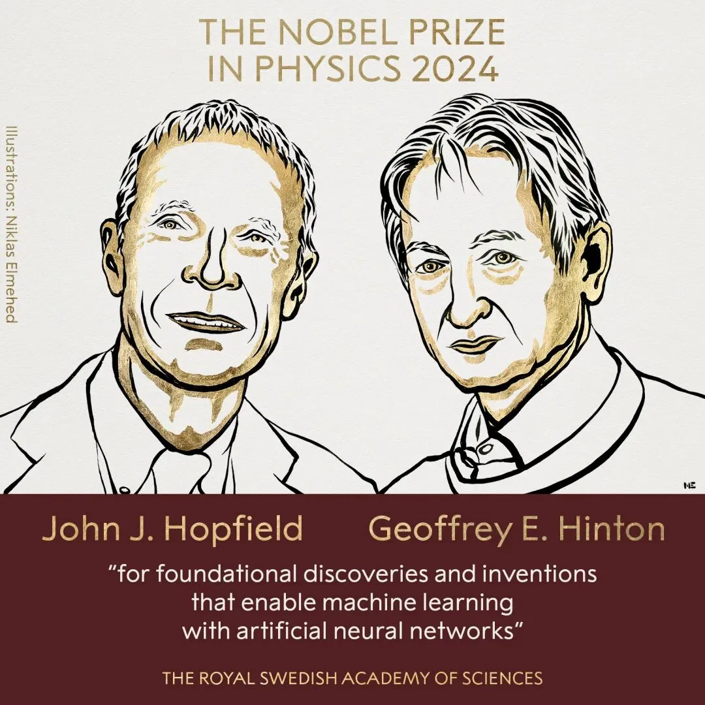
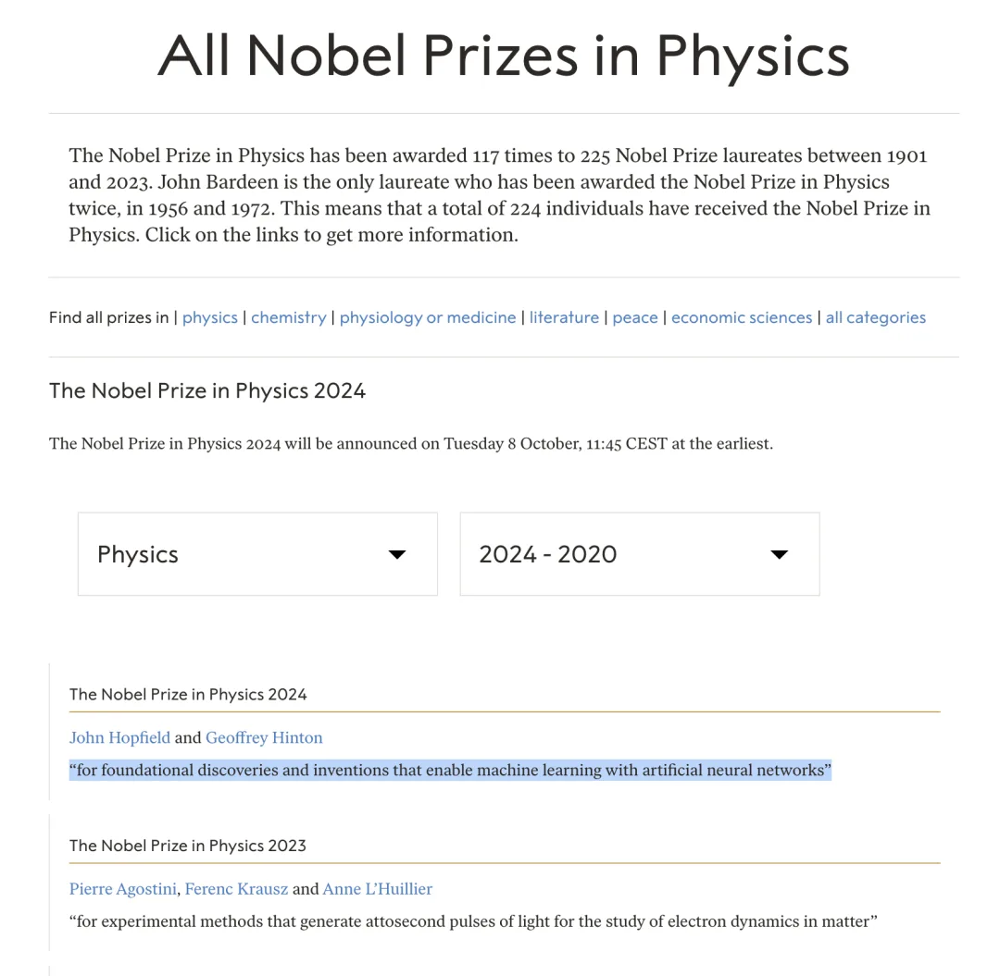

引用央视报道：瑞典皇家科学院当地时间 10 月 8 日宣布，将 2024 年诺贝尔物理学奖授予约翰·J·霍普菲尔德（John J. Hopfield）和杰弗里·E·辛顿（Geoffrey E. Hinton），表彰他们在使用人工神经网络进行机器学习的基础性发现和发明。

值得一提的是，辛顿教授已经在 2018 年获得了计算机领域的最高奖项图灵奖。2018 年的图灵奖得主为 Yoshua Bengio（约书亚·本吉奥），Geoffrey Hinton（杰弗里·辛顿）和 Yann LeCun（杨立昆），也是因为他们在神经网络上的研究与贡献。

---

发布版本：[微信公众号](https://mp.weixin.qq.com/s/yxa9GnS0xTMGBVnzcM1_Fg)
