十几天前，我只是想给几个新项目找一套顺眼的文档主题。

十几天后，我把自己的 **18 个网站全部迁了过去**。

从 Pigsty 的中英文文档、Silo、PIG、SOW、PG Exporter，到公司首页、个人博客，再到《设计数据密集型应用》这样的多语言书籍，现在全部运行在同一套框架上。

这可不是什么换个颜色、改个字体的小装修。十八个网站的内容结构、语言、规模和用途各不相同：有上千个页面的大型技术文档，有只有几页的小工具，有博客，有书籍，有下载站，还有纯粹用来做产品介绍的 Landing Page。

把它们全部迁过去，是一个相当折腾的工程。

但一个作者对工具最高级别的评价，不是 README 里写了多少卖点，也不是给自己点了多少个 Star，而是：**敢不敢把自己的生产环境全部押上去。**

现在我押了。所以，我觉得 Oink 终于可以正式发布了。

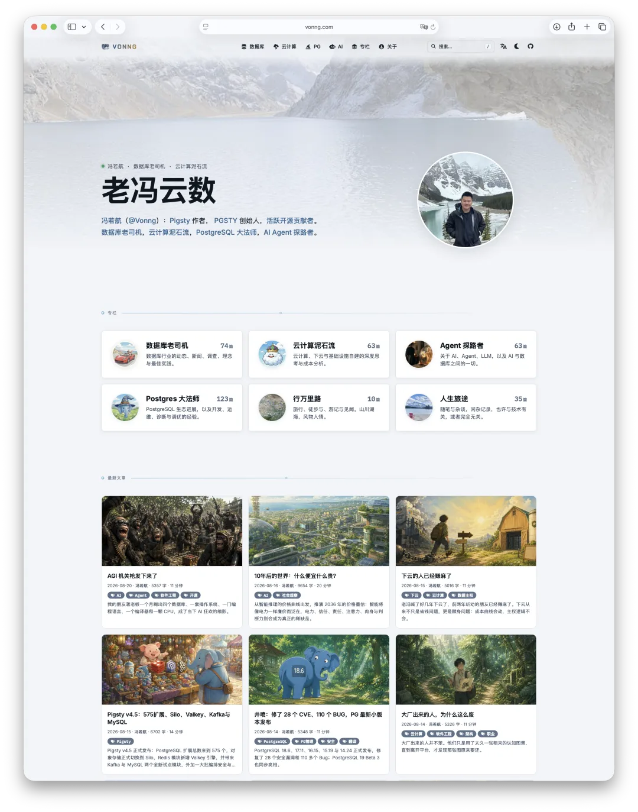

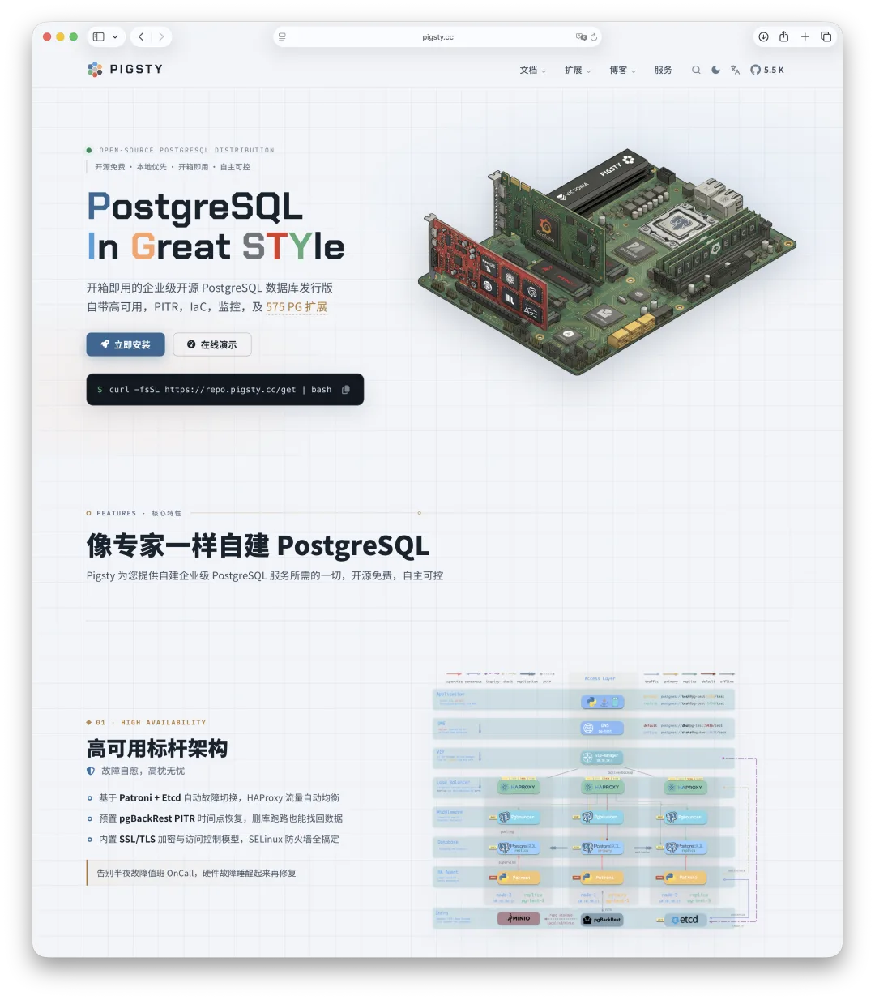

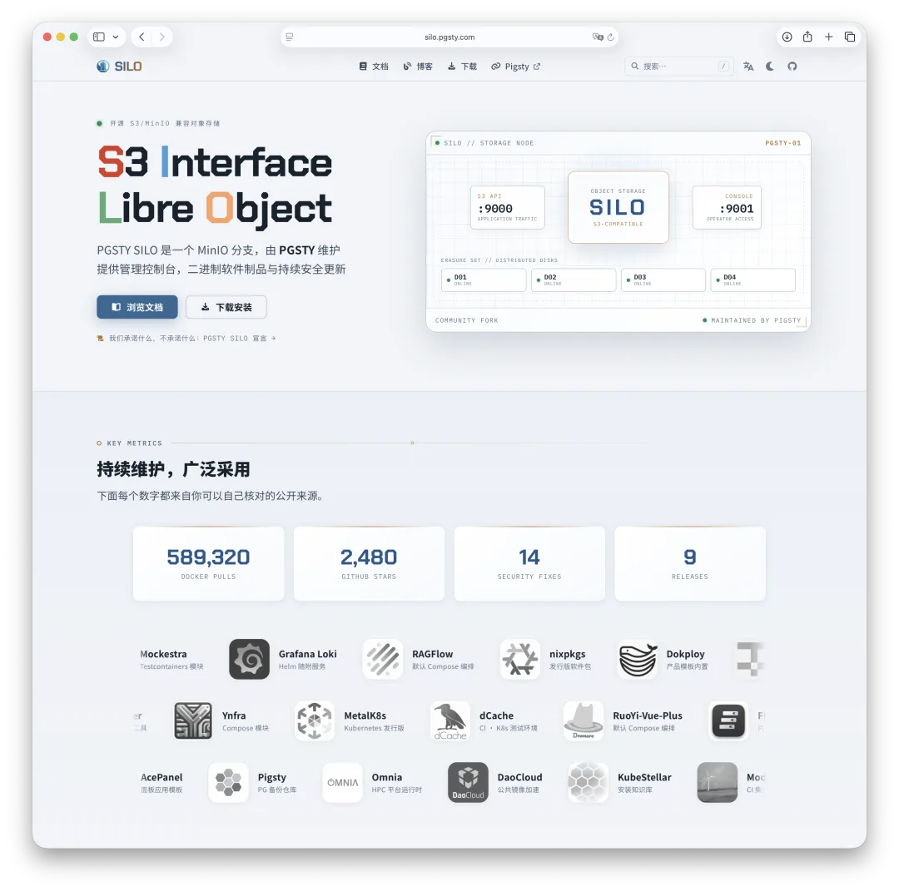

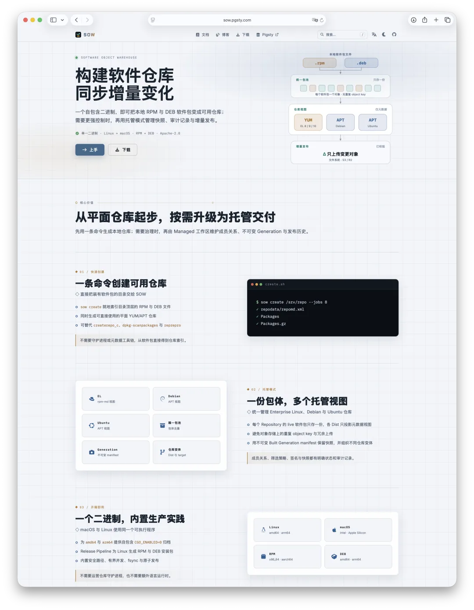

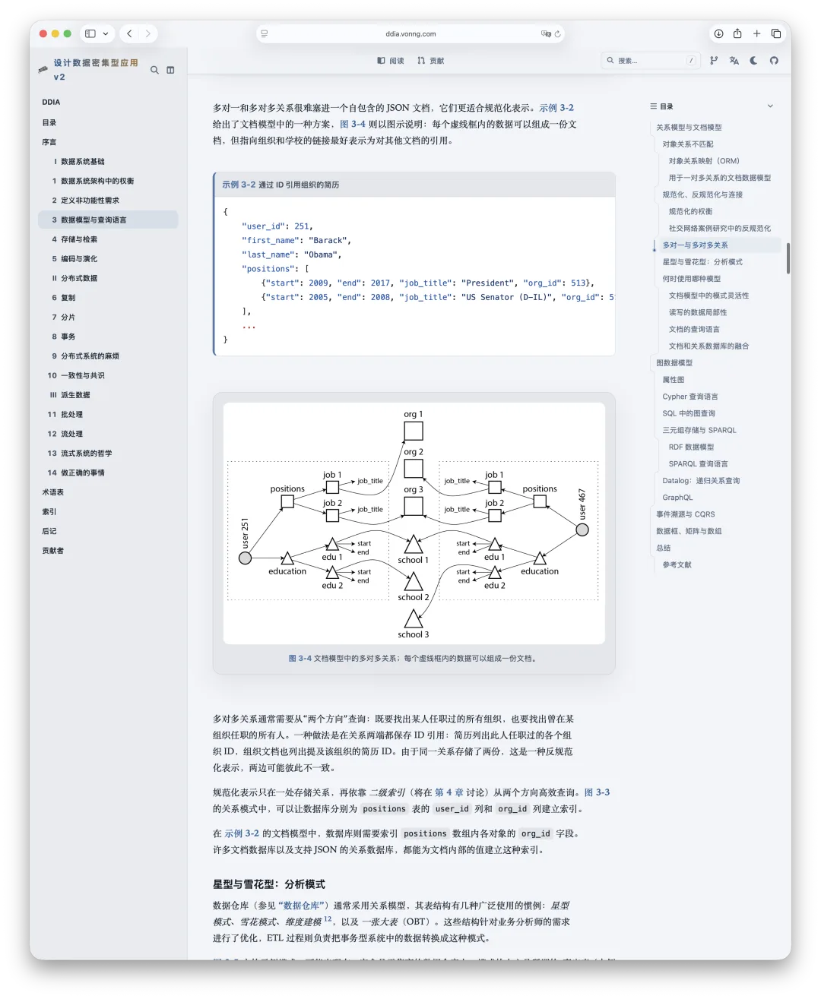

---

## Oink 到底是什么？

Oink 是一个开箱即用、本地优先的 Markdown 文档框架。

你只需要三样东西：

Markdown

Hugo Extended 二进制

一个 Git 仓库。

然后就可以得到一套现代、完整、可搜索、可打印、支持深浅色、多语言、多版本，并且可以直接部署到 GitHub Pages、Cloudflare Pages、Nginx 或任何静态服务器上的网站，通过 Git 推送直接发布更新。

整个构建过程不需要 Node.js，不需要 `npm install`，不需要 PostCSS，不需要外部 CDN，也没有必须常驻的后端服务。主题所需的字体、样式、图标与交互运行时全部随项目本地交付，一条 `hugo` 命令就能生成完整的静态目录。断网也能构建与服务。

当然，你也可以完全让 Claude 与 Codex 来操心这些事。

它当然可以被称为一个 Hugo Theme，但我觉得这个说法有点低估它。我更愿意把 Oink 称为一套 **文档发行版**。普通主题解决的是“页面长什么样”，Oink 想解决的则是整套问题：

- 内容应该怎么组织；
- 文档、博客和书籍如何共存；
- 搜索、导航、多语言和版本管理怎么做；
- 技术组件应该怎样书写；
- 同一份内容如何输出给浏览器、打印机和 AI Agent；
- 网站如何构建、检查、部署、升级和长期维护。

换句话说，它不是只给 Docsy 换了一张脸，而是把我这些年维护工程文档时踩过的坑、形成的判断和积累的组件，封装成了一条完整的交付路径。

**Markdown in, Modern Docs out。**

这就是 Oink 最核心的产品定义。

至于名字，也很简单：一边是文档与墨水的 **Ink**，另一边是 Pigsty 宇宙里小猪的叫声**Oink**。README 里那句**Open，Indexed，Navigable，Knowledge**，就当作附赠的彩蛋好了。

---

## 为什么偏偏是现在？

因为现在写代码实在是太快了。

以前做一个新开源项目，最费时间的通常是把功能做出来。现在有了 Codex、Claude Code 和各种 Agent，项目原型可能一个下午就冒出来了，仓库、工具、组件和小产品的数量正在迅速膨胀。

但项目做完之后，问题才刚刚开始：

README 要写，安装指南要写，配置参数要写，发布注记要写，API 文档要写，博客和产品首页最好也得有。否则代码虽然存在，别人却不知道它是什么、能解决什么问题、该怎么用，更不知道出了问题该去哪里找答案。

**AI 大幅降低了生产代码的成本，却没有自动消灭文档。恰恰相反，它制造了更多需要被解释、被组织、被交付的东西。**

文档正在从过去的附属品，变成项目交付链条里越来越明显的瓶颈。

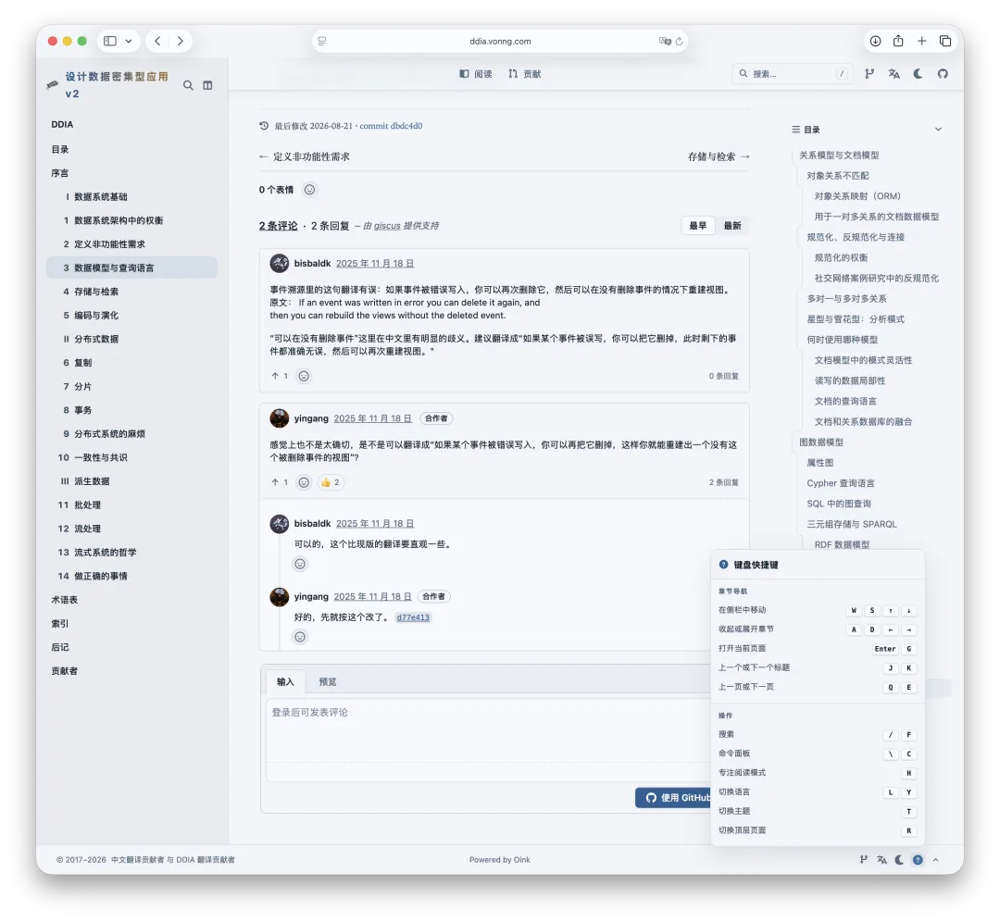

另一方面，Markdown 也正在获得一种新的地位。

过去我们说 Markdown 是程序员写文档的通用格式；现在，它实际上已经成了人类与 AI Agent 之间的公共协议。README、AGENTS.md、Skills、任务说明、项目记忆、设计文档、知识库，越来越多的信息最终都落在 Markdown 里。

这是一个很重要的变化。

以前的文档框架，主要考虑的是怎样把内容渲染给浏览器里的人看。现在，一个真正现代的文档系统，还应该考虑：

- AI 能不能直接读；
- 内容能不能无损复制；
- 页面有没有干净的 Markdown 版本；
- 整个站点有没有机器可发现的索引；
- 源文件里是不是混进了大量只对某个前端框架有意义的噪音。

Oink 会为每个页面生成对应的 `.md` 版本，在站点根目录生成 `llms.txt`，并提供“复制为 Markdown”“查看 Markdown 源码”以及可选的“在 ChatGPT / Claude 中打开”入口。这些都是构建时生成的静态产物，不需要额外服务，也不会把正文偷偷上传到什么地方。

所以 Oink 并不是简单地“支持 AI”。

它的内容模型从一开始就在假设：**这份文档既要给人看，也要给机器读。**

---

## 我受够了现代文档框架

做 Oink 还有一个非常朴素的原因：我确实受够了现有的文档框架。

这些框架并不是不能用，其中不少甚至相当优秀。问题在于，它们往往要求你在一些我不愿意接受的东西之间做选择。

### MDX：为了表现力，把内容变成私有方言

第一类是大量使用 MDX 的框架。

我理解 MDX 的吸引力。你可以在 Markdown 里直接插入 React 组件，想画什么就画什么，表现力几乎没有上限。

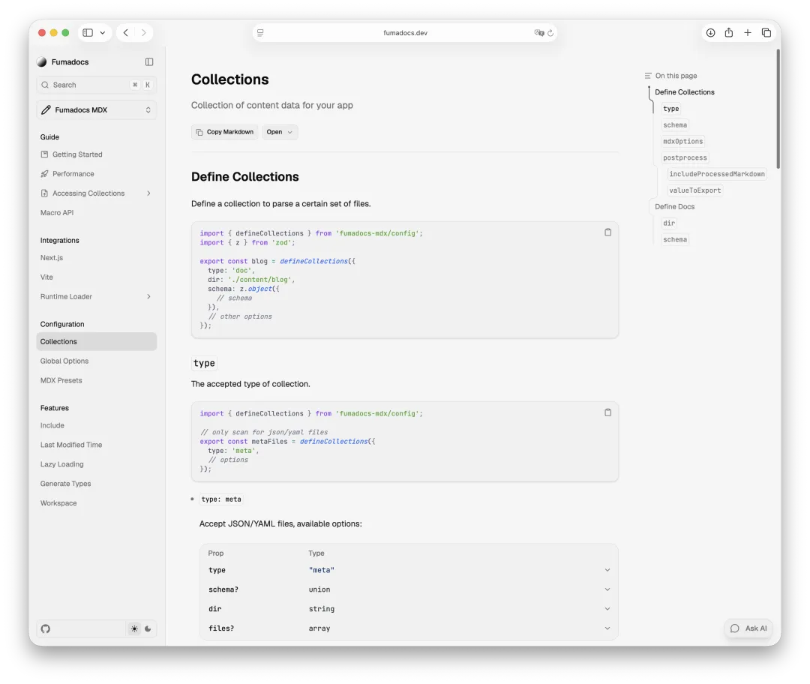

但它的代价也非常明确：内容和表现逻辑开始纠缠在一起。

文档里逐渐出现组件标签、属性、嵌套容器、导入语句和各种只有特定框架才能理解的东西。写到最后，它看上去不再像 Markdown，而像一份披着 Markdown 外衣的 JSX。

这会带来三个问题。

第一，人直接阅读源文件时，噪音太多。

第二，AI Agent 读取时，要浪费上下文理解大量与内容无关的表现细节。

第三，一旦你想换框架，真正被锁住的不是页面样式，而是内容本身。

我始终认为：**样式控制不应该大面积侵入内容。**

内容是长期资产，主题只是它某一阶段的衣服。为了今天一个漂亮的选项卡，把十年后仍然有价值的文字写成某个前端框架的私有 DSL，这笔账不划算。

### Node.js：为了写文档，先养一套前端工程

第二类问题是现代前端工具链。

你只是想写几篇文档，结果先得到一个 `package.json`、两个锁文件、几百兆 `node_modules`，再配上 bundler、插件、主题包和一串版本约束。

哪怕网站最终只是一些静态页面，构建它的过程也越来越像在维护一个前端应用。

这当然不是 Node.js 的原罪。对于真正复杂的 Web 应用，这些工具有充分价值。但对文档来说，我认为它们经常是明显的过度设计。

文档本来应该是一个项目里：

- 最容易构建的东西；
- 最容易搬走的东西；
- 最容易离线保存的东西；
- 最不应该因为依赖升级突然坏掉的东西。

结果现在恰好反了。

代码还能编译，文档站先因为某个插件、锁文件或者构建环境开始闹脾气。你只是想改个错别字，却先要研究为什么今天的构建和半年前不一样。

我不喜欢这种感觉。

### 轻量框架不够用，完整框架又不好看

还有一类像 Docsify 这样的轻量工具，确实简单，但当你需要大型导航、多语言、多版本、打印、SEO、复杂组件、书籍交叉引用和完整发布体系时，很快就会感觉表现力不足。

Docsy 则正好相反。它的内容模型和工程能力很成熟，毕竟是 Google 发起、CNCF 项目大量采用的一套方案，但它的默认界面确实已经很有年代感，而且很多实现仍然带着旧时代前端工程的包袱。

Hextra 和 Blowfish 我也都用过，而且挺喜欢。前者适合文档和书籍，后者适合博客，但当我同时维护十几个网站时，我不想再维护三套内容方言、三套配置方式和三套定制逻辑。

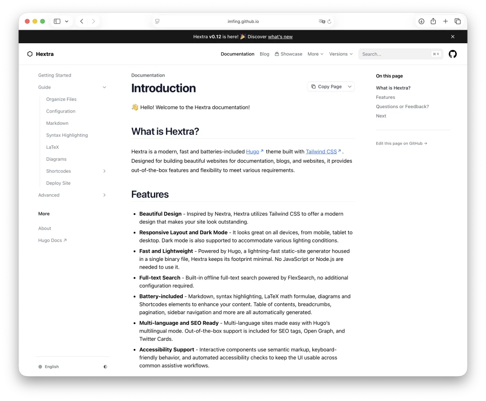

所以我的需求逐渐变得非常明确：

> 有没有一套统一框架，能够同时处理文档、博客、书籍、产品首页、发布下载和 API Reference，同时仍然坚持纯 Markdown、静态构建、本地优先和长期可维护？

没有完全符合我要求的。

那就自己做一个。

---

## Oink 的答案：让内容保持干净，让框架承担复杂性

Oink 的设计并不是从一张设计稿开始的，而是从十几个真实网站里倒推出来的。

我先把这些网站实际需要的能力汇总起来，再尝试寻找一组尽可能简单、稳定和统一的抽象。

最终形成了几个非常明确的原则。

## 第一，原生 Markdown 优先

Oink 的第一原则不是“禁止组件”，而是：

> **能用原生 Markdown 表达的东西，就不要发明新的语法。**

比如步骤列表，本质上还是一个普通的有序列表，只需要在后面加上一行属性：

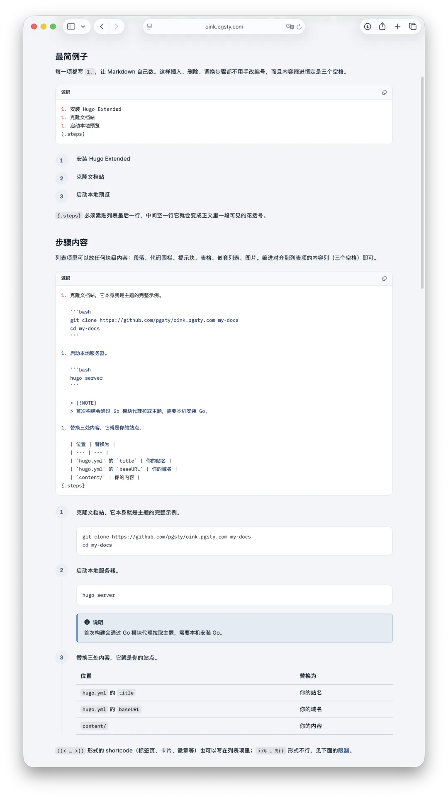

即使离开 Oink，这仍然是一份人类和其他 Markdown 工具都能读懂的有序列表。

文件树也是一样。很多框架会要求你写一大堆嵌套组件，而 Oink 使用一个接近纯文本的围栏块：

在 Oink 里，它会变成带文件图标、对齐注释、折叠目录和可拖动分隔线的文件树；离开 Oink，它仍然是一段一眼就能看懂的文本。

Callout 使用普通引用块，步骤使用普通列表，字段说明使用普通表格，图片、代码块和数据围栏也尽量沿用 Markdown 已有的语义。只有当原生 Markdown 确实无法表达某种能力时，才退回到 shortcode。

这不是洁癖，而是一条非常现实的工程原则：

**框架总会过时，内容应该活得比框架更久。**

---

## 第二，只用 Hugo，别的都不要

Oink 使用 Hugo Extended 编译模板与样式。

正常构建不会从网络拉取字体、JavaScript 或第三方资源；浏览器侧需要的运行时也全部随主题一起交付。最终产物就是一个普通的 `public/` 静态目录。

<!-- -->

    hugo --gc --minify

构建完了，事情也就结束了。

你可以把它扔给：

- GitHub Pages；
- Cloudflare Pages；
- Netlify；
- Nginx；
- Caddy；
- 对象存储；
- 内网服务器；
- 离线安装包；
- 任何能托管静态文件的地方。

没有数据库，没有应用服务器，没有必须在线的 SaaS，没有某家搜索服务的账号，也没有部署后还得继续养着的 Node Runtime。

这就是 Oink 所说的 **Local-First**。

这里的“本地优先”并不只是“可以在 localhost 打开”，而是指整个系统的关键能力都掌握在你自己手里：

- 内容在你的 Git 仓库里；
- 资源在你的构建产物里；
- 搜索索引在你的站点里；
- 构建过程可以复现；
- 网站可以离线运行；
- 托管平台随时可以更换。

文档尤其应该这样。

它不应该因为某个 CDN、外部字体服务、托管搜索或者前端依赖停止工作，就突然变成一堆打不开的壳。

---

## 第三，一套框架，六种内容

真实项目很少只有“文档”。

一个成熟项目通常还会慢慢长出：

- 产品首页；
- 博客与技术文章；
- 发布注记；
- 安装包与下载页；
- API Reference；
- 有章节、图表和交叉引用的长篇书籍。

传统做法是为这些东西分别选择工具，然后努力让它们看起来像一家人。

Oink 反过来：先提供一套统一的页面外壳、导航、搜索、主题和输出体系，再在上面承载六类内容。

### 文档

左侧目录树、右侧页内纲要、面包屑、上一篇/下一篇、编辑链接、历史链接、全文搜索和键盘导航都已经准备好。

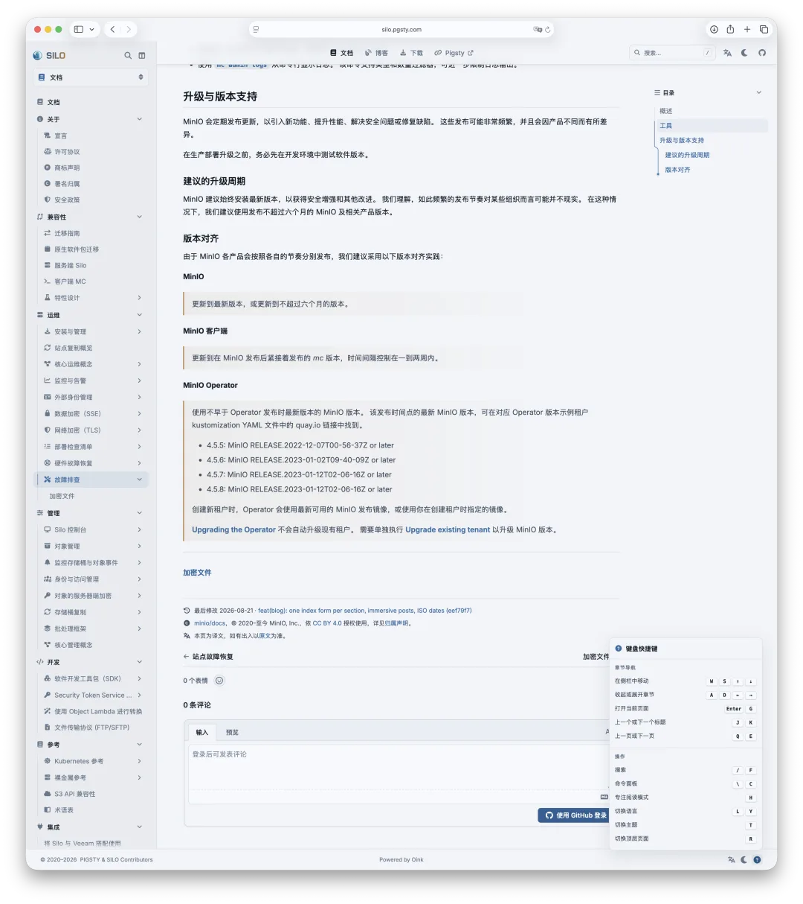

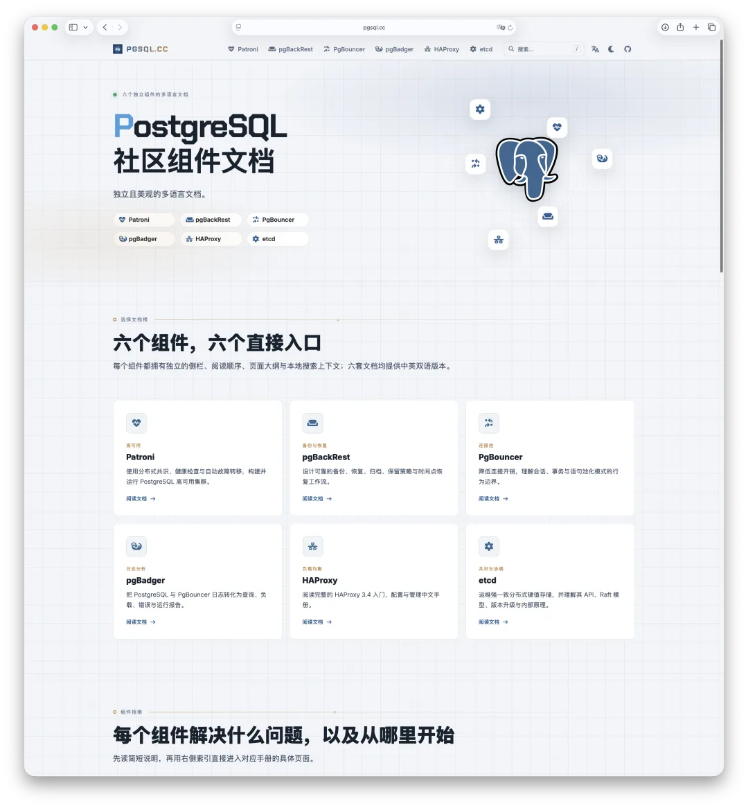

### 博客

支持作者档案、多作者署名、系列文章、标签分类、RSS、分享栏、列表/卡片/表格索引，以及适合长文阅读的沉浸式 Hero 页面。

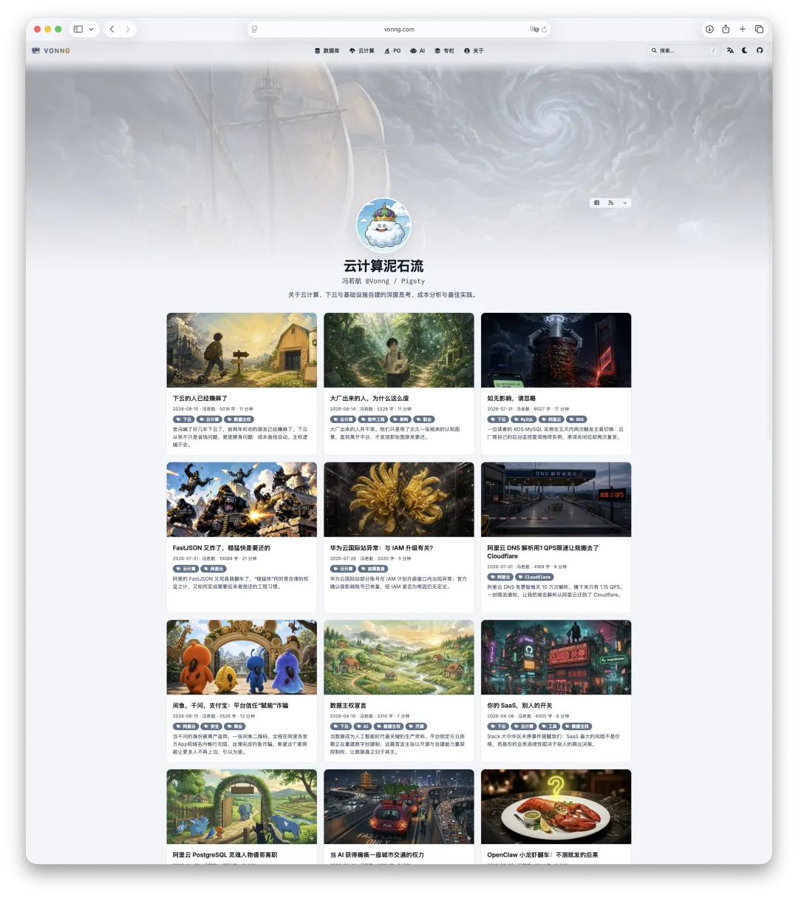

### 书籍

支持章节编号、图片与表格编号、公式、交叉引用、目录索引以及整本书连续打印。DDIA 这样的多语言复杂书籍，就是这套模型的主要试验场。

### 发布与下载

一份结构化的 YAML 数据，可以生成发布卡片、下载资产列表、校验和与历史归档。发布状态不再散落在手写 HTML 里，而是成为可以检查和复用的数据。

### Landing Page

Oink 内置了一组服务端渲染的首页区块，可以用数据和 Markdown 组合产品介绍、功能板块、指标、价格、FAQ、团队与行动入口。

你现在看到的 Oink 首页，以及 PGSTY 公司首页，本身就是用这套 Landing 系统搭出来的。

### API Reference

Swagger UI 和 Redoc 以本地运行时的方式交付。OpenAPI 文件放在仓库里，即使在断网和内网环境中也能照常查看。

这六类内容并不是六套互不相干的主题。它们共享同一套设计语言、搜索、语言切换、版本选择、输出格式和组件体系。Oink 当前同时提供 21 类技术内容组件，并且只在页面实际使用某项能力时加载对应运行时。

这件事看似只是“少配几套主题”，真正带来的价值却很大：

**你终于可以用一套知识，维护整个项目的对外信息系统。**

---

## 第四，功能可以很强，页面不能越来越重

Oink 里有不少高级组件：

但我的原则不是把所有 JavaScript 一股脑塞进每个页面里。

一个页面没有图表，就不应该加载 ECharts；没有 Mermaid，就不应该加载 Mermaid；没有终端录像，就不应该加载播放器。组件脚本根据当前页面实际使用的能力进行拼装，打印、Markdown 和 RSS 输出则完全不加载这些浏览器运行时。

这就是 Oink 所说的：

> **Content. On Demand.**
>
> 能力按需出现，负担不要到处乱跑。

更重要的是，每个组件都应该知道自己离开浏览器之后是什么。

在 HTML 里，它可以是一棵漂亮的交互文件树；在打印页面里，它应该完整展开；在 Markdown 输出里，它应该保留原始围栏；在 RSS 里，它至少应该退化成可阅读的源码。

这种“优雅降级”不是锦上添花，而是 Oink 内容模型的一部分。

因为一个真正可靠的文档组件，不能只在作者当前使用的浏览器和主题版本里成立。

---

## 第五，为人类设计，也为 Agent 设计

Oink 对 AI Agent 的支持，不是在导航栏里随便加个 ChatGPT 图标就算完事。

它从输出层开始处理这个问题。

同一份 Markdown 内容，可以生成：

- HTML 页面；
- 打印页面；
- 原始 Markdown 页面；
- RSS；
- 站点级 `llms.txt` 索引。

每个 HTML 页面都会声明自己对应的 Markdown 地址，Agent 和爬虫不需要先把导航、按钮、脚本与样式从 HTML 里剥掉，再猜哪一部分才是正文。

更关键的是，这个 Markdown 页面不是把 HTML 再反向转换一遍，而是尽可能保留你真正写下的内容。Callout、表格、文件树、代码围栏等组件也会按照各自定义的 Markdown 形态输出。

这意味着 Oink 站点不仅适合“被 AI 总结”，也适合成为 Agent 真正可操作的工程知识库。

你可以让 Agent：

- 阅读站点结构；
- 找到特定配置；
- 获取当前页面的干净 Markdown；
- 根据已有文档继续补充内容；
- 检查中英文翻译；
- 更新发布注记；
- 直接在仓库里修改源文件。

在我看来，这是未来文档框架的基本能力，而不是一个可有可无的插件。

**浏览器只是文档的一个消费者，AI Agent 正在成为另一个。**

---

## 搜索、多语言与版本，不需要再从头拼装

这些功能很少成为文档框架宣传页上最性感的部分，但在真实项目里，它们决定了一套系统到底能不能用。

Oink 的全文搜索完全在本地运行：Hugo 在构建时为每种语言生成 JSON 索引，浏览器下载后在本地搜索，不需要爬虫、账号、外部 CDN 或托管服务。拉丁文字使用 Lunr，中文、日文等 CJK 查询则有子串回退机制，不会出现英文能搜、中文形同虚设的尴尬。

搜索入口与命令面板合并，通过 `⌘ K` 或 `Ctrl K` 打开。除了搜文档，还可以搜索页面操作、语言切换与版本切换。

多语言直接使用 Hugo 原生模型，翻译文件与原文并排放置；英文、简体中文与繁体中文界面文本经过完整维护，页面之间可以建立稳定的语言对应关系。

多版本文档则提供版本菜单和旧版本归档提示，但不擅自规定你的部署方式。每个版本仍然是一个独立、可复现的 Hugo 构建，可以放在不同域名、子域名或者目录下。

除此之外，RSS、SEO、站点地图、Google Analytics、Giscus 评论、深浅色、打印样式、图片缩放、键盘导航、移动端布局和仓库编辑链接也都已经准备好了。

你当然可以自己把这些东西一点点拼起来。

但我做 Oink 的目的，正是让你不必再拼一次。

---

## 先别听我吹，直接看十五个生产站点

目前 Oink 的公开案例库收录了 15 个真实站点，覆盖中英文大型文档、公司首页、开源项目、小型工具、聚合知识库和三本书；规模从只有两页的小站，一直到拥有上千份内容文件的发行版手册。

如果你准备做一个新站，不需要从空目录开始研究所有配置。直接找一个最接近的现成站点，照着抄就行。

这些站点不是专门为了截图做出来的 Demo，而是我自己每天都在使用和维护的生产站点。

这点很重要。

Oink 的不少设计不是来自“我觉得用户可能需要”，而是来自真实迁移过程中遇到的具体问题。设计文档所依据的一轮调查，覆盖了 11 个消费站点和五千多份 Markdown 文件；公开案例又进一步覆盖了从小工具到大型发行版文档的两端。

所以它不是一套想象中的通用方案，而是许多真实需求最终收敛出来的公共部分。

---

## 它不是一张截图配一个 README

Hugo 主题很容易做出一个“看起来不错”的首页，然后在复杂内容、移动端、多语言、打印或者升级时原形毕露。

我不敢说 Oink 没有 Bug，但它不是一张截图配一个 README 的主题玩具。

0.6 版本除了真实站点验证，还覆盖了 HTML、打印、Markdown、RSS 与 LLMS 等 40 个黄金输出面，包含 85 项迁移测试、38 项浏览器运行时测试，以及双语站点构建、大型站点性能测量和真实中英文浏览器检查。

开发预览和生产发布也采用不同的错误策略。

普通 `hugo server` 遇到错误配置时，会尽量发出警告并安全降级，避免一个错别字让整个预览站点全部打不开；生产构建则使用 `--panicOnWarning`，让 CI 对警告保持严格，防止有问题的产物被发布出去。

这套思路很像数据库系统：

- 开发阶段要尽可能提供诊断；
- 生产发布必须建立严格门槛；
- 错误不能悄悄制造误导性结果；
- 也不能因为一个局部输入问题，就让所有页面一起陪葬。

名字虽然叫 Oink，骨子里仍然是工程师做出来的东西。

---

## 怎么开始？其实不用先学 Oink

这年头，说实话，我写这么多文档也不全是指望人逐页阅读的。

最简单的使用方式，是把任务直接交给 Codex 或 Claude Code。

Oink 的文档站本身就是完整样例和回归测试站，包含所有页面类型与组件。官方推荐的最快路径不是从空目录开始，而是把样例站克隆下来，删掉不需要的部分，再替换成自己的内容。

对人类来说，命令只有几行：

    git clone https://github.com/pgsty/oink.pgsty.com my-docs
    cd my-docs
    hugo server

然后修改站点名称、域名和仓库地址，把 `content/` 换成自己的内容即可。

当然，你甚至不需要亲自做这些。

可以直接把下面这段话扔给 Agent：

你只需要负责两件事：

第一，告诉 Agent 你要做什么样的网站。

第二，把真正有价值的内容写出来。

剩下那些主题配置、目录组织、构建脚本和部署细节，本来就应该由工具处理，而不是让每个写文档的人重新学习一遍。

---

## 谁适合使用 Oink？

Oink 最适合下面几类人。

### 开源项目作者

项目已经写出来了，不想再花几天时间研究前端框架，只想尽快得到一套像样的首页、文档、博客和发布页。

### 基础设施与工程软件团队

数据库、运维平台、中间件、开发工具、发行版和私有化软件，往往需要大量配置说明、命令、架构图、文件树、终端录像和版本文档。Oink 的组件与本地优先交付模式，就是围绕这类内容设计的。

### 需要内网、离线或长期归档的团队

如果文档必须在私有网络、客户环境、离线安装包或隔离环境中运行，那么不依赖外部 CDN、搜索服务和运行时后端，会省掉很多麻烦。

### 写书、做翻译和维护大型知识库的人

章节编号、交叉引用、图表公式、多语言、整书打印和稳定锚点，都是长篇内容真正会遇到的问题。

### 同时维护多个项目的人

当你有五个、十个甚至更多项目时，统一框架的收益会迅速放大。你不再需要记住每个站点各自使用什么主题、什么组件方言、什么部署方式。

我自己把 18 个网站迁过去，就是最直接的例子。

---

## 谁不适合使用 Oink？

Oink 不是万能框架，也没有必要装成万能框架。

如果你需要的是：

- 拖拽式所见即所得 CMS；
- 在线多人协作编辑后台；
- 复杂的用户账号与权限系统；
- 大量动态业务状态；
- 一个可以随意嵌入 React 应用的前端平台；
- 依赖服务端实时计算的 Web 应用；

那么 Oink 不是正确选择。

它的边界很清楚：**以 Markdown 和结构化数据为源，构建静态、现代、可靠的内容网站。**

这个边界不是缺陷，而是它能够保持简单的原因。

---

## 文档本来就应该是最不容易坏的东西

过去几年，我在文档这件事上确实折腾了不少。

用过 Docsy，拿 Hextra 放书，用 Blowfish 写博客，也试过各种前端框架。它们各有长处，但当网站越来越多、内容越来越复杂之后，我最终还是回到了最朴素的一条路：

- 内容使用 Markdown；
- 构建使用单一二进制；
- 输出是普通静态文件；
- 所有资源尽可能本地交付；
- 样式和内容尽可能分离；
- 对人类和 Agent 使用同一份事实源。

这不是因为新技术不好，而是因为文档这种东西，真正重要的并不是技术栈有多时髦。

真正重要的是：

- 十年之后还能不能打开；
- 换个平台还能不能部署；
- 离线之后还能不能使用；
- 人和机器还能不能读懂；
- 项目越来越大之后还能不能维护。

**文档本来应该是一个项目里最容易部署、最不容易坏的东西。**

Oink 只是试图把它变回本来该有的样子。

目前 Oink 已经以 Apache 2.0 协议开源，保留了 Docsy 的历史与上游署名，并对随主题分发的第三方运行时逐项记录许可信息。

它还远没有完工，但现在已经足够好，至少好到让我愿意把自己的十八个网站全部放在上面。

而只要这些网站还在，我就会继续维护它。

你不需要先研究一堆概念，也不需要从空白目录开始。

去案例库里找一个最像你需求的网站，复制下来，把内容换成自己的，然后交给 Agent 收拾剩余细节。

**把 Markdown 喂进去。****剩下的，交给这头猪。****

---

- Oink 文档与案例[1]
- Oink GitHub 仓库[2]
- Oink 文档站源码[3]

### References

- `[1]` Oink 文档与案例： <https://oink.pgsty.com/>
- `[2]` Oink GitHub 仓库： <https://github.com/pgsty/oink>
- `[3]` Oink 文档站源码： <https://github.com/pgsty/oink.pgsty.com>

数据库老司机*点一个关注 ⭐️，精彩不迷路*

---

发布版本：[微信公众号](https://mp.weixin.qq.com/s/MU5xKj-llGIyOP0pTsuxnA)
