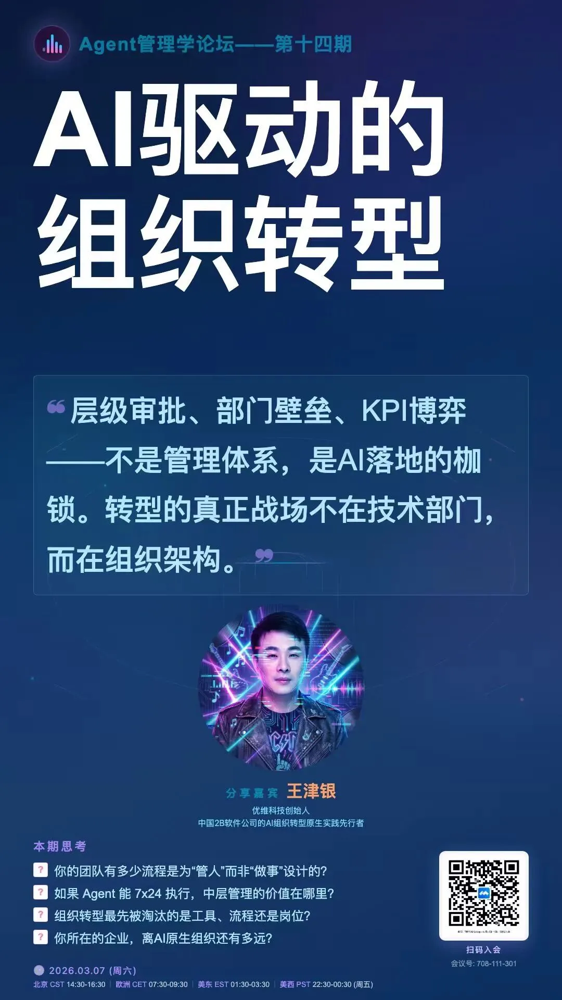

> 原作者：瑞典马工

硅谷这个地方，同时以美国深圳和美国驻马店闻名，一边疯狂创新，一边疯狂忽悠。那里的老哥老姐时不时的发明一个新名词，有的词语是真的创新，有的新词是新瓶装旧酒，有的词语则只为骗钱。

比如说 Palantir，一半以上收入来自美国战争部的赏赐，拿单子全靠 Peter Thiel 和美国右翼集团的关系，网站挂着星条旗，活脱脱一个美国信创企业。本来应该闷声发大财的，但是他们不甘寂寞，发明一个新词语 FDE，所谓前置部署工程师。国内一帮无脑自媒体也跟着嗨。实际上，这玩意就是个驻场工程师，我国那些三产企业都玩了二十年的老把戏。

这公司还弄了个本体论，被我的朋友冯老板发现就是把大家日常做的数据库建模换了个名字，这样就有个名头对美国国防部张嘴要高价，有兴趣的可以跳过去读 [Palantir 的 “本体论骗局”](/db/ontology-bullshit/)。

又比如，美国人吹的神乎其神的增长黑客，Growth Hacking，听起来特别神秘高科技，其实就是中国互联网公司玩了二十多年的互联网运营岗。Tiktok 把这一套搬到美国，吊打 Facebook 和谷歌，两个美国傻大个至今学不会运营，还在那里傻乎乎的抄袭界面，以为 tiktok 是靠 UI 赢得客户的。

再多说一句，前两年吹 PLG 的中国投资人也不吹了。

最近这几个月，美国驻马店又开始吹 One Person Company，所谓一人公司者，还弄了个缩写 OPC，看起来很吊的样子。我左看右看，还是忍不住说“这 TM 不就是个体户么？” 我高中时候都在学校门口吃早餐，今天这里吃包子，明天那里吃米粉，按美国驻马店的标准，原来卖包子的老李和炒粉的陈姨都是 OPC 啊，失敬了。

吹 OPC 的老哥们，都说一个人能干一个公司，你问他们梁静茹什么时候给他的勇气，他们就会说“我只有一个人类员工，但是我有一百个小龙虾。他们是我的主力员工，所以我有一百个员工。小龙虾就是 Peter 一个人做出来的。”听起来很合理吧，对吧？结果小龙虾的创始人 Peter 转头就加入了 OpenAI 当了个员工。另外一个最有价值 Agent Claude Code 的发明人 Boris 带着他的小姨子 Cat Wu 从 Anthropic 跳槽到 Cursor，然后又从 Cursor 回到 Anthropic，宁愿当硅谷吕布，就是不肯去当个体户，不管忽悠家们怎么吹 OPC。

但是吹 OPC 的哥们虽然不靠谱，但是他们抓到了一个问题：现在没人知道怎么打造一个 AI/人类协作的团队，没人知道流程要怎么定义，没人知道团队规模要怎么控制，没人知道要怎么写招聘启事，没人知道怎么考核团队，HRBP 甚至不知道怎么在 Agents 之间搞末位淘汰了（以前这可是哈巴狗都能干的活）。一言以蔽之，我们没有一个 AI 时代的德鲁克。

好消息是，任何一个美国好东西，你都可以在中国找到一个平替。比如说电动车领域，中国比亚迪平替美国特斯拉；高领毛衣领域，中国雷军平替美国乔布斯；繁殖癌领域，广州多益网络徐波平替南非马斯克。他们都工作的很好，请大家点赞👍👍👍。

那么在工商管理领域，没有世界一流工商管理专家美国德鲁克，那我们就应该在中国找个有德鲁克 80% 那么好但是只有德鲁克 10% 那么贵的中国替代品。

各位有福了，我给你们找到优维科技创始人、中国 2B 软件公司 AI 组织转型原生实践先行者 @JY.王津银 @ElevoAI，直接分享他在真实企业场景中推动 AI 驱动组织转型的一线经验：当 Agent 重塑了生产力，组织该如何跟上？

多数企业 AI 转型受阻，根源不在技术选型，而在于没人敢对组织动刀。

Agent 已具备分析、执行乃至辅助决策的能力，但多数企业仍在用上个时代的架构驾驭下个时代的生产力。层级审批、部门壁垒、KPI 博弈，转型的真正战场不在技术部门，而在组织架构图上。不敢动组织的转型，只是体面的拖延。

时间安排（03 月 07 日 周六）：

北京：14:30 - 16:30

瑞典：07:30 - 09:30

美东：01:30 - 03:30

美西：22:30 - 00:30（周五晚）

\#腾讯会议：708-111-301

觉得马工在吹牛逼的朋友，你认真看一下老王的头像，你看那充满 AI 科技感的头像，你还不感动吗？运维老王亲身把自己升级为 AI 老王了！

在这里放个群二维码，欢迎对这个组织转型有严肃兴趣，有一手经验的朋友加入，一起讨论这个重大理论话题。没有一手经验只是打酱油的，就不用加了，加入了也会被管理员踢出来。

---

发布版本：[微信公众号转载页](https://mp.weixin.qq.com/s/8heMP8qZ7HdlCKWam73M4g)
