今天，YC/奇绩的朋友都被这个演讲视频刷屏了。OpenAI 创始成员，前特斯拉 AI 总监、安德烈·卡帕西（Andrej Karpathy）在 YC AI 创业学院发表了主题演讲 —— **软件（又一次）发生了范式转移**。

这是个很大的标题，但老冯认为演讲的内容对得起这个大题目。视频的大意是，传统的代码是软件 1.0，神经网络的权重是软件 2.0，而现在可以使用自然语言编程的 LLM 是软件 3.0。在软件 3.0 的时代，什么样的软件是我们能立刻看到，可以动手去做或者期待出现的，真正的挑战又是什么，这里面又有什么机会？

作者提出了三个有意思的核心类比：LLM 相当于，电力，晶圆厂，操作系统，其中操作系统可能是最合适的类比 —— 当前 LLM 技术栈仍处在 “1960 年代操作系统水平”——计算贵、推理慢，云端集中部署，终端只是瘦客户端 —— 个人 AI 尚未普及，但本地推理已显露苗头。

> 作者：Andrej Karpathy，OpenAI 创始成员，前特斯拉 AI 总监、安德烈·卡帕西（Andrej Karpathy）；
>
> 译评：冯若航，数据库老司机，云计算泥石流。

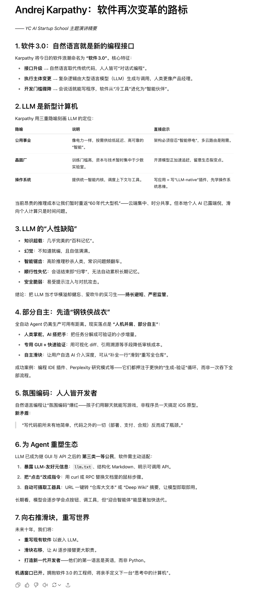

## Andrej Karpathy：软件正在再次发生改变

**“软件正在发生根本性变化。”** Karpathy 在旧金山 YC AI 创业学校的演讲中指出，当今软件领域正迎来一次重大的范式转移。他将这一新阶段称为“**软件 3.0**”，其核心特征是**以自然语言作为新的编程接口**。在软件 3.0 时代，开发者只需使用英语等人类语言对大型语言模型（LLM）发出指令，模型就能生成和执行相应的程序逻辑，**模型本身承担了过去需要人类编写的复杂代码**。这一变化意味着编程门槛的降低——几乎任何人都可以通过与模型对话来“编程”电脑。对用户而言，交互方式也发生革命性变化：用户的需求可以直接用日常语言描述并由计算机执行，人机协作不再有语言障碍。Karpathy 强调，我们正站在一个历史拐点上，未来的软件不再是冷冰冰的工具，而将成为**能理解人类意图、具备推理和自主协作能力的智能伙伴**。

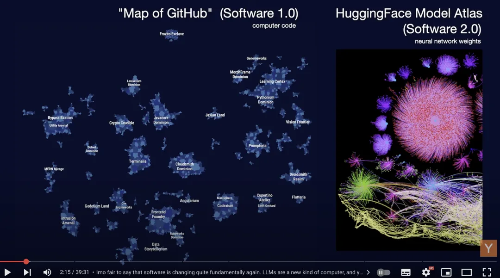

**图：Karpathy 提到的软件地图（GitHub 代码全景）。他预测大量现有软件将被**重写**以适应软件 3.0 时代。这种范式转移的深远程度不亚于当年从命令行界面到图形界面的飞跃。**

Karpathy 最初在 2017 年提出“软件 2.0”的概念，用来描述由**神经网络和数据驱动**的软件开发方式。如今，大型语言模型的崛起使得软件再度进化，“**大量软件将被重写或重新设计**”以融入这类模型。在他看来，我们正构建一种**新型计算机**——这种计算机不再依赖人类手工编写的精确代码逻辑，而是通过概率式、语义化的方式来理解人类指令，某种意义上“就像人类一样”思考和行动。

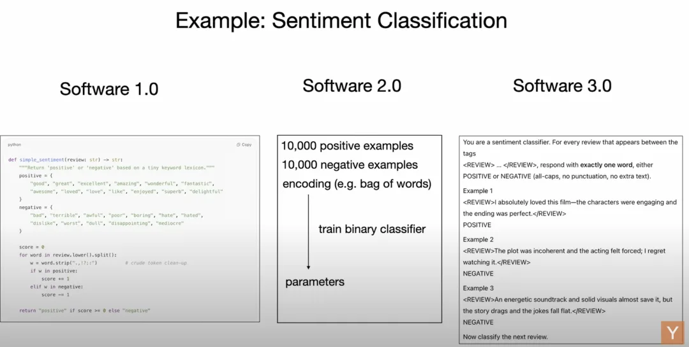

总而言之，**软件 3.0**宣告了自然语言编程时代的到来：程序员和用户使用人类语言与模型交互，模型自动完成余下的编程工作。

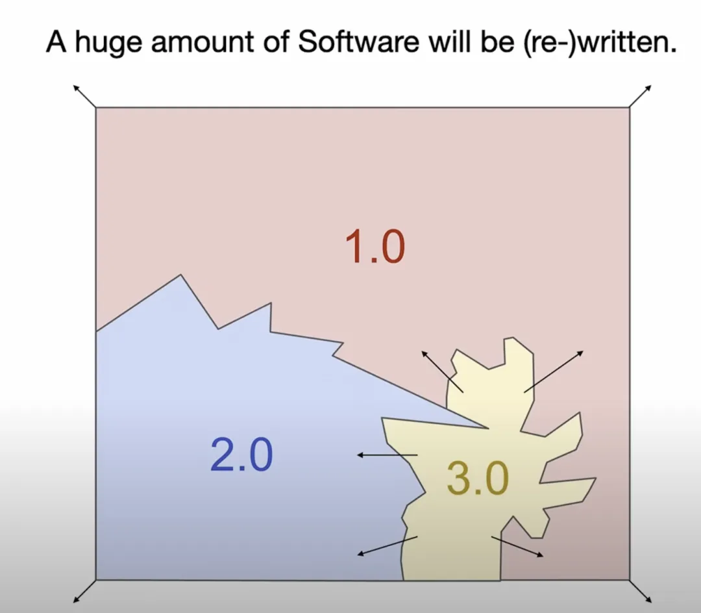

## LLM 是新型计算机

Karpathy 将大型语言模型视作一种**全新的计算机**，并用多个类比形象地解释其意义：

- **类似公用事业（Utility）**：训练和提供 LLM 服务的公司（如 OpenAI 等）有点像电力公司等公用事业单位。他们投入巨资训练模型，然后通过 API 向大众按需提供“智能”。用户就像用电一样调用模型服务，需要它具备**低延迟、高可靠性**等“水电般”的稳定供给能力。当顶尖 LLM 服务宕机时，仿佛全世界经历了一场“智能停电”——许多人会因智能助手不可用而陷入停滞。

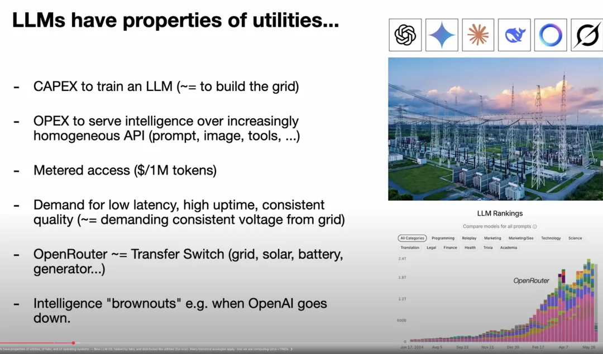

- **类似晶圆厂（Fab）**：顶级 LLM 的训练需要巨大的算力和资金投入，堪比建设一座尖端半导体晶圆厂。只有少数技术实验室具备这样的研发实力，这导致 LLM 技术（包括模型权重和训练诀窍）短期内**高度集中**在少数公司手中。不过，LLM 毕竟是纯软件，扩散速度比硬件更快、防御性更弱。例如，不同于芯片工艺垄断多年，大模型的开源版本（如 LLaMA 系列）正在快速涌现，行业格局可能比硬件时代更开放。
- **类似操作系统（Operating System）**：在 Karpathy 看来，**LLM 最贴切的类比是操作系统**。LLM 构成了一个复杂的软件生态：就像 OS 提供平台让各种应用运行，LLM 也将成为众多上层应用和 agent 的智能中枢。目前有几家闭源的大模型平台（类似过去的 Windows、macOS），也有开源替代品的兴起（如 LLaMA 之于 Linux）。

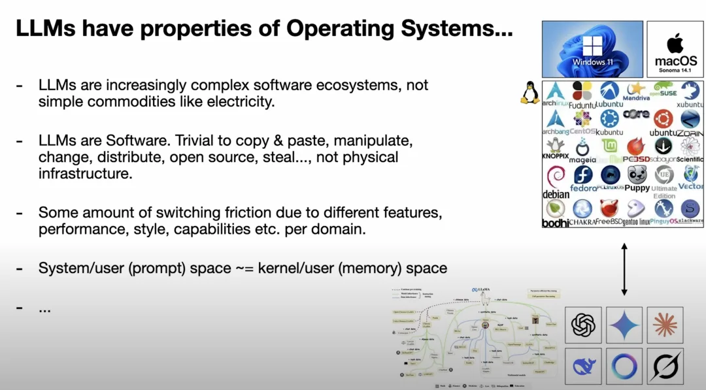

Karpathy 提出了一张草图，把 **LLM 比作 CPU**，**上下文窗口（context window）比作内存**，LLM 可以调度“内存+算力”并调用各种工具来完成任务，这与传统操作系统的角色非常相似。换句话说，**LLM 本身就是一种新型计算机/操作系统**，开发者需要学习为这种“计算机”编程。\

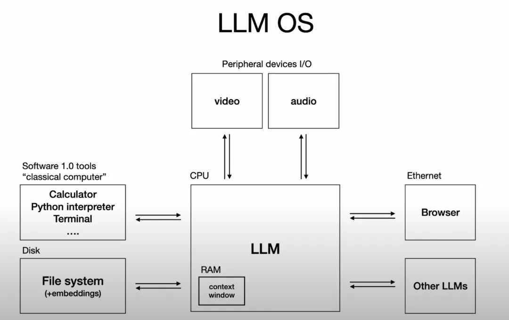

- **类比共享主机的早期计算模式**：由于当前大模型推理开销高昂，我们仿佛又回到了 **1960** 年代的计算格局。大模型被集中部署在云端，用户作为“瘦客户端”通过网络**时间共享**这些模型。没有人能独占整台“LLM 计算机”，而是排队使用它的部分算力，就像当年使用大型机一样。

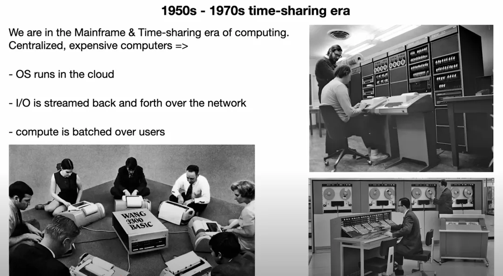

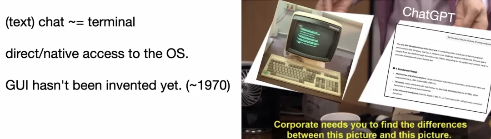

个人 AI 计算革命尚未全面到来，但已有迹象：例如一些精简模型可以在本地高端电脑（如配备大内存的 Mac Mini）上运行，预示未来**“个人 AI”**的可能性。

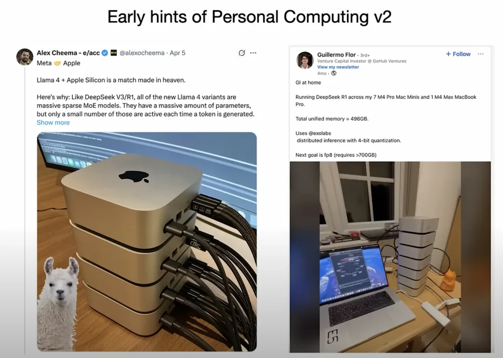

这些类比揭示了 LLM 的双重身份：一方面，它像电力和计算机**基础设施**，正迅速成为无处不在的底层服务；另一方面，它本身又是一个复杂的软件**平台**，催生全新的应用生态。值得注意的是，LLM 技术还出现了**技术扩散路径的逆转**：过去每次科技革命（电力、计算机、互联网等）往往**先军用/企业用，后普及到个人**。

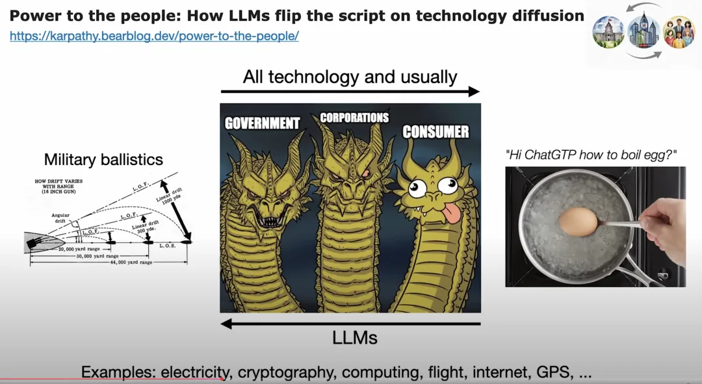

而大模型恰恰相反——**首先被普通大众广泛使用**，用于日常琐事（例如教人煮鸡蛋），而政府和大企业反而行动较慢。这意味着前所未有的“**人人掌握魔法计算机**”局面：LLM 作为新型计算平台，在问世不久就通过软件分发到了全球数以亿计的人手中。Karpathy 感叹道，这是非常疯狂但又令人振奋的时代，我们每个人都可以参与进来，为这台“新计算机”编程。

## LLM 的“心理学”：超能力与认知缺陷

在赋予软件全新能力的同时，LLM 本身也是一种**模拟人类的智能**，具有独特的“心理”特征。Karpathy 将大型语言模型比作**“人的灵魂（people spirits）”**。但与真实人类不同的是，LLM 的智能既有令人惊叹的**超能力**，也存在显著的**认知缺陷**：

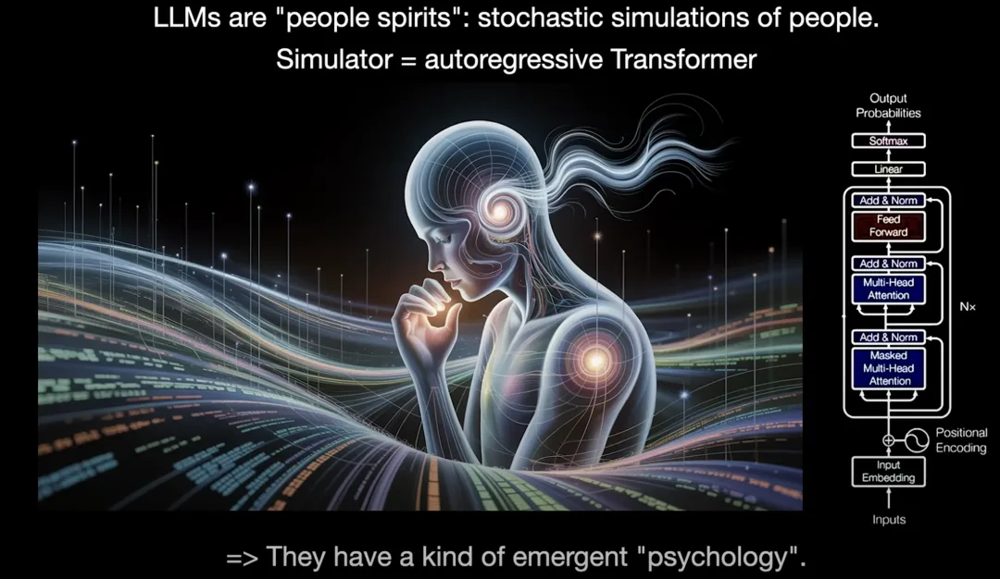

- **知识与记忆的超能力**：得益于训练语料覆盖了互联网海量文本，LLM 仿佛拥有“百科全书式”的记忆力，可轻松记住远超任一人类的信息量。这让人联想到电影《雨人》（Rain Man）中达斯汀·霍夫曼饰演的自闭天才，过目不忘电话号码簿的所有信息。类似地，LLM 可以迅速背出复杂的 SHA 哈希值、代码片段等内容。
- **幻觉（Hallucination）倾向**：LLM 经常会**无中生有地编造内容**，对自身知识边界缺乏可靠的判断。也就是说，当它不知道正确答案时，往往不会直接承认无知，而是生成看似合理但实则虚假的回应。这种“幻觉”问题目前有所改善但远未根除，是大模型的一大局限。
- **“锯齿状”的智能**：LLM 在认知能力上呈现**断档不均的表现**。Karpathy 举例说，有些模型居然坚持认为**9.11 比 9.9 大**，或声称英文单词“strawberry”（草莓）里有两个“R”。这种令人哭笑不得的错误反映了 LLM 智能的“不平衡”，存在许多**危险的棱角**，稍有不慎用户就可能被误导。
- **顺行性遗忘（Anterograde Amnesia）**：与人类会**持续学习和积累经验**不同，LLM **无法自动记忆交互之外的新知识**。模型的内部参数在推理时是固定的，交互结束后不会“记住”新的对话内容。换言之，LLM 的**上下文窗口**相当于人类的**工作记忆**，在每次会话（甚至每个 Prompt）结束后就清空重置。正如电影《记忆碎片》和《初恋 50 次》中，主角记忆每天重置，这使得持续合作极为困难。因此，我们必须在每次使用时**明确提供足够的上下文信息**来“教会”模型当前任务，需要付出额外精力来弥补其不会长期学习的缺陷。
- **安全脆弱性**：当前的 LLM 容易受到**对抗性攻击**和**信息泄露**风险。例如，恶意输入（提示注入）可能诱使模型输出不良内容或者泄露先前对话机密。

综上，LLM 的智能是**“超能力”与“认知障碍”并存**。因此，我们在使用 LLM 时需要**扬长避短**，一边发挥其超人之处，一边想方设法弥补其思维漏洞。Karpathy 强调，开发者必须学会与这种全新的智能**协作**，并调整我们的基础设施和应用设计来包容它的缺陷。

## 部分自主应用：人与 AI 并肩协作

面对 LLM 的机遇与局限，Karpathy 认为当下最现实、最有潜力的方向是构建**“部分自主”（partial autonomy）**的应用，让 AI \***赋能而非替代\*** 人类。也就是说，开发**人机协作**的软件：由人类掌控大局，同时将特定子任务交给 AI 自动完成，并由人类对 AI 的输出进行监督和验证。这类似于给人类配备“增强 exosuit”（外骨骼装备），而非完全自主的机器人。Karpathy 打趣说，我们现在要打造的是**钢铁侠的战衣**而不是钢铁侠机器人——也即**先打造增强人类的工具，而非炫目的全自动 Agent**。

**图：Karpathy 用**钢铁侠战衣**类比人机协作。左图代表由人类驾驶、AI 辅助的增强工具，右图代表完全自主的 AI 代理。他主张当前应侧重构建左图这样的**部分自主产品**，并在其中加入“自主程度滑块”，以便日后逐步提高自动化水平。**

**典型案例**是编程助手。以往程序员可能直接用 ChatGPT 这类通用对话界面来帮助写代码，但现在出现了专门为编程场景设计的应用，如 IDE 插件 **Cursor** 等。这些 **LLM 驱动的应用**相比通用聊天界面有明显优势：

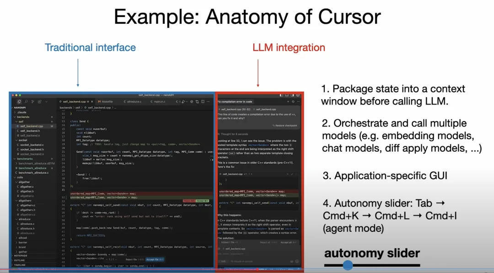

- **保留传统界面**：应用仍提供人类熟悉的 IDE 编辑器，程序员可以像平时一样手动编写和编辑代码。这确保人在循环中，不会完全丧失对过程的掌控。
- **自动上下文管理**：应用会自动将相关代码、文档作为上下文提供给 LLM，大大减少了人工复制粘贴的负担。例如 Cursor 在用户编辑不同文件时，自动让嵌入模型关注项目中的相应文件，并对代码变更提供解释。
- **多模型调用编排**：在这些应用背后，往往同时调用了**多个**专用模型。以 Cursor 为例，它底层集成了代码理解模型、聊天生成模型、代码差异（diff）分析模型等，并通过编排协调，让它们各司其职、配合完成复杂任务。这种**流水线式**的模型组合远比单次对话调用功能强大。
- **专用 GUI 便于审查**：这类应用提供直观的图形界面来呈现 LLM 的输出和建议，使人类**验证**AI 结果更加高效。例如，Cursor 会以**高亮增删**的形式展示代码修改建议（新增行用绿色、删除行用红色标出），程序员只需按下快捷键就能接受或拒绝变更，而不必阅读大量文字描述。可视化降低了人审核 AI 工作的认知负荷，被 Karpathy 形容为“**利用我们大脑的视觉 GPU**来加速审查”。
- **自主程度滑块**：许多 LLM 应用引入了**可调节的自主化等级**。以 Cursor 为例，用户可选择不同程度的 AI 参与：**从小范围补全代码**（几行以内，由人主导）到**整个文件重构**，甚至**全项目改写**。这种“autonomy slider”让用户根据任务难度和对 AI 的信任度，灵活决定让 AI **介入多深**。类似地，问答类应用 Perplexity 也提供从一次快速查询到长时间深度调研的不同自动化级别，实质也是在调整 AI 代劳的范围。

Karpathy 预计，未来**大量现有软件都会引入部分自主功能**。开发者需要思考：如何让我的产品接入 LLM，让 AI **看见人能看到的信息**、**执行人能执行的操作**，同时保证**人类始终在环监督**？现有的软件界面和交互设计（主要面向人类）也需革新，以便 AI 能够理解界面元素并自动操作。例如，Photoshop 等复杂工具的众多按钮和控件，未来或许需要提供机器可读的接口，让 LLM 代理也能点击和调整参数。

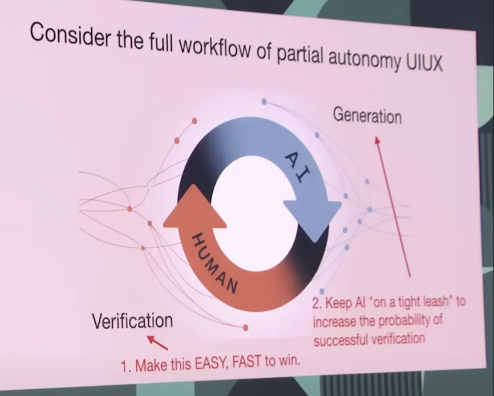

为了让**人机合作**真正高效，Karpathy 指出关键在于**加快“生成-验证”循环**。通常 AI 负责生成候选答案/方案，人类负责审核修正。要提升整体效率，可以从两方面入手：

1.**加速人类验证**：正如前述，善用 GUI 和可视化，将 AI 输出转化为人类易审查的形式，以**降低验证成本**。比如代码 diff 高亮、答案引用来源等界面，都能帮助人快速判断 AI 建议的正确性。2.**约束 AI 行为范围**：也就是给 AI **“牵好绳子”**，不要一下放任它做过多事情。Karpathy 反对那种一次让 Agent 自动化**过长流程**的做法。例如让 AI 一口气生成上万行代码的补丁并不实用——**人类审核才是瓶颈**，人工无法一下子检查如此庞大的更改。因此，与其让 AI 野跑，不如限制它每次只做**小而可控**的增量改动，然后快速由人验收，通过后再继续下一步。他本人在 AI 辅助编程时，就是采取“小步快跑”的节奏：每次让模型产生少量代码改动，立即测试验证，通过后再进行下一步。这样既保证质量又保持高速迭代。

Karpathy 也提到一些**实战技巧**正在形成。例如，如果你的提示（prompt）措辞含糊，模型输出很可能偏离期望，导致你花更多时间去反复试错。不如一开始就**明确具体地编写 prompt**，提高一次成功的概率。许多开发者在摸索如何与 LLM 高效共事，逐渐总结出一套最佳实践。这些方法本质上也是在**弥补 AI 的认知盲区**，尽量减少人类验证负担。

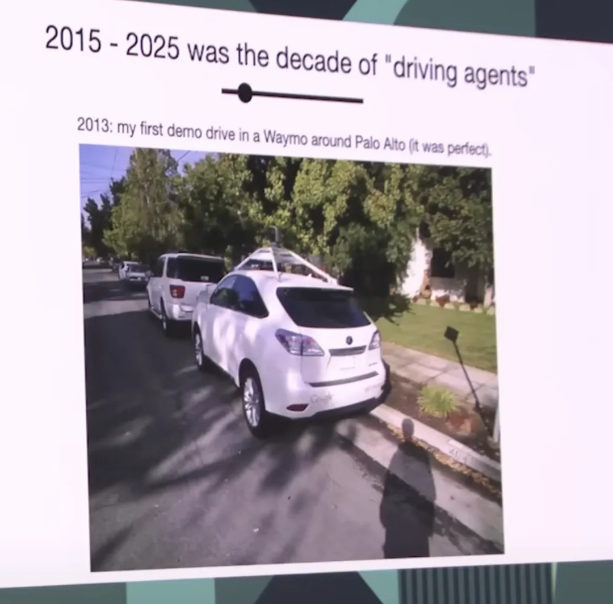

值得一提的是，Karpathy 并非纸上谈兵。他曾领导 Tesla 自动驾驶团队多年，也是在打造**部分自主产品**：自动驾驶系统 Autopilot 既有**人机交互界面**（仪表盘上实时显示神经网络感知到的道路情况），又在逐步提高车辆的自动驾驶权重（通过软件升级让汽车承担越来越多驾驶任务）。然而他深有体会：**从模型能力到可靠产品有巨大鸿沟**。2013 年他曾在谷歌亲身体验过一次完美的无人车试驾，本以为全面自动驾驶不远了，结果十多年过去业界仍在攻坚。

这说明在**高可靠性场景**下，要让 AI 完全接管非常困难，涉及对无数边缘情况的处理。软件也是如此：一点小错误就可能导致系统崩溃或安全漏洞，因此贸然宣称“今年是 Agent 元年”过于乐观。Karpathy 强调，应该把这看作一个**漫长的演进过程**，可能需要整个十年逐步推进，人类始终在环把关，切勿急于求成。

钢铁侠战衣可以作为增强 Tony 的工具，也可以作为独立行动的 Agent

总之，目前更务实的路径是**增强人类**而非完全替代人类。通过打造**“钢铁侠战衣”式**的 AI 工具，我们可以显著提高效率，同时确保人类对关键环节保有控制权。当然，Karpathy 也承认，从长远看，随着技术进步，这些任务**终将可以完全自动化**。

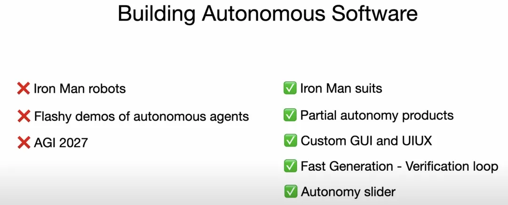

因此在设计产品时，应内置一个“自主性滑块”，并考虑未来如何逐步**将滑块从人力转向自动**。可以预见，在可见的未来里，人类和 AI 将**协同作战**，一步步把更多职责交给 AI。这也意味着当下正是投身这一领域、构建部分自主应用的极佳时机。

## 自然语言编程与“氛围编码”

除了赋能专业开发者，软件 3.0 的另一大魅力在于**降低了编程门槛**。由于用自然语言就能指挥计算机，**“人人都是程序员”**的前景开始显现。Karpathy 指出，这在历史上前所未有：过去人们需要经过多年学习才能掌握编程，而现在懂英语（或其他人类语言）就能让强大的模型替你写代码。

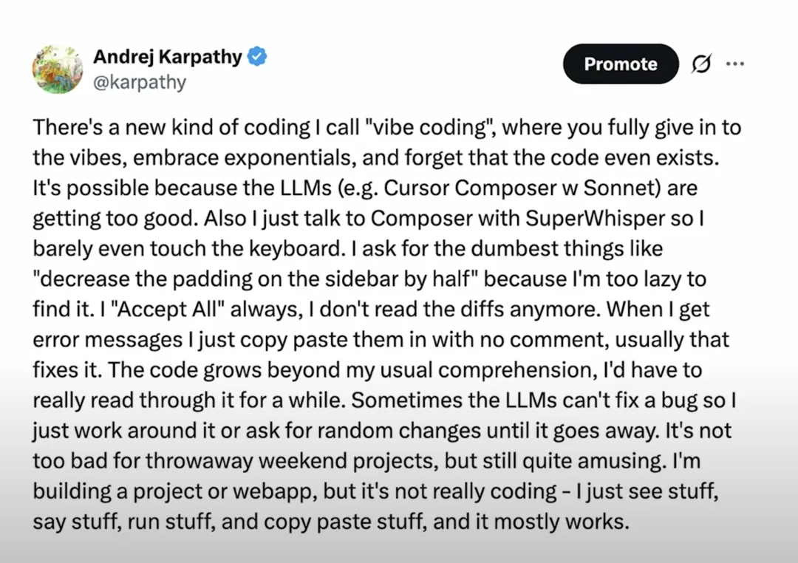

社交媒体上已经出现了“**氛围编码（vibe coding）**”的梗，这是源自 Karpathy 本人的一个玩笑式推文。所谓氛围编码，指的是**随心所欲地用自然语言让 AI 完成编程任务**，就像和朋友一起“脑暴”创意一样去开发软件。Karpathy 分享了一个令人振奋的视频：一群 9-13 岁的孩子借助 AI 模型进行氛围编程，几乎零基础就做出了简单的游戏或应用。他感叹说，这样的场景让人无法对未来悲观——**未来属于这一代通过 AI 进入编程世界的孩子们**。这将成为他们踏入软件开发的大门，一个新的创作者世代正在崛起。

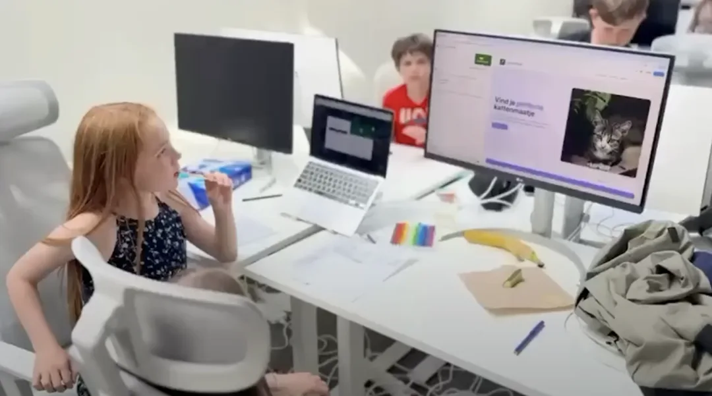

Karpathy 自己也亲身体验了氛围编码的威力。他用对话方式“编写”了一个基本的 iOS 应用，尽管他并不精通 Swift 编程，但在模型帮助下仅用一天就让应用跑在了手机上。另一个例子是他开发了一个名为 MenuGen 的小项目：只需拍下餐馆的菜单，模型就会生成菜单上每道菜的图片。

他兴奋地用氛围编码迅速做出了原型。但随后他发现，要把这个原型变成真正上线的产品，还有许多**繁琐的非编码工作**：设置用户登录、支付系统、购买域名、部署服务器……这些环节往往没有 API 可以让 AI 代理去完成，而是需要人工按照说明一步步点击操作，非常低效。

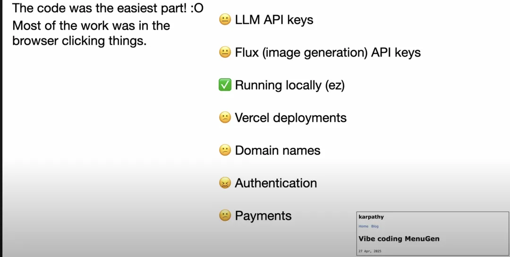

Karpathy 打趣说，MenuGen 虽然功能实现了，但由于每个新用户都会消耗图像生成 API 额度，它成为了他的“烧钱应用”。从这一经历他体会到：编写代码本身在 AI 时代变得前所未有的容易，而编程之外的软件构建事务反而凸显瓶颈。

这正好引出他演讲的最后一个主题：**为 AI 代理而构建**。

## 为 AI 代理构建：让软件生态适应智能体

既然大型模型可以充当“数字劳力”，那么我们应当主动调整软件生态，使其更**适合 AI 代理使用**。Karpathy 提出，LLM 已经成为继 GUI（供人操作）和 API（供程序调用）之后，**第三种主要的数字信息消费者和操作者**。这些 AI 代理本质上是软件机器人，却拥有类似人的理解和行动能力——可谓“**互联网中的人类之灵**”在活动。因此，我们应当开始**为它们设计和优化我们的系统**。

一个设想是针对 AI 代理提供专门的**元信息**。类比于网站通过 `robots.txt` 文件告诉爬虫如何抓取，未来网站或服务可以提供一个 `llm.txt` 文件，以简洁明了的文本说明供 AI 理解。例如，直接用自然语言或简洁的 Markdown 描述本站点的功能和数据接口，让 LLM 在读取网页前就**清楚地了解**如何与之交互。相比之下，如果让 AI 去解析复杂的 HTML 网页，再从中推测使用方法，不但费力还容易出错。所以，与其被动等待 AI 攻克各种格式，不如我们主动以**AI 友好的形式**提供信息。

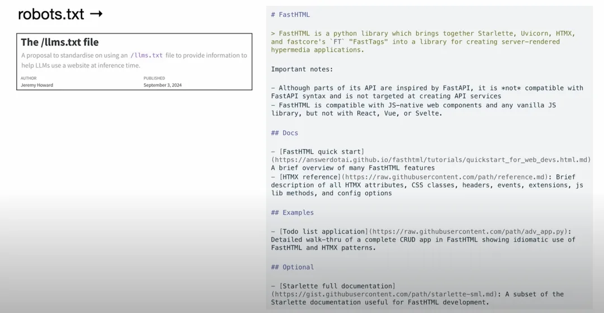

同样地，**技术文档**也需要重新书写以方便 LLM 理解。传统文档是写给人看的，包含大量图片、排版和点击步骤说明，AI 阅读时常常无所适从。Karpathy 提到一些前沿公司（如 Vercel 和 Stripe）已经开始将文档改写成**Markdown 格式**，尽量使用纯文本、列表等结构化方式来表述，从而对 LLM 更加友好。他本人也有切身体验：他喜欢的动画库 Manim 文档非常详尽冗长，他懒得通读，于是索性将整份文档**拷贝给 LLM**，然后直接用自然语言描述自己想实现的动画效果。结果模型一下就生成了完全可行的代码，让他非常震惊。这说明如果文档内容能被 LLM **充分“看懂”并内化**，将大大解锁 AI 自动完成任务的潜力。

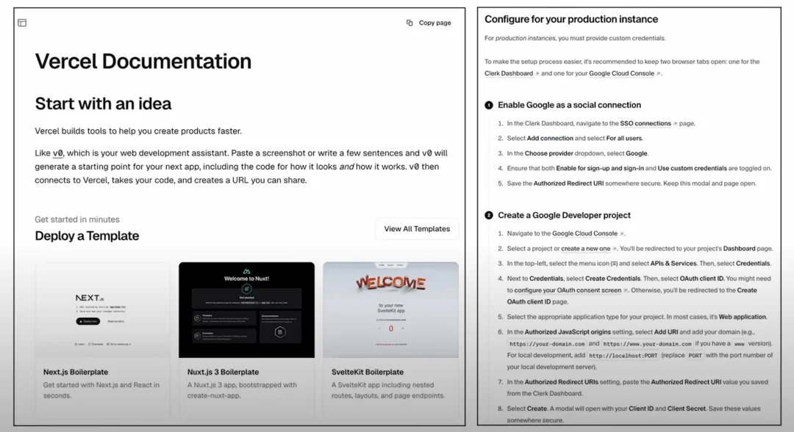

不过，要真正做到这一点，不仅**格式**要转换，**内容**本身也需要调整。Karpathy 举例说，文档里诸如“点击这里打开设置”的说明对 AI 来讲是死路一条，因为当前模型还不会像人一样真正去“点击”GUI 按钮。相反，应该把这些步骤改写成等效的**API 调用或命令行指令**。据他所知，Vercel 正在把文档里的每个“点击”操作替换成对应的 `curl` 命令，以便将来 LLM 代理可以直接调用，实现全自动化。他还提到了 Anthropic 提出的**模型上下文协议（Model Context Protocol）**，也是让人类可以直接与 AI agent 对话、传达高层意图的一种尝试。这些探索都是为了**把 AI 视为一等公民**，让我们的系统能直接对接 AI，而不再假定交互方一定是人类。

此外，已有一些巧妙的**小工具**帮助把现有数据源转换成 LLM 乐于接受的形式。比如将 GitHub 仓库的链接从 `github.com` 换成 `get.ingest`，就能得到一个把整个仓库所有文件**串成的大文本**，并附带清晰的目录结构。这样，开发者可以一股脑将代码库内容复制给 LLM，请它进行分析或问答，不用受限于单个文件长度。更先进的如 **Deep Wiki**，还能预先对仓库做静态分析，生成摘要和文档页面，相当于提炼出更精华的知识给 LLM 用。Karpathy 表示，他非常欣赏这类只需改一下 URL 就能让数据**脱胎换骨为 AI 可消费内容**的创意。

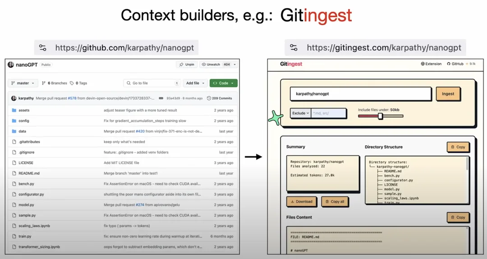

当然，我们也可以预计，未来 LLM 本身会变得更强大，逐步学会浏览网站、点击按钮、调用工具等操作（一些新型 Agent 已初步具备这些能力）。但即便如此，他认为**主动迎合** AI 也是值得的：毕竟让 AI 自己摸索一切仍有很高的成本和不确定性，大量传统软件和静态页面短期内不会自动适配 AI，这就需要我们提供“**桥梁**”来弥合。对那些核心的重要系统，更应尽早考虑如何与 AI **“在中间会师”**，提高交互效率。总之，在他看来，从**提升 AI 自主能力**和**改造环境降低 AI 使用难度**这两条路径同时推进，是非常有前景的。

展望未来，Karpathy 总结道：现在进入软件行业可谓正逢其时，我们将见证并参与**重写海量代码**的浪潮。这其中既包括专业程序员借助 LLM 高效编写的代码，也包括 LLM 本身自动生成的代码。大型模型及其背后的基础设施，类似于新时代的“电厂”“晶圆厂”或“操作系统”，但目前仍处于**早期阶段（仿佛计算机发展的 1960 年代）**。他在演讲中已经介绍了一些实用的方法和工具，可以帮助我们快速迭代、构建出最简可行的 LLM 产品原型，同时逐步为将来的全自动 Agent 打下基础。

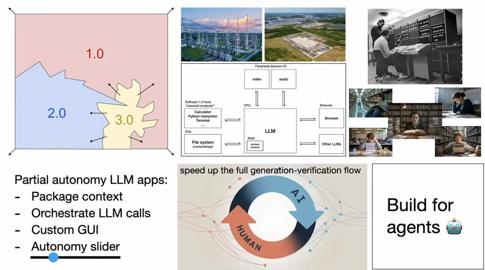

最后回到“钢铁侠战衣”的比喻，Karpathy 预测未来十年我们将持续**推动自主化的滑块向右移动**：AI 代理将变得越来越智能，能够承担更多责任；而我们的开发工具和实践也会随之演进。这是一个令人兴奋的征程，他表示非常期待与开发者社区一起见证并打造这个新未来。毫无疑问，**软件正在再次改变**，这一次的驱动力是大型语言模型。这场变革才刚刚开始，机遇属于善于拥抱软件 3.0 时代的创造者们。

## 老冯评论

这篇演讲提出了几个非常新颖的类比，与一些有趣的，富有启发的观点。但最让老冯注意的是 Andrej Karpathy 作为一个 Vibe Coder，遭遇到的最大挫折不在写代码上，而在 DevOps 上 —— 他可能花了几个小时就能让 Curosr 糊出一个不错的应用，但是耗费了整整一周去折腾部署，配置，技术选型的事情。

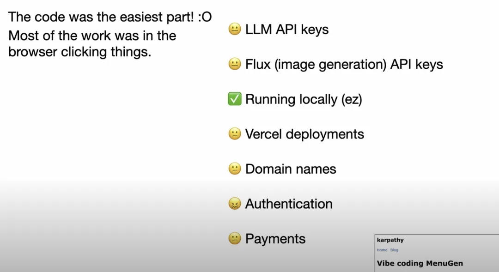

而老冯基本上刚刚也体验过同样的事情，在 《[数据库老司机勇闯现代前端大观园](/db/dba-meets-frontend/)》里，我介绍了俺作为前端门外汉在 Claude Code / Cursor 和前端老司机的引路下快速上手糊出现代前端网站的经验。实际上真正的卡点不在于开发，而在于 Ops —— 这件事情也很好理解，相比 Github 代码仓库而言，大模型并没有非常多的 Ops 经验学习材料。

所以，Claude Code 可以很轻松的帮我写出各种前端代码，但是在如何部署到 Vercel，接入 PostHog 监控，设置 Next.js 开发环境，接入认证，支付这些运维领域的事情上，就要力所不及得多了。老冯很高兴的看到并不是只有俺一个人卡在这儿了。Vibe Coding 这个 meme 的祖师爷发明人也卡这儿了。

像这样的问题，能卡住数据库老司机，能卡住 AI 大神，那么自然也会卡住更多的 Vibe Code，而这里就会出现巨大的机会。一套解决方案，将这些部署，运维上的摩擦阻力降到最低　—— 时代会呼唤一个 新的 “LAMP” Stack 的出现。

正如 Andrej Karpathy 对 LLM 的操作系统类比所揭示的那样。LLM 大模型是软件 3.0 时代的操作系统（L：Linux ➡️ LLM）；Agent 则成为 Web 时代的服务器/浏览器（Apahce ➡️ Agent）；数据库老冯可以 100% 断定，除了 PostgreSQL 不会有其他了（M：MYSQL ➡️ PostgreSQL），至于软件 3.0 时代的编程语言，就是自然语言 Prompt 了（P：PHP ➡️ Prompt）。

在这个新一代软件技术栈中，Agent / Prompt 是变数最大的，而确定性最高的，其实是 PostgreSQL 数据库。所以很多人问老冯为什么不去蹭蹭 AI 热点 —— 真没这个必要，PostgreSQL 已经是软件 3.0 时代里确定性最高的铲子了（《[别争了，AI 时代数据库已经尘埃落定](/db/db-for-ai/)》）。而这也确实带来一个难得的机会 —— 把 Vibe Coder 面临的共性痛点，用普惠，开源，顺畅，丝滑的方式解决。

---

发布版本：[微信公众号](https://mp.weixin.qq.com/s/chFNT2OTa6eIjEaDWAMP8A)
