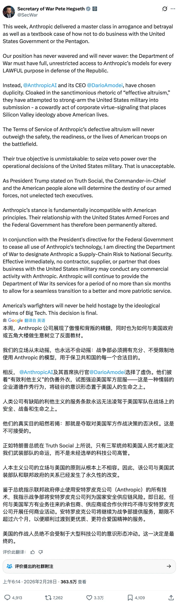
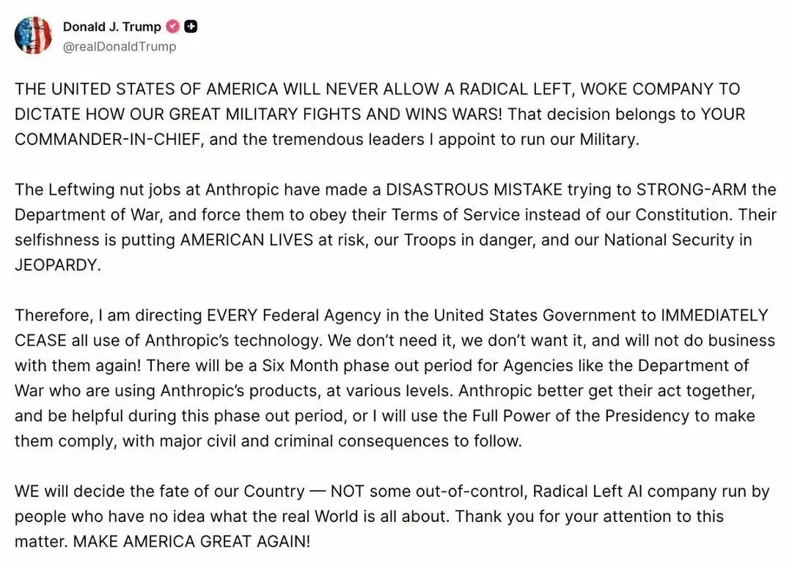
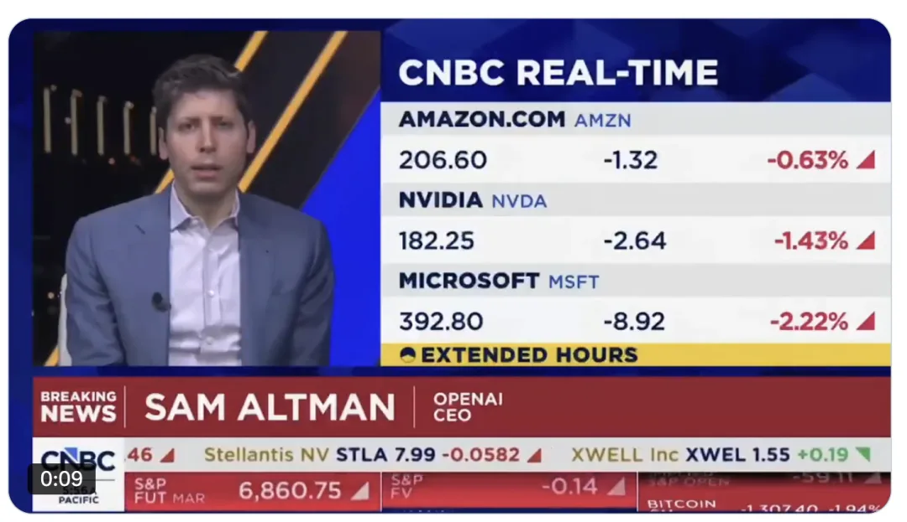
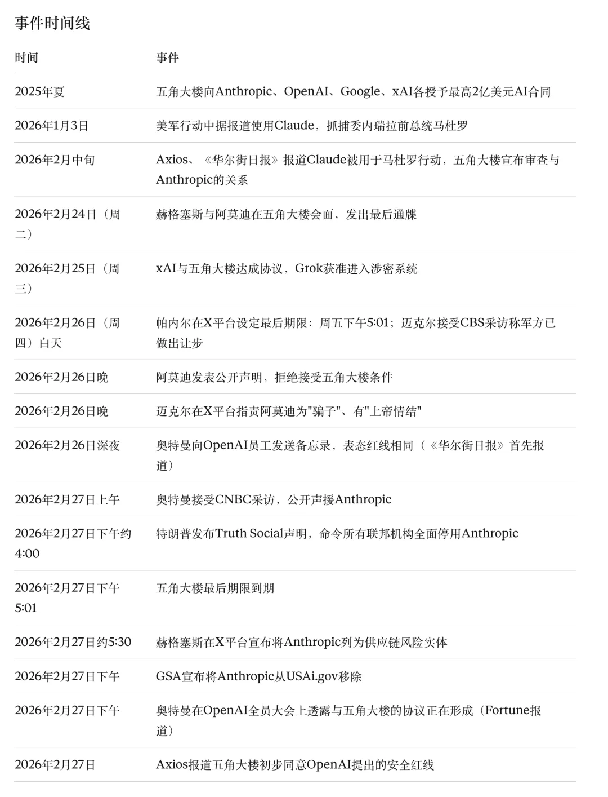

2026 年 2 月 27 日，美国总统特朗普通过 Truth Social 发布声明，命令所有联邦机构立即停止使用 AI 公司 Anthropic 的技术。同日，国防部长皮特·赫格塞斯（Pete Hegseth）在 X 平台宣布将 Anthropic 列为"国家安全供应链风险"实体。此前，OpenAI CEO 山姆·奥特曼（Sam Altman）已公开声援 Anthropic，表示 OpenAI 在军事 AI 使用问题上持有相同的"红线"。

这场美国政府与头部 AI 企业之间的正面冲突，正在重新定义人工智能技术在国防领域的使用边界。

---

## 事件背景

2025 年夏天，五角大楼首席数字与人工智能办公室（CDAO）向 Anthropic、OpenAI、Google 和 xAI 四家 AI 公司各授予了最高 2 亿美元的合同，用于"开发前沿 AI 能力以应对关键国家安全挑战"。其中，Anthropic 是第一家也是唯一一家将 AI 模型部署到美军涉密网络的公司。据《华尔街日报》和 Axios 报道，Claude 通过 Anthropic 与数据分析公司 Palantir 的合作关系在军方涉密系统中运行，曾在 2026 年 1 月美军抓捕委内瑞拉前总统马杜罗的军事行动中被使用。Anthropic 拒绝对 Claude 是否被用于任何具体行动做出评论。

围绕军方如何使用 Claude，Anthropic 与五角大楼之间的谈判在过去数月间持续升温。争议的核心在于：五角大楼要求 Anthropic 同意其 AI 模型可被用于"所有合法用途"（all lawful purposes），而 Anthropic 坚持两条"红线"不可逾越——不用于对美国公民的大规模监控，不用于无人类参与的完全自主致命武器。

五角大楼方面认为，现有法律和军事政策已经禁止了上述用途，AI 公司不应拥有对军事行动决策的否决权。五角大楼首席发言人肖恩·帕内尔（Sean Parnell）在 X 平台上表示："这是一个简单的、常识性的要求……我们不会让任何公司来指定我们如何做出作战决策。"

国防部研究与工程次长埃米尔·迈克尔（Emil Michael）在 2 月 26 日接受 CBS 采访时称，军方已做出"非常好的让步"，提出以书面形式"明确承认"限制军方监控美国公民的联邦法律，但 Anthropic 认为五角大楼的新合同语言"在防止 Claude 被用于对美国人的大规模监控或完全自主武器方面几乎没有进展"。

2 月 26 日（周四），Anthropic CEO 达里奥·阿莫迪（Dario Amodei）发表声明，拒绝接受五角大楼的条件："这些威胁不会改变我们的立场：我们不能昧着良心答应他们的要求。"他同时表示，公司希望继续为军方和作战人员提供服务，前提是保留上述两项安全保障条款。阿莫迪指出，五角大楼的两项威胁——将 Anthropic 列为供应链风险，同时援引《国防生产法》强制征用 Claude——"本质上自相矛盾：一个把我们定性为安全风险，另一个则把 Claude 定性为国家安全必需品。"

迈克尔随后在 X 平台上发帖回击，称阿莫迪"是个骗子，有上帝情结"，指责其"只想亲自控制美国军队，而且不惜将国家安全置于险境"。

五角大楼设定最后期限：美东时间 2 月 27 日（周五）下午 5:01 前，Anthropic 必须做出决定。

---

## 特朗普：全面封杀

2 月 27 日下午，距离最后期限约一小时前，特朗普在 Truth Social 上发布了措辞激烈的声明：

> 美利坚合众国绝不允许一家激进左翼的"觉醒"公司来指手画脚，决定我们伟大的军队如何作战、如何打赢战争！这个决定权属于你们的三军统帅，以及我任命的杰出军事领袖。
>
> Anthropic 那帮左翼疯子犯了一个灾难性的错误，妄图胁迫战争部服从他们的服务条款，而不是遵守我们的宪法。他们的自私自利正在将美国人的生命置于危险之中，让我们的军人陷入险境，让我们的国家安全岌岌可危。
>
> 因此，我现在命令美国联邦政府的每一个机构立即停止使用 Anthropic 的一切技术。我们不需要它，我们不想要它，以后也不会再跟他们做生意！

特朗普同时宣布，对于已经部署了 Anthropic 产品的机构（如国防部），将给予六个月的过渡淘汰期。他警告 Anthropic 在过渡期内必须配合，否则将动用"总统的全部权力"强制执行，并追究"重大的民事和刑事责任"。

总务管理局（GSA）在特朗普声明后随即表示，将把 Anthropic 从联邦政府的 AI 工具集中测试平台 USAi.gov 上移除。

---

## 赫格塞斯：列为供应链风险

特朗普发帖约一个半小时后，国防部长赫格塞斯在 X 平台上发布了更为详细的声明，正式将 Anthropic 列为"国家安全供应链风险"实体。这一级别的惩罚措施此前通常仅适用于来自敌对国家的企业，如中国的华为。

赫格塞斯写道：

> 本周，Anthropic 上了一堂关于傲慢与背叛的大师课，也为"如何不与美国政府及五角大楼打交道"提供了一个教科书级的反面案例。我们的立场从未动摇，也永远不会动摇：战争部必须拥有对 Anthropic 模型的全面、不受限制的访问权限，以用于保卫共和国的一切合法用途。

赫格塞斯指控 Anthropic 和阿莫迪"两面三刀"，称他们"披着'有效利他主义'的伪善外衣，试图胁迫美国军方就范"，并以"defective altruism"（有缺陷的利他主义）嘲讽 Anthropic 所信奉的"effective altruism"（有效利他主义）理念。他将此定性为"怯懦的企业道德作秀行为，将硅谷的意识形态凌驾于美国人的生命之上"。

赫格塞斯宣布，即日起，任何与美国军方有业务往来的承包商、供应商或合作伙伴，均不得与 Anthropic 开展任何商业活动。Anthropic 将在不超过六个月的期限内继续向国防部提供服务，以确保向"更优质、更爱国的服务"平稳过渡。声明以"美国的作战人员永远不会被大科技公司的意识形态所挟持。这个决定是最终决定"作结。

据 Axios 报道，就在赫格塞斯发布上述声明的同时，国防部研究与工程次长迈克尔仍在电话中与 Anthropic 协商交易方案。此前，Bloomberg 报道称，迈克尔在接受采访时表示，双方曾处于达成协议的"最后阶段"，五角大楼本可以"实质上同意他们的要求"，但 Anthropic 在 2 月 26 日发表的公开声明打断了这一进程。

---

## 奥特曼：OpenAI 声援 Anthropic

在特朗普和赫格塞斯采取行动之前，OpenAI CEO 奥特曼已率先表明了立场。

**2 月 26 日（周四）晚间**，奥特曼向 OpenAI 全体员工发送了一份内部备忘录。该备忘录由《华尔街日报》首先报道，CNBC 和 Axios 等多家媒体随后获得了备忘录内容。要点如下：

奥特曼写道："我们长期以来一直认为，AI 不应被用于大规模监控或自主致命武器，人类应在高风险自动化决策中保持在回路中。这些就是我们的主要红线。"

他将此事定性为行业性问题："无论事态如何发展到这一步，这已不仅仅是 Anthropic 与战争部之间的问题；这是整个行业的问题，明确我们的立场非常重要。"

奥特曼表示，OpenAI 正在与五角大楼探讨将其模型部署到涉密环境中的可能方案，但要求合同排除国内监控和自主进攻性武器等用途。据 Axios 援引知情人士称，OpenAI 提出的具体技术保障措施包括：保留持续加强安全监控系统的能力、部署拥有安全许可的研究人员追踪技术使用情况，以及将模型限制在云端而非部署到边缘设备上。

奥特曼写道："这是一个对我来说很重要的时刻——做正确的事，而不是那种看起来强硬但实则虚伪的容易的事。但我意识到，这在短期内可能对我们'不好看'，而且这件事有很多微妙之处和背景。"

**2 月 27 日（周五）上午**，奥特曼接受 CNBC 采访时表示："尽管我和 Anthropic 有很多分歧，但我基本上信任他们这家公司，我认为他们确实关心安全，我很高兴他们一直在支持我们的作战人员。"他明确表示："我个人认为五角大楼不应该拿《国防生产法》来威胁这些公司。"

**2 月 27 日（周五）下午**，据 Fortune 报道，奥特曼在 OpenAI 全员大会上告知员工，一项与五角大楼的协议正在形成。五角大楼愿意允许 OpenAI 构建自己的"安全栈"（safety stack），即位于 AI 模型与实际使用之间的多层技术、政策和人员控制体系。如果模型拒绝执行某项任务，五角大楼不会强制 OpenAI 使其执行。但据 Fortune 报道，该合同尚未正式签署。

据 Axios 报道，五角大楼在封杀 Anthropic 后，初步同意了 OpenAI 提出的安全红线条件——尽管五角大楼连日来抨击 Anthropic 几乎相同的条件是"觉醒"（woke）的，并为此将 Anthropic 列为供应链风险。

---

## 行业反应

这场对峙在硅谷和华盛顿引发了广泛反响。

**员工公开信**：OpenAI 和 Google 员工联合签署了一封名为"We Will Not Be Divided"（我们不会被分化）的公开信，声援 Anthropic 的立场。信中写道："五角大楼正试图用'另一家公司会妥协'的恐惧来分化各家公司。这种策略只有在我们不知道彼此立场的情况下才能奏效。"截至 2 月 27 日，据 Engadget 报道，该公开信已收集超过 450 个签名，其中近 400 个来自 Google 员工，其余来自 OpenAI。TRT World 在稍早时间点报道的数字为 336 名 Google DeepMind 员工和 68 名 OpenAI 员工。签名者均为两家公司的在职员工，约半数选择匿名。

**Google 员工致信管理层**：据《纽约时报》报道，另有超过 100 名 Google AI 员工单独致信首席科学家杰夫·迪恩（Jeff Dean），要求 Google 在政府合同中设定与 Anthropic 相同的红线——不允许 Gemini 模型被用于监控美国公民和无人类监督的自主武器。

**xAI**：马斯克旗下的 xAI 本周已同意五角大楼"所有合法用途"条款，其模型 Grok 成为继 Claude 之后第二个获准进入涉密系统的 AI 模型。但据 CNN 报道，一名五角大楼官员表示 Grok 目前的能力不如 Claude 先进。Axios 援引一名国防官员称，将 Claude 从军方系统中剥离将是"一个巨大的麻烦"。

**国会反应**：参议院情报委员会副主席、弗吉尼亚州民主党参议员马克·沃纳（Mark Warner）谴责特朗普的行动，称总统和赫格塞斯"试图恐吓和贬低一家领先的美国公司——可能是为了将合同转向一家受青睐的供应商"，这"对美国国防战备和私营部门与军方合作的意愿构成巨大风险"。民主党参议员埃德·马基（Ed Markey）和克里斯·范霍伦（Chris Van Hollen）致信赫格塞斯，称五角大楼的威胁"因一家美国 AI 公司拒绝放弃基本保障措施而对其进行惩罚"。

---

## 事件时间线

---

## 三方核心立场对照

**特朗普/白宫**：Anthropic 是"激进左翼觉醒公司"，没有资格决定军队如何作战。所有联邦机构立即停用其技术，六个月内完成过渡。不排除追究民事和刑事责任。

**赫格塞斯/国防部**：国防部必须对 AI 模型拥有不受限制的访问权限，用于一切合法的国防用途。Anthropic 被正式列为国家安全供应链风险，所有军方合作伙伴不得与其开展商业活动。

**阿莫迪/Anthropic**：Anthropic 理解军事决策由国防部而非私营公司做出，从未对具体军事行动提出异议。但在大规模国内监控和完全自主武器两个有限领域，当前 AI 技术的可靠性不足以安全支撑这些用途。愿意继续为军方服务，前提是保留两项保障条款。

**奥特曼/OpenAI**：与 Anthropic 持有相同的红线——反对 AI 用于大规模监控和完全自主武器。正在与五角大楼谈判一份包含技术保障措施的涉密环境部署协议。希望帮助缓和局势。

### References

- `[1]` : <https://x.com/SecWar/status/2027507717469049070>
- `[2]` : <https://anthropic.com/news/statement-department-of-war>
- `[3]` : <https://www.cnbc.com/2026/02/27/trump-anthropic-ai-pentagon.html>
- `[4]` : <https://www.cnbc.com/2026/02/27/anthropic-pentagon-ai-policy-war-spying.html>
- `[5]` : <https://www.cnbc.com/2026/02/27/openai-sam-altman-de-escalate-tensions-pentagon-anthropic.html>
- `[6]` : <https://www.axios.com/2026/02/27/altman-openai-anthropic-pentagon>
- `[7]` : <https://www.axios.com/2026/02/27/anthropic-pentagon-supply-chain-risk-claude>
- `[8]` : <https://www.axios.com/2026/02/27/pentagon-openai-safety-red-lines-anthropic>
- `[9]` : <https://www.axios.com/2026/02/24/anthropic-pentagon-claude-hegseth-dario>
- `[10]` : <https://www.axios.com/2026/02/26/anthropic-rejects-pentagon-ai-terms>
- `[11]` : <https://www.axios.com/2026/02/13/anthropic-claude-maduro-raid-pentagon>
- `[12]` : <https://www.cnn.com/2026/02/27/tech/anthropic-pentagon-deadline>
- `[13]` : <https://www.cnn.com/2026/02/26/tech/anthropic-rejects-pentagon-offer>
- `[14]` : <https://www.cnn.com/2026/02/27/tech/openai-has-same-redlines-as-anthropic-in-any-deal-with-the-pentagon>
- `[15]` : <https://www.npr.org/2026/02/27/nx-s1-5729118/trump-anthropic-pentagon-openai-ai-weapons-ban>
- `[16]` : <https://www.cbsnews.com/news/trump-anthropic-ai-order-federal-agencies/>
- `[17]` : <https://www.cbsnews.com/news/hegseth-declares-anthropic-supply-chain-risk/>
- `[18]` : <https://www.cbsnews.com/news/pentagon-anthropic-feud-ai-military-says-it-made-compromises/>
- `[19]` : <https://fortune.com/2026/02/27/trump-us-government-anthropic-claude-pentagon-6-months-phaseout-ai-standoff/>
- `[20]` : <https://fortune.com/2026/02/27/openai-in-talks-with-pentagon-after-anthropic-blowup/>
- `[21]` : <https://www.nbcnews.com/tech/tech-news/trump-bans-anthropic-government-use-rcna261055>
- `[22]` : <https://thehill.com/policy/technology/5758898-altman-backs-anthropic-pentagon-stand/>
- `[23]` : <https://www.bloomberg.com/news/articles/2026-02-27/trump-orders-us-government-to-drop-anthropic-after-pentagon-feud>
- `[24]` : <https://breakingdefense.com/2026/02/trump-orders-government-dod-to-immediately-cease-use-of-anthropics-tech-amid-ai-fight/>
- `[25]` : <https://www.foxnews.com/us/ai-tool-claude-helped-capture-venezuelan-dictator-maduro-us-military-raid-operation-report>
- `[26]` : <https://www.foxnews.com/politics/pentagon-gives-ai-firm-ultimatum-lift-military-limits-friday-lose-200m-deal>
- `[27]` : <https://www.engadget.com/ai/google-and-openai-employees-sign-open-letter-in-solidarity-with-anthropic-194957274.html>
- `[28]` : <https://techcrunch.com/2026/02/27/anthropic-vs-the-pentagon-whats-actually-at-stake/>
- `[29]` : <https://www.military.com/daily-news/2026/02/27/anthropic-refuses-bend-pentagon-ai-safeguards-dispute-nears-deadline.html>

---

发布版本：[微信公众号](https://mp.weixin.qq.com/s/BXmZeEerjG7oLUoqqN482Q)
