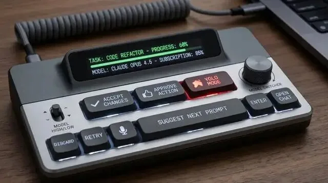
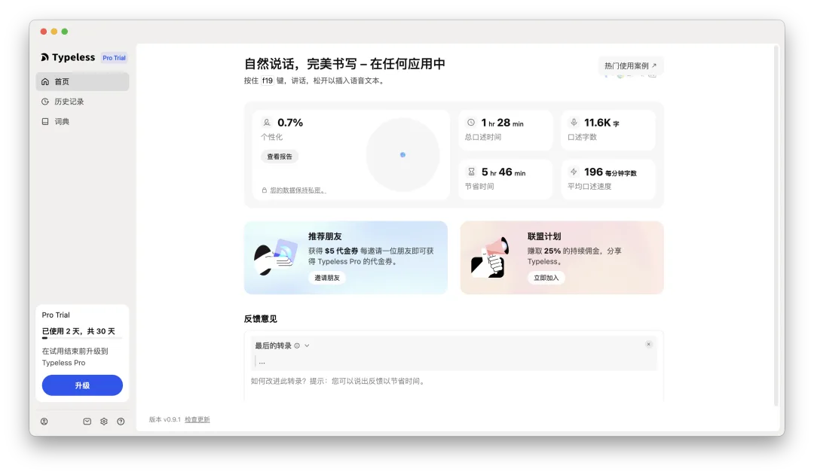
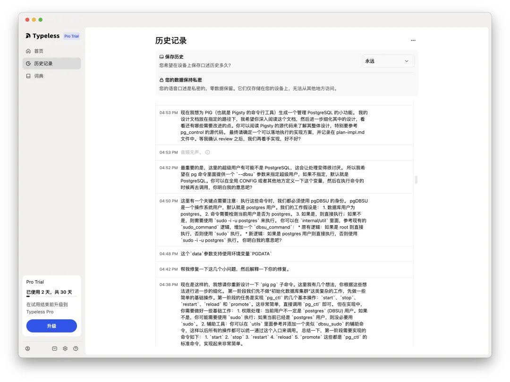
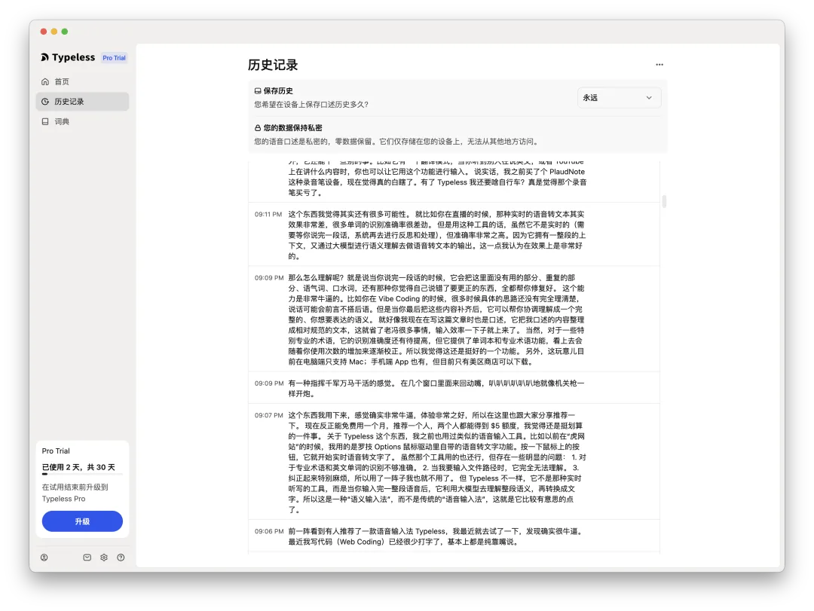
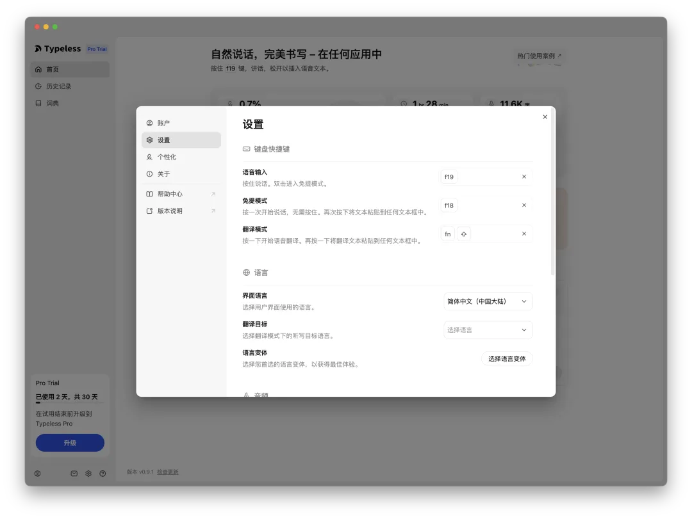
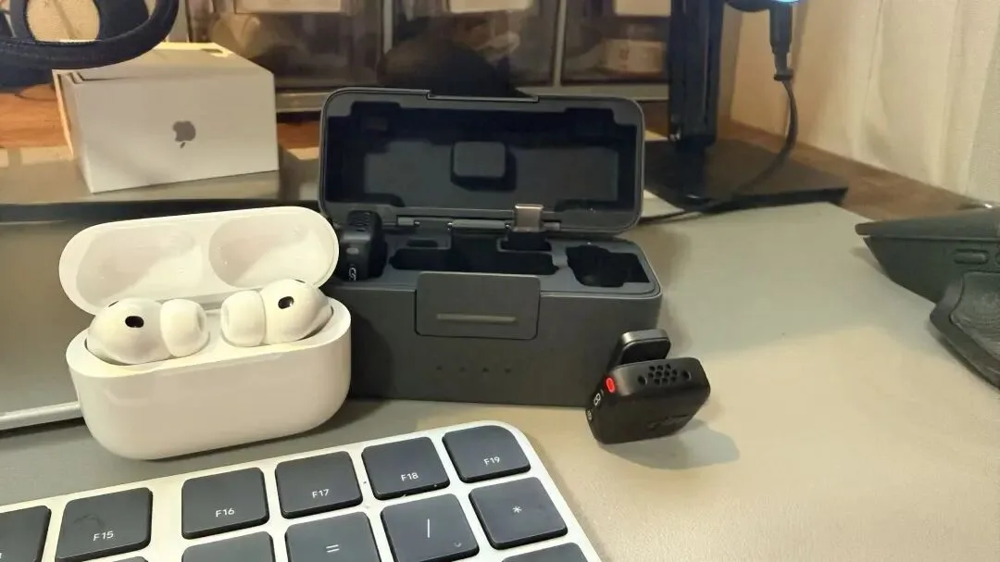
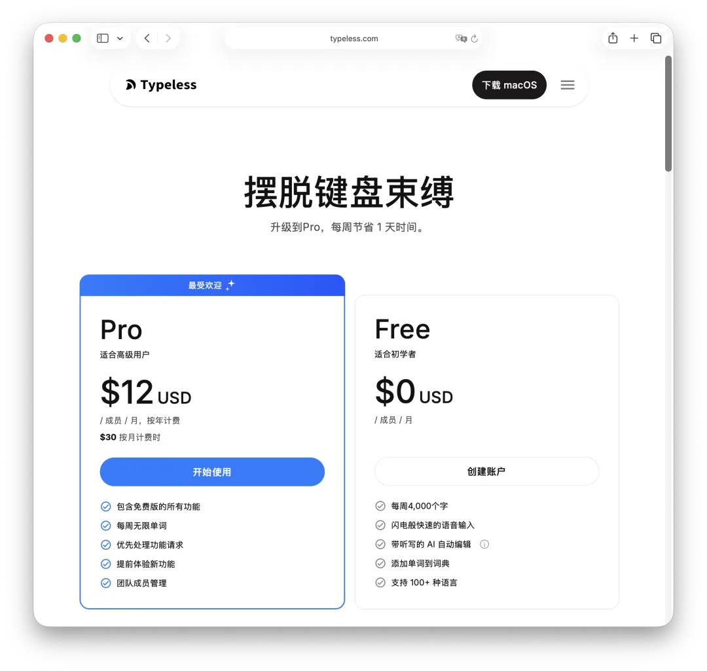

还记得这张梗图吗？2026 年 Vibe Coder 最需要的设备 —— 某种意义上来说，现在已经实现了！

前阵子看到有人推荐了一款语音输入法 Typeless，试用之后发现确实牛逼。这两天我写代码 Vibe Coding 已经很少打字了，基本上纯靠嘴说，有一种指挥千军万马干活的感觉。在几个窗口里来回动嘴，叭叭叭叭像机关枪一样开炮，别提多爽了 —— 君子动口不动手。

 口述速度每分钟 196 个字，这比我打字肯定是快多了。而且这是润色过后的高质量输出字数，已经去掉了那些没用的废话和口水词儿。

重要的事情放在最前头 —— **这玩意现在免费试用一个月**。用老冯的推荐码，你和俺都能获赠 5 美元免费额度。欢迎尝鲜：<https://www.typeless.com/refer?code=XVCCJNA>

---

## 语义输入法，而非语音输入法

我以前也用过语音转文字。比如之前 “[糊网站](/db/dba-meets-frontend/)”的时候，我用罗技 Options 鼠标驱动自带的语音转文字：按一下鼠标键实时听写，松开就停。能用，但很难“顺滑”：专业术语、英文单词识别不稳，经常乱飘，文件路径、命令行、代码片段这些东西，它基本听不懂。最致命的是纠错成本高，极其影响 Vibe Coding 的顺滑心流体验，所以用了一阵子就放弃了。

### 语义输入：不实时，但更准

Typeless 的路子不一样：它不是一边听一边吐字的实时听写，而是**等你把一段话说完**，再用大模型去理解整段语义，然后输出更像“人写的文字”。所以我更愿意叫它：**语义输入法**。这差别不是文案噱头，是体验层面的“质变”。

你口述的时候，天然会有很多噪音：嗯啊口头禅、重复、半路改口、前言不搭后语、说错了又补一句……传统听写会把这些原封不动糊出来，最后你得自己收拾残局；Typeless 会把这些当成“草稿噪音”，帮你做第一轮整理——把口水词删掉，把重复合并，把你中途的更正融合进最终表达里。

我特别喜欢它带来的一个感觉：**思考有缓冲区**。

你可以先把脑子里的东西倒出来，不必担心一边说一边要“说得像文章”。哪怕你前半段说错了、后半段补回来，最后它也能把整段内容整合成一个更完整的意思。这个“缓冲区”对 Vibe Coding 特别重要：写代码时很多思路并不是线性的，你总是边说边改边补，全靠它把碎片重新拼起来。

我写这篇文章也是口述出来的：它先给我一份比较规整的初稿，我再丢到 Claude / GPT 做第二轮组织和润色，最后我自己把语气、节奏、狠话和删减做完，一篇文章就成了。这套流程比以前快太多了。

顺便说下准确率：专业术语偶尔还是会翻车，但它提供了单词本/术语库这类机制，**越用越贴合你的表达习惯**，这点很关键。平台上目前也有现实限制：**电脑端只支持 Mac**；iPhone 端也有 App，但这个似乎没有上架国区，**美区 AppStore**能下载。不知道使用的是什么模型，但反正不翻墙也能用。

## 怎么用：一个快捷键，两种模式

Typeless 上手几乎没有学习成本：设个快捷键就行。我用的是键盘右上角的 **F19** —— Magic Keyboard 上 神秘而好用的键，右手握着鼠标的大拇指一敲就好了。

- **基础模式**：按住说话，松开开始转录并输入
- **免提模式**：双击进入免提，你可以一直说；说完再按一下，让它开始转录

除了转录，它还有翻译模式：别人说英文、YouTube 在讲内容，你也可以让它理解后输出。老实讲看到这个功能，我顿时觉得之前买的 **PlaudNote** 录音笔不香了，Typeless 这套“说—整理—输出”的链路更贴近输入场景，很多时候我根本不需要“先录音再回去转写”的那套流程。有了 Typeless，还要啥自行车。

## 80 块钱买回注意力，我觉得值

目前 Typeless 可以免费试用 Pro 一个月，然后就要决定是否包年了。年订阅折算下来大概 **12 美元/月**，差不多 **80 RMB/月**。老冯觉得这个价格还不错。就像那个 plaude note 录音笔订阅一年也得几百块订阅费呢。这玩意在手机和电脑上直接提供“录音笔级”的体验，省一个设备。而且目前用下来不限制单词数量和时长，重度口述非常友好。

本质上它卖的不是“语音转文字”，而是**把输入从键盘里解放出来**。如果你每天写文档、写方案、写代码注释、写 PRD、写邮件，这钱很容易省回来。因为省下来的是实打实的时间。从这个角度来看，这简直就太超值了！像我这种感觉自己的输入速度被敲键盘的速度高度限制的选手，觉得这玩意儿简直就是让我放飞自我的神器！

## 硬件搭配：麦克风怎么选

你当然可以直接用电脑自带麦克风，或者插个 USB 麦克风。但我用下来最顺手的两套是：

1.**AirPods Pro**2.**DJI Mic Mini**

我两样都有，对比下来我更偏向 **DJI Mic Mini**。

AirPods Pro 的好处是省事：戴上就能说，自带降噪、麦克风也不错。但它有个让我很烦的小毛病：**偶尔会出现录音启动延迟**。你按下快捷键，它没有立刻开始收音，开头那一两秒被吞了——口述输入里这就很尴尬。而且你要是戴着耳机听音乐，一说话那个音量就下去了，感觉会不太流畅。而且老戴着入耳式耳机也不是很舒服。

DJI Mic Mini 基本不会这样，而且它是领夹式：夹在衣领上，小声说也清楚，环境噪音干扰也小。我媳妇在后面唱 KTV、开大音箱放歌，都不怎么影响我这边 Vibe Coding——这点挺硬核。但它也有槽点：发射器不能直接蓝牙连电脑（虽然可以蓝牙连手机）。macOS 上用它，你得把接收器用 USB 接电脑，再让接收器去连发射器。

另外，办公室场景也得现实一点：你对着屏幕一直叭叭叭叭，旁边同事大概率会觉得你在跟空气吵架。领夹麦至少能让你声音更小、更自然一点，社死风险低些。最近大疆出了 DJI Mic Mini，所以原来的 Mic 2 或者一代产品可能降价了。好像现在这种“一收一发”的搭配也就 200 多块钱。续航也可以，反正一整天搞下来没什么问题，晚上放盒子里充电就行。老冯用的是一发二收的套装，所以两个 Mic 可以轮流用。

## 小结

Typeless 的体验确实超出我预期：干净、纯粹、顺滑，最重要的是它真的能把日常输入效率拉上去。对写作、写代码、写方案这种“输入密集型工作”，它非常友好。

再强调一次：不是广告，确实好用，而且还有首月免费 + 推荐各得 5 美元额度。白嫖不亏，用顺了再决定要不要付费就行。推荐链接： <https://www.typeless.com/refer?code=XVCCJNA>

至于“会不会很快有开源替代”——也许。但人家把 macOS 和 iOS 体验打磨到这个程度，不是随便 vibe coding 一下就能糊出来的。老冯还是愿意为这种节省注意力的体验付点钱的：毕竟省下来的时间，比订阅费值钱多了。

---

发布版本：[微信公众号](https://mp.weixin.qq.com/s/8iMiG86dy97h7Hor_Mk5_g)
