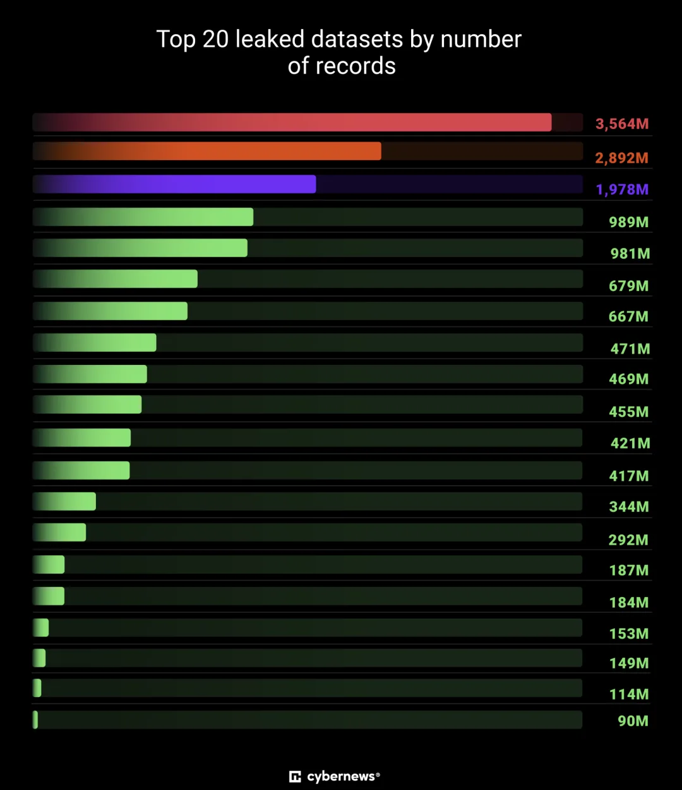

早上起来，老冯的 iPhone 突然提示我的账号被锁定了，要求我修改密码。然后就看到了这篇新闻。于是重新把主流平台的密码都修改了一遍。在这个泄漏已经不算新闻的时代，还是要注意基本的网络卫生，不要被扒光了再追悔莫及。

[深度分析：迪奥数据泄露事件，云配置失当的锅？](/cloud/dior-leak/)

[某平台 CVV 泄露：你的信用卡被盗刷了吗？](/cloud/cvv-leak/)

[Oracle 云大翻车：传 6 百万用户认证数据泄漏](/cloud/oracle-cloud-leak/)

---

> Vilius Petkauskas, Cybernews <https://cybernews.com/security/billions-credentials-exposed-infostealers-data-leak>

## 超过 160 亿条登录凭据被曝光，可能源自各类信息窃取木马

**（infostealer）。** 有时，**无意间**收集并汇总敏感信息的危害，并不亚于黑客主动盗取。Cybernews 研究团队近期在网上发现了多份超巨型数据集，涵盖从社交平台、企业系统，到 VPN、开发者门户等几乎所有常见在线服务的登录信息，可谓“无孔不入”。

自今年年初开始，研究团队持续监控网络安全态势，迄今已发现 **30 份**外泄数据集，单份容量从数千万到 **35 亿**条不等，总量高达 **160 亿**条账号记录——规模之大，令人难以想象。

除了 5 月底 **Wired** 报道的一份包含 1.84 亿记录的“神秘数据库”外，这些数据集此前均无人披露；然而它在本次发现的榜单中甚至排不进前二十。更令人担忧的是，研究人员指出，**“几乎每隔数周就会冒出一份新的超大数据集”，** 足见信息窃取木马的普遍与猖獗。

> **“这不仅是一次泄露，更像是大规模利用的‘作战蓝图’。** 160 亿条登录记录，让不法分子获得前所未有的入侵筹码，可用于账号接管、身份盗用，或极具针对性的钓鱼攻击。更可怕的是，这些数据集的结构完整且更新极快——并非旧漏的回锅，而是可直接武器化的新鲜情报。” ——研究团队

唯一的“好消息”是：这些数据集在公网暴露的时间都很短——足够让研究员发现，却不足以追溯幕后操纵者。多数数据集通过**未加固的 Elasticsearch 或对象存储**短暂公开。

## 这些“百亿级”数据里有什么？

研究团队表示，外泄数据主要由**信息窃取木马日志、撞库字典**及**旧泄露数据再包装**混合而成。虽然难以逐一比对，显然数据间存在大量重叠，因此无法准确估算究竟多少独立账号受影响。

从结构看，绝大多数记录遵循固定格式：**URL → 账号 → 密码**——这正是现代信息窃取木马常用的抓取方式。

16 亿条记录意味着，几乎所有主流在线服务都难逃其“魔爪”：Apple、Facebook、Google、GitHub、Telegram 乃至各国政府服务，应有尽有。

如此规模的凭据泄露，可为**钓鱼、电邮欺诈（BEC）、勒索软件入侵**提供丰厚燃料。若企业缺乏 MFA 或账号卫生意识，这些带有 **Token / Cookie / 元数据** 的新旧日志组合将构成极大威胁。

## 数据集都有哪些？为何而泄？

团队发现的数据集差异巨大：

- **最小**的命名与某木马相同，包含 **1600 万**条记录；
- **最大**的疑似面向葡语用户，达 **35 亿**条；
- **平均**每份超 **5.5 亿**条。

有的命名笼统，如 “logins”“credentials”，难以推断来源；有的则暗示所属服务。例如：

- 一份 **4.55 亿**条的数据库名指向俄罗斯；
- 另一份 **6000 万**条的数据库直接叫 “Telegram”。

命名并非绝对，但可见部分数据指向**云服务、企业内部数据甚至加密文件**；某些名称或许直接对应收集木马的代号。

目前无法确定数据拥有者身份。可能有安全研究员用于监测泄露，但基本可以断定，其中不少属于**网络犯罪团伙**。对黑客而言，**“大而全”的聚合数据库**能够快速放大身份盗用、钓鱼、未授权访问等攻击效果——即便命中率不足 1%，也足以威胁数百万用户的资产安全。

## 用户该怎么办？

由于无法溯源，个人很难对这些外泄数据采取补救措施。但**基本的网络安全卫生**仍是自保关键：

1.**使用强、独一无二且定期更换的密码**；2.**开启多因素认证（MFA）**，即便凭据泄露也能降低风险；3.**检查系统是否感染信息窃取木马**，避免继续“输血”给黑客。

## 大规模数据泄露早已司空见惯

- 上周，Cybernews 报道了可能是 xXXXXX**\**
- 去年夏天，包含 **近 100 亿** 唯一密码的 **RockYou2024** 在黑客论坛公开；而 2021 年也曾出现 **80 亿** 级别的 **RockYou2021**。
- 2024 年初，Cybernews 发现了迄今最大的数据泄露之一——被称为 **“Mother of All Breaches (MOAB)”**，包含惊人的 **260 亿** 条记录。

如今的现实是：**“百亿级”泄露不再是新闻**。对个人与企业而言，唯一可行的策略，就是把**安全意识与防护手段前置**，别等凭据漂浮到暗网黑市才后知后觉。

### References

- `[1]` : <https://cybernews.com/security/billions-credentials-exposed-infostealers-data-leak>
- `[2]` : <https://www.wired.com/story/mysterious-database-logins-governments-social-media/>
- `[3]` : <https://www.yahoo.com/news/16-billion-passwords-apple-facebook-203204594.html>

---

发布版本：[微信公众号](https://mp.weixin.qq.com/s/TiY1pDQQhxY-z_RoDTAoyw)
