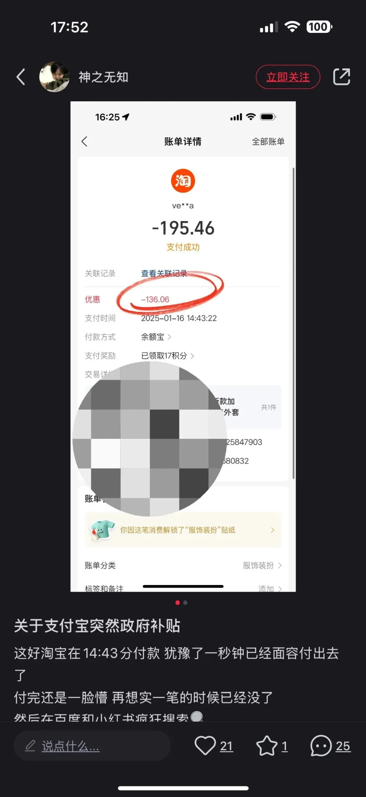
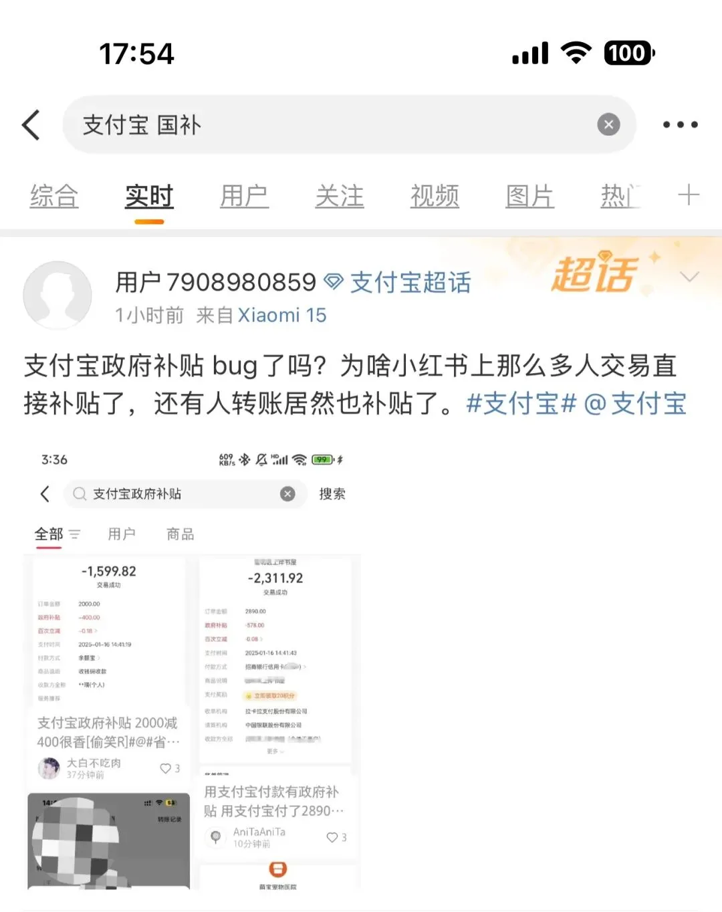
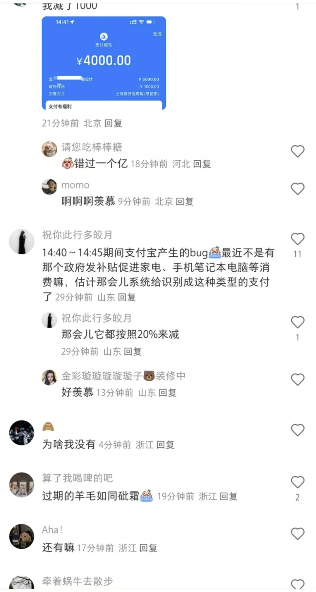
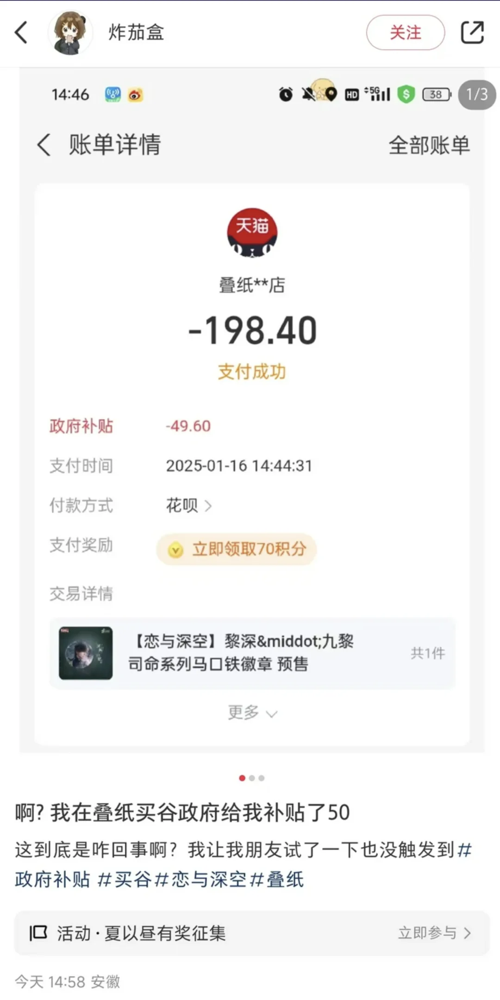
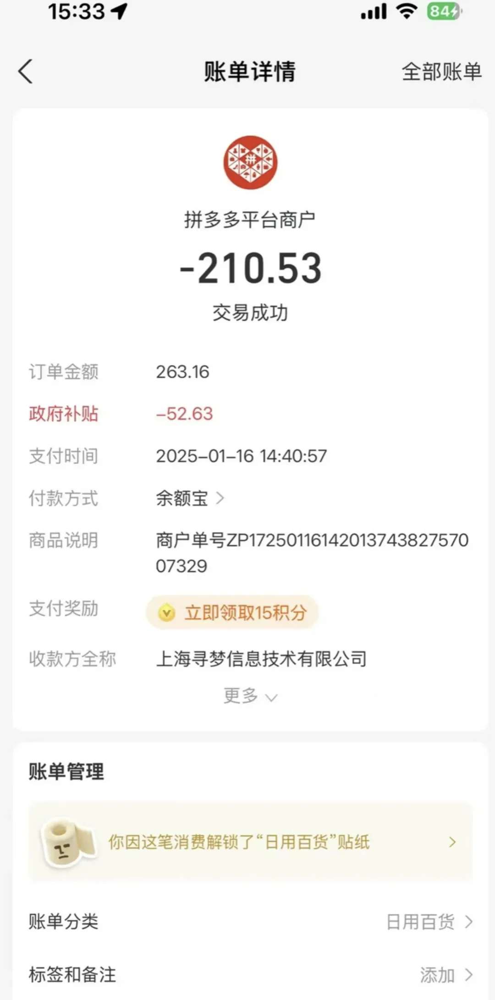
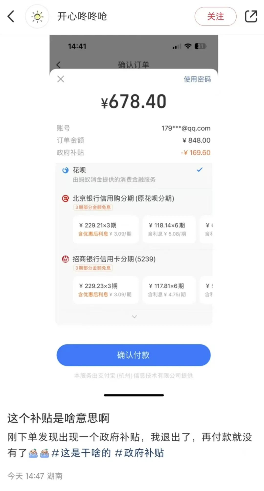
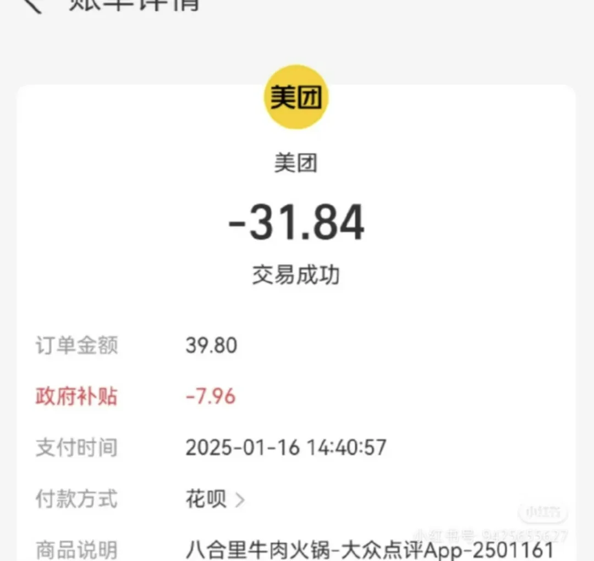
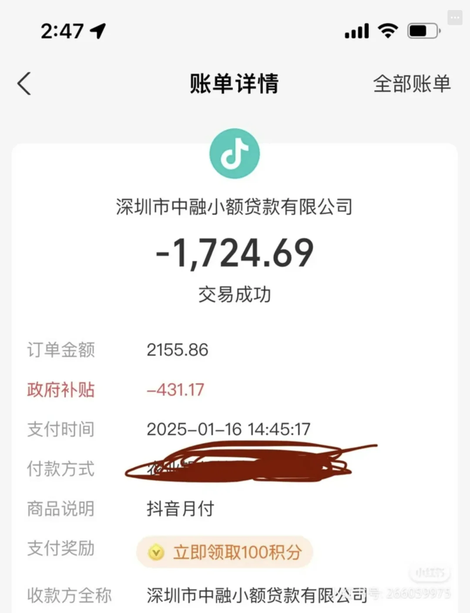
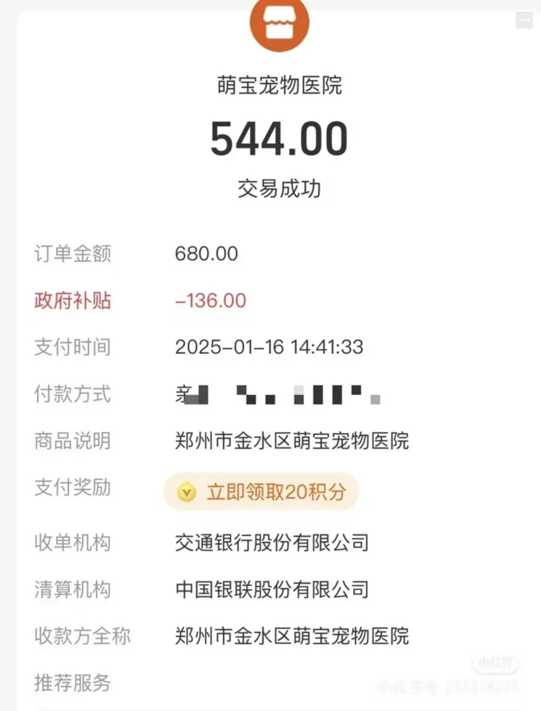

就在刚刚，小红书，微博，V 站上都有多位用户发帖反馈在今天（2025-01-16）下午 14:40 - 14:45 的支付宝订单（甚至包括转账）被 “政府减免” 20%。

V 站原贴链接：<https://www.v2ex.com/t/1105618> （顺带一提，截止至发稿时，这帖子已经被**和谐**了，但以下是截图）

看很多人都在发，只可惜自己没有这么好的运气赶上这波福利呀。**以上均为网友发帖，本号不负责判断与验证真假**。那么这到底是福利？还是史诗级 BUG 呢？

从现象上来看，乱七八糟的交易都有扣减：包括美团吃饭，拼多多买东西，还贷，宠物医院；而且扣减只发生在特定很短的时间段，我的观点是倾向于认为这是个 BUG，错误将不属于国家补贴（家电手机之类的）的交易进行了补贴。当然也不排除天降馅饼的可能性。

如果是 BUG，就是不知道是运营配置错误，还是数据库等基础设施出了什么问题。如果是数据完整性的技术 BUG，那估计蚂蚁的程序员就要糟心了，这看上去更像是一个运营侧的配置错误。

昨天刚出了[江教在线网传删库跑路的瓜](/cloud/jiangxi-drop-db/)，结果今天马上就出来个更大的。走点心吧。

---

发布版本：[微信公众号](https://mp.weixin.qq.com/s/UVBrznTPucNXEHEdPWKvLg)
