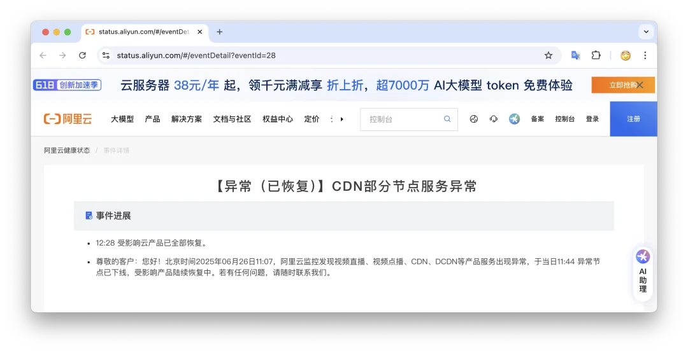
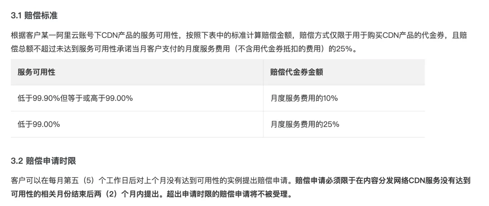
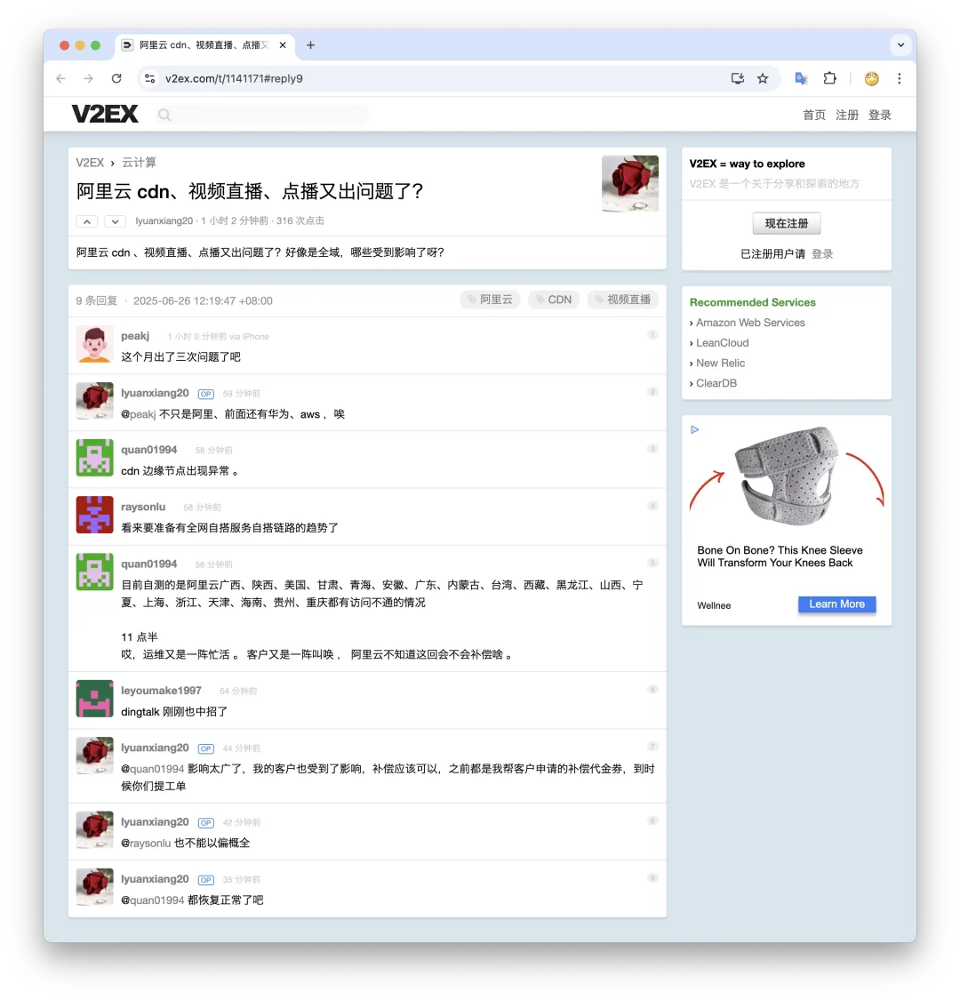
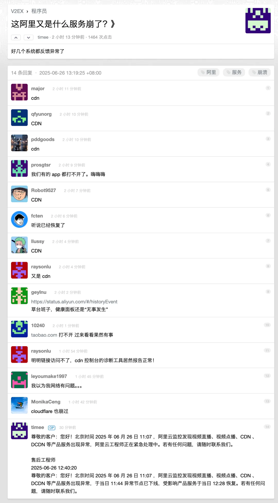
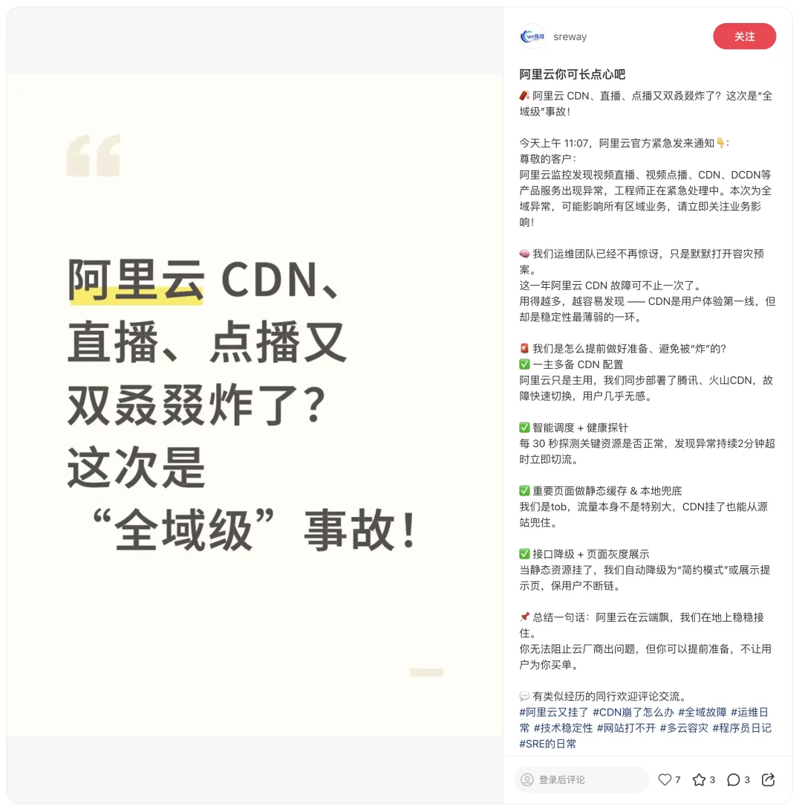
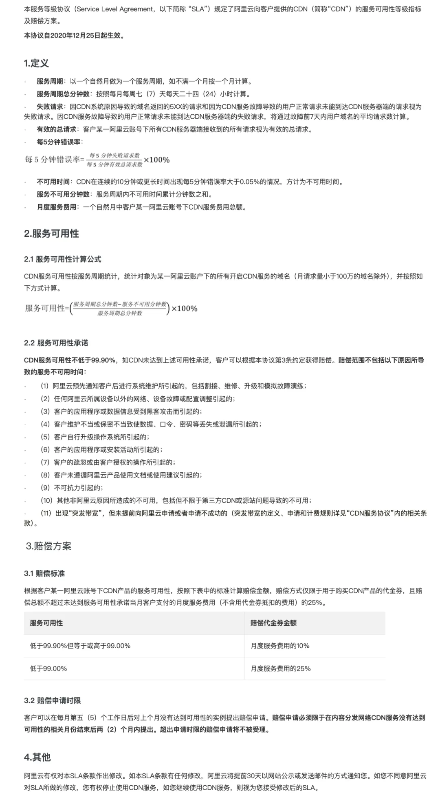

根据阿里云 Status Page 显示：北京时间 2025 年 06 月 26 日 11:07，阿里云监控发现视频直播、视频点播、CDN、DCDN 等产品服务出现异常，于当日 11:44 异常节点已下线，受影响产品陆续恢复中。12:28 受影响云产品已全部恢复。

根据阿里云 CDN SLA <https://help.aliyun.com/zh/cdn/support/alibaba-cloud-cdn-sla> 页面的说明，本次故障持续时间 81 分钟，占月度总时长 43200 的 0.18%，也就是当月 CDN 可用性为 99.8125%，达到 SLA 的第一档赔付额度，应当补偿月度服务费用的 10%。

老冯建议各位受影响的客户千万不要客气，记得及时主张自己的合法权益，申请 SLA 不达标赔付代金券。[10% 月度服务费代金券虽然对云厂商没有什么成本，也可能没有几个钱](/cloud/sla/)，但更重要的是可以清晰表明自己不当冤大头的态度。不仅是这次故障，20 天前的域名拖走大故障也不要忘了申请。

这次事故也在各种微信群，V2EX，甚至是小红书上流传讨论。

上一次 6 月 6 号《[阿里云核心域名被拖走](/cloud/aliyun-domain-seized/)》 导致的大故障才过去 20 天，阿里云又出现了一次大面积的关键服务故障，这实在是让人难绷。

老冯最近和阿里云数据库的朋友们闲聊天，朋友表示，你说俺们阿里云这不好那不好，但我们有一个好，那就是赔得起 —— 老冯倒是丝毫不怀疑这一点。所以这一次 CDN 故障，还有赶上了上次 aliyuncs 域名被拖走大故障的用户，可不要忘了及时向阿里云提出赔偿申请，不必有啥客气和顾虑。

<http://terms.aliyun.com/legal-agreement/terms/suit_bu1_ali_cloud/suit_bu1_ali_cloud201803050950_21147.html>

根据阿里云的 SLA 赔偿申请时限规定，用户应当在下个月第五个工作日后（7 约 7 日？）提出六月份没有达到可用性的赔偿申请，如果超过两个月后，超出申请时限的赔偿申请将不被受理。

[云 SLA 是安慰剂还是厕纸合同？](/cloud/sla/)

[云 SLA 是不是安慰剂？](/cloud/sla/)

 也就是说在下个月，受到影响的用户就可以针对这两起大事故针对阿里云主张代金券赔付了。而要是忘掉了拖两个月，就申请不了了。

---

发布版本：[微信公众号](https://mp.weixin.qq.com/s/Y2PZiH63EAXRKP8gele8NQ)
