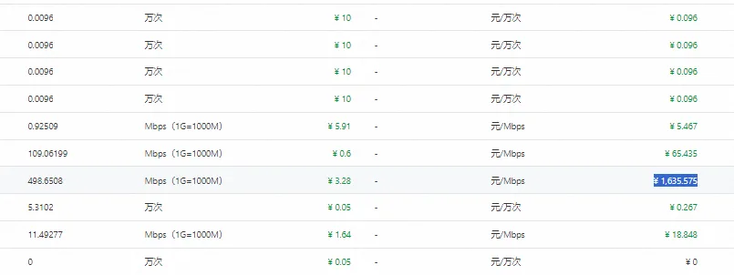
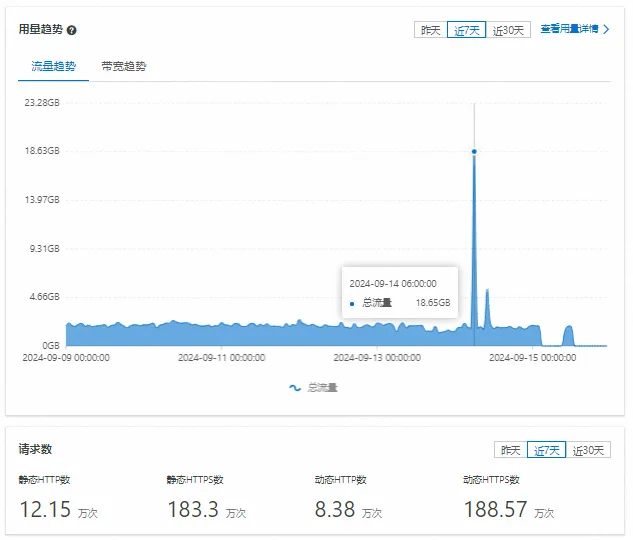
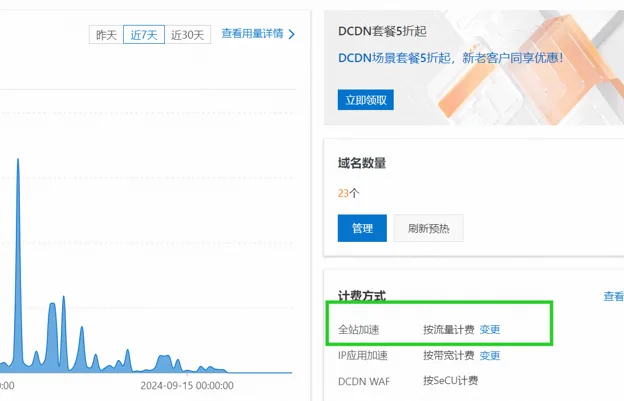
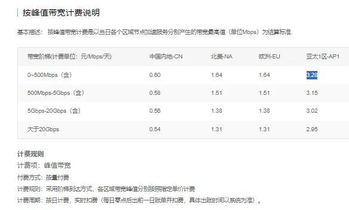
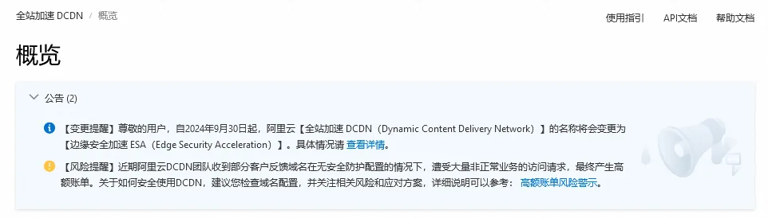

> 原作者：诗语

有的选就不要做互联网，不然某天你一觉睡醒就会发现自己欠了云服务商一套房。

说实话很糟心，大周末又是中秋休假第一天，难得喘口气又被阿里云的短信给烦到不行。只不过这次来的信息影响很大，连续发送了十几条短信和邮件提示我们账户欠费，然后关联的各项业务全部停止运行。

> 这次事件影响到了薇晓朵主服务器和全线业务系统。

凌晨 2 点多收到一条欠费短信，之后就是各项业务逐个停机，由于睡得早，一直到 9 点我醒了查看手机才发现整个平台挂了大半夜。

由于原因不明，也没睡醒，就先充值了费用让业务运行起来。

> 这个时候我是不是应该庆幸说 “还好是周末和休假没什么人访问。”

事实并非如此，这根本就是不应该发生的问题。使用大厂的云服务理由只有一个——省心。省钱你就别想了，但这种情况最近几年变得非常复杂，各种故障频发让人很闹心。

这只是离谱的前序。

在解决了问题，可以正常访问 Weixiaoduo.com 之后，我也清醒了大半，然后开始去翻看扣费账单和阿里云 DCDN 配置，我看到有一项是如下图：

|             |      |
|-------------|------|
| ¥ 1,635.575 | 扣费 |

我仔细回忆了一下这月也没做什么特别的操作，除了上月开启了阿里云配套的 DCDN 安全 WAF 外没有做过别的改动。\

这操作吓得我赶紧把已经配置了 WAF 的几个域名给删掉，因为阿里云有个奇葩的计费标准是按每条规则来分别计费，也就是说我在此时还没反应过来，以为是 WAF 安全流量本身就跑了这么多。

行吧，到这其实这事也就应该结束了。

直到我想起——我早在上两月就对文派公司业务和菲比斯业务做了拆分，不可能存在这么多流量同时消耗，**而且在文派科技的阿里云企业账号里的服务业务也配置了相同的 DCDN 就没出现费用暴涨翻倍的情况。\****\**

排查不出来原因了，就提交了个阿里云工单。那么扯皮正式开始：

> 您好，感谢等待，这边看了下您的日志，这个应该不是盗刷的，是您的域名在对应时间段有一个 ************************\*.log 请求记录，这个文件非常大，164******03 16G 左右，导致您的带宽升高的

我翻看了这个文件发现是一个日志文件，然后去 DCND 控制台也看到了是有个流量异常的点，如下，14 号凌晨 6 点突然流量变成了 18.65GB。

那么紧接着的对话让我感到自己还是太穷了。

> 您好，该请求只有一次的，盗刷的话一般不会只请求一次的 同时，您的网站端应该也是有这个文件的，即使是您这边内部人员自行下载的话也是会产生对应的流量信息的 您可以下载下对应时间段的离线日志，过滤下对应的请求信息，核实下对应的客户端 IP 信息的 大概时间在 14 号的早上 6：55 左右的

到这里我脑袋里的问号就更多了，**一个 16GB 的文件，被下载了一次，阿里云直接扣了我一千多？**（图上没认真核实费用，所以是 1500，实际被全扣是 1600 多）

我也看了阿里云售后工程师给到的截图，意思是说这一个文件的请求触发导致我们站超过阿里云的流量请求峰值 500Mb/s

基本描述：按峰值带宽计费是以当日各个区域节点加速服务分别产生的带宽最高值（单位 Mbps）为结算标准。

那么问题又来了，

> 我可以确定阿里云是因为这一个文件被下载了一次产生的此离谱扣费。

这里就是开始扯皮的焦点，我很不能理解：

> 你们这搞的我越想越不对劲，一个文件 16GB 的文件，谁家用带宽能达到 500M/s 还峰值，下载半分钟不到就扣 1500 多，意思是这要下载 16TB 我早上起来还得欠你们一套房是吧

在这之后我因为是节假日，我能理解还在上班的都是调休过的，没必要为难谁。但我能理解别人，谁理解我呢。让给个确切的回复也不给。

> 你要回答或者解决不了可以找一个能解决的人给我回复。

另外在等待回复的时候，我把我个人的疑问梳理了一遍发过去。

首先大半夜的如果不是夜间值班没人会在凌晨三四点还在线，3:31 手机收到阿里云的 ECS 机器欠费短信，之后接着就是一堆服务的欠费通知；然后停机状态就延续到早上我起来，又是周末又是中秋休假，又是业务全线停摆，我很不爽。但是，但是来了，费用我给阿里结清，业务恢复后再排查了原因无果才找到你们让排查。

我以为是盗刷，那么可能这种情况我还能认，自己安全防范没做到位。有意思的是，你们给我的排查结果是一个单文件被下载了一次然后就超量扣费了 1600 多。这不就来劲了吗，都是做互联网这块的，家用带宽能达到 500M/s 的基本就不可能，即便是我退一步，这文件是被某个机房或者搜索引擎蜘蛛给爬了，32 秒就下载完，然后你们也能扣 1600 多？

更有意思的地方在于我在讲理，你们非要谈计费方式，我又不是没支付，既然在用阿里服务，本身我能认可你们的计费条件，我需要的只是你们给到一个合理的解释和确切的答复，没那么难吧。

这个 16GB 的文件被人用 32 秒 的你们峰值 500M 带宽下载了一次能花 1600 多？如果下次我继续用，被人连续刷一晚上，是不是早上起来就倾家荡产的还得给你们还账户欠款？？？

接下来我收到了阿里云售后的电话，给我解释了对应的问题原因，我这里也复述：

1、因为我们使用的是【按带宽计费模式】所以导致了带宽一旦达到某个值就会自动计费；

2、由于我们站被下载的日志文件是海外请求所以造成了费用如此之高；

3、阿里云系统正常，并没有判断这是异常行为，所以没问题。

到这里我大概明白也就是说，按照阿里的峰值带宽算每天是 1600 多的费用。那行，我们先不管阿里收费标准和计费模式，以及谁能做到下载文件能达到 500Mb/s；

我的疑问依旧有下面几个：

1、我们以实际情况来讲，网站在夜间只有 1 个文件被这么大流量带宽下载。

2、仅 1 个 16GB 文件被 500Mb/s 带宽下载了 1 次，达到阿里带宽峰值，维持时间 32 秒；

3、因为这 32 秒就直接收了全天全量的带宽费用。

对于这种情况是否合理，是否为异常，是否为系统 bug 自行甄别。我实在是不想浪费太多时间在这上面，因为已经毁了我整个周末。

> 任何使用阿里云 DCDN 服务的用户都应该关注这一问题，这不只是我遇到的，你也会遇到，毕竟也不是为我们一家公司服务。

之后我得到的答复是等上班后会看看要怎么处理或者给到赔偿，话都说到这了，除了谢谢，我能说什么？都只是在做客户服务，上班看就上班看吧。

> 这个 16GB 的文件被人用 32 秒 的你们峰值 500M 带宽下载了一次能花 1600 多？

我一直坚持要这个问题给到一个确切的答复原因显而易见，有一次就会有第二次，这些情况只会越来越常见。**要答案的目的是确认是否还能继续用阿里云服务。\****\**

因为我只要还在用阿里云就得时时刻刻注意这种问题的发生？？？这次天降大锅的意外欠费情况导致我们薇晓朵的全部服务无法访问，造成的损失是不大，因为是双休日+节假日+凌晨，但是毁了我整个周末问题就很大。

工作日我会继续跟进阿里的回复结果，也大概明了无非两种情况，一种是确认异常退费，一种是不认不退，退不退其实都无所谓，因为此事件让我更加确信不能将鸡蛋都放在一个篮子里。

这篇文章仅代表我个人观点，你赞不赞同与我关系不大，并且本人对自己的言行 100% 负责。

祝你中秋愉快。

————————————

2024 年 10 月 6 日 补充，目前事情已经处理完毕，阿里给补了张异常扣费同等金额的 CDN 代金券，说实话对他们处理这件事的方式我并不满意，但无一例外的我给了所有工作人员好评，原因就一个，对事不对人。

电话沟通、工单沟通来来回回好几次，我确实心情很糟糕，但也只是就事论事，跟阿里的工作人员进行了技术交流和一些常识性的问题科普，另外就是我再重申一点，既然是在用他们平台的服务，我也就默认是认可平台的计费方式和服务。

沟通的焦点最后锁定到了一点上：我们服务器的带宽是固定带宽所以不存在会有超量和下载 500Mb/s 的可能性，只有一个原因，那就是有人通过源服务器请求命中了这个文件，但是在阿里的 CDN 服务器上没找到对应的缓存文件，所以导致阿里云自己机房里薇晓朵服务器上拉取这个文件数据回源，所以才能达到这么大的带宽流量和请求超标。

沟通来沟通去，我第一时间专门写这篇文章但还是等了快大半个月，今天又是选周末才对所有用户推送目的不是兴师问罪，只是想看看是不是我技术太菜，错怪阿里了。直到事件处理完毕，看到了阿里云在 CDN 后台贴了一条公告，

> 这才发现我没错，这就是你们开发人员各部门没有协调导致的业务逻辑问题。

> 【风险提醒】近期阿里云 DCDN 团队收到部分客户反馈域名在无安全防护配置的情况下，遭受大量非正常业务的访问请求，最终产生高额账单。关于如何安全使用 DCDN，建议您检查域名配置，并关注相关风险和应对方案，详细说明可以参考：高额账单风险警示。

上面也就贴上这条公告信息，另外这次因为是多重休假加夜间断网，对我们实际造成的损失并不大，谁在乎这一千多块钱呢，每次充值进去没几天就烧完了。

我真正争辩的是这个理，以及菲比斯和文派未来的业务是否敢继续使用阿里云 CDN 的问题。现在解决方案给到了，我的态度是会继续用，但也会逐步的分散业务到其他的服务商去，鸡蛋放一个篮子里实在是太危险了。

祝你国庆愉快。

---

发布版本：[微信公众号转载页](https://mp.weixin.qq.com/s/0Wnv1B80Tk4J03X3uAm4Ww)
