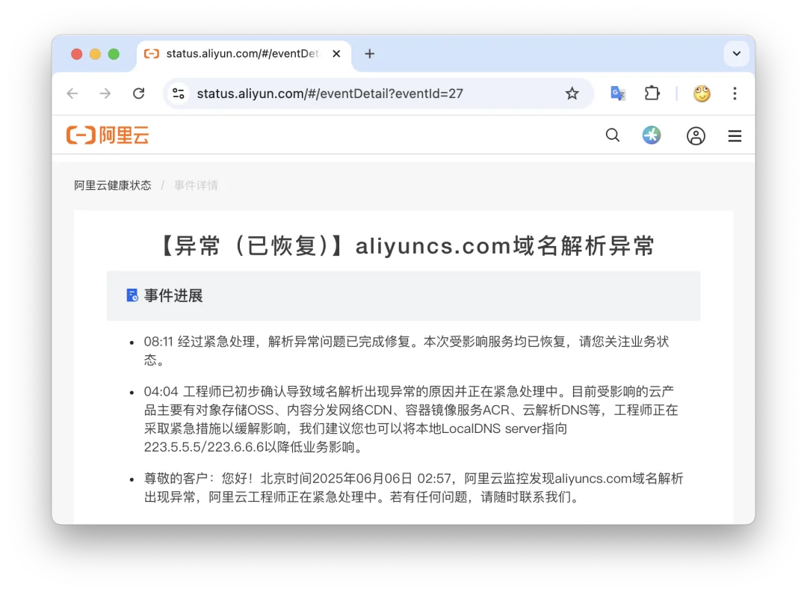
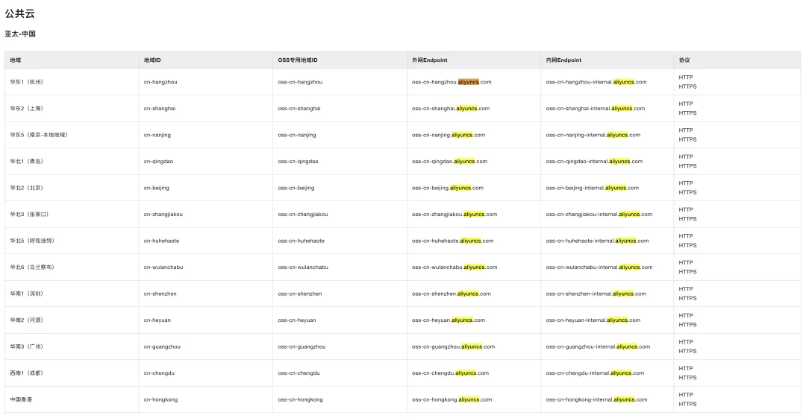
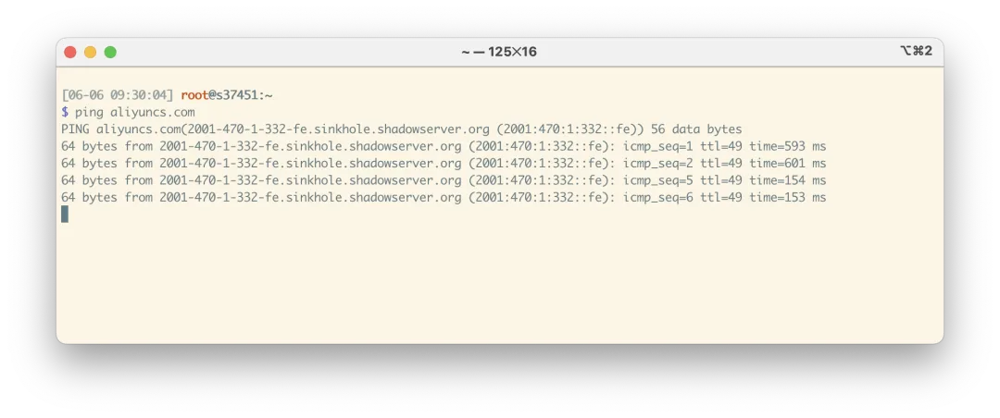
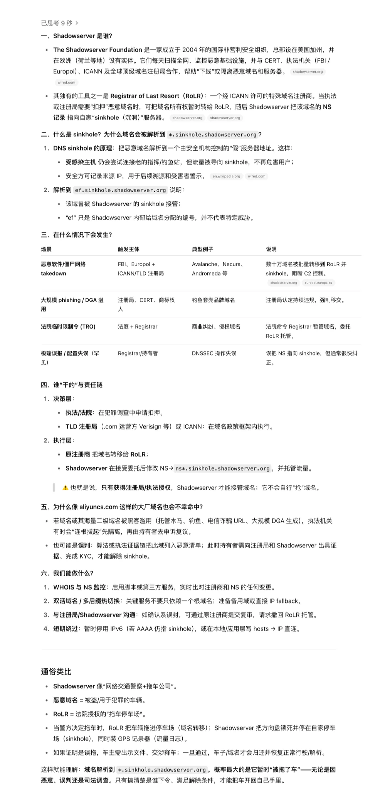

今天早上许多群里出现网站故障的讨论，比如 cnblogs 全国访问一片红，一看原来是阿里云又出故障了。

根据阿里云健康看板状态页，北京时间凌晨 02:57 阿里云发现故障，早上 8:11 分确认解析异常修复。 <https://status.aliyun.com/#/eventDetail?eventId=27>

这次爆炸的是 aliyuncs.com 域名，用过阿里云服务的朋友们都知道，像对象存储这种核心服务使用的域名都是 aliyuncs.com 的子域名。那么域名解析故障的影响范围可想而知。

而且因为有 DNS 缓存的存在，实际上真正影响的时间会更长，也绝非只有这几个小时。例如，截止到本文发出，老冯实测，阿里云在海外的解析依然 “没有恢复”，被解析到 sinkhole.shadowserver.org。可能是因为 DNS 缓存的原因。

有网友在微博上表示这次故障的原因是域名被人拿了，解析到 SS （Shadow Server）。

这里提一嘴，Shadowserver 相当于赛博拖车厂

有客户在 V 站上贴出了止损建议，评论也蛮有意思的。

阿里云大早上来了个惊喜，被客户叼炸了\

<https://v2ex.com/t/1136705#reply12>

总之，这又是一场足以进入云计算故障历史的事件。这些以前看似 ”不可能出现“ 的问题，一次又一次真真切切的发生在大家面前。

老冯对此没有更多评论，这件事本身就已经足够魔幻了

## 云计算泥石流专栏

[阿里云：从上到下烂到根了【去除原文版】](/cloud/aliyun-rotten/)

[硬编码密码泄漏，阿里云的软件工程也太差了](/cloud/aliyun-hardcoded-password/)

[Azure 和 OpenAI 来查水表了](/cloud/azure-openai-audit/)

[深度分析：迪奥数据泄露事件，云配置失当的锅？](/cloud/dior-leak/)

[10 万用户的软件，因腾讯云欠费 2 元灰飞烟灭？](/cloud/tencent-2yuan/)

[AWS 东京可用区故障：影响 13 项服务](/cloud/aws-tokyo-outage/)

[云计算不能做成云算计之一：云行贿必须清理](/cloud/cloud-bribery/) 马工

[CVE 惨遭断奶，美帝自毁安全长城](/misc/cve-funding-cut/)

[Shopify：愚人节真的翻车了](https://mp.weixin.qq.com/s?__biz=MzU5ODAyNTM5Ng==&mid=2247489406&idx=1&sn=f51aea1ea2148f7d281f1bded9de8888&scene=21#wechat_redirect)

[DHH 下云：S3 晚搬一天，就多花四万](/cloud/dhh-s3-migration/)

[Oracle 云大翻车：6 百万用户认证数据泄漏](/cloud/oracle-cloud-leak/)

[今日大瓜：赛博佛祖与赛博菩萨大打出手](/misc/cyber-buddha-fight/)

[花钱买罪受的大冤种：逃离云计算妙瓦底](/cloud/patsy/)

[OpenAI 全球宕机复盘：K8S 循环依赖](/cloud/openai-failure/)

[支付宝崩了？双十一整活王又来了](https://mp.weixin.qq.com/s?__biz=MzU5ODAyNTM5Ng==&mid=2247488632&idx=1&sn=dba2c78f37bb4af2421677e842b57fdd&scene=21#wechat_redirect)

[草台回旋镖：Apple Music 证书过期服务中断](/cloud/apple-music-cert/)

[DHH：下云超预期，能省一个亿](/cloud/odyssey-done/)

[WordPress 社区内战：论共同体划界问题](/cloud/wordpress-drama/)

[记一次阿里云 DCDN 加速仅 32 秒就欠了 1600 的问题处理（扯皮）](/cloud/aliyun-dcdn-bill/) 转

[阿里云：高可用容灾神话的破灭](/cloud/aliyun-ha/)

[阿里云故障预报：本次事故将持续至 20 年后？](/cloud/aliyun-ha/)

[阿里云盘灾难级 BUG：能看别人照片？](/cloud/aliyun-drive-bug/)

[阿里云新加坡可用区 C 故障，网传机房着火](https://mp.weixin.qq.com/s?__biz=MzU5ODAyNTM5Ng==&mid=2247488345&idx=1&sn=684398668bdddc05d4218c42f5a383b0&scene=21#wechat_redirect)

[这次轮到 WPS 崩了](https://mp.weixin.qq.com/s?__biz=MzU5ODAyNTM5Ng==&mid=2247488215&idx=1&sn=34bedcf01169facd0207200b3e018989&scene=21#wechat_redirect)

[草台班子唱大戏，阿里云 RDS 翻车记](/cloud/rds-failure/)

[我们能从网易云音乐故障中学到什么？](/cloud/netease/)

[GitHub 全站故障，又是数据库上翻的车？](/cloud/github-outage/)

[全球 Windows 蓝屏：甲乙双方都是草台班子](/cloud/bsod-friday/)

[阿里云又挂了，这次是光缆被挖断了？](/cloud/aliyun-fiber-cut/)

[性学家，化学家，软件行业里的废话文学家](/misc/nonsense-writers/) 马工

[Ahrefs 不上云，省下四亿美元](/cloud/ahrefs-saving/)

[删库：Google 云爆破了大基金的整个云账户](/cloud/gcp-unisuper/)

[云上黑暗森林：打爆云账单，只需要 S3 桶名](/cloud/s3-scam/)

[赛博菩萨 Cloudflare 圆桌访谈与问答录](/cloud/cf-interview/)

[云计算：菜就是一种原罪](/cloud/cloud-incompetence/)

[taobao.com 证书过期](https://mp.weixin.qq.com/s?__biz=MzU5ODAyNTM5Ng==&mid=2247487367&idx=1&sn=d6e4abd2b2249d27bd8b8146b591b026&scene=21#wechat_redirect)

[腾讯真的走通云原生之路了吗？](/cloud/tencent-cloud-native/) 马工

[我们能从腾讯云故障复盘中学到什么？](/cloud/qcloud/)

[云 SLA 是安慰剂还是厕纸合同？](/cloud/sla/)

[腾讯云：颜面尽失的草台班子](/cloud/tencent-disgrace/)

[【腾讯】云计算史诗级二翻车来了](/cloud/tencent-epic-fail-2/)

[吊打公有云的赛博佛祖 Cloudflare](/cloud/cloudflare/)

[牙膏云？您可别吹捧云厂商了](/cloud/toothpaste-cloud/)

[罗永浩救不了牙膏云](/cloud/luo-live/)

[Redis 不开源是“开源”之耻，更是公有云之耻](/db/redis-oss/)

[公有云厂商卖的云计算到底是什么玩意？](/cloud/what-public-cloud-sells/) 马工

[迷失在阿里云的年轻人](/cloud/lost-youth-at-aliyun/)

[RDS 阉掉了 PostgreSQL 的灵魂](/cloud/rds-castrates-pg/)

[云计算反叛军联盟](/cloud/cloud-rebels/)

[剖析云算力成本，阿里云真的降价了吗？](/cloud/ecs/)

[DBA 会被云淘汰吗？](/cloud/dba-vs-rds/)

[单租户时代：SaaS 范式转移](/cloud/single-tenant-saas/)

[互联网技术大师速成班](/misc/internet-tech-masterclass/) 马工

[门内的国企如何看门外的云厂商](/cloud/state-owned-enterprise-cloud-view/) Leo

[卡在政企客户门口的阿里云](/cloud/aliyun-enterprise-market/) 马工

[云计算泥石流](/cloud/debris/)

[拒绝用复杂度自慰，下云也保稳定运行](/cloud/uptime/)

[扒皮对象存储：从降本到杀猪](/cloud/s3/)

[半年下云省千万：DHH 下云 FAQ 答疑](/cloud/cloud-exit-faq/)

[互联网故障背后的草台班子们](/cloud/amateur-internet-outages/) 马工

[从降本增笑到真的降本增效](/cloud/smile/)

[阿里云周爆：云数据库管控又挂了](/cloud/aliyun-weekly-crash/)

[重新拿回计算机硬件的红利](/cloud/bonus/)

[我们能从阿里云史诗级故障中学到什么](/cloud/aliyun/)

[【阿里】云计算史诗级大翻车来了](/cloud/aliyun/)

[阿里云的羊毛抓紧薅，五千的云服务器三百拿](/cloud/cheap-ecs/)

[云厂商眼中的客户：又穷又闲又缺爱](/cloud/cloud-customers-poor-bored-lonely/) 马工

[是时候放弃云计算了吗？](/cloud/odyssey/)

[云计算泥石流合集 —— 用数据解构公有云](/cloud/debris/)

[下云奥德赛](/cloud/odyssey/)

[FinOps 终点是下云](/cloud/finops/)

[云计算为啥还没挖沙子赚钱？](/cloud/profit/)

[云 SLA 是不是安慰剂？](/cloud/sla/)

[杀猪盘真的降价了吗？](/cloud/ebs/)

[公有云是不是杀猪盘？](/cloud/ebs/)

[垃圾腾讯云 CDN：从入门到放弃](/cloud/cdn/)

[驳《再论为什么你不应该招 DBA》](/cloud/no-dba-bullshit/)

[范式转移：从云到本地优先](/cloud/paradigm/)

[云数据库是不是杀猪盘](/cloud/rds/)

[你怎么还在招聘 DBA?](/cloud/no-more-dba/) 马工

[云数据库是不是智商税](/cloud/rds/)

[云 RDS：从删库到跑路](/cloud/drop-rds/)

### References

- `[1]` : <https://status.aliyun.com/#/eventDetail?eventId=27>

---

发布版本：[微信公众号](https://mp.weixin.qq.com/s/l1b-eq06NyuN61cqZoYJjA)
