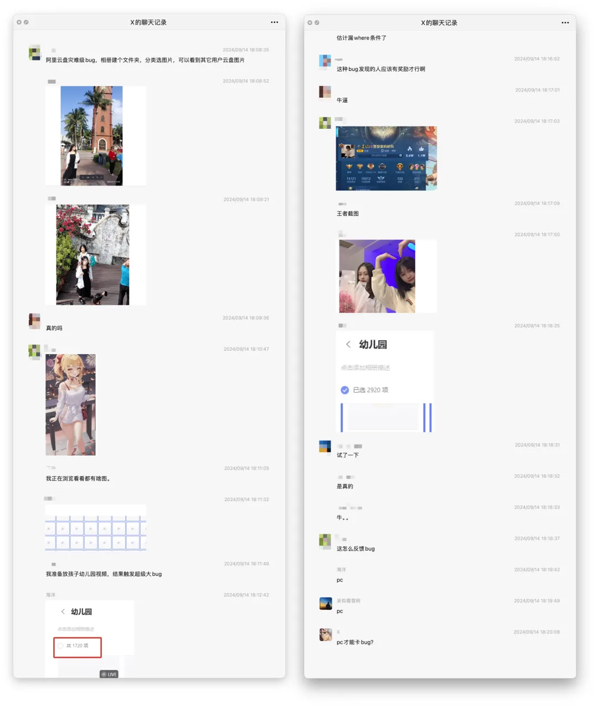
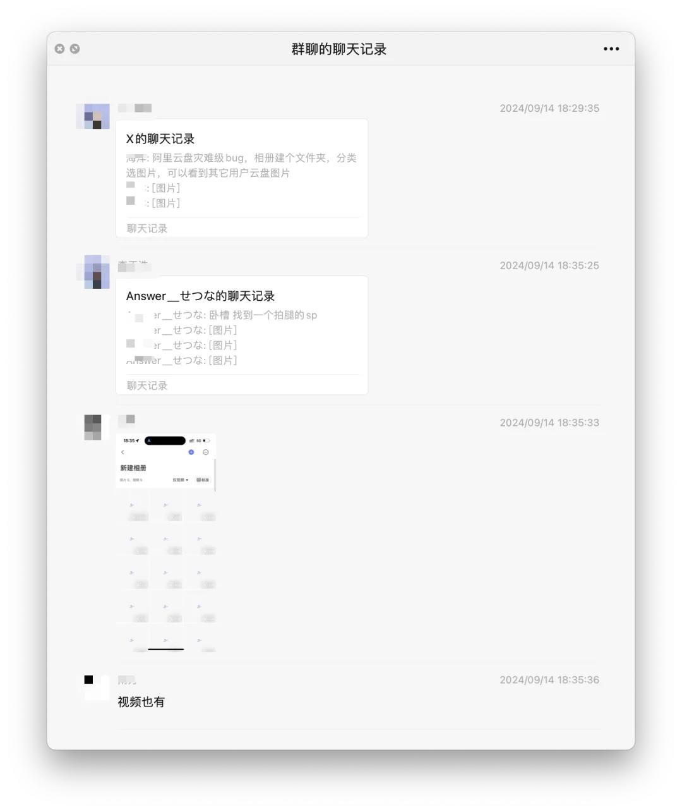
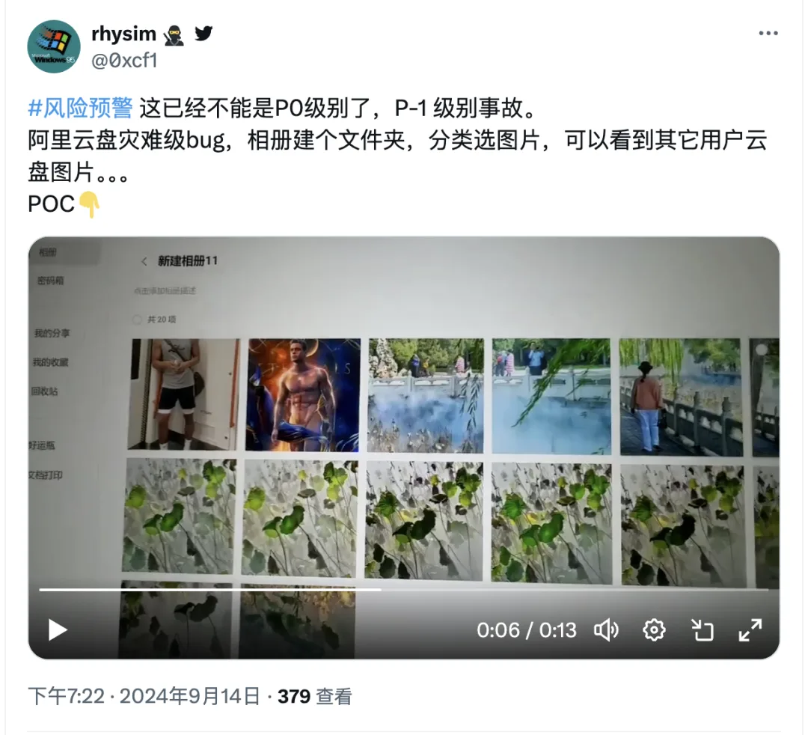

据网络消息，阿里云盘曝出史诗级 BUG，可以看到其他用户云盘图片。目前流传的聊天记录显示：在阿里云盘相册中新建个文件夹，分类选择图片，就可以看到其他用户云盘图片。复现视频见 B 站连接：

根据聊天记录来看，要用 PC 客户端才能卡 BUG。笔者用 Mac 客户端暂时无法复现，不过有群友表示复现成功，也有群友表示人已经反馈略缩图已经紧急屏蔽了。

数据安全上的问题通常优先级远远高于数据可用性。我不知道目前这个 Bug 修复没有，如果没有修复，最明智的做法应该是赶紧把服务停掉。例如，瑞典互联网金融服务公司 Klarna 也曾经遇到过类似的 BUG （缓存错误导致数据安全问题），它们立即停止了服务避免进一步泄漏，但目前阿里云盘仍然可以访问。

阿里最近有点儿水逆，9 月 10 号阿里云新加坡机房火灾淋水故障，到现在已经 105 个小时了，还没有完全修复，月可用性已经下降到 85%，年可用性指标已经下降到 98.8%，再次刷新记录。一波未平，一波又起，让人嗟叹。

这次事故利好群晖与 NAS 厂商 —— 并再次告诉我们一个硬道理，数据一定要在自己手里，放在别人 —— 特别是云服务上迟早要出事。云盘留着当个电影下载站还不错，拿来放个人隐私数据还是算了吧。

[云计算泥石流](/cloud/debris/)曾几何时，“上云“近乎成为技术圈的政治正确，整整一代应用开发者的视野被云遮蔽。就让我们用实打实的数据分析与亲身经历，讲清楚公有云租赁模式的价值与陷阱 —— 在这个降本增效的时代中，供您借鉴与参考。点一个关注 ⭐️，精彩不迷路搜索 **pigsty-cc**，加入微信讨论群组

---

发布版本：[微信公众号](https://mp.weixin.qq.com/s/C7XGgGmzvMjKJGbBGVmrzw)
