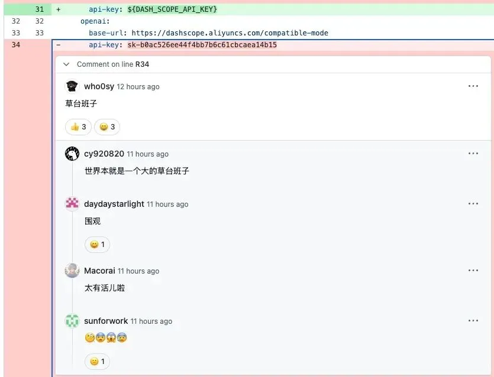
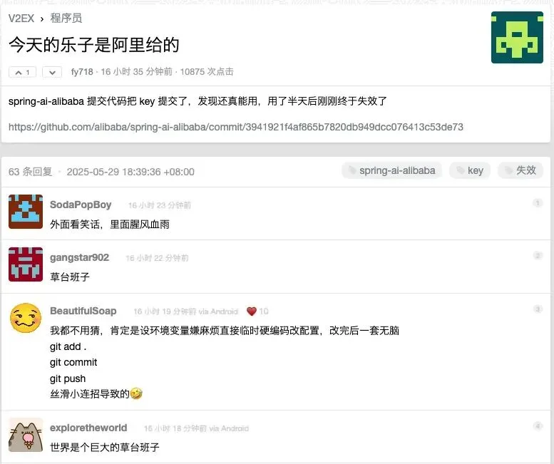
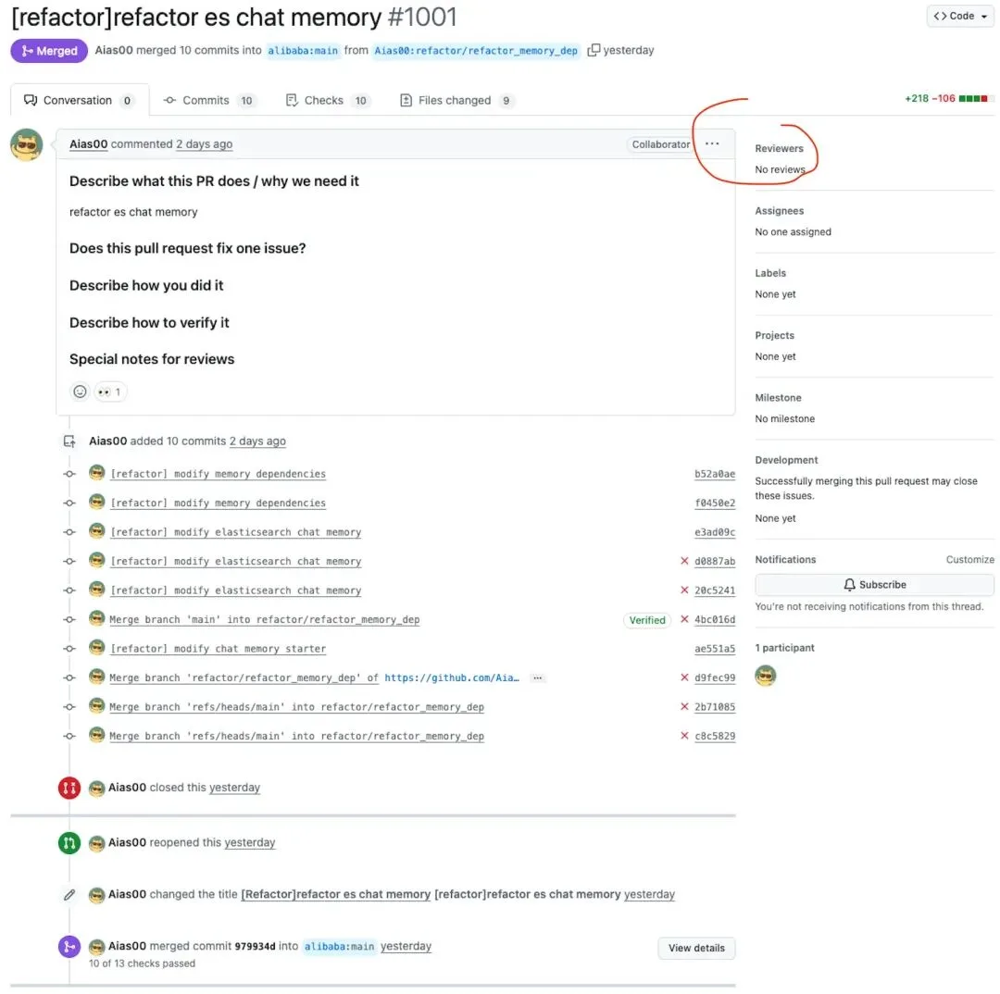
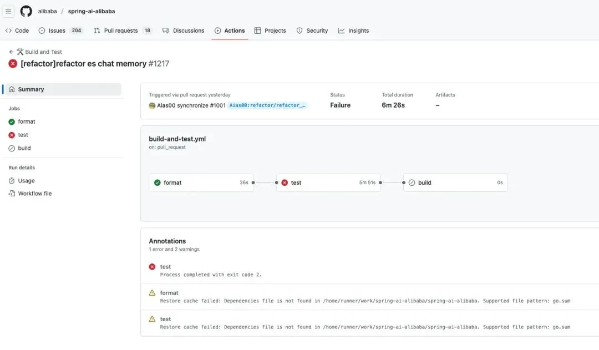
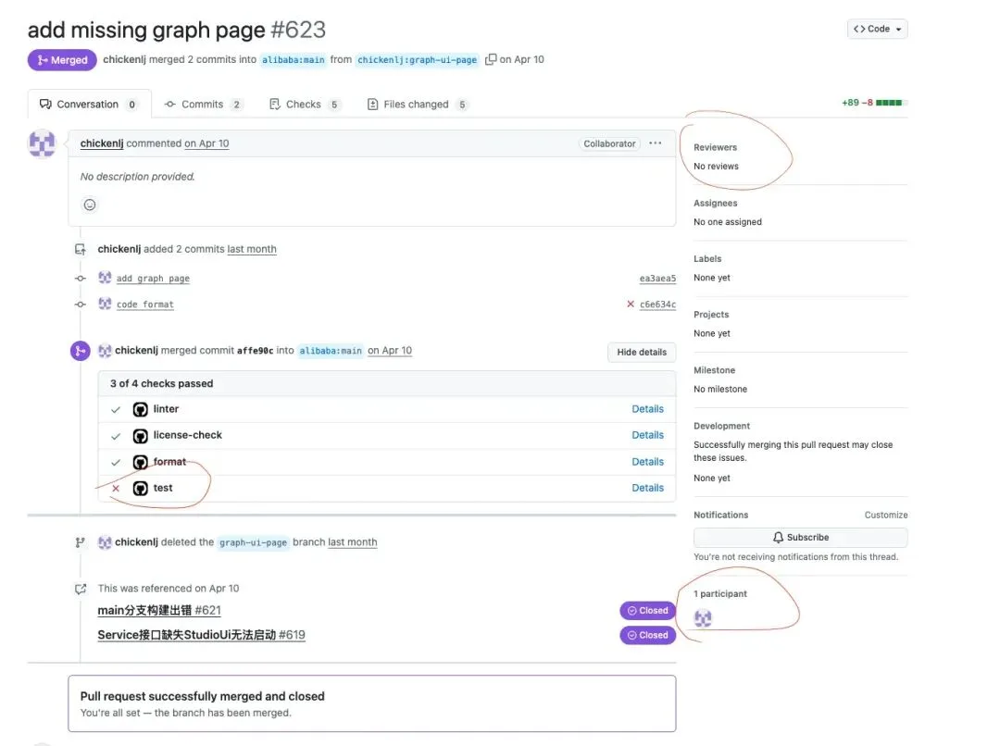

> 原作者：瑞典马工

昨天，阿里 Alibaba AI Spring 项目的一个开发者把自己的阿里百炼·灵积平台的 API Key 硬编码进去，并且提交到 github 上。

不出所料，**开发者社区又群嘲了一把阿里云[1]**。

**阿里云员工第一时间澄清[2]**：

> **chickenlj[3]**
>
> 大家好，我是 Spring AI Alibaba PMC 成员。
>
> 首先，非常感谢大家对我们项目的关注和善意提醒，这次确实是我们在开源流程中的一次疏忽。还好发现得及时，没有给 Aias00 造成实际的财务损失。
>
> Aias00 作为 spring-ai-alibaba 的重要协作者之一，为开源社区做出了很大的贡献，在这里也感谢 Aias00 和其他贡献者对开源社区的支持。
>
> 我本人作为一名长期贡献开源的普通人，过去也犯过类似错误，处理的时候实际上挺慌张的，感谢各位的理解，我们非常珍视每一个为开源社区付出的贡献者的努力。
>
> 大家关于项目流程的建议都非常好。理论上，GitHub 的 Secret Scanning 应该能检测到类似问题，但这次没有生效，我们会进一步排查原因。
>
> 接下来，项目 PMC 成员们会一起商量如何强化此类流程检查，规范项目协作，防止类似事情再次发生。
>
> 也欢迎大家多多使用 spring-ai-alibaba 以及阿里的其他开源产品，提出宝贵意见。如果能参与代码贡献就更好了：）

**作者也出来做了个检讨[4]**：

> 大家好，我就是 这帖子里提到的，spring-ai-alibaba 社区的一个外部贡献者，这个 PR 是我提交的，过程检查的时候没有特别仔细就给提交了。[流汗]  这次提交用的 key 是我自己账号申请的免费测试 key。昨天晚上处理问题的时候，检查得不够仔细，才导致出现了这次的问题。今天上午发现后，我第一时间让 key 失效，并且还原了相关代码重新提交。其实也是社区其他贡献者把帖子转给我，我才知道大家已经在讨论这件事了。说实话，这种情况我也是第一次遇到，处理方式可能不是最完美的，也希望大家能理解。

两个公告的中心意思是一致的，重点强调作者不是阿里云员工，而是一个外部贡献者，把阿里云和这种低级错误撇清关系。

但是众所周知，硬编码密码是阿里的顽疾。两年前，我的一篇文章**[《](/db/db-in-k8s/) · [阿里云怎么教坏 ChatGPT 写危险代码的](/db/db-in-k8s/) · [》](/db/db-in-k8s/)**就指出过这个不良文化。阿里云不仅自己硬编码密码，而且把这种坏习惯写到范例代码里，误导行业年轻人。

他们当时的代码是这样的，非常的不安全。

    def main():     access_key_id ="你的阿里云AccessKey ID"     access_key_secret = "你的阿里云AccessKey Secret"     client = AcsClient(access_key_id, access_key_secret, "cn-hangzhou")

大多数没有经过严格职业训练的从业者，都会出于人之常情，不愿意遵循安全规范。建筑施工队老师傅会理直气壮的说：“我干这行十几年了，从来不戴安全帽，也没有出过事。” 软件施工队老师傅也会理直气壮的说：“我写了几百万行 Java，都是硬编码，从来没出过事。”

工程学就是要和从业者的惰性作斗争，用各种手段提高不规范行为的员工成本，同时用各种工具降低规范行为的员工成本，驱使员工都选择规范行为。

一个规范的建筑工程团队，不会容忍员工在工地上不戴安全帽，一个规范的软件工程团队，也不应该容忍员工硬编码密码。

后来，阿里云逐步把他们的不良代码都修改了，现在看起来规范多了

    config = open_api_models.Config(     # 必填，请确保代码运行环境设置了环境变量 ALIBABA_CLOUD_ACCESS_KEY_ID。,     access_key_id=os.environ['ALIBABA_CLOUD_ACCESS_KEY_ID'],     # 必填，请确保代码运行环境设置了环境变量 ALIBABA_CLOUD_ACCESS_KEY_SECRET。,     access_key_secret=os.environ['ALIBABA_CLOUD_ACCESS_KEY_SECRET'] )

可惜的是，看上去，阿里云的安全整改只限于范例代码。上述 PMC 刻意提到

> 理论上，GitHub 的 Secret Scanning 应该能检测到类似问题，但这次没有生效，我们会进一步排查原因。

如果这种基本安全只依赖于 GitHub 的免费检查，那么不使用 GitHub 的阿里云内部代码怎么办？全靠自觉吗？

实际上，这个风波里还暴露出一个更为严重的质量控制漏洞：这个外部贡献者的代码合并请求，没有经过其他人审核，是他自己合并的。

现代风险管理学中，有一个四眼原则（4 eyes principle）：可能带来风险的动作，在发起人发起之后，还需要一个同样资历的同事予以审核，才能实施。在一个正规的医院，手术前后，器械护士会和另外一个护士清点所有的器械，并且两人共同签名。在会计行业，一份报表需要双人会签才能发布。

GitHub 流行的代码合并请求，也是这种四眼原则的一个应用：一个代码撰写者提交代码合并请求（Pull Request），另外一个代码审核者予以审核和批准（Review and Approve）。绝大多数项目禁止代码撰写者直接推送其修改。

然而，阿里云的 Alibaba AI Spring 项目，允许同一个人合并他自己的代码合并请求，相当于让器械护士自己检查自己的清点，让一个会计在一份报告上把自己的名字签两遍。看起来动作都做了，实际上，彻底绕过了四眼原则的风险控制，架空了流程最开始的质量控制目标。

这个惹出麻烦的 **1001 代码合并请求[5]**，没有提 Issue，Commit message 乱七八糟的，没有人审阅，作者自己就合并了。

为了保证质量，这个项目有不少单元测试用例，并且设置为 PR 提交时自动触发。问题是，在这个合并请求中，**测试是失败的[6]**，作者也不管不顾合并了！

这并不是该位外部贡献者的个人坏习惯，阿里云员工也是一样的乱来。**代码合并请求 623[7]**全程只有一个人参与，没有审阅，测试用例失败，一样合并了。

总而言之，看起来阿里云员工并没有建立起良好的工程习惯，也不太会使用现代工程工具。有时候跟着社区搭建了一些不错的流程，但是自己又不遵守。出来搞开源，欢迎外部贡献者，但是没有能力，甚至没有意识，去控制质量。

被大家盯着的外部项目已经这么随意了，内部项目的质量控制会松散到什么程度，可想而知。这么多年，阿里云一直无法突破金融业客户的门槛，跟这种差劲的软件工程质量控制，恐怕有不少关系。

就在我写作的同时，阿里云员工正在半夜加班修补项目流程。这个**半夜十二点提交的代码合并请求[8]**，已经开始着手解决密码泄漏问题了。这是一个很有趣的现象。过去这几年，开发者社区通过骂阿里云给阿里云带来的质量提升，可能比他们的高管驱动的质量提升，还要有效。

## 参考资料

[1]

开发者社区又群嘲了一把阿里云： *<https://www.v2ex.com/t/1135099>*

[2]

阿里云员工第一时间澄清： *<https://github.com/alibaba/spring-ai-alibaba/commit/3941921f4af865b7820db949dcc076413c53de73#commitcomment-158328386>*

[3]

chickenlj: *<https://github.com/chickenlj>*

[4]

作者也出来做了个检讨： *<https://github.com/alibaba/spring-ai-alibaba/commit/3941921f4af865b7820db949dcc076413c53de73#commitcomment-158328386>*

[5]

1001 代码合并请求： *<https://github.com/alibaba/spring-ai-alibaba/pull/1001>*

[6]

测试是失败的（原 CI 运行记录已过期）。

[7]

代码合并请求 623: *<https://github.com/alibaba/spring-ai-alibaba/pull/623>*

[8]

半夜十二点提交的代码合并请求： *<https://github.com/alibaba/spring-ai-alibaba/pull/1032/files#diff-40d099b4e3a5aa61a0ec4acb9b9841e5d857a0ee1d9290aec2e7bec8f1f8093d>*

---

发布版本：[微信公众号转载页](https://mp.weixin.qq.com/s/43pIBxYvsszeBZGk7LU7_w)
