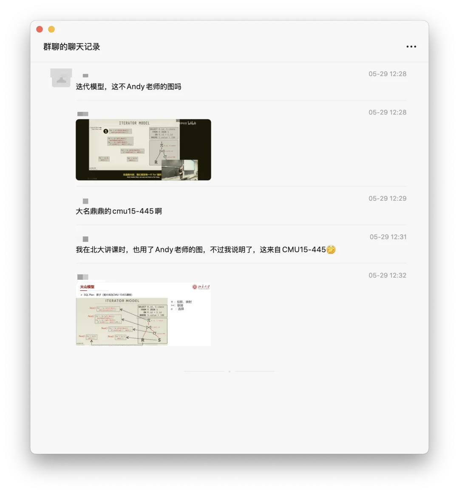
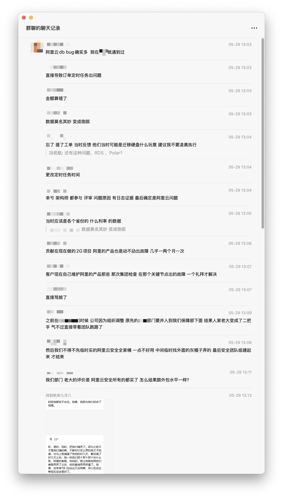
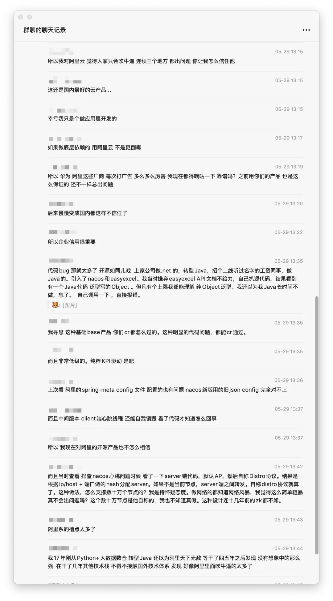
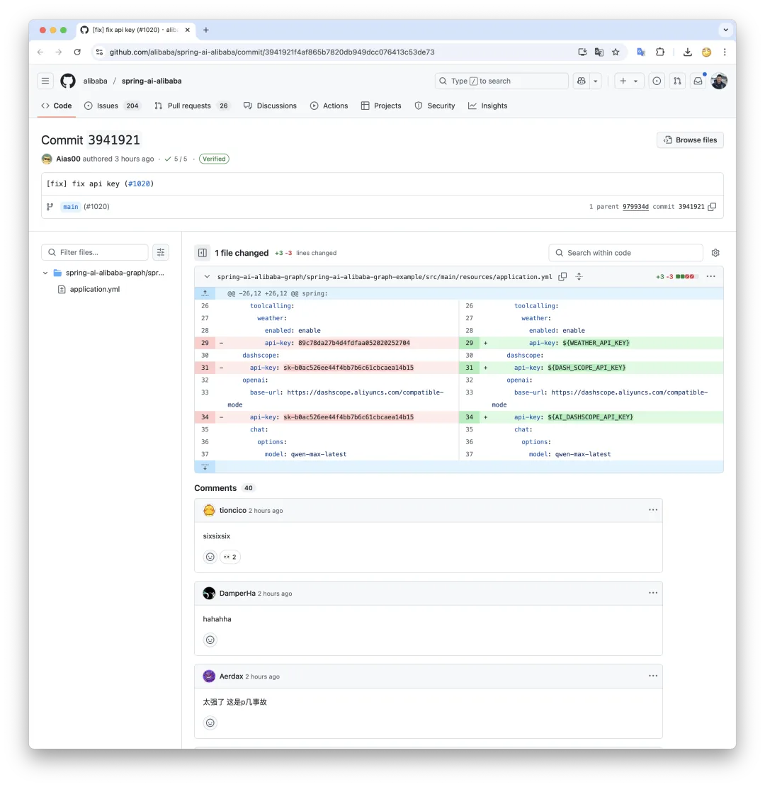

最近老冯的一位群友在阿里云数据库上遇到了糟心事儿，气的写了篇文章怒斥阿里云，让我帮忙转发下。我看了下，嗨，这是阿里云常规表现嘛。我觉得他对阿里云有一些不切实际的期待，期待落空之后落差太过明显。阿里云搞数据库的很多都是老冯的熟人，所以我已经很久没有对他们开炮了（更可能是比较无聊了）。但用户怒斥阿里云这种节目，老冯还是喜闻乐见的，受邀转发，不嫌事大。顺便点评一下，附上群友精彩评论。\
原文：[阿里云：从上到下烂到根了](https://mp.weixin.qq.com/s?__biz=MzI1MjM1Mjg5Mw==&mid=2247485084&idx=1&sn=e258500798541a497558a1ad842425fa&scene=21#wechat_redirect) （已无）

但可惜的是，原作者受到各种压力被删除了，并请求老冯也一并删除。引用作者来了，老冯也没有办法，不删侵权的不就成我啦？所以今天呢，去掉引用的原文再发一遍。\

---

老冯评论\
老实说，司马辽太杰提出的这几个问题放在阿里云上只能算 “小问题”。比如书里的这个图错了，嗨这算啥，有群友就表示，这图看着真眼熟：

老冯之前做阿里云 RDS PolarDB 监控适配的时候弄了套数据库测试了下，花了一个小时整完，发现了十多个缺陷，然后挑了几个提给他们。这还只是随便看看，深挖不知道坑还有多少。一位金融行业的群友看到这条消息，也吐槽到还有更离谱的问题呢。经过群友的同意，也在此发出。

当然，最好玩的当属今日份的乐子，spring-ai-alibaba 提交代码把 key 提交了，V 友发现还真能用，用了半天后刚刚终于失效了。\

AI 服务 密钥就这么大喇喇的提交上来了，然后还提了个 Commit 清理……。瑞典马工对此还有专文评论《[硬编码密码泄漏，阿里云的软件工程也太差了](/cloud/aliyun-hardcoded-password/)》

老冯做 PG 数据库发行版有好几年了，已经帮助不少客户从阿里云上搬下来了，有很多人问老冯，都是做数据库发行版，我为啥要用你的 Pigsty 自建[而不用阿里云 RDS](/cloud/rds-failure/) 或 PolarDB？我一般都笑笑建议先去实际用用 RDS 试试再来找俺，这样就不会有十万个为什么了。

---

发布版本：[微信公众号](https://mp.weixin.qq.com/s/0pT7wb0Y6ohgvEltED93hA)
