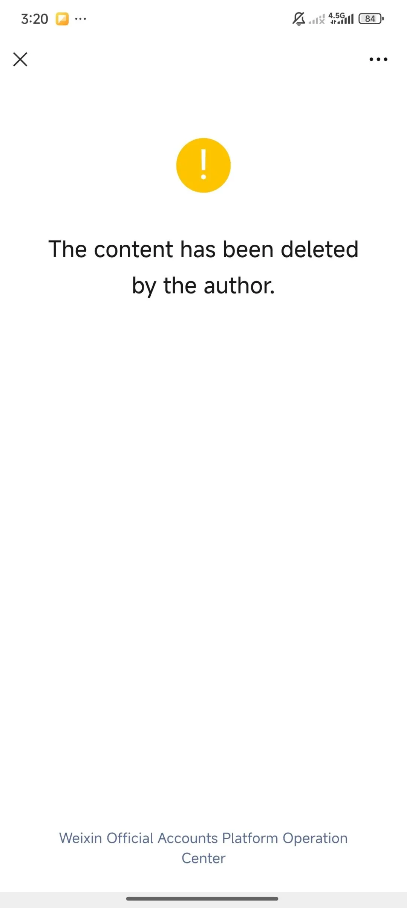
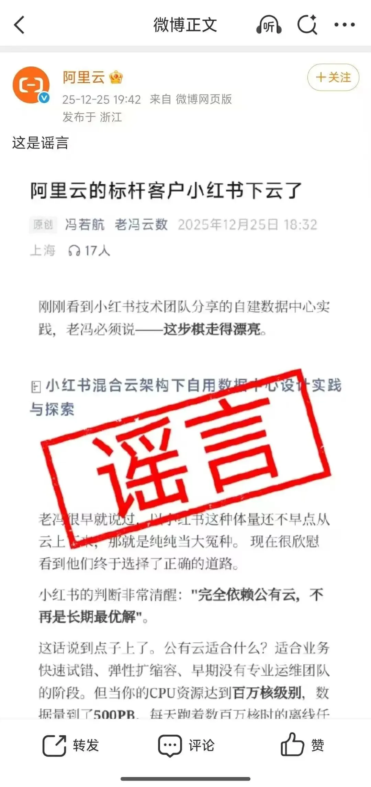
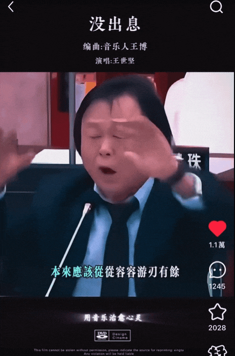

> 原作者：瑞典马工

90 年代湖南的乡村小学是很江湖的地方，每天都在霸凌和反霸凌。有些小朋友被别人欺负的时候，他的姐姐会拉着弟弟说“走，我们告老师去”，弟弟一定会挣脱姐姐的手，打死也不去，因为他知道，一旦走上了这条不归路，他会被同学打上“和姐姐一起告老师的软蛋”标签，永久性的。小朋友唯一的选择就是骂回去，用实力证明自己。

我的朋友冯若航写了一篇《阿里云的标杆客户小红书下云了》，他认为自己是实话实说，因为他的信息来源是小红书自己发布的《[小红书混合云架构下自用数据中心设计实践与探索](https://mp.weixin.qq.com/s?__biz=Mzg4OTc2MzczNg==&mid=2247494247&idx=1&sn=1316aaac5d8acf30b8d2681bb5c6ac94&scene=21#wechat_redirect)》。但是阿里云认为这是霸凌，选择了和自己的公关部姐姐去告老师。

公关部姐姐举报了文章，让小龙老师把小冯嘴巴缝起来。

这是很没出息的举动。小冯只是一个数据库个体户，经营一个开源的 postgresql 发行版，是云计算领域的小不点。阿里云有好几万员工，年营业额将近一千亿，是云计算行业亚洲最大的大个子。两个人有不同观点，为什么阿里云要牵着姐姐的手去告老师？为什么阿里云不能理直气壮的和小冯辩论？为什么不用详实的数字，鲜明的案例，逻辑严明的理论证明小红书和小冯都错了？

更有趣的是，小冯第二天又用更详实的数据再次论证了自己的主张，发了一篇

[小红书究竟有没有下云？](/cloud/rednote-cloud-exit/)

这次小龙老师都不好意思捂嘴了，文章至今还可以访问。也就是说，大个子告老师，失败了。\

多年以前，阿里云自称 3A 云之一，AWS/Azure/Aliyun，把谷歌云都不放在眼里，更没看得上华为云腾讯云。想不到几年过去，这个世界 3A 云中的一 A，碰到云计算个体户冯若航挑战，不敢正面迎战，只能牵着公关部姐姐的手去小龙老师那里告状。告状又没有确实的证据，第二天就被小冯再扇了一巴掌。令人不禁扼腕叹息。

从技术角度讲，小红书的那个下云决策有很多漏洞

1.以 AI 为引子，说云不能满足智能计算的需求，但是并没有论证自建数据中心就能满足。最简单的，都没有说怎么买到 GPU。

2.谈到了对 TCO 敏感，但是并没有论证自建数据中心的 TCO。

3.决策过程没有看到业务部门开发团队的视角，尽管开发团队才是云的真正用户，也是上云/下云最大的利益相关方。

4.对基础软件理解落后十五年。比如还在用单服务器的 HDD 满足应用的日志存储需求，而不考虑用硬件支撑对象存储，再由对象存储支撑应用。

5.自建从发电到机房监控系统的各种组件，引入大量的不确定性和工程风险。

6.对数据安全，数据合规和可审计性缺乏重视。

就连冯若航也比小红书运维部门看得更远更深。他指出阿里云的大数据服务，是很难迁移到自建大数据平台的。

阿里云解决方案团队如果有实力，完全可以组织一批专家，从供应链安全，研发效率，高阶服务，可用性，TCO 各个侧面论证上云的优势。

小红书还有一个在中国比较不寻常的需求：提高绿电占比。这个需求可能和他们的国际化拓展有关。如果阿里云对此加以严肃的讨论，也可以促进自己在 Sustainability 的进步，甚至引领整个中国云计算行业的进步。

很可惜，这一切都没有发生。一个本来对甲方和乙方都很有价值，可以塑造行业方向的讨论，还没开始，就被打断了。这都是因为阿里云解决方案团队太软蛋，只愿意躲在公关大姐姐背后，而不敢站出来用实力捍卫自己的荣誉。

马工两年前写过一篇文章

[卡在政企客户门口的阿里云](/cloud/aliyun-enterprise-market/)，指出阿里云的一个严重缺陷就是没有人能清晰的，令人信服的论证云计算的价值主张，只有一些不成系统的碎碎念。两年后的今年，情况并没有变得更好。

这种领导者能力的缺陷，对于行业跟随者来说，并不关键。但是现在亚马逊云几乎放弃中国市场的用户教育，阿里云如果不能接棒，行业就没有领导者，行业认知停滞在“云计算=虚拟机大池子”的阶段。甲方不想着怎么利用云计算提升自己产品团队的研发效率，不想着怎么跟随云计算最佳实践提升安全性（请看快手的悲剧），不想着组合云服务践行 DevOps，每天就脚踏三只船让供应商打骨折。乙方大打价格战，互相挖客户，派自己的工程师去给客户打杂跑腿，陷入到大家都不乐意但是又集体选择的内卷游戏。\

阿里云解决方案团队，be a man，不要躲在公关部大姐姐的背后了，站出来捍卫你们的职业荣誉，填补 AWS 留下的领导者空位。

---

发布版本：[微信公众号转载页](https://mp.weixin.qq.com/s/UXwNjcTgS1yESWbxXuxQUg)
