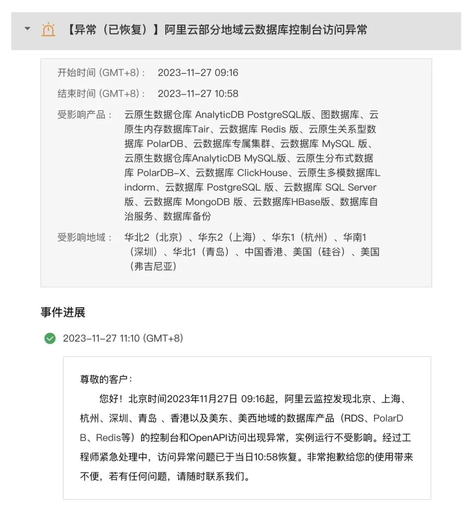

## 阿里云 [11. 12 大故障两周](/cloud/aliyun/) 过去，还没有看到官方的详细**[复盘报告](/cloud/aliyun/)**，结果又来了一场大故障：中美 7 个区域的数据库管控挂了近**两个小时**。

当然与上次 Auth 故障类似，因为数据库这种 IaaS 资源类服务不会因为管控挂了就不能用了 —— 你确实无法通过 API 与控制台对数据库进行管理与变更，但是数据库本身是活着的，也可以正常使用访问。

这一次和 11.12 故障属于让官方发全站公告的显著故障，没记错的话，11 月份还有两次较小规模的局部故障。这种故障频率即使是对于草台班子来说也有些过份了。某种意义上说，**阿里云这种周爆频率可以凭一己之力，毁掉用户对公有云云厂商的**托管服务**的信心：**只是单纯使用纯资源的 ECS / RDS，不会因为管控挂了就不能用了。而那些听信云厂商布道师宣传，深度使用 IAM，托管服务，用云管控 API 凌空杂耍弹性创建销毁资源的用户，遇到管控面挂了那就真抓瞎了。

更进一步说，作为云服务的核心 —— 管控服务如果是这个稳定性水平，那么高价值客户为什么要 [花十几倍到上百倍的资源溢价](/cloud/rds/) 来买云上的托管资源。而不是直接去移动联通机房租个机柜，雇两个大厂 SRE，买服务器用[开源软件](/pigsty/better-rds-alternative/)自建？这是阿里云应当认真思考与回答的问题。（《[重新拿回计算机硬件的红利](/cloud/bonus/)》）\

阿里云上次 11.12 的故障，到今天都没有一份像样的复盘分析报告，对于 Auth 不可用这样的顶级故障来说是完全说不过去的，这一次又是管控面的问题，可谓雪上加霜。这会对品牌形象产生致命打击 —— 吹过的牛逼会像回旋镖一样打回到自己身上，而专业用户的印象会最终停留定格在草台班子的滑稽画像上。

## 参考阅读

[重新拿回计算机硬件的红利](/cloud/bonus/)\

[我们能从阿里云史诗级故障中学到什么](/cloud/aliyun/)

[是时候放弃云计算了吗？](/cloud/odyssey/)\

[下云奥德赛](/cloud/odyssey/)

[FinOps 的终点是下云](/cloud/finops/)

[云计算为啥还没挖沙子赚钱？](/cloud/profit/)

[云 SLA 是不是安慰剂？](/cloud/sla/)

[云盘是不是杀猪盘？](/cloud/ebs/)

[云数据库是不是智商税？](/cloud/rds/)

[范式转移：从云到本地优先](/cloud/paradigm/)

[腾讯云 CDN：从入门到放弃](/cloud/cdn/)

---

发布版本：[微信公众号](https://mp.weixin.qq.com/s/3F1ud-tWB3eymu1-dxSHMA)
