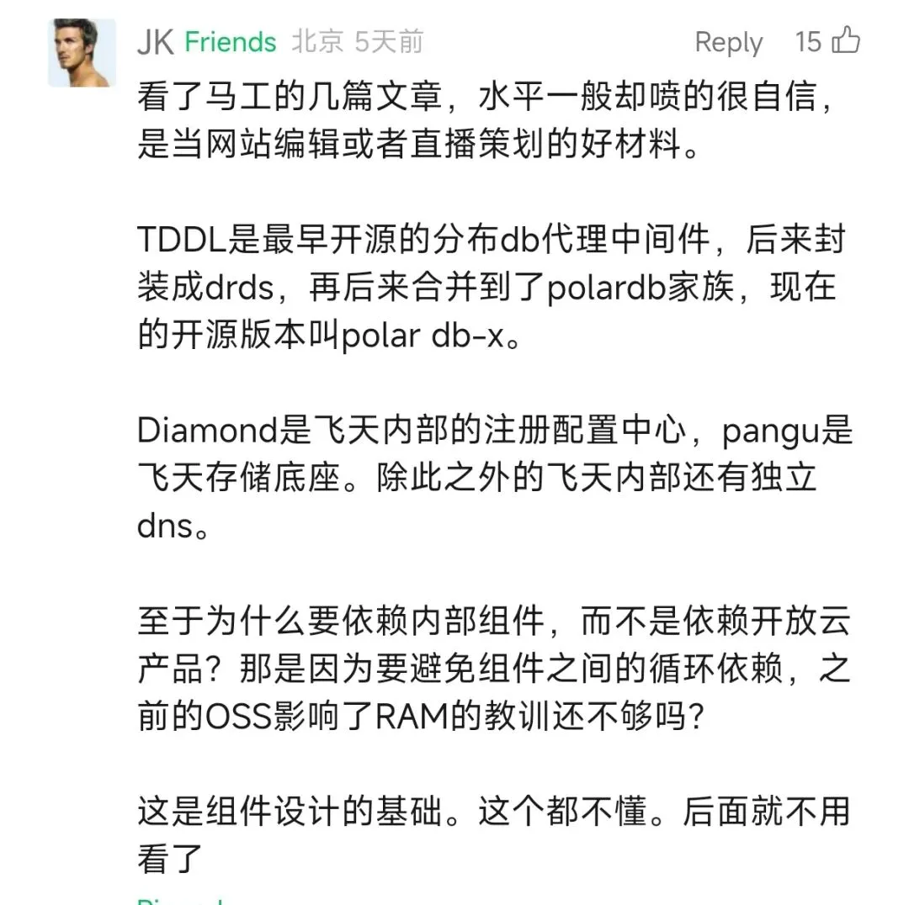
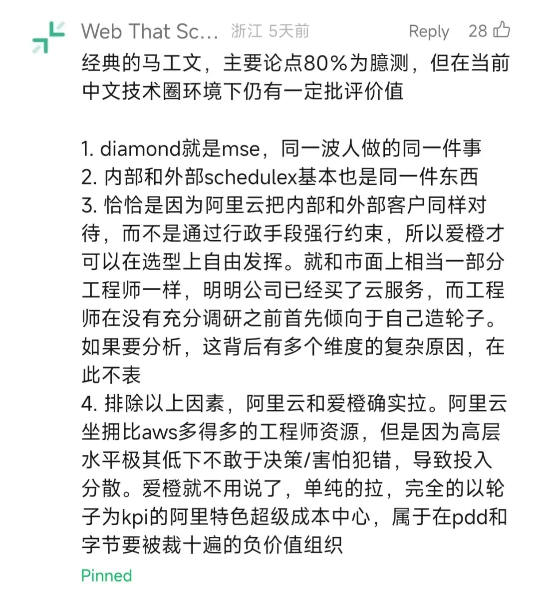

> 原作者：瑞典马工

前几天我发了一篇文章，批评阿里云的技术布道太差，以至于阿里集团的业务团队也宁愿用内部的盘古存储系统也不用阿里云的对象存储 OSS。有很多阿里的工程师很气愤，过来怼我，指出 OSS 的底层实现其实就是盘古，两者是一回事，甚至用盘古更高明。

JK

这位:

还有这位:

这几位认为只要最终 packets 流到了盘古系统，那么从哪个 interface 进来就无所谓。他们甚至有一些抑制不住的骄傲，觉得知道盘古是 OSS 的底座就很高明，而不知道的这个事实的就很”可怕”。

恕我直言，这几位也许是不错的后端开发者，但是缺乏基本的产品意识，是很糟糕的工程师。

软件工程发展到今天，每一个软件都依赖于其他软件。以你我正在使用的微信举例，微信的服务器端程序依赖于 Linux syscalls，微信客户端依赖于安卓 Framework，微信 web 端依赖于浏览器的 DOM 和 Event。然而微信开发者并不需要是 Linux 内核贡献者，安卓专家或者 Vue.js 作者。他们只需要使用 Linux，安卓和 Vue.js 提供的接口就可以开发微信了。

软件工程师很大一部分工作就是通过接口粘合不同组件的能力，组合出自己需要的系统。一般系统，都有上千此类依赖组件。

这也引出了一个判断：对于此类被依赖的组件来说，接口是其核心部分。

作为组件之间的契约，接口对外定义组件的能力边界，指导组件之间的交互。

以拼图为例，每一块的边缘形状和图案就是其对外接口，任何一个组件上的接口变动，会触发其他组件的配合修改，否则拼图就无法完成。而具体的实现，比如其纸料和颜色，则不一定影响其他组件。

这一判断对于云服务尤其如此。和分发软件不同，云服务运行在云厂商自己的硬件上，云厂商对其有完全控制权。只要愿意，云厂商可以每天更新其具体实现而用户无感知。但是对 API 的任何不兼容修改，会导致大量运行其上的应用停止工作。而对 API 的扩展，则需要大量的技术布道，才能被业界采纳。

因此推出第二个论断：**不变的 API 才是云服务的灵魂。而可变的 Implementation 则是第二位的。**据我所知，华为云早期基于 OpenStack，但是逐步的把它替换掉了，大多数用户并未感知到。类似的例子是，阿里云有大量的接口是服务于早期的个人站长的，这么多年过去了，个人站长早已经不是阿里云的主力客户，但是那些接口因为被广泛采用，几乎无法修改了。腾讯云去年的一个 API 把 Detail 写做了 Detial，被我发现后，至今也无法修改，因为已经有客户依赖于它了。

在这个意义上，云服务有铁打的 API 和流水的 Implementation。一个云服务的能力，行为和边界由 API 决定。

盘古和 OSS 虽然共享同一个 Implementation，但是有完全不同的 API，因此是两个不同的产品。MuleAI 使用盘古存储系统，则受限于盘古 API 的能力，比如没有 Auths 和 Authz，不能通过 Presigned URL 分享。同时也要承担盘古存储的负担，比如管理其 Cache。假设 MuleAI 以后需要强一致性，则 MuleAI 要么关闭 Cache，要么配置盘古去 purge 缓存对象。如果用 OSS，则这些能力都是 OSS API 已覆盖的。

对于绝大多数应用开发者来说，由于无法访问代码和硬件，最应该关注的云服务产品质量指标就是 API。从这个标准看，盘古对于绝大多数应用来说，是很糟糕的半成品，有非常繁琐而且初级的 API。显然不应该是应用开发者的首选。\

---

发布版本：[微信公众号转载页](https://mp.weixin.qq.com/s/GEDjjdUWD1TlrjyTkR5FJw)
