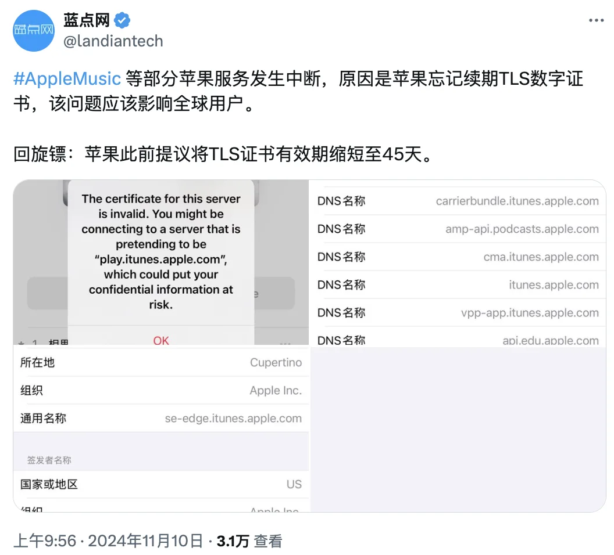
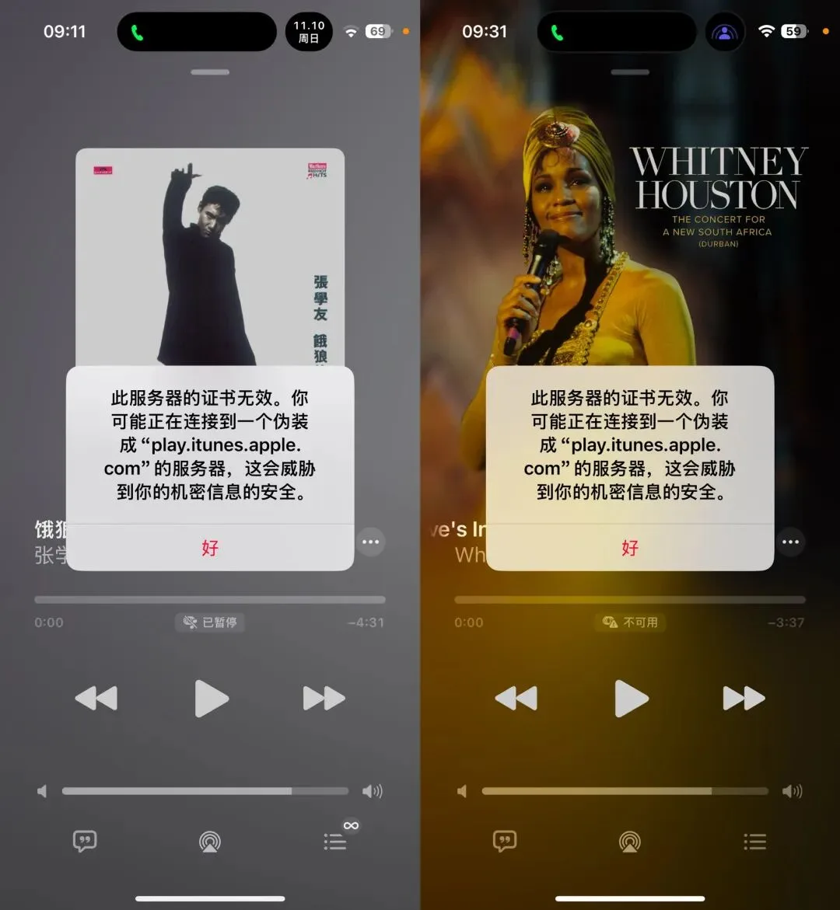
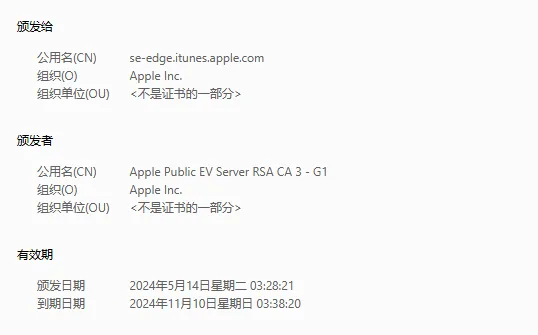
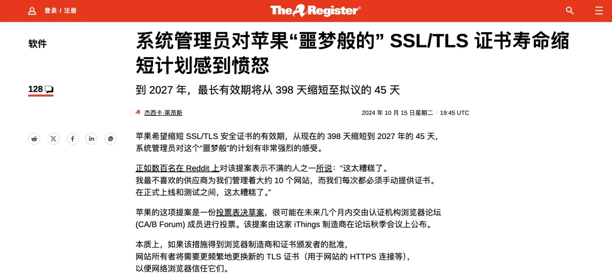
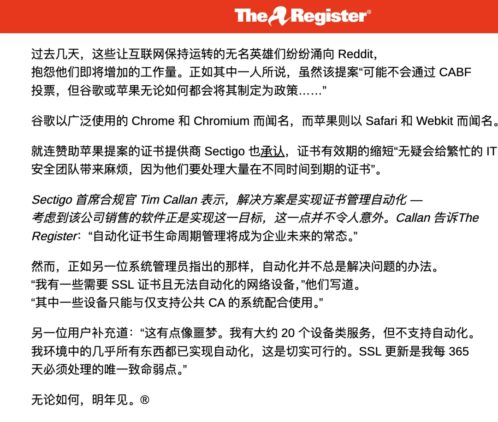
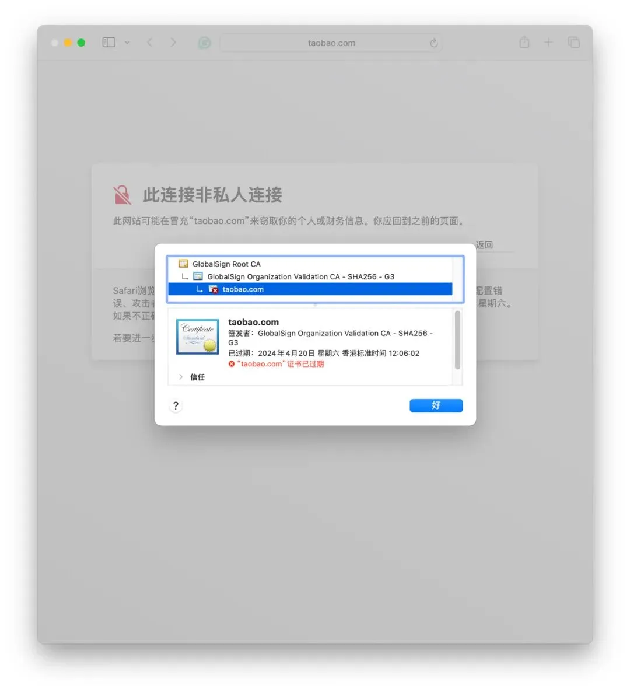

今天早上，网传 Apple Music 出现证书过期，导致服务中断。据称影响范围为国区 Apple Music。有趣的是，就在一个月前，苹果公司刚刚宣布了一项计划，拟将 SSL/TLS 安全证书的有效期逐步从当前的 398 天大幅缩短至 2027 年的 45 天。

结果刚提出没多久，苹果立马就忘了更新自己的证书。属实是回旋镖正中自己的脑门，蛮丢脸的。

从过期的证书来看，苹果使用的证书有效期是 180 天 / 六个月的版本。看起来似乎他们也没有设置自动更新证书的轮换程序，或者说设置了也没有生效 —— 也有一种可能，它们用的也是土办法：把证书有效期记录在某个 Excel 表格中，由运维老师傅管理。

以前，SSL 证书的有效期曾长达 8 年，但近年来为了提升互联网安全性证书的有效期逐步缩短。2015 年，CA/B 论坛（证书颁发机构和浏览器供应商的行业组织）将最大有效期缩短至**39 个月；2018 年 3 月**，证书最大有效期进一步缩短至 **825 天**（约 **27 个月**）；

**2020 年 9 月 1 日**，根据苹果、谷歌和 Mozilla 等主要浏览器厂商的要求，SSL/TLS 证书的最大有效期被缩短至 **398 天**（约 **13 个月**）。而就在一个月前，苹果的新提议将进一步缩短证书的有效期，计划在 2025 年缩短至 200 天，2026 年缩短至 100 天，最终在 2027 年降至**45 天**。

缩短证书有效期在理论上有助于提高互联网安全性（因为如果证书丢失，攻击者有更长的使用时间），但管理这些证书的重任往往落在网站和系统管理员的肩上。

尽管理论上有 acmebot 之类的自动化工具可以自动申请免费的 HTTPS 证书，但并非所有系统都可以用自动化系统来进行证书管理。很多网管与运维都对此颇有怨言 —— 这不是给我们增加几倍工作量么。

老冯认为，安全与活性应该取得一个适度平衡，如果过分强调某一方面的安全，反而可能会因为连锁反应导致整个系统的不安全 —— 例如，将证书有效期缩短理论上可以减少攻击者得手后的利用时间，但也可能导致更多的网站因为管理疏忽导致服务不可用，甚至因为管理压力负担直接摆烂躺平。

证书过期导致客户端中断有不少鲜活案例，例如，之前[淘宝官网 taobao.com 的证书就出现过过期](http://mp.weixin.qq.com/s?__biz=MzU5ODAyNTM5Ng==&mid=2247487367&idx=1&sn=d6e4abd2b2249d27bd8b8146b591b026&chksm=fe4b3a5cc93cb34a8e90e4b7f06803fa11ee8234014cd4f1aedff59e3bf3c846b3cb133090f2&scene=21#wechat_redirect) 的情况。这次硅谷大手子也难以免俗，再次彰显了草台班子理论的泛用性。

---

## [云计算泥石流](/cloud/exit/)

---

发布版本：[微信公众号](https://mp.weixin.qq.com/s/eawgZ3hE63b3fRfrJ1sqfw)
