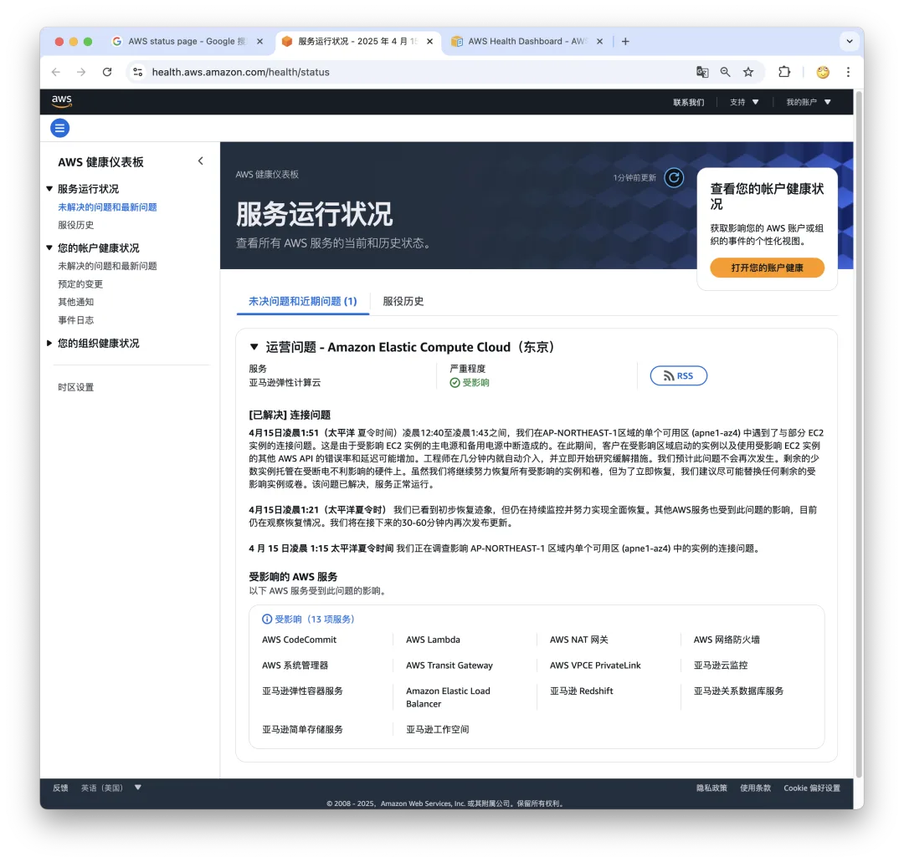

## AWS 东京可用区故障：影响 13 项服务

就在刚刚，AWS 东京可用区出现故障，开始于 4 月 15 日 16:15 分（北京时间），宣告结束于 16:51 分，EC2 实例断电，主备电源同时断电。影响 13 项服务。目前已经通告解决：剩余的少数实例托管在受断电不利影响的硬件上。

## 故障通知

**4 月 15 日凌晨 1:51（太平洋** 夏令时间）凌晨 12:40 至凌晨 1:43 之间，我们在 AP-NORTHEAST-1 区域的单个可用区 (apne1-az4) 中遇到了与部分 EC2 实例的连接问题。这是由于受影响 EC2 实例的主电源和备用电源中断造成的。在此期间，客户在受影响区域启动的实例以及使用受影响 EC2 实例的其他 AWS API 的错误率和延迟可能增加。工程师在几分钟内就自动介入，并立即开始研究缓解措施。我们预计此问题不会再次发生。剩余的少数实例托管在受断电不利影响的硬件上。虽然我们将继续努力恢复所有受影响的实例和卷，但为了立即恢复，我们建议尽可能替换任何剩余的受影响实例或卷。该问题已解决，服务正常运行。

**4 月 15 日凌晨 1:21（太平洋夏令时）** 我们已看到初步恢复迹象，但仍在持续监控并努力实现全面恢复。其他 AWS 服务也受到此问题的影响，目前仍在观察恢复情况。我们将在接下来的 30-60 分钟内再次发布更新。

**4 月 15 日凌晨 1:15 太平洋夏令时间** 我们正在调查影响 AP-NORTHEAST-1 区域内单个可用区 (apne1-az4) 中的实例的连接问题。

[云计算泥石流](/cloud/exit/)点一个关注 ⭐️，精彩不迷路\

### DHH

[先优化碳基 BIO 核，再优化硅基 CPU 核](/db/bio-core-cpu-core/)

[单租户时代：SaaS 范式转移](/cloud/single-tenant-saas/)

[拒绝用复杂度自慰，下云也保稳定运行](/cloud/uptime/)

[是时候放弃云计算了吗？](/cloud/odyssey/)

[下云奥德赛](/cloud/odyssey/)

### 亚马逊

[Ahrefs 不上云，省下四亿美元](/cloud/ahrefs-saving/)

[云上黑暗森林：打爆云账单，只需要 S3 桶名](/cloud/s3-scam/)

[Redis 不开源是“开源”之耻，更是公有云之耻](/db/redis-oss/)

[RDS 阉掉了 PostgreSQL 的灵魂](/cloud/rds-castrates-pg/)

[扒皮对象存储：从降本到杀猪](/cloud/s3/)

[重新拿回计算机硬件的红利](/cloud/bonus/)

[是时候放弃云计算了吗？](/cloud/odyssey/)

[下云奥德赛](/cloud/odyssey/)

### 阿里云

[阿里云：高可用容灾神话的破灭](/cloud/aliyun-ha/)

[阿里云故障预报：本次事故将持续至 20 年后？](/cloud/aliyun-ha/)

[阿里云新加坡可用区 C 故障，网传机房着火](https://mp.weixin.qq.com/s?__biz=MzU5ODAyNTM5Ng==&mid=2247488345&idx=1&sn=684398668bdddc05d4218c42f5a383b0&scene=21#wechat_redirect "阿里云新加坡可用区C故障，网传机房着火")

[草台班子唱大戏，阿里云 RDS 翻车记](/cloud/rds-failure/)

[阿里云又挂了，这次是光缆被挖断了？](/cloud/aliyun-fiber-cut/)

[云计算：菜就是一种原罪](/cloud/cloud-incompetence/)

[taobao.com 证书过期](https://mp.weixin.qq.com/s?__biz=MzU5ODAyNTM5Ng==&mid=2247487367&idx=1&sn=d6e4abd2b2249d27bd8b8146b591b026&scene=21#wechat_redirect "taobao.com 证书过期")

[牙膏云？您可别吹捧云厂商了](/cloud/toothpaste-cloud/)

[罗永浩救不了牙膏云](/cloud/luo-live/)

[迷失在阿里云的年轻人](/cloud/lost-youth-at-aliyun/)

[剖析云算力成本，阿里云真的降价了吗？](/cloud/ecs/)

[从降本增笑到真的降本增效](/cloud/smile/)

[阿里云周爆：云数据库管控又挂了](/cloud/aliyun-weekly-crash/)

[我们能从阿里云史诗级故障中学到什么](/cloud/aliyun/)

[【阿里】云计算史诗级大翻车来了](/cloud/aliyun/)

[阿里云的羊毛抓紧薅，五千的云服务器三百拿](/cloud/cheap-ecs/)

[云厂商眼中的客户：又穷又闲又缺爱](/cloud/cloud-customers-poor-bored-lonely/)

### 腾讯云

[腾讯真的走通云原生之路了吗？](/cloud/tencent-cloud-native/)

[我们能从腾讯云故障复盘中学到什么？](/cloud/qcloud/)

[云 SLA 是安慰剂还是厕纸合同？](/cloud/sla/)

[腾讯云：颜面尽失的草台班子](/cloud/tencent-disgrace/)

[【腾讯】云计算史诗级二翻车来了](/cloud/tencent-epic-fail-2/)

[垃圾腾讯云 CDN：从入门到放弃](/cloud/cdn/)

### 其他云

[删库：Google 云爆破了大基金的整个云账户](/cloud/gcp-unisuper/)

[云计算不能做成云算计之一：云行贿必须清理](/cloud/cloud-bribery/)

---

发布版本：[微信公众号](https://mp.weixin.qq.com/s/4no4Raj26u6GbUiHECBAjA)
