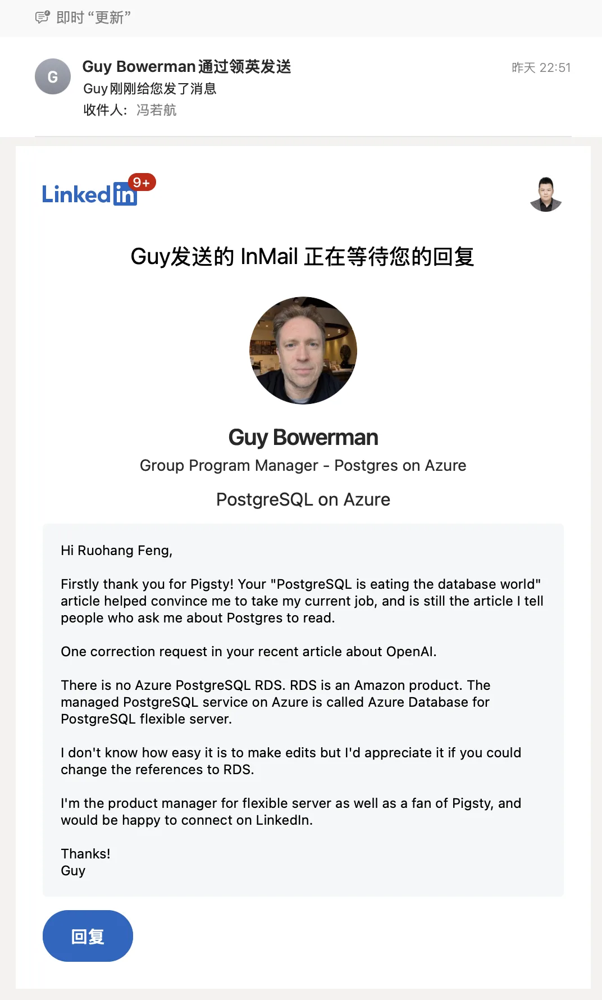
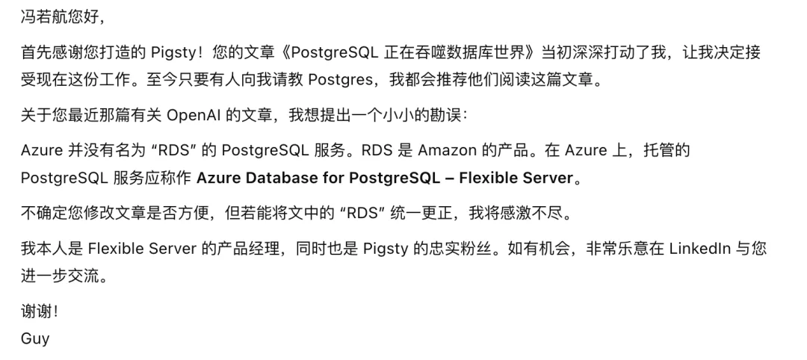
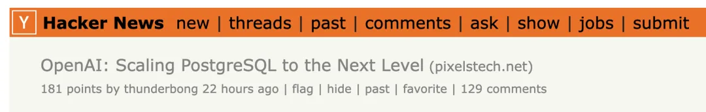
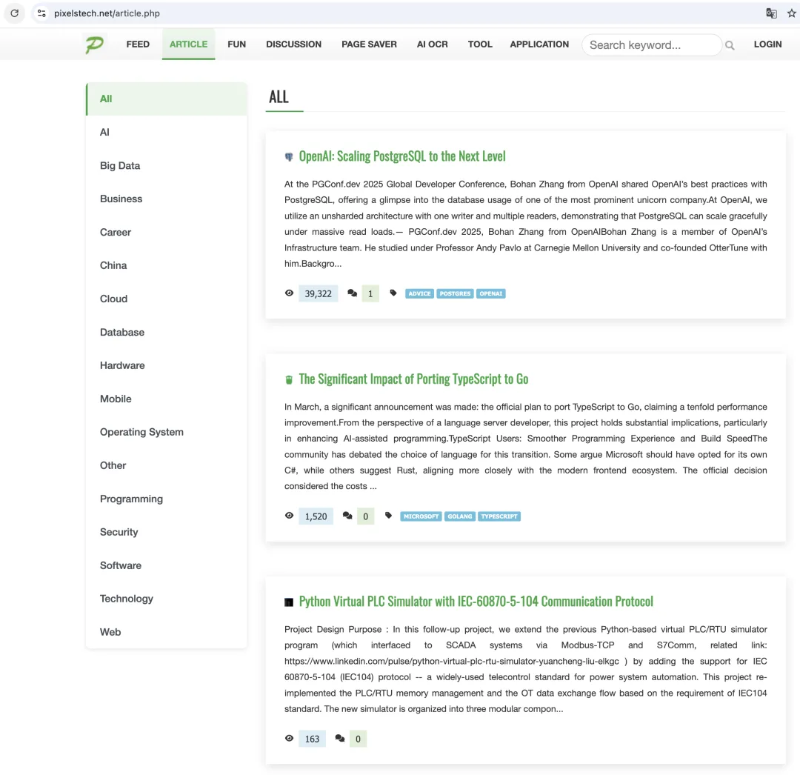
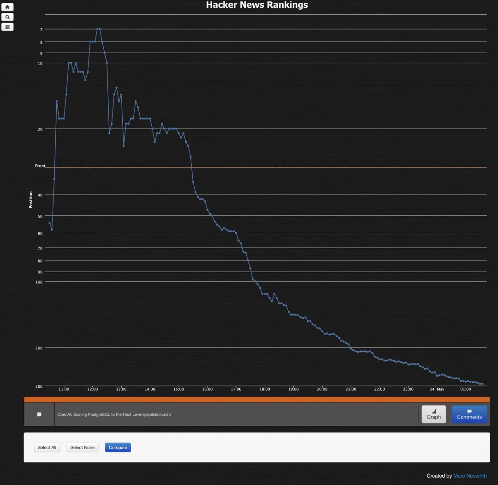
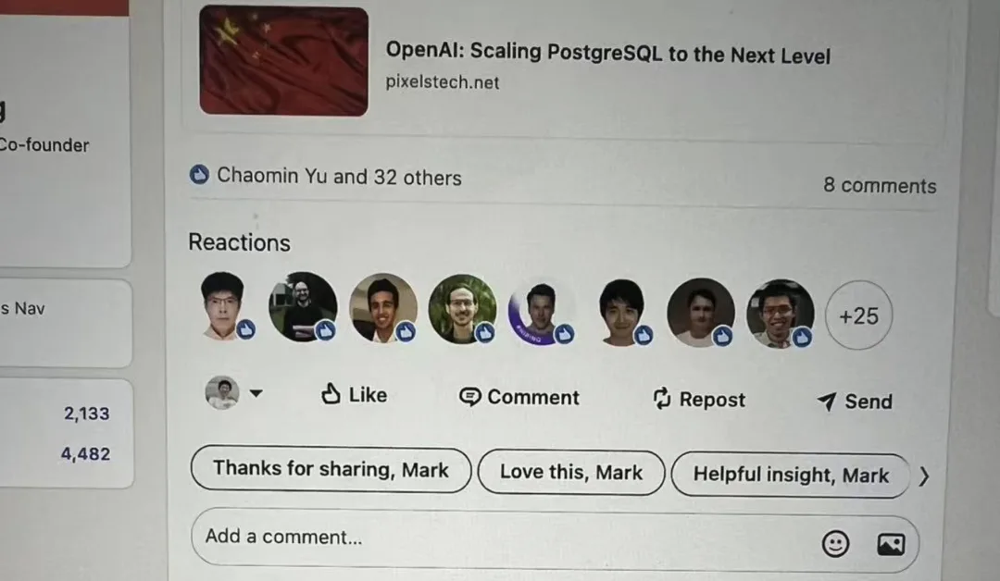
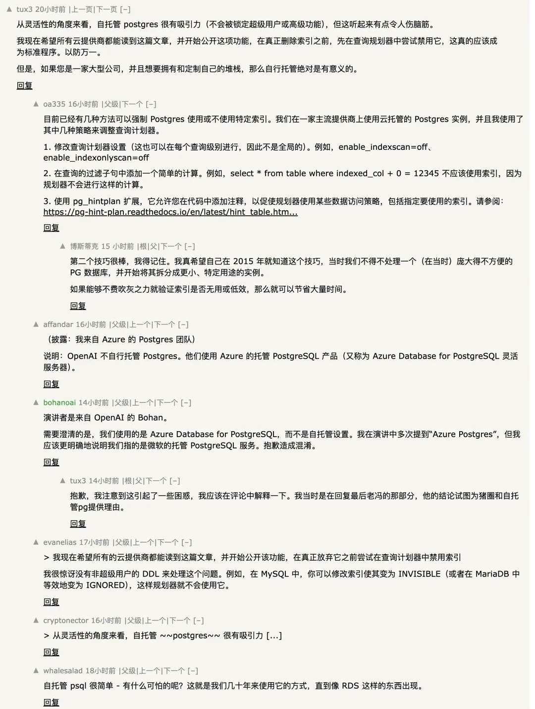
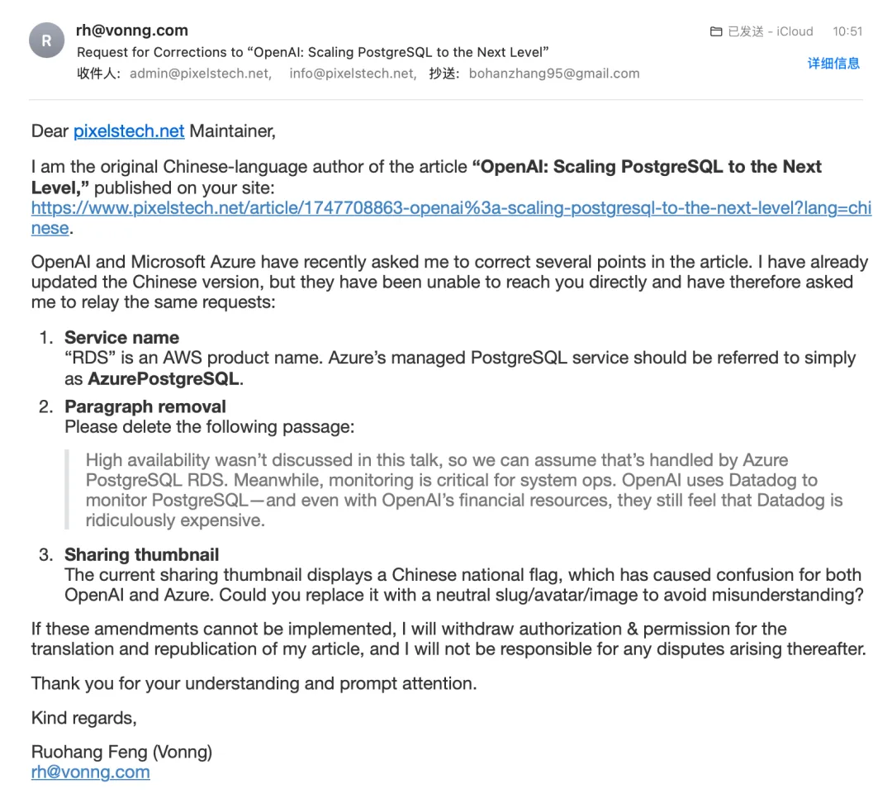
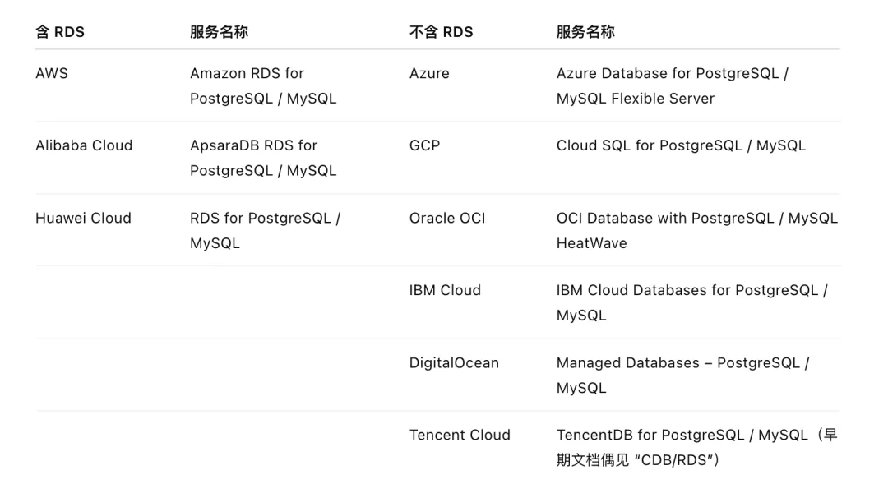
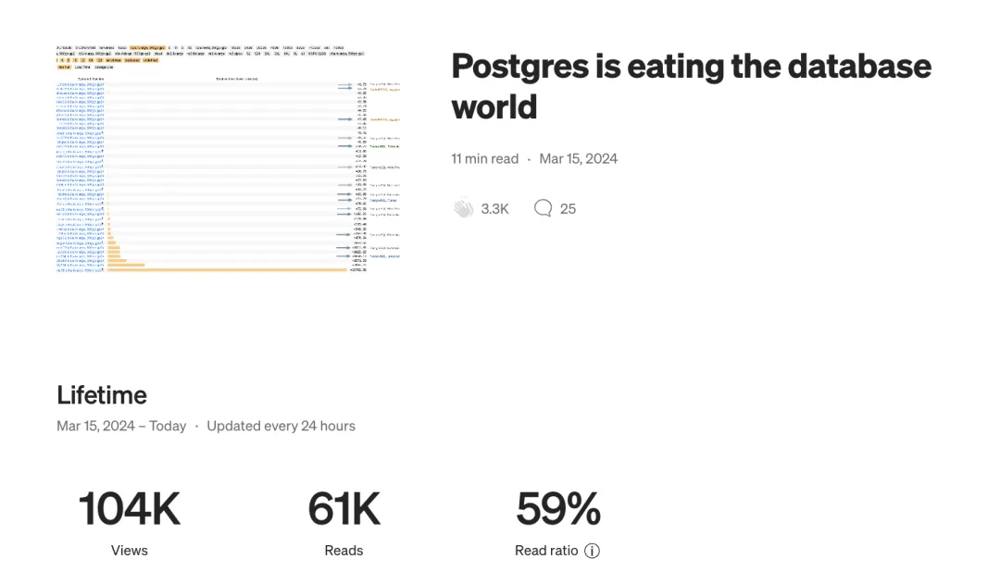

周一的时候老冯写了篇文章《 [OpenAI：将 PostgreSQL 伸缩至新阶段](/db/openai-pg/)》，有网友给翻译搬运到外网，还有网友发了 HackerNews，结果一下炸了。我还在纳闷发生了什么，Azure 和 OpenAI 的人就跑来找老冯了。主要是想要更正一下里面的表述，说 俺们 Azure 的托管 PostgreSQL 服务不叫 RDS。

然后 OpenAI 的朋友也紧接着找了过来，也建议我把一些数字藏起来，把 RDS 的表述换掉，以及把涉及精确数字模糊处理。老冯有点无语，怎么 Azure 和 OpenAI 一起跑过来查老冯的水表啦？

然后我一看，发现咋回事了，这篇博客上了 HakcerNews 首页，好家伙四万阅读，对技术文章来说肯定算爆款了。

> <https://news.ycombinator.com/item?id=44071418>

这确实是出乎老冯的意料了，因为我根本没有翻译英文发表到全球媒体上的打算。有人问我能转载吗我说 OK，事情就变成这样了。哎呀，四万曝光，太可惜了，老冯应该顺便多给 Pigsty 打两个广告的。

---

更滑稽的是，转载媒体的头像和文章略缩图是一面中国国旗，五星红旗飘荡在 LinkedIn 上，估计根正苗蓝的美国信创 Azure 和 OpenAI 看着都要脚趾抠地了。

---

HN 上的讨论还蛮激烈。我看应该是有个用户误以为 OpenAI 用的是 Azure 上自建的 PostgreSQL 集群，给 Azure 的 Postgres 团队看着急了，然后找的我。但老冯的原文也没说人家 OpenAI 是自建的呀。

是翻译偏差还是理解偏差我也不知道。但他们说的都是其他媒体转载我的英文文章，我也改不了，我自己要改也就只能改一下微信，知乎，还有 Pigsty 博客上的中文版本。然后给转载者发个修改通知。

---

但人家说话这么好听又诚恳，老冯能有什么办法呢，给转载者发了封邮件说啊请你帮帮忙也修改一下，你要是不改反正人家找你跟我没关系 balabala，发了封邮件后，转载者也修改了这些表述并重新上架了文章，问题解决。皆大欢喜。

一个有趣的事情是，俺的微信公众号文章里还留着一些这些原始数字和 RDS 字样的表述，没法修改了。但人家也不在乎中文媒体改不改的，反正全球社区都是看英文文章的。就比如我现在在公众号继续叭叭这个，我就一点儿都不担心人家再来查水表。

另一个让老冯有些在意的问题是 RDS 这个表述为什么会让 Azure 产品经理这么敏感。难道他们的托管 PG 不叫 RDS（Relation Database Service） 吗？我看中国的云厂商几乎清一色的都叫 RDS for xxx 呀。后来我一查发现，还真是，Amazon RDS 竟然是 AWS 的注册商标。

虽然从商标法的角度来说，商标保护的是完整标识（如 “Amazon RDS”），对缩略词 “RDS” 的通用使用并不构成绝对排他。但是国际厂商出于避免潜在纠纷的考虑，都倾向于使用其他排他的表述。所以这位老兄让我把 RDS 换成 Azure Database for PostgreSQL flexible server，我倒是完全理解。

但这样反过来一看，国内的云厂商好像就没这根筋，像阿里云和华为云都大喇喇的直接管自己的托管 MySQL 和 PostgreSQL 叫 RDS。

从这个角度来看，简中世界确实像是一个相对独立的小圈子，无论是媒体传播还是商业生态/技术习惯，与全球有些不太一致 —— 但这不一定是坏事，有时候独立环境孵化出的奇葩反倒能给大生态一些不一样的破圈新鲜感。

这件事倒是给老冯提了个醒，其实俺的博客和公众号里有些很不错的文章，俺一直犯懒没有去翻译成英文发表。其实如果发表在全球媒体上，影响力可能会比单一中文平台要大的多。

例如之前心血来潮让 GPT 翻译成英文的 《[PostgreSQL 正在吞噬数据库世界](/pg/pg-eat-db-world/)》，在国内反响也就那样，但是在全球 PG 社区里产生了相当大的影响力。

以至于这两年参加 PG 开发者大会和新朋友一见面的开场几乎都是：“噢是你，我读过你的那篇文章”。这让老冯不禁遐想，要是把下云杀猪盘系列搬运到海外，这些云厂商看到了不知道会有什么样的戏剧效果。哈哈。

---

发布版本：[微信公众号](https://mp.weixin.qq.com/s/qSeGHMzTlusRKRskY7V1wA)
