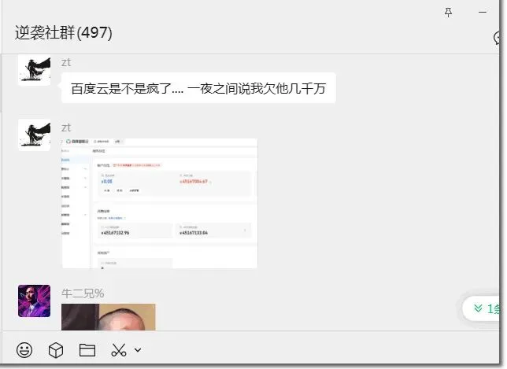
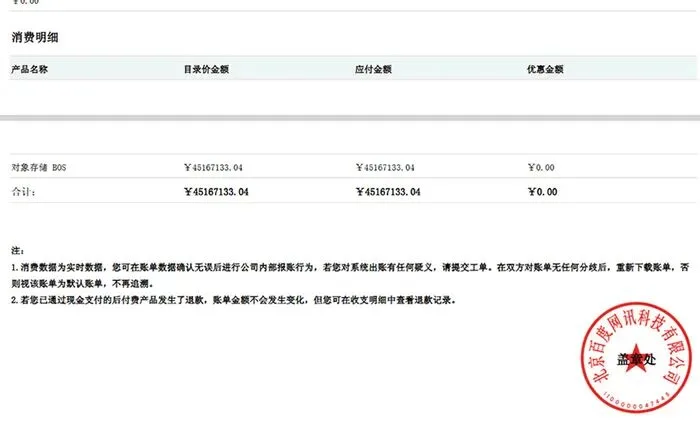

今天有群里有人分享一个有趣的 Case，有位开发者在百度云对象存储上存了几百兆数据，261.8KB 的下载流量，被收费了 20374385.48 ¥。

当然最滑稽的是，还有一个 “确认状态” —— “已确认”，讲真，但凡有一点儿人工 “确认” 的成分，都不至于让这么离谱的账单出现并发给用户。

而且，这个情况看起来并非个例，还有一位站长今天早上八点发了自己收到的百度云 —— 四千五百万账单，以及一条停机提醒。

“您的对象存储服务已停机，账务欠费后，数据将于 15 天后删除，删除后无法恢复”。

老冯算了一下，折合 1 个字节 7.78 元，1GB 流量 77 亿元，好家伙，到火星的流量费都到不了这个水平。这么离谱的价格，谁都能一眼看出哪里搞错了。百度给出的反馈是凌晨系统上线导致账单系统出 Bug 了。

当然，我也相信百度云只是单纯因为草台翻了车，毕竟最近翻车的云厂商实在太多了，多到老冯都懒得写了 —— AWS 故障三连击，Azure 配置变更导致的故障，安永 4TB 的数据库备份在 Azure 泄漏，诸如此类……  AWS 故障翻车好歹还有些学习借鉴意义，而百度云搞的这些花活恐怕只能招笑了。

## 老冯评论

这次故障虽然滑稽，这件事确实引人深思，这次账单出现 Bug 的表现，稍有常识的人都能一样看出来。但如果这个 BUG 是更隐秘的表现形式 —— 不是从几分钱到几千万这么夸张离谱，而只是高了 1%，多了几块钱，甚至几分钱，那么又有谁会发现呢？

这让我想起 电影《上班一族》里面的一个故事，利用一个叫做 “萨拉米切片” 的伎俩，从大量的交易中偷取微小的零头。我依稀记得圈内也有这么几个偷分厘的案例。有群友也评论到 ——  CDN 厂商的利润来源被你发现了（SI vs IEC）。

老冯自己曾经在腾讯云 CDN 上[遇到过很离谱的收费](/cloud/cdn/)，1 个 GB 的包点个预热，内部流量收了大几百块钱。写文章怒斥嘲讽过之后，他们也承认错误并改进修复了。但这也说明，在此之前那么长时间，被这个坑坑过的人，其实都被多收了钱，而没有人发现。

其实，普通用户是很难从技术上去核实验证云厂商给出的账单细节的 —— 很多云用户连大面上的账都算不清楚，就别提零头精算了。在云上运营会有许多新的挑战，计费算账甚至成为了一门专门的生意与服务 —— FinOps。有时候，你真的需要跟斗牛犬一样对着云厂商咬住细节不放，才能不被当肥羊给宰了。

### References

- `[1]` : <https://www.nodeseek.com/post-494925-1>
- `[2]` : <https://t.cj.sina.com.cn/articles/view/1234557003/4995d84b02701ca8q>

---

发布版本：[微信公众号](https://mp.weixin.qq.com/s/K9tdxeiqU8_S4lVylcWQeQ)
