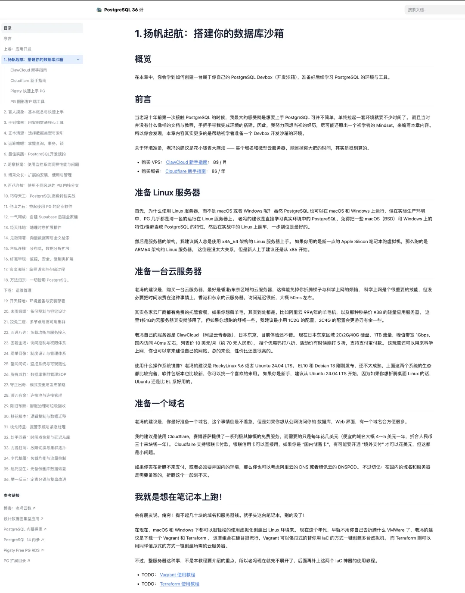
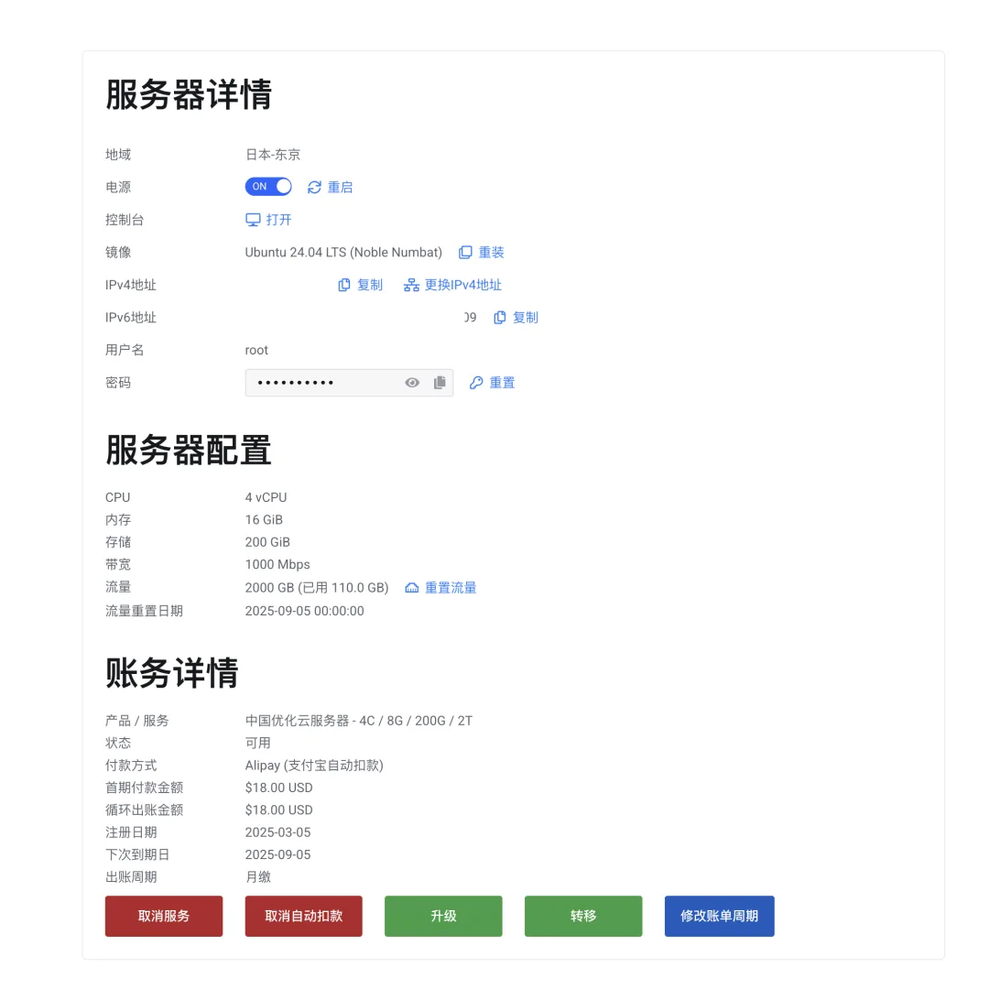
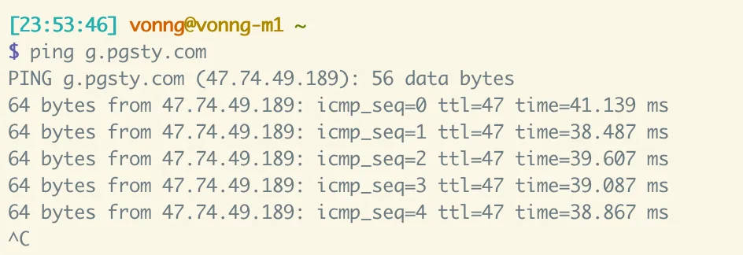
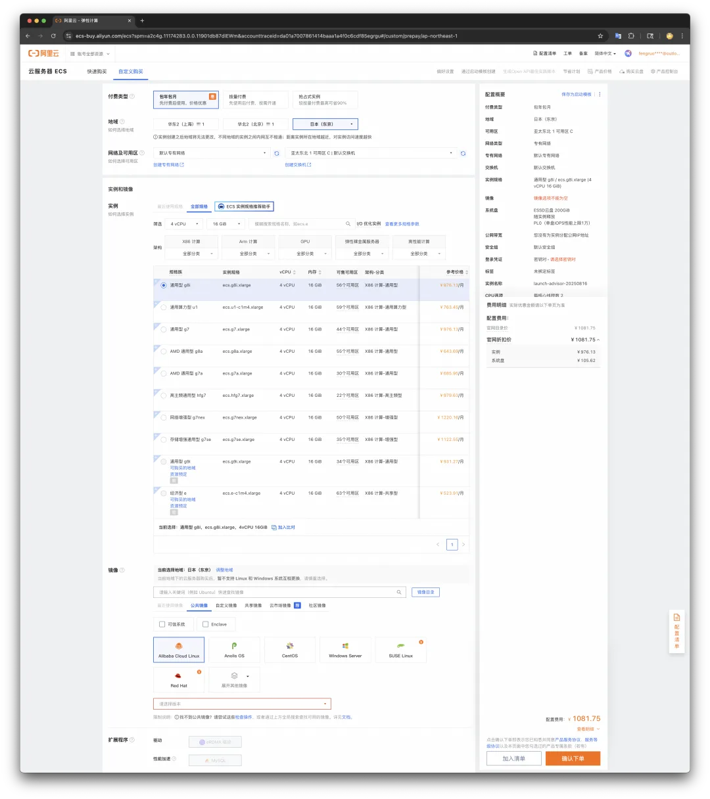
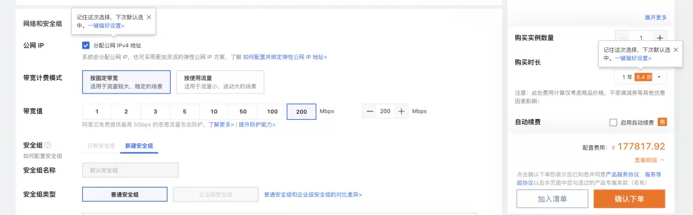
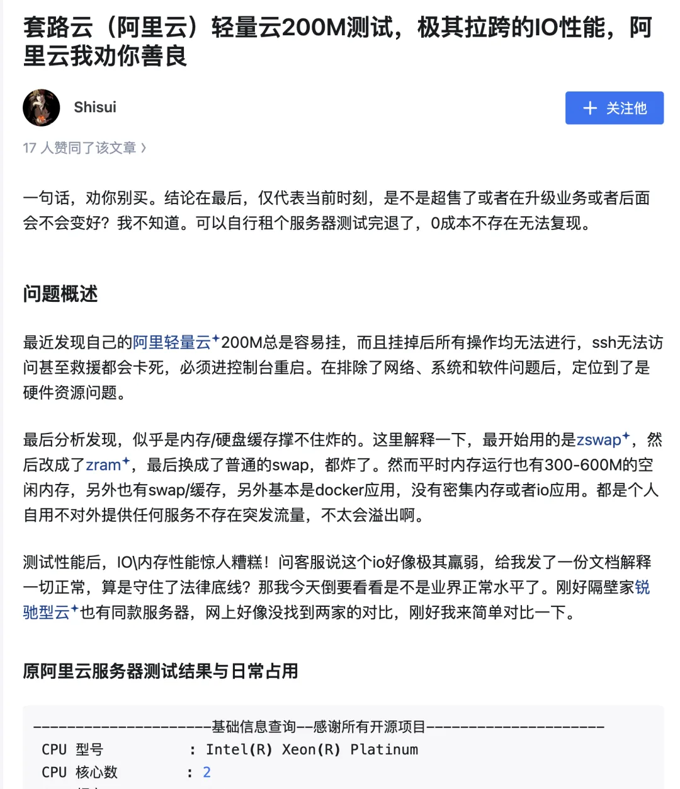
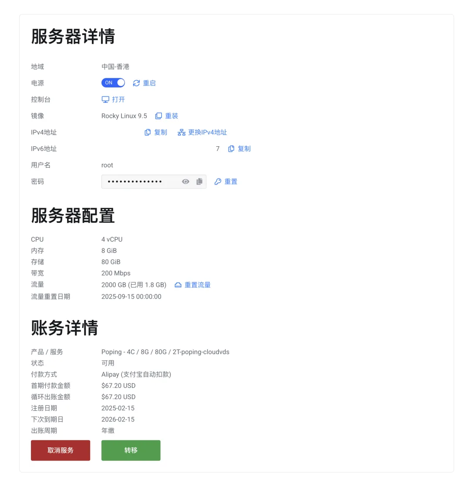

最近老冯[想做一套 PostgreSQL 教程](/pg/pg-36-stratagems/)，用实战的方式来上手 PostgreSQL。那么，当然是少不了一台 Linux 服务器，来安装 Pigsty。要是搁以前呢，老冯可能会说你去拿个 Vagrant 笔记本上拉起个虚拟机用就行了。

不过现在我觉得最好的方式还是搞一台境外云服务器来学习。因为对于初学者来说，这能节省大量会浪费在科学上网上的时间。

教程地址：<https://pg36g.vonng.com/>

所以啊，老冯就弄了个教程，选的是 ClawCloud，还有一个在 Cloudflare 上买域名的教程，算是经济实惠的最佳实践。

当然有人问，啊为什么不用 “阿里云”，”腾讯云“ 这些 ”知名大品牌“ 云啊，这个老冯在[云计算泥石流](/cloud/exit/) 专栏里说过很多了 —— 第一贵，第二烂。烂主要是烂在带宽上 —— 默认 1～5Mbps 的带宽，基本上就是乞丐速度。

ClawCloud，有小道消息说是阿里云开的马甲号，卖便宜 VPS，因为大号没法下来做这个生意。之前有过性价比很好的香港服务器，不过赔本卖的太多跑路了，但是日本和新加坡区域还是有的 —— 老冯的建议是去弄个日本可用区的。

ClawCloud 不仅天生免翻省去大量麻烦，而且给了 1Gbps 的峰值带宽，白天很快，晚高峰也基本能用，每个月 TB 级的免费流量，最主要中国访问也很快，中国优化服务器日本可用区，从上海访问大概 30～50ms 左右，完全 OJBK。

比如老冯自己用的两台服务器，主力是日本的一台 4 核 16G 内存 200G 磁盘,1Gbps 峰值带宽 + 2TB 每月流量的服务器，每月 18 美元也就是 128 块钱，每年大概 1500 块钱。当然很多人对这个性价比没有概念，没事 ——

我们打开阿里云，找到 ECS 云服务器，选择日本东京可用区，4c16g 机型 200G 乞丐云盘，看看价格，乖乖！1081.75¥，**每月**。这还是不带公网 IP 与带宽的价格。

如果加上网络，那价格就太吓人了，带宽我们只能选最高 200Mbps （17 万一一年）。

或者你也可以选择速率最大 100 Mbps 的流量按量付费，海外 6 毛钱 1GB/国内 8 毛（每月 2TB 流量费也就是 1200 块钱）。假设我们选个理智一点的按量付费，那么一年的费用（折扣后）是 9466.92 元，如果要 24TB 流量，那还要再加上 1 万 4 的流量费，加起来两万多块钱一年。

总的来说，我觉得只要是稍微有点脑子与数学常识的人都知道选哪个。这就是信息不对称割韭菜嘛。

当然有阿里云的朋友不服气跟我抬杠说，啊呀我们阿里云也有经济实惠的机型，比如那个 200Mbps 峰值带宽的 “轻量应用服务器”，每个月只要三四十块钱哦。那个我已经帮大家踩过坑避过雷了，IO 没法看，而且晚高峰基本就废了。知乎也有人评测过

我在 ClawCloud 上的另一台服务器是活动的时候买的，不是中国优化线路，峰值流量 200Mbps，4c8g 80G 硬盘，一年的价格 67 美金，香港地区。

当然，国外其实也有一些不错的 VPS 厂商，不过傻瓜易用，网络快，支持支付宝，又便宜又好的目前我看 ClawCloud 就挺好。

当然，ClawCloud 最好在有活动的时候买，经常有非常便宜的优惠。现在平时能买的 10 美元/月（有优惠券 8 美元/月）的这个 2c/2g 规格其实就挺好，活动价的时候 4～6 美元说不定就能拿下。

什么？你问老冯是不是收钱了？老冯特此强调一下哈，本号从来没有接过任何商单哈。

---

发布版本：[微信公众号](https://mp.weixin.qq.com/s/EIIIv09tHlhsuI1107nNyQ)
