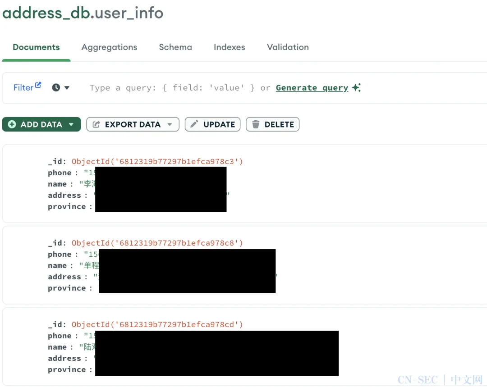

> 微信原页已失效；正文从明确署名的公开镜像恢复：[https://cn-sec.com/archives/4145266.html](https://cn-sec.com/archives/4145266.html)。

## 2025 年 6 月 6 日 Vilius Petkauskas

**英文原文：<https://cybernews.com/security/chinese-data-leak-billiones-records-exposed/>**

****老冯评论：看上去这次爆炸的是一个 MongoDB……****

> **在很可能是迄今为止侵袭中国最严重的数据泄露事件中，数十亿份包含财务数据、微信与支付宝信息及其他敏感个人信息的文件被公开暴露。令人忧虑的是，受影响用户几乎无计可施来保护自己。**

## 关键要点

- 受波及用户可能高达数亿。
- 泄露数据包含数十亿条财务记录、微信与支付宝明细。
- Cybernews 研究团队认为，泄露数据经过精心收集与维护，用于为几乎任何中国公民建立详尽的行为、经济与社会画像。

Cybernews 团队的最新发现显示，这次超大规模泄露主要影响中国用户：一个容量高达 631 GB、未设置任何密码保护的数据库公之于众，暴露了令人震惊的 40 亿条记录。

安全研究员、SecurityDiscovery.com 负责人 Bob Dyachenko 与 Cybernews 团队共同发现了这批庞大的公开数据。

数据库由多个数据集构成，每个集包含自 50 万至逾 8 亿不等的记录。研究者推测，这些数据被精心聚合与维护，目的是为几乎所有中国公民建立详尽的行为、经济与社会画像。

> “如此海量且多样的数据类型暗示着，这极可能是一个集中式的聚合枢纽，用于监控、画像或数据增值。” ——Cybernews 研究团队

数据规模之大，意味着威胁方或国家行为体可将其用于钓鱼诈骗、敲诈勒索、金融欺诈，甚至国家级情报收集与信息操控等多重用途。

## 最大规模中国数据泄露中包含哪些信息？

尽管研究团队竭尽全力，由于暴露实例很快被下线，Cybernews 仅得以短暂查看数据库内容，也因此无法确认数据库所有者身份。然而，收集并维护此类数据既耗时又费力，通常与威胁团伙、政府组织或极具动机的研究者相关。

团队共看到 16 个数据集，名称大多指向其所含数据类型。

| 数据集 | 记录数（约） | 可能内容 |
|----|----|----|
| `wechatid_db` | 8.05 亿 | 微信 ID |
| `address_db` | 7.80 亿 | 含地理标识的住址信息 |
| `bank` | 6.30 亿 | 支付卡号、生日、姓名、电话等财务数据 |
| “三要素校验” | 6.10 亿 | 身份证、手机号、用户名 |
| `wechatinfo` | 5.77 亿 | 微信元数据、通讯日志或聊天内容 |
| `zfbkt_db` | 3.00 亿 | 支付宝卡片及令牌信息 |
| 其他 9 个集合 | 3.53 亿 | 赌博、车辆登记、就业、养老保险、台湾相关信息等 |

仅凭前述前三个集合，经验丰富的袭击者即可交叉关联住址与消费习惯、负债与储蓄等信息，准确描摹个人画像。支付宝相关集合更可能导致非法支付、账号接管或身份盗用，对受害者造成灾难性后果。

## 中国数据泄露的老大难问题

研究团队无法将数据归因于任何可识别的组织。数据库中既无所有者标识，也无指向性的 HTTP 头信息；被发现后不久，相关基础设施即被撤离公共访问。

> “受影响个体由于所有者匿名且缺乏通知渠道，几乎没有直接求助途径。” ——Cybernews 研究团队

在中国发生的数据泄露事件并不罕见。Cybernews 曾报道过：

- 150 亿条[2] 记录泄露，涉及微博、滴滴、上海 XXX 等；
- 12 亿条[3] 用户记录被神秘人士泄出；
- 6 200 万条[4] iPhone 用户信息外流。

然而，超过 40 亿条记录的泄露前所未见，使此次事件成为迄今发现的最大单一来源的中国个人数据泄露。

### 时间线

- **发现时间：** 2025 年 5 月 19 日
- **关闭时间：** 2025 年 5 月 20 日

### References

- `[1]` : *<https://cybernews.com/security/chinese-data-leak-billiones-records-exposed/>*`[2]` 150 亿条： *<https://cybernews.com/security/chinese-data-leak-expose-didi-weibo-kfc-communist-party/>*`[3]` 12 亿条： *<https://cybernews.com/security/mysterious-actor-exposes-billion-chinese-users/>*`[4]` 6 200 万条： <https://cybernews.com/privacy/iphone-users-data-leak-china-privacy-breach/>

## 老冯评论

看上去这次爆炸泄露的是一个 MongoDB，为什么这么多数据泄漏事件都跟 MongoDB 有关呢？一个重要的原因是，即使到今天，MongoDB 的默认配置依然没有密码，所以会有很多监听公网不带 Auth 的的裸奔 MongoDB。

虽然在个案上来说，这肯定是运维的黑锅没跑了，但在总体上说，MongoDB 的默认安全设置也难辞其咎。更多关于 MongoDB 的评论，请看：[MongoDB 没有未来：“好营销”救不了烂芒果](/db/bad-mongo/)

## [云计算泥石流专栏](/cloud/exit/)

[大故障：阿里云核心域名被拖走了](/cloud/aliyun-domain-seized/)

[Oracle 云大翻车：6 百万用户认证数据泄漏](/cloud/oracle-cloud-leak/)

[阿里云：从上到下烂到根了【去除原文版】](/cloud/aliyun-supabase/)

[硬编码密码泄漏，阿里云的软件工程也太差了](/cloud/aliyun-hardcoded-password/)

[Azure 和 OpenAI 来查水表了](/cloud/azure-openai-audit/)

[深度分析：迪奥数据泄露事件，云配置失当的锅？](/cloud/dior-leak/)

[10 万用户的软件，因腾讯云欠费 2 元灰飞烟灭？](/cloud/tencent-2yuan/)

[AWS 东京可用区故障：影响 13 项服务](/cloud/aws-tokyo-outage/)

[云计算不能做成云算计之一：云行贿必须清理](/cloud/cloud-bribery/) 马工

[CVE 惨遭断奶，美帝自毁安全长城](/misc/cve-funding-cut/)

[Shopify：愚人节真的翻车了](https://mp.weixin.qq.com/s?__biz=MzU5ODAyNTM5Ng==&mid=2247489406&idx=1&sn=f51aea1ea2148f7d281f1bded9de8888&scene=21#wechat_redirect)

[DHH 下云：S3 晚搬一天，就多花四万](/cloud/dhh-s3-migration/)

[今日大瓜：赛博佛祖与赛博菩萨大打出手](/misc/cyber-buddha-fight/)

[花钱买罪受的大冤种：逃离云计算妙瓦底](/cloud/patsy/)

[OpenAI 全球宕机复盘：K8S 循环依赖](/cloud/openai-failure/)

[支付宝崩了？双十一整活王又来了](https://mp.weixin.qq.com/s?__biz=MzU5ODAyNTM5Ng==&mid=2247488632&idx=1&sn=dba2c78f37bb4af2421677e842b57fdd&scene=21#wechat_redirect)

[草台回旋镖：Apple Music 证书过期服务中断](/cloud/apple-music-cert/)

[DHH：下云超预期，能省一个亿](/cloud/odyssey-done/)

[WordPress 社区内战：论共同体划界问题](/cloud/wordpress-drama/)

[记一次阿里云 DCDN 加速仅 32 秒就欠了 1600 的问题处理（扯皮）](/cloud/aliyun-dcdn-bill/) 转

[阿里云：高可用容灾神话的破灭](/cloud/aliyun-ha/)

[阿里云故障预报：本次事故将持续至 20 年后？](/cloud/aliyun-ha/)

[阿里云盘灾难级 BUG：能看别人照片？](/cloud/aliyun-drive-bug/)

[阿里云新加坡可用区 C 故障，网传机房着火](https://mp.weixin.qq.com/s?__biz=MzU5ODAyNTM5Ng==&mid=2247488345&idx=1&sn=684398668bdddc05d4218c42f5a383b0&scene=21#wechat_redirect)

[这次轮到 WPS 崩了](https://mp.weixin.qq.com/s?__biz=MzU5ODAyNTM5Ng==&mid=2247488215&idx=1&sn=34bedcf01169facd0207200b3e018989&scene=21#wechat_redirect)

[草台班子唱大戏，阿里云 RDS 翻车记](/cloud/rds-failure/)

[我们能从网易云音乐故障中学到什么？](/cloud/netease/)

[GitHub 全站故障，又是数据库上翻的车？](/cloud/github-outage/)

[全球 Windows 蓝屏：甲乙双方都是草台班子](/cloud/bsod-friday/)

[阿里云又挂了，这次是光缆被挖断了？](/cloud/aliyun-fiber-cut/)

[性学家，化学家，软件行业里的废话文学家](/misc/nonsense-writers/) 马工

[Ahrefs 不上云，省下四亿美元](/cloud/ahrefs-saving/)

[删库：Google 云爆破了大基金的整个云账户](/cloud/gcp-unisuper/)

[云上黑暗森林：打爆云账单，只需要 S3 桶名](/cloud/s3-scam/)

[赛博菩萨 Cloudflare 圆桌访谈与问答录](/cloud/cf-interview/)

[云计算：菜就是一种原罪](/cloud/cloud-incompetence/)

[taobao.com 证书过期](https://mp.weixin.qq.com/s?__biz=MzU5ODAyNTM5Ng==&mid=2247487367&idx=1&sn=d6e4abd2b2249d27bd8b8146b591b026&scene=21#wechat_redirect)

[腾讯真的走通云原生之路了吗？](/cloud/tencent-cloud-native/) 马工

[我们能从腾讯云故障复盘中学到什么？](/cloud/qcloud/)

[云 SLA 是安慰剂还是厕纸合同？](/cloud/sla/)

[腾讯云：颜面尽失的草台班子](/cloud/tencent-disgrace/)

[【腾讯】云计算史诗级二翻车来了](/cloud/tencent-epic-fail-2/)

[吊打公有云的赛博佛祖 Cloudflare](/cloud/cloudflare/)

[牙膏云？您可别吹捧云厂商了](/cloud/toothpaste-cloud/)

[罗永浩救不了牙膏云](/cloud/luo-live/)

[Redis 不开源是“开源”之耻，更是公有云之耻](/db/redis-oss/)

[公有云厂商卖的云计算到底是什么玩意？](/cloud/what-public-cloud-sells/) 马工

[迷失在阿里云的年轻人](/cloud/lost-youth-at-aliyun/)

[RDS 阉掉了 PostgreSQL 的灵魂](/cloud/rds-castrates-pg/)

[云计算反叛军联盟](/cloud/cloud-rebels/)

[剖析云算力成本，阿里云真的降价了吗？](/cloud/ecs/)

[DBA 会被云淘汰吗？](/cloud/dba-vs-rds/)

[单租户时代：SaaS 范式转移](/cloud/single-tenant-saas/)

[互联网技术大师速成班](/misc/internet-tech-masterclass/) 马工

[门内的国企如何看门外的云厂商](/cloud/state-owned-enterprise-cloud-view/) Leo

[卡在政企客户门口的阿里云](/cloud/aliyun-enterprise-market/) 马工

[云计算泥石流](/cloud/debris/)

[拒绝用复杂度自慰，下云也保稳定运行](/cloud/uptime/)

[扒皮对象存储：从降本到杀猪](/cloud/s3/)

[半年下云省千万：DHH 下云 FAQ 答疑](/cloud/cloud-exit-faq/)

[互联网故障背后的草台班子们](/cloud/amateur-internet-outages/) 马工

[从降本增笑到真的降本增效](/cloud/smile/)

[阿里云周爆：云数据库管控又挂了](/cloud/aliyun-weekly-crash/)

[重新拿回计算机硬件的红利](/cloud/bonus/)

[我们能从阿里云史诗级故障中学到什么](/cloud/aliyun/)

[【阿里】云计算史诗级大翻车来了](/cloud/aliyun/)

[阿里云的羊毛抓紧薅，五千的云服务器三百拿](/cloud/cheap-ecs/)

[云厂商眼中的客户：又穷又闲又缺爱](/cloud/cloud-customers-poor-bored-lonely/) 马工

[是时候放弃云计算了吗？](/cloud/odyssey/)

[云计算泥石流合集 —— 用数据解构公有云](/cloud/debris/)

[下云奥德赛](/cloud/odyssey/)

[FinOps 终点是下云](/cloud/finops/)

[云计算为啥还没挖沙子赚钱？](/cloud/profit/)

[云 SLA 是不是安慰剂？](/cloud/sla/)

[杀猪盘真的降价了吗？](/cloud/ebs/)

[公有云是不是杀猪盘？](/cloud/ebs/)

[垃圾腾讯云 CDN：从入门到放弃](/cloud/cdn/)

[驳《再论为什么你不应该招 DBA》](/cloud/no-dba-bullshit/)

[范式转移：从云到本地优先](/cloud/paradigm/)

[云数据库是不是杀猪盘](/cloud/rds/)

[你怎么还在招聘 DBA?](/cloud/no-more-dba/) 马工

[云数据库是不是智商税](/cloud/rds/)

[云 RDS：从删库到跑路](/cloud/drop-rds/)

> 原文始发于微信公众号（合规社）：[有史以来最大的中国数据泄露：逾 40 亿条支付宝微信数据](http://mp.weixin.qq.com/s?__biz=MzkyMTUwMjIwNA==&mid=2247508575&idx=1&sn=3878fbb263f03e2b008f0ff68925034b)

---

发布版本：微信公众号（原发布记录已失效）
