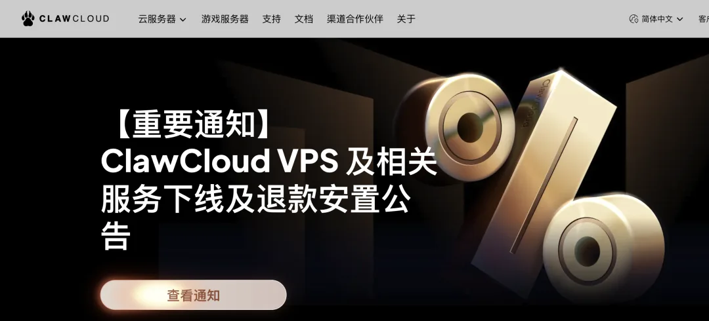
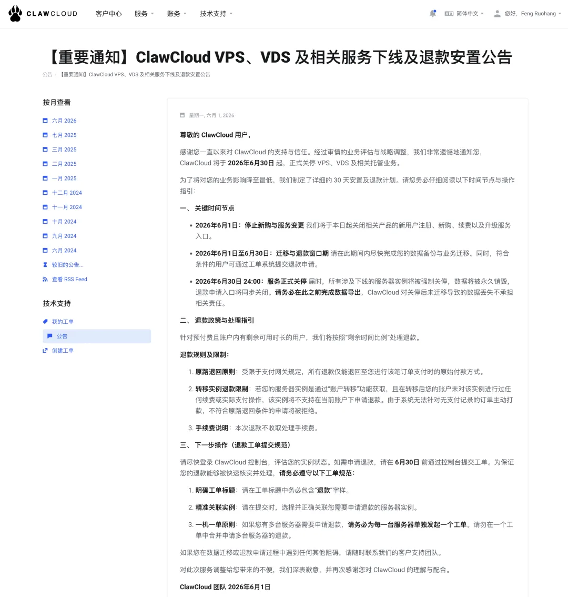
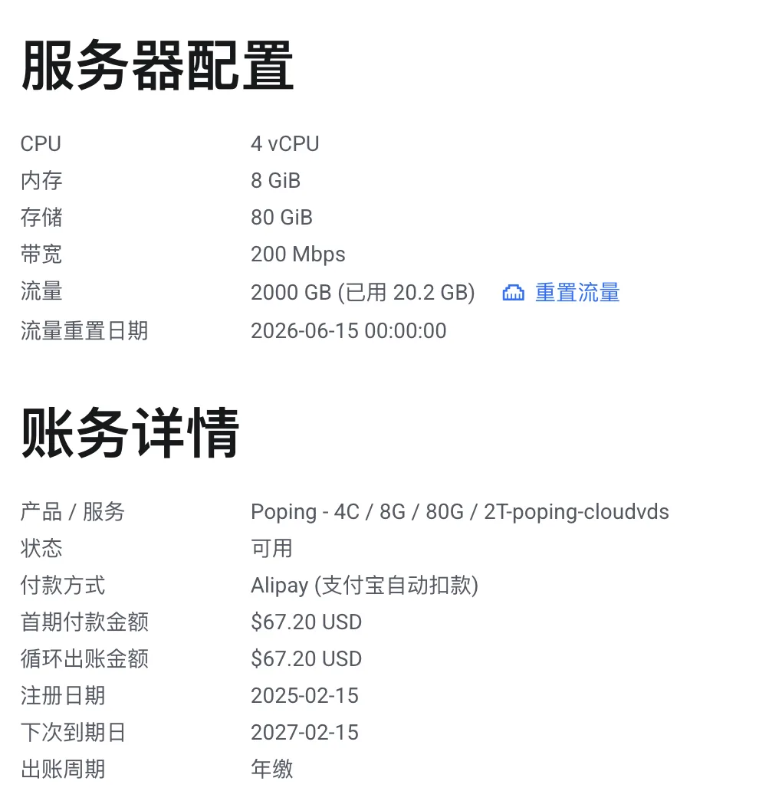
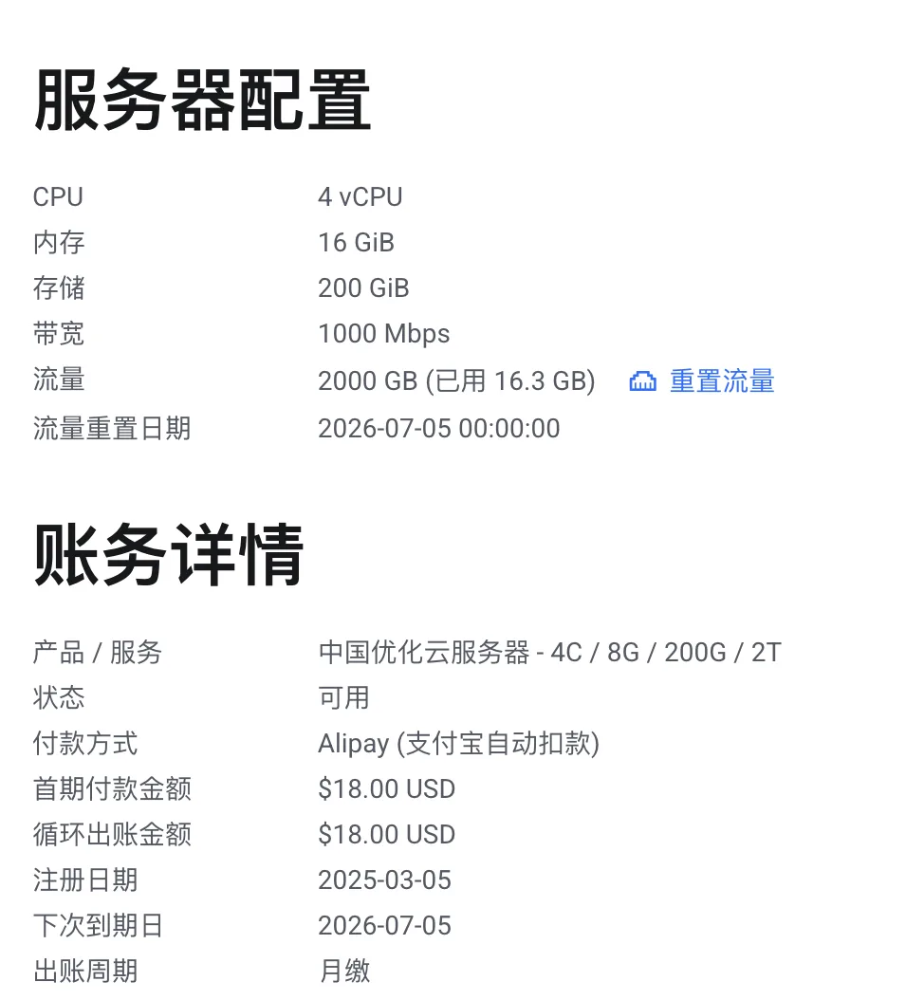
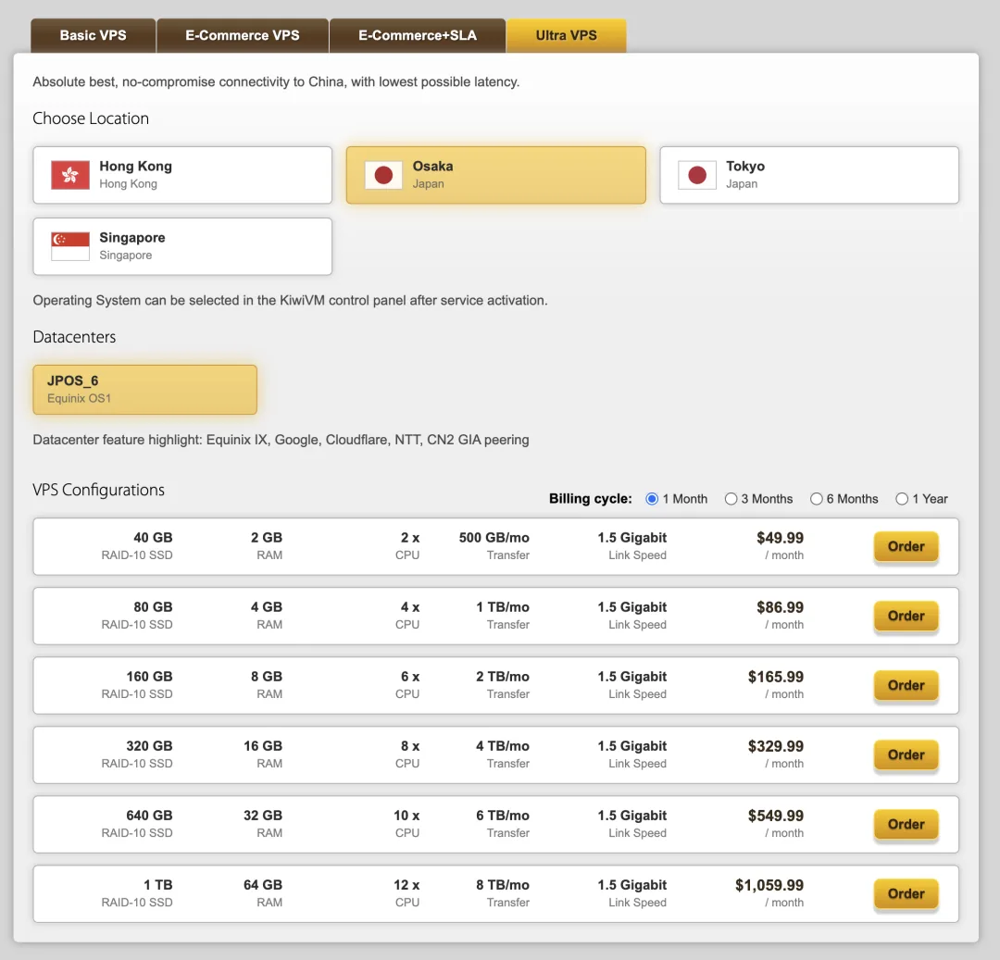
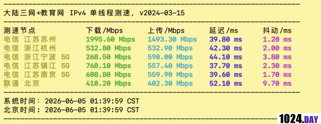
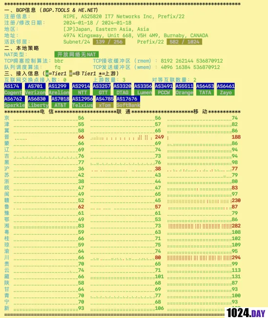
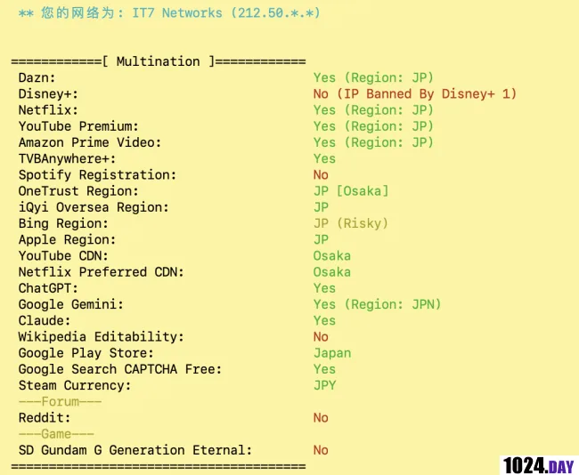
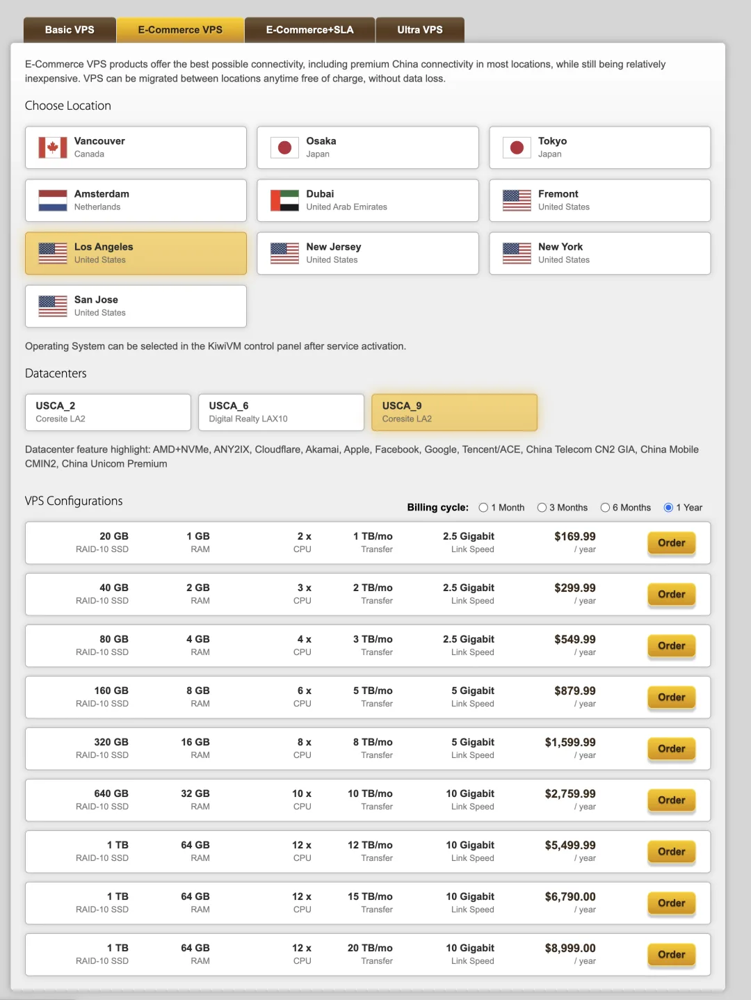

老冯之前在《[便宜云服务器哪家强？](/cloud/cheap-vps/)》还有 PG 上手教程里面都推荐过 ClawCloud 家的 VPS。不幸的是，看上去这次 ClawCloud 真的要跑路了，官网已经发了公告 《ClawCloud VPS 及相关服务下线及退款安置公告》，2026 年，6 月 30 日起正式关停 VPS、VDS 相关业务。

根据知情人士透露，这玩意是 AL 云的马甲小号。不知道为什么不做了，也许是最近都去做 AI 生意了，看不上 VPS 生意了；也可能流量费倒贴的太厉害了，总之，跑路了。之前香港区域就跑路下线过一次，这次干脆整个 VPS 产品线都砍了。老冯对此感到很遗憾。毕竟，这种性价比的机器确实不多见了。

俺之前趁着打折买了两台云服务器，一台 4 核 8G/80G 磁盘/2T 流量/200M 带宽的 VDS，年付 67 美元。

另一台是 4 核 16G/200GB 磁盘/1G 带宽/2TB 流量的中国网络优化服务器，月缴 18 美元。

在上面放着几个网站，包括我自己的个人博客 vonng.com，Pigsty 中文站 pigsty.cc，还有 PostgreSQL 中文站镜像 pg.center。

老实说，要让我再找个这种价格的云服务器，还真是不太容易。我的要求是：

- 全球都可以访问，大陆地区访问量大。（国内云服务器 PASS 掉）
- 每个月 1TB 左右的流量，越快越好。
- 延迟越低越稳定越好，走精品网络。（所以走 CN2 GIA 网络）
- 要求能够在上面访问 ChatGPT 和 Claude （所以香港的不行）

因为要从中国大陆密集访问，基本上目前区域最优解是日本，从上海访问日本服务器和香港的延迟差不多，但是香港的 IP 无法使用 ChatGPT 和 Claude，而且还要贵一圈。新加坡的延迟要到 70～100ms 了，美西的延迟要 120ms+ 了，日本 CN2 GIA 的延迟最快能到 30ms-40ms 左右。

当然，ClawCloud 的中国优化服务器也不是走 CN2 GIA 网络的，上海延迟大概 60-70ms，而且晚高峰的带宽相当难看，所以这次我也想一步到位，直接就上最好的网络。

我调研了一圈，基本上带有 CN2 GIA 网络的 VPS 都很贵，基本上最后收敛到 DMIT 和 Bandwagong 搬瓦工上了。属于毕业线路，贵但是质量没得说。DMIT 基本都卖断货了，只有搬瓦工可以买买，这个价格也很… well 真的是挺贵的。

老冯最后选了日本大阪 JPOS_6 机房的 Ultra VPS，80GB 档位，4C/4GB，1TB 月流量，1.5G 网络，80GB 磁盘，每月 87 刀折合人民币 600 块，一年六千块钱。

目前我已经把 ClawCloud 上的几个网站都搬迁到这台新 VPS 上去了。不过怎么说呢，一分钱一分货，贵还是有贵的道理。不论是用来访问网页还是用来中转（嘿嘿），这个体验都没得说，而且晚高峰的质量表现仍然很流畅。

关于这个 VPS，<https://1024.day/d/3851> 有详细的评测

当然，老冯是因为正儿八经有网站要同时面向全球与中国提供服务。如果是自己用用，其实洛杉矶的 E-Commerce VPS 套餐也不错。一样的价格可以买到 6C8G / 5TB 月流量 / 5G 带宽的 VPS，除了中国访问延迟高（120ms）没毛病。

当然，如果你知道还有什么其他给力的套餐与节点，也欢迎在评论区告诉老冯与大家分享。

---

发布版本：[微信公众号](https://mp.weixin.qq.com/s/Jk_4KMeN6qBWMZwUFZ7B4w)
