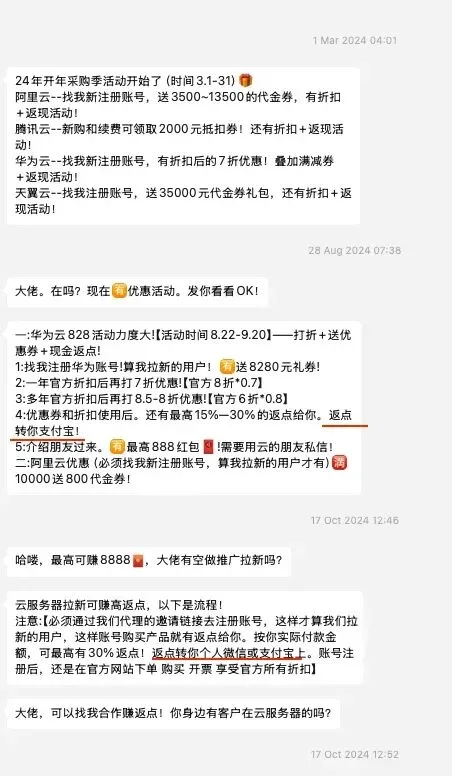
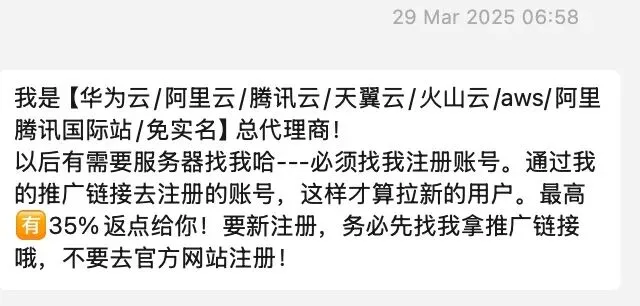

> 原作者：瑞典马工

作为桌子两边都坐过的云计算从业者，本人一直关注中国云计算的发展。相对于电信设备，智能手机，人工智能，生物医药，新能源汽车，电池等兄弟行业的突飞猛进，中国云计算的产品质量一直和国际同行保持稳定的较大差距，国际竞争力保持为零。这一点可以从美国政府这几年的制裁名单看出：美国政府连小米手机都制裁过，但是从来都懒得制裁中国云厂商（不要抬杠，华为云被制裁是因为集团的缘故）。

都是工程行业，为什么中国云计算行业发展就这么落后呢？我相信各位读者都有很多观点，但是目前为止没有看到严肃的讨论。在其他行业，小米汽车 CEO 雷军本人为电动车事故道歉，宁德时代 CEO 曾毓群直接批评欧洲对手 NorthVolt “所有东西都错了”，人工智能行业的李彦宏积极建言献策国家的 AI 监管规则，李想在开课讲产品设计，而云计算厂商绝大多数 CXO 们没有基本的沟通能力，只能在自家办的活动场子里读一些下属部门拼凑出来的稿子，而这些稿子，基本没有任何洞见，属于付费请人阅读都被嫌弃的水准。

而公开的讨论，对行业的发展是很必要的。小灵通 vs GSM 的争论，智能手机 WAPI vs WiFi 的争论，自动驾驶雷达 vs 摄像头的争论，氢能源 vs 锂电池的争论，不仅促进了从业者的思考深度，也对用户做了很好的市场教育，是极为有效的 marketing 策略。美国云计算同行 FaaS vs Kubernetes 的争论，cloud native vs cloud agnostic 的争论，微服务 vs 单体服务的争论，都极大的促进了行业产品的快速迭代。由于缺乏健康诚实的反馈环，中国云计算厂家经常开发一些无厘头的产品，发布一些不知所云的 PR 文章，推荐一些二十年前的古董架构，自我构建一种王后妈妈强迫镜子说自己最漂亮的气氛。而用户经常发现自己充当了乙方中某些层混子完成 KPI 的工具。

有鉴于此，笔者打算发布一系列文章，严肃的讨论这个行业的一些通病。文章不针对某个具体的厂商，但是我也不会用“杭州某厂”或者“H 云”之类的可怜虫专用词汇，我会在举例的时候坦率的点名阿里云，腾讯云，华为云，天翼云或者其他主要玩家，但是不太可能会提及青云和 UCloud，毕竟批评垂死病人是不厚道的行为。

这个行业最危险的一号通病，毫无疑问，就是腐败。

这位云厂商的渠道商，去年八月份还只支持“返点转你支付宝”，十月份就升级为“返点转你个人微信或支付宝上”了，看起来这个行贿流程越来越成熟了。她和我都不熟，甚至不知道我的姓名，就敢这么建议了，显然在她的圈子里，这种返点几乎是公开的，以至于不需要掩盖了。

到了今年三月份，这位代理商又把她的行贿包升级到 3.0 版，新增对 AWS 和阿里腾讯国际站资源的覆盖，最高返点也从去年的 30% 提升到了 35%。

对于企业用户来说，云计算是一笔很大的开销。小的企业几万块一个月，大企业可以一年几个亿，35% 的最高返点下的油水，是任何正常薪水无法比拟的。

如果放任这种腐败成为行业的常态，那大家都不必用心做产品了，最后就比谁的下限低谁的胆子大，整个行业只能用死亡螺旋的姿态下坠。

即使最终返点金额低于承诺的 35%，这种广泛的行贿也会腐蚀从业者的互相信任。一个工程师和另外一个工程师在争论架构的时候，免不了要考虑一个问题：“他坚持要用 Lambda 不用 Kubernetes，难道是因为 AWS 给他的返点高？”

AWS 在海外有一个非常有效的 Marketing 策略，他们积极建设开发者关系，把 AWS 塑造为技术先锋的工具包，然后推动甲方的开发者向他们的经理们建议使用 AWS。这个策略是如此有效，以至于在某些公司，CTO 拒绝使用 AWS 则需要给出解释以安抚自己的下属。本来阿里云也可这样从下往上给压力，但是，如果 CTO 听说有人可以从代理商那里拿到最高 35% 的返点，恐怕需要解释的是建议使用云服务的工程师了。

云计算的供应商和用户，基本都有不错收入，本来大家可以无所顾虑的讨论技术和产品，享受 Geek 的乐趣，但是返点进入图片之后，整个画风都歪了。各位读者，是否有类似的经验？欢迎在评论区公开留言，或者在微信对话框给我发送私信。

[云计算泥石流](/cloud/exit/)点一个关注 ⭐️，精彩不迷路\

## DHH

[先优化碳基 BIO 核，再优化硅基 CPU 核](/db/bio-core-cpu-core/)

[单租户时代：SaaS 范式转移](/cloud/single-tenant-saas/)

[拒绝用复杂度自慰，下云也保稳定运行](/cloud/uptime/)

[是时候放弃云计算了吗？](/cloud/odyssey/)

[下云奥德赛](/cloud/odyssey/)

## 亚马逊

[Ahrefs 不上云，省下四亿美元](/cloud/ahrefs-saving/)

[云上黑暗森林：打爆云账单，只需要 S3 桶名](/cloud/s3-scam/)

[Redis 不开源是“开源”之耻，更是公有云之耻](/db/redis-oss/)

[RDS 阉掉了 PostgreSQL 的灵魂](/cloud/rds-castrates-pg/)

[扒皮对象存储：从降本到杀猪](/cloud/s3/)

[重新拿回计算机硬件的红利](/cloud/bonus/)

[是时候放弃云计算了吗？](/cloud/odyssey/)

[下云奥德赛](/cloud/odyssey/)

## 阿里云

[阿里云：高可用容灾神话的破灭](/cloud/aliyun-ha/)

[阿里云故障预报：本次事故将持续至 20 年后？](/cloud/aliyun-ha/)

[阿里云新加坡可用区 C 故障，网传机房着火](https://mp.weixin.qq.com/s?__biz=MzU5ODAyNTM5Ng==&mid=2247488345&idx=1&sn=684398668bdddc05d4218c42f5a383b0&scene=21#wechat_redirect "阿里云新加坡可用区C故障，网传机房着火")

[草台班子唱大戏，阿里云 RDS 翻车记](/cloud/rds-failure/)

[阿里云又挂了，这次是光缆被挖断了？](/cloud/aliyun-fiber-cut/)

[云计算：菜就是一种原罪](/cloud/cloud-incompetence/)

[taobao.com 证书过期](https://mp.weixin.qq.com/s?__biz=MzU5ODAyNTM5Ng==&mid=2247487367&idx=1&sn=d6e4abd2b2249d27bd8b8146b591b026&scene=21#wechat_redirect "taobao.com 证书过期")

[牙膏云？您可别吹捧云厂商了](/cloud/toothpaste-cloud/)

[罗永浩救不了牙膏云](/cloud/luo-live/)

[迷失在阿里云的年轻人](/cloud/lost-youth-at-aliyun/)

[剖析云算力成本，阿里云真的降价了吗？](/cloud/ecs/)

[从降本增笑到真的降本增效](/cloud/smile/)

[阿里云周爆：云数据库管控又挂了](/cloud/aliyun-weekly-crash/)

[我们能从阿里云史诗级故障中学到什么](/cloud/aliyun/)

[【阿里】云计算史诗级大翻车来了](/cloud/aliyun/)

[阿里云的羊毛抓紧薅，五千的云服务器三百拿](/cloud/cheap-ecs/)

[云厂商眼中的客户：又穷又闲又缺爱](/cloud/cloud-customers-poor-bored-lonely/)

## 腾讯云

[腾讯真的走通云原生之路了吗？](/cloud/tencent-cloud-native/)

[我们能从腾讯云故障复盘中学到什么？](/cloud/qcloud/)

[云 SLA 是安慰剂还是厕纸合同？](/cloud/sla/)

[腾讯云：颜面尽失的草台班子](/cloud/tencent-disgrace/)

[【腾讯】云计算史诗级二翻车来了](/cloud/tencent-epic-fail-2/)

[垃圾腾讯云 CDN：从入门到放弃](/cloud/cdn/)

## 其他云

[删库：Google 云爆破了大基金的整个云账户](/cloud/gcp-unisuper/)

[Oracle 云大翻车：传 6 百万用户认证数据泄漏](/cloud/oracle-cloud-leak/)

---

发布版本：[微信公众号转载页](https://mp.weixin.qq.com/s/GetqBeJqO3mHWmyItej9Cw)
