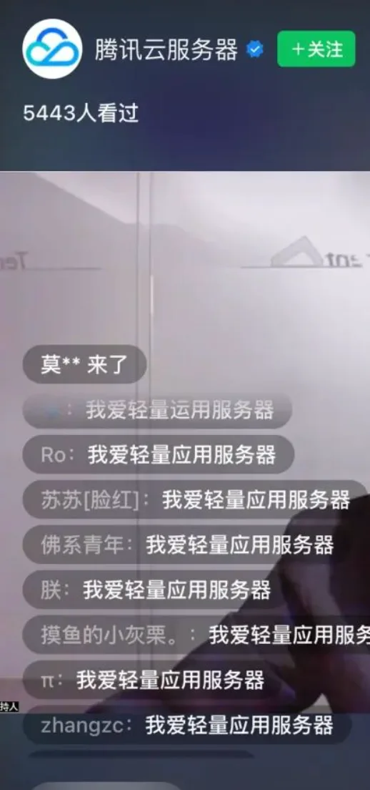
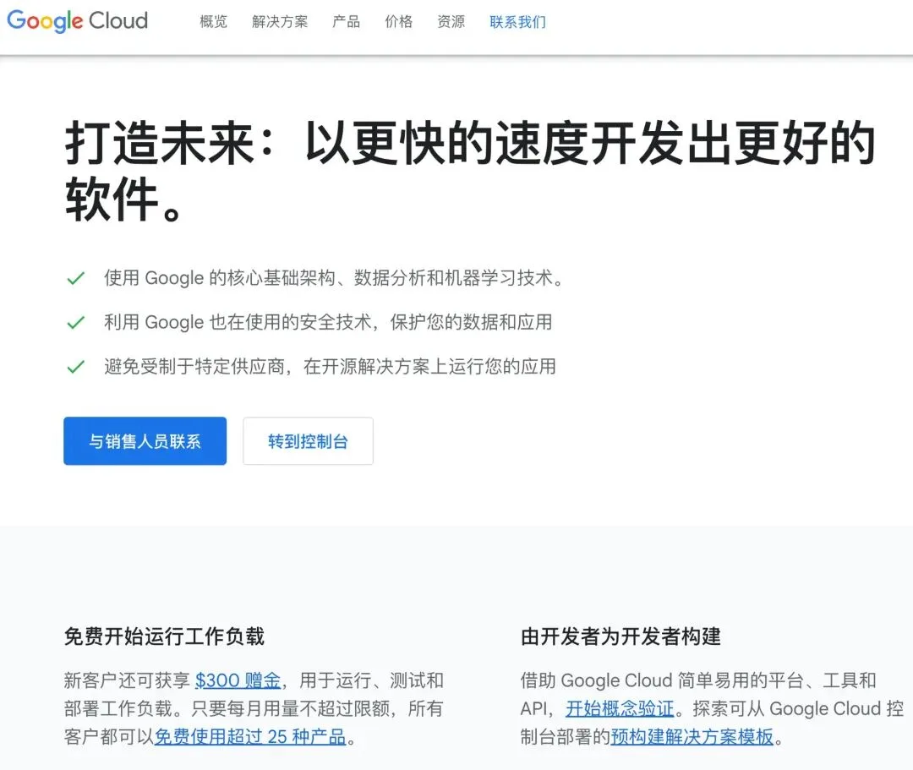
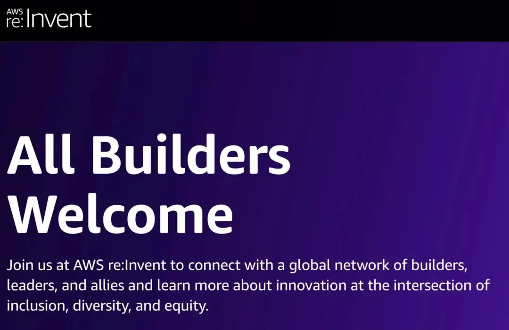
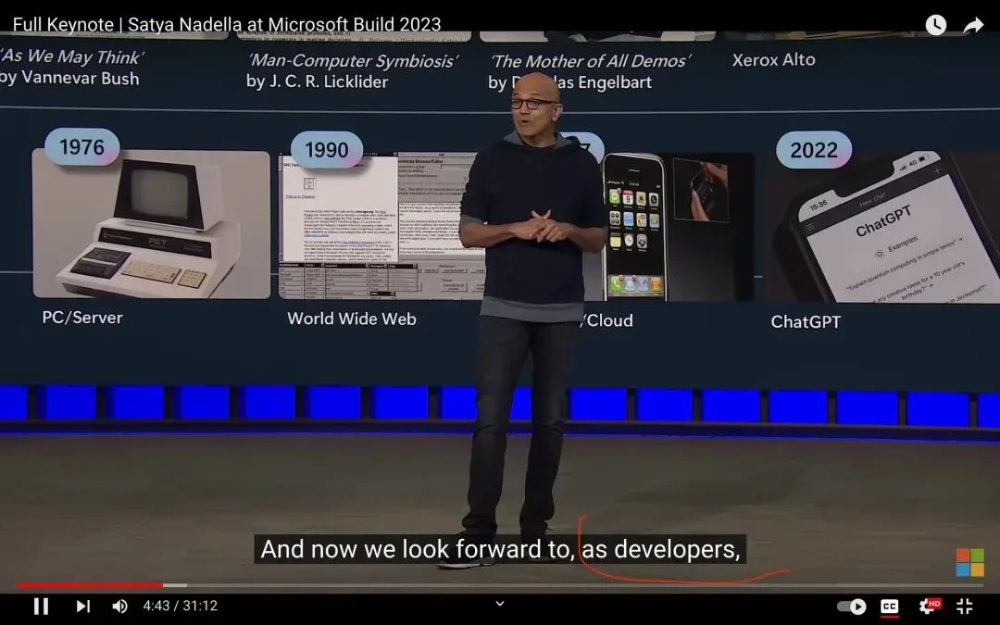
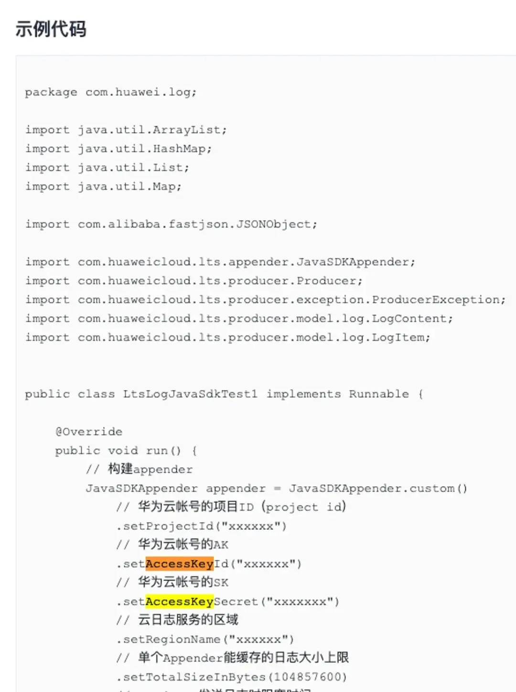
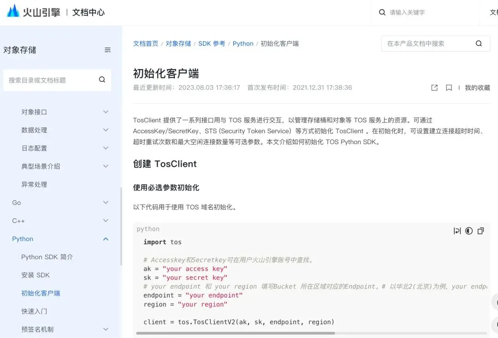

> 原作者：瑞典马工

## 摘要

云厂商没有清晰的用户画像，市场营销策略混乱，技术理念落后，产品质量低下，还用种种办法惹怒专业用户，整体散发出一种草台班子随便搞搞的气息。

## 专业人士，你是专业人士！

昨天我收到了一条来自千亿营收大厂的短信，是这样说的：

> 【阿里云】尊敬的\<此处隐去用户名\>，您好：恭喜亲开启上云之旅，现加入阿里云推广返佣计划，推荐好友上云最高可获 34% 返佣！还有首单最高 100 元开单奖励等你来拿！简单几步，开启变现之路！点击查看……

也许尊敬的阿里云想知道我的反馈：

1. 作为已婚男性，我不想和任何同性或者异性互相称”亲“，如果阿里云不愿意用中国传统文化叫我马先生，可以用美国文化叫我单名 Chi，或者用国企文化叫我马工，任何一个都比“亲”得体。

2. 作为企业雇员，收取（潜在）供应商的现金报酬是非常不合适的。我一点都不想要你的返佣，更不想踏上所谓的变现之路。

3. 100 元的奖励，大多数工程师是看不上的，都不够订阅一个月 ChatGPT Plus。

我在一个微信群里和同行发牢骚说：“要不阿里云干脆说送一盒鸡蛋算了，我还可以发展我妈妈给他们贡献一个新增客户数 KPI。”然后微信群的朋友就给我发了这个：“呐，五盒鸡蛋送给你。”

我还能说什么呢？只能默默的把这个活动页面转到我的邻居购物分享群。

另外一个行业大佬，也是一样的。搞个产品介绍直播，还把观众当猴子耍，要“宝宝们”在评论区统一节奏表忠心：“我爱轻量应用服务器”。

“宝宝们”这么低声下气的出卖自己的职业自尊，会得到什么报酬呢？一个公仔！还是抽到签才有的！

我很困惑。这些营收几百上千亿的云厂家雇佣了很多专业人士，一定做过用户画像，那么他们的典型用户画像难道是这样的？

1. 特别穷，看到“最高一百元奖励”的短信就觉得很诱惑。

2. 特别闲，会在直播间列队打口号。

3. 特别缺爱，喜欢被人叫“宝宝”和“亲”。

4. 完全不在乎职业声誉，刚注册云账号的第二天就向同行推荐。

作为一个云计算用户，我觉得我的职业尊严被践踏了。

搞了这么多年，云厂家就没把用户当专业人士看，更没把自己当作专业 IT 供应商看，整个气氛就像一个朋友说的：“他们把云计算做出了县城农贸市场的感觉。”

## 云计算的用户究竟是谁？

云计算的用户是谁？本来是一个很简单的问题，主流厂商的画像都很一致，几乎没有分歧。

### GCP 的目标用户是谁？

GCP 首页开门见山的定位：由开发者为开发者构建的 GCP，是为了帮助开发者以更快的速度开发出更好的软件。

### AWS 的目标用户是谁？

AWS 从 2018 年起就称呼他们的客户为 Builder。Builder 者，建造者也，不仅是专业人士，而且是积极的专业人士。

### Azure 的目标用户是谁？

微软 CEO 纳德拉也说得很明白：开发者，100% 的专业人士。

没有一家“亲”我，也不会给我发购物卡，也不给我寄公仔，但是我感觉被尊重了被理解了。我用云不是为了当“宝宝”，也不是为了“34% 返佣”，作为一个开发者，我用云就是为了更好更快更安全的建造软件。

为了建造更好的软件，一个开发者期望云厂家提供什么呢？这个答案可能因人而异，但是下面三个是比较普遍的：

1. 探索先进的技术理念。

2. 提供能够落地上述理念的云产品。

3. 提供成功案例以供参考。

跟这些比起来，公仔，返佣和购物券是一文不值的。

## 云厂家有责任探索和传播先进技术理念

PingCAP 是我国最优秀的基础软件厂家之一。该公司 CTO 半年前发朋友圈庆祝一件事：他写了一篇文章，在 hackernews 被首页推荐了。

文章标题是什么呢？《DynamoDB 2022 论文读后感[1]》，黄东旭读到 AWS DynamoDB 团队发的一片论文，发现关注的问题很一致，赶紧写了一篇读后感。在他的号召下，我也把论文读了一遍，还接触到了”可预测性能比高性能更重要“这个新鲜的观念。虽然暂时并不赞同，但是这个观点已经在我脑海里免费驻扎了。

这是一个典型的先进技术理念的传播途径：云厂家前沿团队提出自己的主张，业界意见领袖做出回应，专业媒体自发传播，开发者广泛参与，最终这项技术成为（或者不成为）业界主流。

请注意，AWS 不会给黄东旭返佣，黄东旭也不需要去 yc 刷脸求推荐，我也不期望 yc 给我送公仔，各位读者也别期望我叫你们宝宝。这是 professionals 和 professionals 之间的正常，体面，健康的交流。

过去几年，Serverless，IaC，Cloud Native，ARM 服务器基本都是这个路线，而微服务，DevOps，事件驱动架构也借助云厂商的推广得到了更广泛的普及。

我们用户当然知道中美基础软件有差距，并不期待本土云厂商做到同等程度，但是他们有时候实在太掉链子了。下面试举两例。

### 无聊的高并发问题

在本世纪初，一台 Apache 服务器只能处理很可怜的一两百个并发请求。最优秀的软件也很难处理上万的并发，那时候业界有个著名的 C10K 问题[2]，谁要是能做到几千并发，那就是业界高手，人中翘楚。

但是随着 Epoll 在 2003 年和 Nginx 在 2004 年的相继面世，C10K 问题得到了彻底解决。随便一个小白只要学会处理 Epoll Edge-triggered 的事件，甚至只要学会配置 Nginx，就可以达到前几年大师们做梦都不敢想的高并发。

有趣的是，20 年后的今天，阿里云向我们推荐的成功案例[《竞赛成绩发布仅需 5 秒，杭州亚运会怎么做到的？》[3]](https://mp.weixin.qq.com/s?__biz=MzA4NjI4MzM4MQ==&mid=2660237950&idx=1&sn=8d9d9237dd3fc84aa283400164d71f2f&scene=21#wechat_redirect)提及：

> 9 月 27 日共进行 30 个竞赛分项，379 场比赛，涉及场馆 35 个，场馆侧累计上报 109393 条赛事信息数据（ODF 数据），中央成绩系统向官网、INFO 系统、智能亚运一站通、杭州亚运行等各大信息发布平台累计推送 358567 条赛事信息数据。

体育界的朋友听到这个，会觉得“不明觉厉”，但是从业人士计算一下，就发现这个系统的的 QPS 只有 109393/8/3600 = 3.8。即使算上十倍高峰值，也只有 38 请求每秒，可以说我用手机装个二十年前的 Apache，都能从容处理。Linkedin 团队在 2014 年就发布了一个类似的消息队列系统的测评，Kafka 能处理两百万请求每秒[4]，这可是实打实的差了十万倍。

实际上，不管两百万还是两千万，在 2023 年的今天，可扩容性（Scalability）和二十年前的 C10K 一样，是一个已经解决的问题。只要预算足够，用 CDN + LB + Kubernetes + MQ + DynamoDB + S3，我一个人能建造一个全地球 80 亿人民一起访问的网站，晚上都不用值班运维的那种。

如果今天还有人津津乐道什么高并发海量规模，只能说明一个事：这哥们（大多数是哥们）过去十年已经停止学习了，还活在上一个时代。

### 糟糕的软件工程实践

在建筑工地上，所有人不管什么来头都要戴安全帽，否则安监局会把单位罚死。他们不会听你“天气太热”，“他还是个实习生”，“机器没有开动”，“已经下班了”的任何理由。从 2021 年开始，规定严格到“为充分发挥保护力，且安全帽佩戴时必须按头围的大小调整帽箍并系紧下颚带”。

软件工程领域，有一个几乎同等重要的原则是“任何时候不要把密码硬编码到代码中[5]”。这是行业常识了。但是由于软件工程行业比较新，安监局和网信办还没有关注到，没有对程序开发单位实施日常监管。

这个时候，云厂商作为基础软件提供商，有道德责任做出表率，并且提供工具帮助广大用户遵守这条规则，以保证全行业的安全。

然而我们却一次又一次的看到云厂商在大面积的违反这条规则，甚至主动向用户推荐违规动作。

华为云《云日志服务 Java SDK》[6]就是这么一个例子。

火山引擎也是一样的。在他们 2023.08.03 更新的《对象存储 Python SDK 参考》[8]中，犯的错误和其他云厂商是一模一样的。

我今年年初写了两篇分别指出[腾讯云[7]](https://mp.weixin.qq.com/s?__biz=MzkwODMyMDE2NQ==&mid=2247483813&idx=1&sn=840b558c1f30e0a769c905d1fa18e0e0&scene=21#wechat_redirect)和[阿里云](/db/db-in-k8s/)的在范例代码硬编码AKSK的问题，后来他们都联系我告知已经修正，并且表示感谢。我猜其他我没查看的云厂商的情况也类似。

2023 年了，一个安全帽都不戴的工程队建的房子，我不敢住。一个硬编码 AKSK 的软件厂商做出来的软件，我也不敢用，更不敢把我的安全委托给他们。

## 云厂家应该提供落地先进理念的云服务

软件工程领域里，很多时候一些先进的理念听起来很好，但是落地不了，或者橘生淮北则为枳了。这是一个众所周知的困局。

要破除这种困局，当然需要甲方在管理，流程和文化上做大量工作，而云厂商的责任是提供良好的工具以帮助甲方降低落地成本。

还是以一个安全理念为例。最小权限原则[9]早在 1970 年代就提出来了，其内容是

> 在计算机科学以及其它领域中，最小权限原则是要求计算环境中的特定抽象层的每个模组如进程、用户或者计算机程序只能访问当下所必需的信息或者资源。
>
> 赋予每一个合法动作最小的权限，就是为了保护数据以及功能避免受到错误或者恶意行为的破坏。

腾讯云的《最小权限原则说明》，阿里云卓越架构的《数据安全访问原则》，华为云的《建议对不同角色的 IAM 用户仅设置最小权限》，火山引擎的《权限审计》都对此理念表示赞同。

但是就像大多数安全原则一样，最小权限原则也有成本：

1. 开发者要为每一个模块定义一组最小的必要权限。

2. 开发者要把这一套权限赋予一个角色。

3. 开发者要把这个角色和对应的软件模块绑定。

4. 开发者要经常维护这一组权限。

假设我们用 FaaS 创建了 100 个函数，那么我们就要定义 100 套权限，100 个角色，并且做至少 100 次绑定。显然，如果没有合适的工具，这个工作量会非常高，以至于经济上不可行。

如果你在正规云上，事情则简单很多了。你用 IAM policy 定义权限，然后用 IaC（Terraform 或者 CloudFormation）定义角色，利用 Lambda execution role[11 把角色和负载绑定。由于所有的配置都是代码，所以你的整个流程可以用 GitOps 自动化，不需要手动操作。对具体实现感兴趣的朋友可以读一下这篇《serverless-iam-roles-per-function》。由于门槛降到这么低，所以现在 One dedicated IAM role per function 已经成为多个网络安全厂商的默认检查项了。

下面我们一一考察下本土云厂商对这个理念落地的支持。

### 腾讯云 CAM 不支持角色和工作负载绑定

腾讯云 CAM 的角色虽然长得很像 AWS IAM role，但是缺失了最基础的一块：CAM 的角色无法和工作负载绑定[12]，而只能绑定到腾讯云账号、已支持角色功能的产品服务和身份提供商三者之一。这样我们就不可能为每一个 FaaS 函数绑定一个角色了。

因此结论是：腾讯云虽然提倡最小权限原则这个理念，但是产品跟不上，用户无法在腾讯云上落地该理念。

### 华为云不支持委托（Delegation）和工作负载绑定

和腾讯云一样，华为云的委托的主体也只支持华为云账号和已支持委托功能的云服务，而不支持用户的工作负载。

（请注意，华为云命名和行业惯例不一样，他们的角色更像一种预定义 User。对应于行业 Role 概念的是他们的委托，Delegation）

所以结论是一样的：华为云虽然提倡最小权限原则这个理念，但是产品跟不上，用户无法在华为云上落地该理念。

### 火山引擎不支持角色和工作负载绑定

不出所料，火山引擎 IAM 的角色也只支持云账号和云服务[13]，和华为云一模一样。不再赘述。

### 阿里云不支持角色和工作负载绑定

全村唯一的希望。阿里云 RAM，也不支持角色和工作负载的绑定§[14]

### 全军覆没

所以结论是，虽然大家口号都喊得响，还以专家姿态写文章教育用户《怎么在云中实现最小权限》[15]，但是落到自己的产品上，就全军覆没了，一个能打的都没有。

几个厂家的 IAM 模型都是借鉴 AWS 的产品设计，所以概念和术语几乎一模一样，这是后进者的常见策略。但是费解的是，几家都只借鉴了一半，把外行都能看懂的搬过来，彻底忽视稍微专业一点但是价值最大的那部分。这让人不禁怀疑，这几家厂商的决策者，究竟有没有研究过 IAM 的用途，还是说在需求 Excel 表格里打个勾就交差了。

## 云厂商经常推荐一些古董技术

腾讯云开发者是腾讯云官方社区公众号，其定位是：

> 汇聚技术开发者群体，分享技术干货，打造技术影响力交流社区

最近两天，他们推荐了一篇文章[《Redis：你永远不知道告警和下班，谁先到来》[16]](https://mp.weixin.qq.com/s?__biz=MzI2NDU4OTExOQ==&mid=2247661429&idx=1&sn=63b53fc7feea7780ab05ce592b7cc24b&scene=21#wechat_redirect)。这篇文章被标记为“腾讯技术人原创”，但是我认为这篇文章技术上一文不值，只有传播学上的价值：它暴露了腾讯云很多所谓专家不懂云计算和基础软件的真相。

这篇文章的问题在于：

1. 全文没有提及一个云服务，全都是自建系统。

2. 自建 Redis，但是又没有 Redis 专家，靠业务团队的程序员临时抱佛脚排查问题。

3. 没有可用的可观测系统，出故障了要上虚拟机手动敲命令。

4. 直接上生产环境运行脚本。这是一个很高风险的安全流程漏洞。

5. 最后排查的结果没有固化到产品/云服务中，而只能以文章的形式传播。

文章透露的团队设置，到技术架构，到故障处理流程，到生命周期管理，都是十五年前的流行做法，那时候 IT 从业者没有云服务可用，只能这样自求多福。

我把这篇文章发给几位以前在腾讯云工作的朋友读，他们不得不痛苦的承认：

## 云厂商提供成功案例了吗？

本土云计算厂家也做了十几年了，营收额都是几百上千亿的，用户应该和我肉眼看到天上的星星一样多，但是这么多星星里，有没有一颗大明星呢？读者您可以暂停一下阅读，想一想：这么多年来，有哪个云计算用户的架构让你印象深刻，有哪个云计算案例让你跃跃欲试？

我是完全没有印象的，我只隐约记得这朵云和这个世界五百强签战略合作协议，那朵云中了那个央企的三亿服务器大单子。但是没有一个案例展示云厂商提升了客户的 IT 生产力。

关于这个怪象，我在去年的文章[《腾讯云阿里云做的真的是云计算吗?》[17]](https://mp.weixin.qq.com/s?__biz=MzkwODMyMDE2NQ==&mid=2247483743&idx=1&sn=9f329de1649fac75f69e57270978d047&scene=21#wechat_redirect)讨论过。后来两个厂商的朋友都找我交流过，都无可奈何的承认我指出的问题确实存在：十几年来，几个厂商加起来没有凑出一个有说服力的上云成功案例。

一年又过去了，情况似乎依旧，仍然没有看到一个漂亮的案例。这一点让人非常费解。

## 云用户眼中的云厂商从业者：草台班子

作为一个对等报复，我这个云用户描述一下我心目中的云厂商画像：

1. 没有专业洞察力

    很多工程师不懂云计算技术，缺乏基本的云计算常识，更不用说自己思考云计算产品了。对着 AWS 画好的老虎抄，他们都能抄出一只狗。

    不少市场部员工只会和亲亲宝宝们推销女士衬衣，和云计算用户搭不上话，甚至没见过云计算用户真人。比如最近冯老板的文章[《是时候放弃云计算了吗？》](/cloud/odyssey/)很火，影响很大，云厂商却无言以对，只能装死。

2. 缺乏专业技术

    云厂商有很多从业务线过来的老专家，开口就是十亿用户，闭口就是万亿流量，但谈论的不过是早已经解决的老古董 Scalability 问题。同时老专家对新技术新问题比如 Infra as Code，GitOps，FaaS，云安全却缺乏基本了解，甚至缺乏了解的兴趣。

3. 缺乏基本的质量控制能力

    打开任何一个云厂商的文档去读，都会发现很多死链接和错别字。年复一年的，几乎没有长进。说得难听点，这种质量管理能力根本不配称之为工程团队，只能算是软件包工头带的农闲软件施工队。

4. 漠视网络安全

    网络安全绝对不只是安全团队的责任。每个 IT 团队的成员都应该接受基本的网络安全教育，并且遵守基本的安全原则。很不幸，在很多产品/文档/演讲中，云厂商员工的表现出的安全意识是低于行业平均水平的，这一点也许和他们当年习惯快速上线应用有关系。

### 参考资料

[1]

DynamoDB 2022 论文读后感： *<https://me.0xffff.me/dynamodb2022.html>*

[2]

C10K 问题： *<https://en.wikipedia.org/wiki/C10k_problem>*

[3]

《: *<https://mp.weixin.qq.com/s/GcCJfIgUZuOY_gNYBHzZnA>*

[4]

Kafka 能处理两百万请求每秒： *<https://engineering.linkedin.com/kafka/benchmarking-apache-kafka-2-million-writes-second-three-cheap-machines>*

[5]

任何时候不要把密码硬编码到代码中： *<https://cwe.mitre.org/data/definitions/798.html>*

[6]

《云日志服务 Java SDK》: *<https://support.huaweicloud.com/usermanual-lts/lts_03_1003.html>*

[7]

腾讯云： *<https://mp.weixin.qq.com/s/JnK3sIPozZqe2kFoFO1mJg>*

[8]

《对象存储 Python SDK 参考》: *<https://www.volcengine.com/docs/6349/93483>*

[9]

最小权限原则： *<https://zh.wikipedia.org/zh-hans/%E6%9C%80%E5%B0%8F%E6%9D%83%E9%99%90%E5%8E%9F%E5%88%99>*

[10]

《最小权限原则说明》: *<https://cloud.tencent.com/document/product/436/38618>*

[11]

Lambda execution role: *<https://docs.aws.amazon.com/lambda/latest/dg/lambda-intro-execution-role.html>*

[12]

CAM 的角色无法和工作负载绑定： *<https://cloud.tencent.com/document/product/598/19420>*

[13]

火山引擎 IAM 的角色也只支持云账号和云服务： *<https://www.volcengine.com/docs/6257/64979>*

[14]

阿里云 RAM，也不支持角色和工作负载的绑定： *<https://help.aliyun.com/zh/ram/user-guide/ram-role-overview>*

[15]

《怎么在云中实现最小权限》: *<https://developer.aliyun.com/article/762525>*

[16]

《Redis：你永远不知道告警和下班，谁先到来》: *<https://mp.weixin.qq.com/s/Tg6gJSOS1HErrFLzlIqrtA>*

[17]

《腾讯云阿里云做的真的是云计算吗?》: *<https://mp.weixin.qq.com/s/mMvDiTiMOt6eiTTYbHvbbQ>*

PS，由于我用的云写作工具的 bug，此处索引有几处混乱，云的工程师不愿意周末加班修 bug，我也不愿意手动排索引，请各位读者谅解。

转载注记：

尽管相对于大多数[换皮国产信创](/db/db-choke/)这类玩意，云厂商的服务已经高到不知道哪里去了；但在许多专业开发者与平台架构师眼中，仍然属于及格线上的大锅饭产品 —— 从业务线新鲜拉来的码农老帮菜组建草台班子照搬 AWS 画虎画皮，根据国内运维的使用习惯魔改糊弄交差做出来的东西。实话说，这些云厂商如果老老实实做好做精卖存算网资源的生意，而不是遍地开花弄一两百个大锅饭服务，也许会活的[更好更体面](/cloud/profit/)。

对云退出感兴趣的朋友还可以参阅以下文章：

[是时候放弃云计算了吗？](/cloud/odyssey/)\

[下云奥德赛](/cloud/odyssey/)\

[云数据库是不是智商税](/cloud/rds/)\

[云盘是不是杀猪盘？](/cloud/ebs/)\

[云 SLA 是不是安慰剂？](/cloud/sla/)\

[云计算为啥还没挖沙子赚钱？](/cloud/profit/)\

[FinOps 终点是下云](/cloud/finops/)\

[范式转移：从云到本地优先](/cloud/paradigm/)\

---

发布版本：[微信公众号转载页](https://mp.weixin.qq.com/s/y9IradwxTxOsUGcOHia1XQ)
