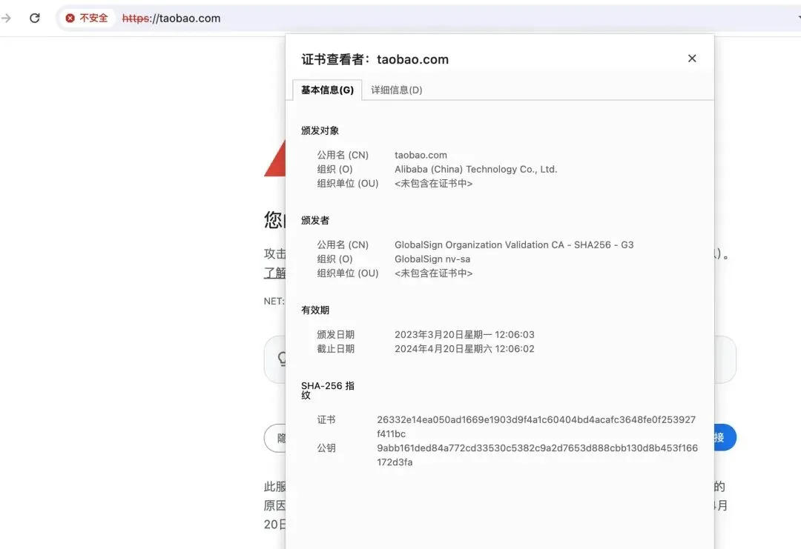
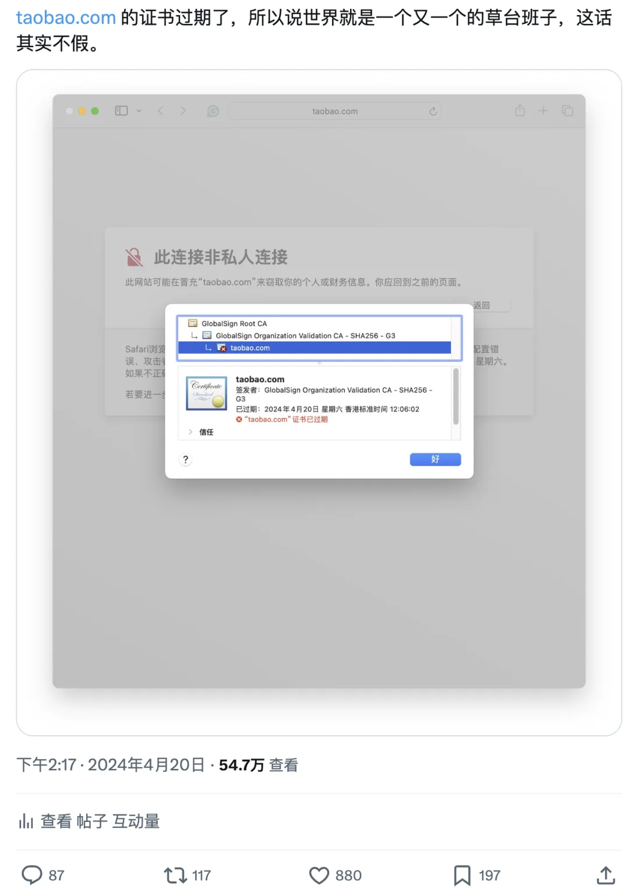
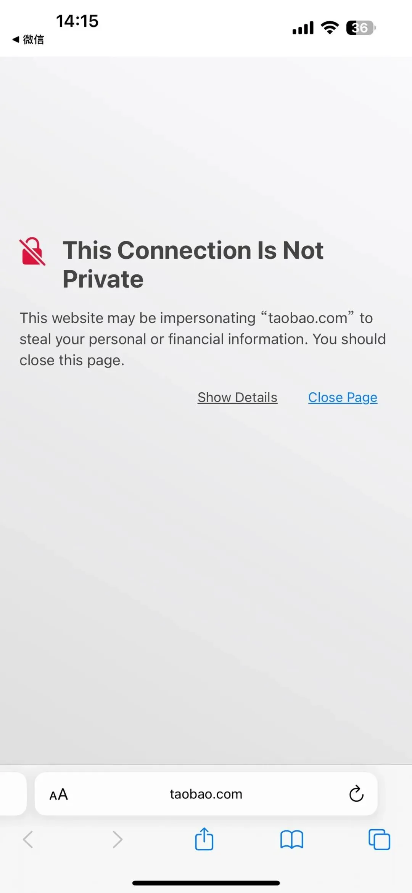
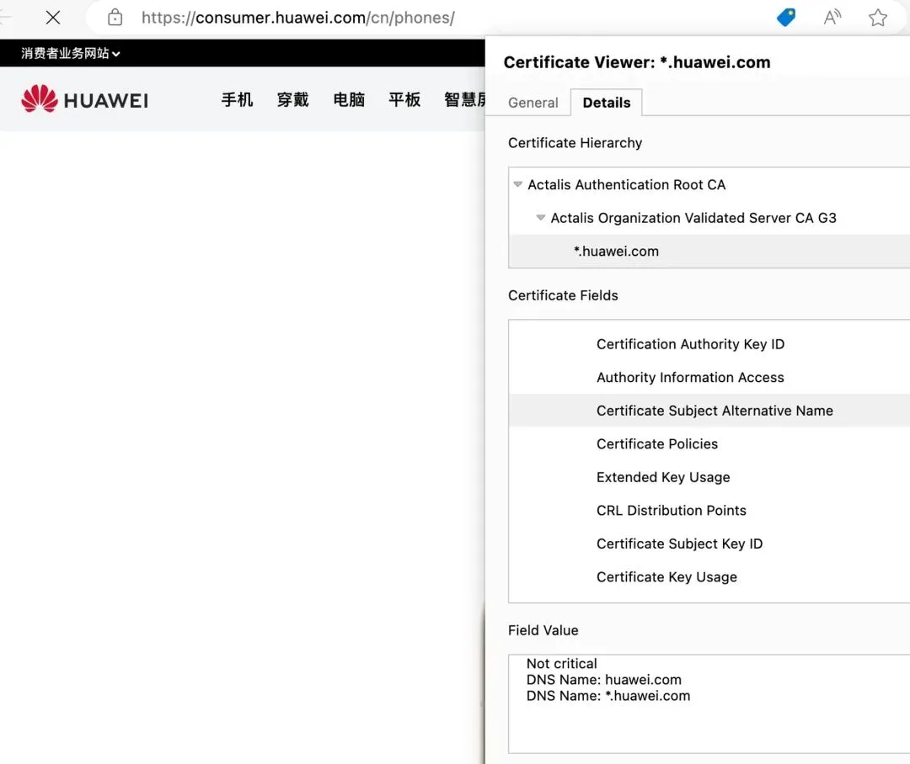

> 原作者：瑞典马工

## 菜鸟们的工程都是一样的菜

上周我发了一篇文章，批评号称已经“[**走通云原生之路**](/cloud/tencent-cloud-native/)”的腾讯集团连个 HTTPS 证书都管不好，不指导其他人用云。

今天，就有朋友发现淘宝也发生一模一样的问题。

[**下云先锋冯老板**](/cloud/debris/) · [**第一时间验证**](http://mp.weixin.qq.com/s?__biz=MzU5ODAyNTM5Ng==&mid=2247487367&idx=1&sn=d6e4abd2b2249d27bd8b8146b591b026&chksm=fe4b3a5cc93cb34a8e90e4b7f06803fa11ee8234014cd4f1aedff59e3bf3c846b3cb133090f2&scene=21#wechat_redirect)

---

冯老板浏览器默认用的是英文，翻译成中文的话，那部分警告内容是：

> 这个网站可能在冒充“taobao.com”来窃取您的个人或财务信息。您应该关闭这个页面。

问题的直接原因很简单：证书正好在今天过期，运维团队没有提前更新证书，可能安排了谁，但是他/她忘记了。所以，用户看到的就是淘宝网在冒充淘宝网。

## 本来不应该这么菜

按照互联网公司的常规流程，这个事基本是这样处理的：

1. 找个倒霉工程师或者小组长背锅，倒霉鬼年终奖泡汤。

2. 技术线大老板们以仲裁者的口吻发文件，要求大家“勤勉尽职，在客户界面上马虎不得。举一反三，务必排查其他漏洞。”

3. 大家该怎样还是怎样。

实际上，这个问题非常非常容易解决。阿里云自己就有**数字证书管理服务[1]**，它几乎是对着 taobao.com 的耳朵说：

> 证书托管是一项保障 SSL 证书到期自动更新的服务。在证书即将到期时，帮助您自动申请新证书以延长证书的有效期。避免因您忘记更新，导致证书到期无法及时获取新证书。

甚至它还能自动部署到接入服务器：

> 证书托管还提供自动部署功能。开启自动部署，新证书签发后会自动被部署到对应的云产品中。

只要用好这个服务，一线工程师就不用提心吊胆的人肉记住几百个证书的更新日期，而消费者们也不会碰到莫名其妙的淘宝网冒充淘宝网错误信息，高管们也不用大发雷霆了。

那么，为什么阿里云开发了这么先进的产品，但是同一个集团的淘宝却不用呢？为什么腾讯云也有同样的 SSL 证书管理服务，而同一个集团的腾讯客服也不用呢？

我没有答案，实际上，我百思不得其解。我和很多朋友讨论过，得到几个可能的原因：

1. 云厂商自己也不会用。反正云产品也不是自己设计的，是西雅图那边设计的，产品经理只负责搬运。

2. 产品经理会用，但是产品质量跟不上，兄弟部门根本看不上。

3. 产品质量还行，云厂商也知道怎么用，但是卖不进兄弟部门。

## 不菜的厂家长什么样？

互联网企业有一个很骄傲的说法：“华为是一家很擅长硬件的企业，但是软件能力不如我们百度腾讯阿里。” 这个说法试图把软件工程神秘化，打造一个软件工程特殊论。

但是归根结底，软件工程还是个工程学。大家都是在物理规律和社会规范的约束下，控制成本和风险，利用工具组合为社会交付有价值的产品。这个行当，工程管理能力是核心竞争力之一。在硬件产品已经证明了工程管理能力的华为，至少在证书管理上比腾讯阿里强了一个档次。

华为的网站信息架构（Information Architecture）非常清晰，全集团使用 **huawei.com** 这个根域名，然后消费者，企业和电信运营商业务分别有自己的二级域名，所以他们只用一个非常简单的 TLS 证书，就能服务集团所有页面。

作为对比，淘宝和一堆的奇奇怪怪的服务共享同一个证书。其中 m.etao.com 是个被废弃的域名，虽然能解析到几个 IP，但是服务器已经不回复了。而 mei.com 更是连 DNS 解析都停了。不是亲眼所见的话，真的很难相信，作为阿里集团的核心业务的淘宝网，居然和这些乱七八糟的僵尸域名共享同一张网络身份证。

    DNS Name: *.tbcdn.cn
    DNS Name: *.taobao.com
    DNS Name: *.alicdn.com
    DNS Name: *.cmos.greencompute.org
    DNS Name: cmos.greencompute.org
    DNS Name: m.intl.taobao.com
    DNS Name: *.mobgslb.tbcache.com
    DNS Name: *.alikunlun.com
    DNS Name: alikunlun.com
    DNS Name: *.django.t.taobao.com
    DNS Name: alicdn.com
    DNS Name: *.tbcache.com
    DNS Name: *.tmall.com
    DNS Name: *.1688.com
    DNS Name: *.3c.tmall.com
    DNS Name: *.alibaba.com
    DNS Name: *.aliexpress.com
    DNS Name: *.aliqin.tmall.com
    DNS Name: *.alitrip.com
    DNS Name: *.aliyun.com
    DNS Name: *.cainiao.com
    DNS Name: *.cainiao.com.cn
    DNS Name: *.chi.taobao.com
    DNS Name: *.chi.tmall.com
    DNS Name: *.china.taobao.com
    DNS Name: *.dingtalk.com
    DNS Name: *.etao.com
    DNS Name: *.feizhu.cn
    DNS Name: *.feizhu.com
    DNS Name: *.fliggy.com
    DNS Name: *.fliggy.hk
    DNS Name: *.food.tmall.com
    DNS Name: *.jia.taobao.com
    DNS Name: *.jia.tmall.com
    DNS Name: *.ju.taobao.com
    DNS Name: *.juhuasuan.com
    DNS Name: *.lw.aliimg.com
    DNS Name: *.m.1688.com
    DNS Name: *.m.alibaba.com
    DNS Name: *.m.alitrip.com
    DNS Name: *.m.cainiao.com
    DNS Name: *.m.etao.com
    DNS Name: *.m.taobao.com
    DNS Name: *.m.taopiaopiao.com
    DNS Name: *.m.tmall.com
    DNS Name: *.m.tmall.hk
    DNS Name: *.mei.com
    DNS Name: *.taopiaopiao.com
    DNS Name: *.tmall.hk
    DNS Name: *.trip.taobao.com
    DNS Name: *.xiami.com
    DNS Name: 1688.com
    DNS Name: alibaba.com
    DNS Name: aliexpress.com
    DNS Name: alitrip.com
    DNS Name: aliyun.com
    DNS Name: cainiao.com
    DNS Name: cainiao.com.cn
    DNS Name: dingtalk.com
    DNS Name: etao.com
    DNS Name: feizhu.cn
    DNS Name: feizhu.com
    DNS Name: fliggy.com
    DNS Name: fliggy.hk
    DNS Name: juhuasuan.com
    DNS Name: mei.com
    DNS Name: taobao.com
    DNS Name: taopiaopiao.com
    DNS Name: tmall.hk
    DNS Name: xiami.com
    DNS Name: tmall.com
    DNS Name: *.cloudvideocdn.taobao.com
    DNS Name: cloudvideocdn.taobao.com
    DNS Name: tbcdn.cn

## 菜就是原罪

有朋友在云厂商就业，他跟我争论“中国云厂商这个低技术水平，是符合中国市场需求的，因为中国甲方有大量的便宜工程师，并不需要最先进的技术。美国云厂商做得好，是因为他们人工贵，需要云来自动化。”

我认为这是胡扯，用他这个逻辑也可以主张：

1. 中国有全世界最好最便宜的邮政系统，所以不需要最先进的移动互联网技术，等美国部署好了 5G，中国再来部署 4G 吧。

2. 中国有全世界发展中国家覆盖最完善的银行网点，有便宜又量大的桂圆，因此中国不需要移动支付。

3. 中国有全世界工资性价比最好的医生，所以不需要创新药，因此恒瑞医药和百济神州应该去做仿制药。

4. 中国大城市有很好的公交覆盖，所以发展汽车的迫切性不足，那些老大爷厂商就足够满足大家的需求了。

实际上呢，中国建成了世界上最完善先进的移动互联网，中国移动支付渗透率在主要经济体中世界前列，中国创新药企业最近十年已经向全世界 license out，中国新车厂已经对欧洲传统车企造成了巨大的精神压力。

借口可以找很多，但是中国云计算行业做成这个糟糕的样子，在国际国内都缺乏竞争力，根本原因就是现在这些厂商太菜了。菜就是原罪，句号。

### 参考资料

[1]

数字证书管理服务： *<https://cn.aliyun.com/product/cas>*

---

发布版本：[微信公众号转载页](https://mp.weixin.qq.com/s/jYIqj94B07oTu9KC85bjtQ)
