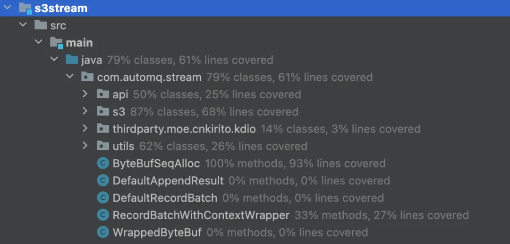
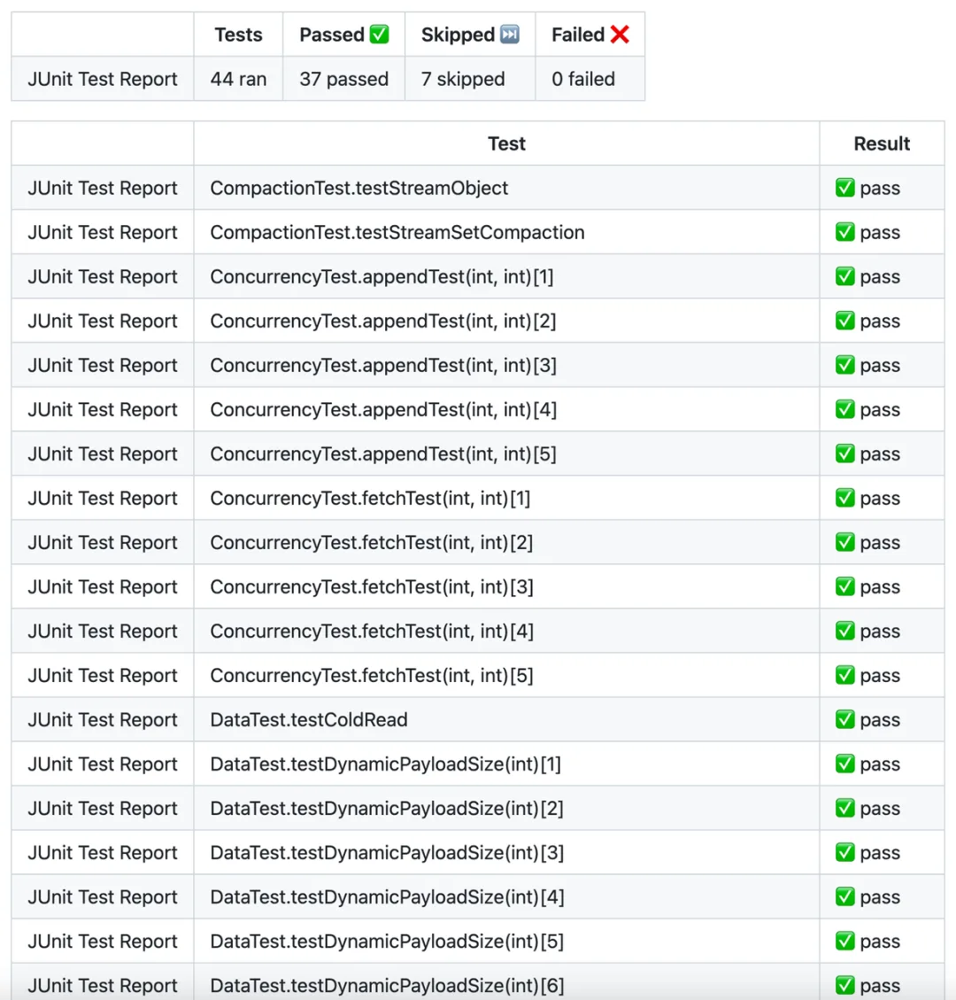
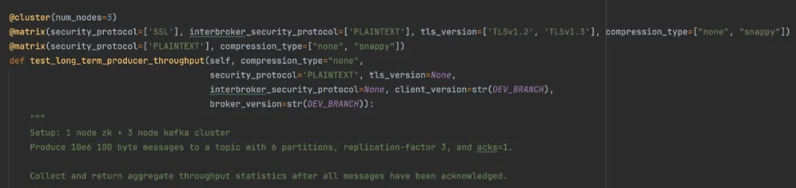
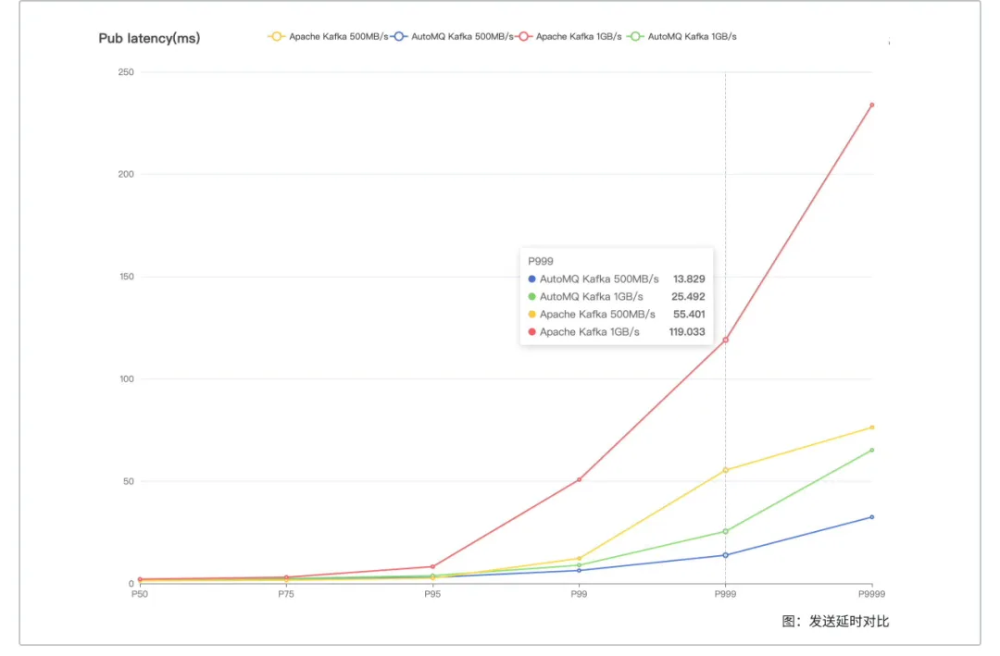
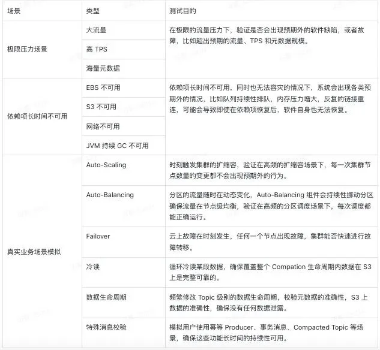
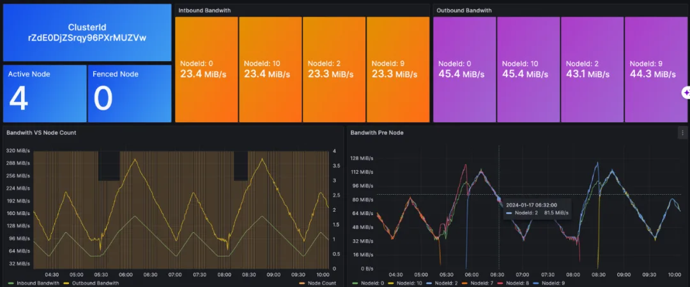
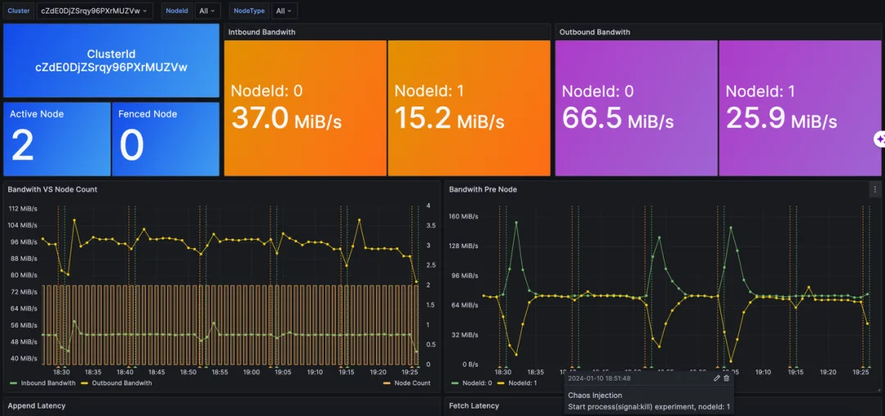

> 原作者：周新宇

作者 \| 周新宇

恰逢今天读到了行业大佬对近期频发的公有云故障的思考《[你用的公有云都没做过测试](/cloud/public-cloud-untested/)》，该文章的核心观点是「公有云是没法测试的」。我其实对这个事情有相反的观点，云服务本身也是软件，软件工程发展至今测试手段是多样和丰富的，而且公有云因为有大规模的生产流量优势，用好金丝雀 / 灰度发布能在新版本全网发布前尽可能揪出从其他测试环节中逃逸的 Bug。

那既然测试是好做的，为什么从结果来看，公有云故障还是那么多呢，结合我在云厂商的工作经历来看，两朵云近两次 IAM 相关的故障背后，大概率还是投入问题。IAM 产品本身不产生直接的营收，在营收至上的公有云厂商里，IAM 团队的处境可想而知。我曾经负责的产品因为在核心的数据链路引入了 IAM 进行鉴权，所以跟 IAM 团队打交道的次数不少，但每次看他们一个小团队支撑着如此重要的业务，也不免胆战心惊。所以，从墨菲定律来看，两个国内头部云厂商都在 IAM 上栽了跟头，也是偶然中的必然了。

1 选择云厂商投入最大、规模最大的云服务

AutoMQ 一直秉承云原生上云的理念，我们深度使用云提供的原生能力研发了存算分离的 AutoMQ，相比较 Apache Kafka，我们获得了 10 倍的成本优势，在运维效率、弹性等方面也有质的飞跃。所以，公有云是否能稳定运行，跟我们的业务是息息相关的，所以在此我想谈一些关于公有云故障的思考。

IAM 的问题是个例，还是具有普遍性？我们可以看一下云厂商的产品目录，数百个自营产品，再结合云厂商投入的研发人数，我们可以很容易得出一个结论「大量的云产品测试资源的投入是不足的」。所以，AutoMQ 在第一天选择依赖哪些云原生的能力时，就定下了两个原则 [1]，其中之一就是「选择云厂商投入最大、规模最大的云服务」，这类服务成熟度往往是最高的，基本都集中在 IaaS 层，比如计算、存储和网络等相关产品，当然数据库也是云厂商的兵家必争之地。

2 如何构建 AutoMQ 高质量的测试基础设施

回到 AutoMQ 上来，我们团队过往的经历让我们深刻意识到测试体系建设的重要性，如果你曾经也在测试资源严重不足的情况下运维着数千个生产节点，你就会理解我们当时的如履薄冰，以及现在要做好 AutoMQ 质量保障这件事情的决心。

作为企业级软件服务，完备的测试基础设施的重要性是不言而喻的，至少体现在三个维度：

- 对于软件本身，是软件质量保障的强有力手段，是软件能够快速、稳定、高效迭代的基础。

- 对于团队，是实践卓越工程师文化、Automate Everything 的基础，是提高研发流畅度，信心度，工作幸福度的关键。

- 对于用户，是了解软件本身以及产品能力的重要入口，可以将部分测试能力做成产品化（比如将故障注入这件事情交给用户亲自来做），部分测试能力还可以做成 Show Case，比如 gRPC 就将其性能测试大盘公开出来了 [2]。

今天，也趁这次机会，向 AutoMQ 的用户介绍一下我们已经具备的一些测试能力。

Unit Testing

单元测试是所有模块的必选项，在单元测试需要 Mock Everything 来进行测试，依赖的组件库包括 JUnit、Mockito、Awaitility[3]等。以 AutoMQ 的核心模块 S3Stream 为例，目前单测有 80% 左右的类覆盖率，60%+ 的行覆盖率，后续也会持续提升。

S3Stream 单元测试覆盖率结果

Integration Testing

将软件的所有或者部分模块，以及外部依赖集成起来进行测试。一般优秀的外部依赖软件都会提供集成测试套件，比如：Test::RedisServer。在大部分软件都容器化过后，通过 TestContainer 进行集成测试也非常方便，它集成了大部分有状态软件，比如我们通过依赖 Adobe 提供的 S3Mock 组件 [4]，将 S3Stream 与对象存储依赖集成起来开发了一系列的集成测试用例，覆盖了 Compaction、并发 Append、并发 Fetch、热 / 冷读、动态 Payload、Stream 操作、Cache 驱逐、动态配置等场景。每个尝试修改 S3Stream 的 Pull Request 都需要通过相应的单元测试和集成测试。

一次 Pull Request 下 S3Stream 的集成测试结果 E2E Testing

端到端测试（End-to-End Test）是一种软件测试方法，旨在模拟真实的用户场景，检测整个系统的完整性和功能，E2E 测试通常是自动化的，通过自动化的测试工具和流程模拟用户的行为和操作，验证系统的功能、性能和可靠性。

得益于 AutoMQ 的存算分离架构，我们复用了 Apache Kafka 全部的计算层代码，100% 的兼容性让 AutoMQ 可以充分利用 Apache Kafka 的 E2E 测试基础设施。Kafka 使用了一种矩阵式的测试方法，能够支持一个测试用例跑在不同的 Kafka 集群规模，甚至不同的集群配置下，能够放大每一个测试用例的价值。如下述的一个 Producer 吞吐量相关的测试用例，将跑在一个具备 5 个节点的集群上，有两个矩阵，第一个矩阵将提供 4 种不同的集群配置组合，第二个矩阵提供 2 种组合，该用例一共会跑在 6 种场景下。

Apache Kafka 中一个普普通通的矩阵式测试用例

AutoMQ 基于 KRaft 版本 Kafka 进行研发的，所以在排除 Zookeeper 模式相关的 E2E 测试用例后，我们通过了剩下 500+ 用例，并会周期性地运行这些测试用例，及时发现 Broken 的情况。

Performance Testing

作为一款数据密集型软件，吞吐和延迟这些性能指标都是至关重要的。AutoMQ 通过 OpenMessaging Benchmark 框架[5] 进行测试，也用于与其他产品进行技术指标的对比，如下图所示是 AutoMQ 在特定流量模型下的延迟指标对比图，更多的 AutoMQ 技术指标详见性能白皮书 [6]。

AutoMQ 在特定流量模型下的延迟指标对比

当然，性能测试并不意味着只在版本发布时，或者跟竞品对比的时候去做，更重要的是要维护好性能基线，及时（比如按天）去回归主干的代码，做好性能的对比，能够及时发现某一次 Commit 影响到了性能指标。否则，性能可能就会随着软件的迭代逐渐恶化，甚至很难溯源出在什么时间点性能出现了下滑。当然，性能基线的自动化回归，AutoMQ 当前还没有完全具备，后续有进展后及时同步给大家。

Soak Testing

常见的代码缺陷大都在上述的测试环节中发现并修复，但对于一些很难触发的 Corner Case，需要通过长期的浸泡测试或者耐力测试，通过在不同的流量模型下长时间测试系统，有助于发现一些罕见的软件缺陷，比如内存泄漏等问题。

对于 AutoMQ 这款软件来讲，包含分布式、高并发、存储、多云等多种特征，导致测试的难度相当大，比如一些分布式时序问题，可能要在很极端的场景下才能出现。为了更好地进行耐力测试，AutoMQ 研发了 Marathon（马拉松）框架，来屏蔽集群部署、扩缩容、故障注入、多云部署等细节，让研发同学能够专注于构建耐力测试的场景。目前我们已经在 7\*24 小时运行的耐力测试用例如下表所示。

这些用例默认会跑在一个弹性流量的背景下，随时触发集群的自动扩缩容，如下图所示，是一个耐力测试下正在频繁扩容和缩容的 AutoMQ 集群。

根据流量自动扩缩容的 AutoMQ 集群

Chaos Testing

故障注入测试也是基础软件不可或缺的最后一环，AutoMQ 能否在 ECS 宕机、网络严重丢包、EBS Hang、S3 不可用等故障环境下按预期完成容灾，也是需要长时间进行验证。我们结合故障注入测试和耐力测试，通过 Chaos Mesh 组件 [7] ，将耐力测试的所有用例，都会跑在一个随机性、周期性注入故障的集群环境中，检验 AutoMQ 的表现是否符合预期。

一个定时注入随机故障的 AutoMQ 集群

如上图所示，图中相邻的两根竖虚线表示一次故障注入的开始和结束，我们可以很容易发现，在上述两个节点的集群中，一个节点出现故障时，流量会持续跌到 0，然后分区会通过故障转移挪动到另一个节点，所以另一个节点出现了持续的流量上涨。在故障结束后，AutoBalancing 组件又会重新调度分区，将流量尽可能调度到比较均衡的状态。

3 结束语

公有云的故障不会结束，每次故障如果能给我们带来一些思考和警示，能激励我们持续性投入到软件质量保障上面，那每一次故障带来的都会是进步。AutoMQ 目前的测试体系每月会消耗数万的云资源，确保软件缺陷能尽可能留在研发环节，避免逃逸到线上。当然，线上故障无法避免，AutoMQ 利用云原生的能力创新性地解决了 Kafka 的诸多问题，能否也用云原生的方式低成本地，在多云多地域的 BYOC 产品形态上，将线上故障的监控、发现和恢复环节管理好，我们在下一篇文章里面讲一讲这方面的实践。

最后，既然公有云的故障无法避免，即使 AutoMQ 仅依赖了 IaaS 层云服务，如何在故障发生时进行容灾呢，我们也将在后续的文章里面分享 AutoMQ 如何以云原生的方式应对 ECS 故障、EBS 故障、S3 故障、AZ 级故障的思路和方案。

## 引用

[1]. AutoMQ 云原生方案解读：[https://mp.weixin.qq.com/s/rmGoamqBnMPlrylDeSwgEA](https://mp.weixin.qq.com/s?__biz=MjM5MDE0Mjc4MA==&mid=2651189673&idx=1&sn=3f64ea3cb46cbba9a2e4dbf4fee23117&scene=21#wechat_redirect)

[2]. gRPC 性能测试大盘：<https://grafana-dot-grpc-testing.appspot.com/>

[3]. 并发场景下单元测试工具：<https://github.com/awaitility/awaitility>

[4]. S3 Mock 组件 <https://github.com/adobe/S3Mock>

[5]. AutoMQ 性能测试框架：<https://github.com/AutoMQ/openmessaging-benchmark>

[6]. AutoMQ 性能白皮书：<https://docs.automq.com/automq-cloud/appendix/performance-benchmark>

[7]. Chaos Mesh 组件：<https://chaos-mesh.org/>

今日好文推荐

[“真男人就应该用 C 编程”！用 1000 行 C 代码手搓了一个大模型，Mac 即可运行，特斯拉前 AI 总监爆火科普 LLM](http://mp.weixin.qq.com/s?__biz=MjM5MDE0Mjc4MA==&mid=2651201941&idx=1&sn=a88a90030a857f25d69957eb22529e55&chksm=bdbbd9c68acc50d0a58c2d4e08539c0fad336ea99d2f1bd45738d14490bcb619e3bf822b617a&scene=21#wechat_redirect)

[逃离 Windows！德国又宣布迁移到 Linux，涉及数万系统、3 万余人，官员吐苦水：Windows 对硬件要求太高了](http://mp.weixin.qq.com/s?__biz=MjM5MDE0Mjc4MA==&mid=2651201822&idx=1&sn=3426e28e7320c75c51cbcd4e3a032c58&chksm=bdbbd94d8acc505b83b755476510dd7fd210cbb898b1ea0138942cd52ff0c2a605a4c3744150&scene=21#wechat_redirect)\

[AI 面试的“酷刑”，只有中高级管理层和 CEO 能幸免](http://mp.weixin.qq.com/s?__biz=MjM5MDE0Mjc4MA==&mid=2651201725&idx=1&sn=1ec37560cbea00f119b599ea75034ee6&chksm=bdbbd8ee8acc51f88023cc74084c30fa2d8b6d51fcf29ee923ef4fa2464a57ba0e95cfb761c4&scene=21#wechat_redirect)\

[蔡崇信反思阿里落后：我们砸了自己的脚；英特尔又“崩了”，亏损 70 亿美元；华为切割“遥遥领先”，传任正非下令禁止 \| Q 资讯](http://mp.weixin.qq.com/s?__biz=MjM5MDE0Mjc4MA==&mid=2651201669&idx=1&sn=78395e008eef2bd765b350591fe48347&chksm=bdbbd8d68acc51c06c6aadbf49e8c3fbe7c1730f69c0455a845f456358a8f90f3fb3785a39df&scene=21#wechat_redirect)

---

发布版本：[微信公众号转载页](https://mp.weixin.qq.com/s/_2luIza-Yr09EVlqZ8MJfw)
