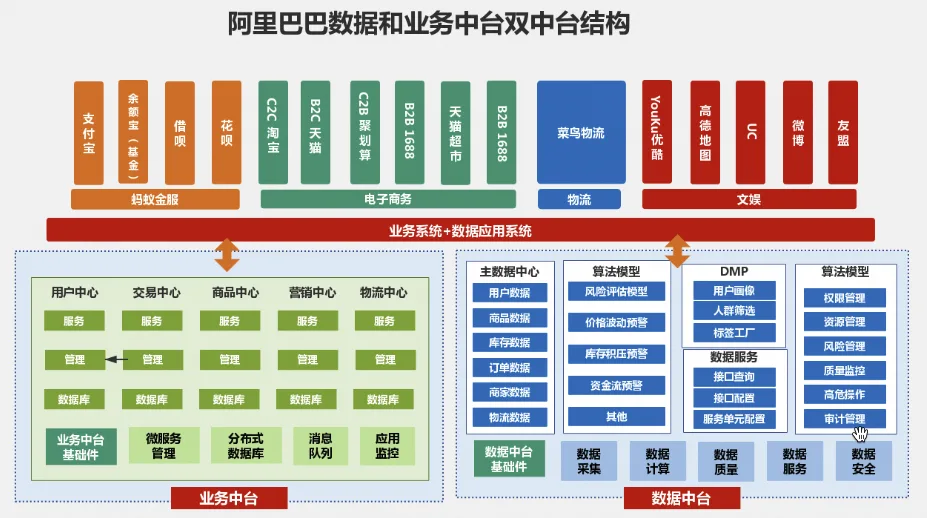

> 原作者：titi

4 月 8 日，腾讯云又出现了一次多 region 的大范围故障，据说是管控面挂了，原因和去年 1112 阿里云的那次类似。不少人问我对此事的看法，和去年那次故障一样，我的观点依然是：无论是哪家云厂出了此类问题，对于云计算行业来说打击都是灾难性的。用户对于行业能力的认知依靠的是过去耗费了大量时间、人力堆砌，逐渐建立心智并达成共识，但信心的崩塌往往都只要一瞬间。关于事件经过和腾讯云做的不足之处，技术层面业内已有大量文章做了深度分析，作为同行，不愿在此敏感时刻过多评价，难免给人以落井下石之嫌。但在这两年，也观察到一个有意思的现象，互联网作为曾经国内的技术灯塔，这两年在舆论战上基本上可以称得上是节节败退。

## 路径依赖

---

前不久，阿里董事长蔡崇信在接受访谈时提到“我们忘记了真正的客户是谁，在某种程度上，我们有点自食其果”。

实际上，今天云计算行业、乃至整个 toB 领域的问题基本也都与此相关。但再细究一步，客观地讲，与其说忘记客户是谁，倒不如说是过度关注客户。对于淘天来说，**客户**是商家，**用户**是买家。淘天不关注商家体验吗？不是的，就是因为太关注商家利益，反而忽视了买家体验。这个问题在云计算行业同样存在。客户是老板，用户是研发人员，搞定了老板，单子就签下了，至于这些用户是否觉得真的好，其实没这么重要。国内的营商环境十分复杂，改革开放 40 年走完了别人 200 年走的路，企业决策者老中青三代同堂。尤其是云计算这类公共服务，要面向的除了互联网客户，还有大量的泛行业客户，而这部分存量规模，反而占据了市场的大多数。于是，过去几年云计算在国内发展的主要路径便是通过宏大叙事，辅佐以大 IP 去讲云计算助力企业完成数字化转型的故事，而这套打法对于没有技术背景的企业客户决策者来说，基本上包治百病，指哪打哪。

从业人员当然知道什么是对的、什么是错的。但是人都会有路径依赖，一旦选择了捷径，那么捷径便成为了唯一的路。做正确的事太难看到希望了，那么不如正确地做事，因为云厂商的客户是决策者、是 CXO，所以客户要什么，云厂商就卖什么。但是，对于真正的云用户来说就很难受，这根本不是他们想要的样子，他们希望掌握的是云的最佳实践。尤其是当国内的技术人员接触到国外的云平台之后，开始有了更为鲜明的对比和直观的感受。随着时代的不断发展，这种感知上的落差，自下而上形成为一种天然的对抗机制，复仇者联盟正在集结。于是用户开始反噬，一大批行业内的意见领袖崛起，屠龙少年的故事又谁不爱听呢。一些早期开始深度使用云的用户，由于长时间在生产系统中接触多个不同云平台，已经培养出了良好的技术审美，他们能够直观地比较出各个云服务的优劣势。他们中的大部分人，比云厂商的从业人员更懂什么是云服务，什么是云计算。\

### 去中心化的舆论场

---

在那个移动互联网刚刚兴起的年代，尤其是处在风口上的互联网企业可以利用信息差，高举高打配合以空中轰炸的方式向数字化转型中的传统企业展开大面积控制，然后再由地面进攻前驱直入。所以大厂普遍习惯于和云头条、特大号等科技媒体合作，又或者是运营一些技术分享的公众号秀肌肉。而今天这个年代，每个人都是媒体，每个人都有资格来发布观点，整个传播环境呈现出一个去中心化的方式。一个品牌或者某一媒体，通过使用大规模权威发声的方式影响到大部分人，这样的条件已经不存在了。今天发生的任何一次公关危机，要想做到消息封闭或者阻塞都十分困难，无论是微博、微信公众号，甚至是脉脉，都有可能成为下一个社会性公关事件的舆论场。而云厂商的应对策略依然是几年前的陈旧制度和水平，并没有跟随着时代共同发展，这也不难理解，毕竟这是一个技术与传播双向交叉的复杂领域。包括许多云厂商的从业者，至今也没有搞清今天他们在舆论战的真正对手是谁，曾经他们以为是国内、国外的友商云，于是横向比较的皆是友商。而今天，他们面对的是一群训练有素，即懂技术，又懂云，还能执笔写文章，有事没事开了 AOE 随意乱喷的业内老炮。而反观这些年来，大厂品牌运营的方式和市场策略几乎就没怎么变过，公关敏感度甚至要比社会平均水准还要低得多，如果把文娱类行业也算进来，那云计算基本处在全行业垫底水平。以昨天腾讯云在微博上发的公告为例，很难想象这是一个在带动全行业高速发展的高科技行业的公关水平。

#### 大厂体制下的群体社恐病

---

自互联网社区诞生以来，各个流派和团体都希望争取更多的支持者，这其中必不可少的武器就是论述和辩论，而论述和辩论又是需要强逻辑的。你需要打造自己的逻辑话语体系，并排查其中有没有漏洞，同时要攻击其他竞争者的漏洞，从而争取更多的受众群体。

今天国内的这些一线互联网大厂正朝着体制化的趋势在发展，而体制化的一个重要表现便是一线员工不再敢轻易对外发声。部门面对舆论的“社恐”病，其形成的机制相当复杂，并不仅仅是“忽视用户”那么简单。一方面体现为与外界的交流越少越好，如果挂通告也最好惜墨如金，细节越少越好；但另外一方面又特别在意舆论怎么评价自己，为了平息舆论而不惜放弃原则按闹分配，在另外一些场景则下体现为从善如流。

这种“社恐”的一个重要特点就是：不交流、不辩经，为此也可以不说人话而只用云八股对外发声。老板们不懂舆情吗？确实有一些小部份不懂，但是这里还有更深层次的因素。\
我要是和舆论产生了沟通，或者说是争论，那我辩赢了，对我没任何帮助，即使辩赢了也没听说过能给我职位晋升的。但我要是辩输了，引发了更大的舆情，那基本上就要为结果负责了。

创业不易，守业更难。为什么所有行业的创一代文宣运营很厉害，是因为那个时候舆论战打赢了，是真的能带来正面收益的，是可以达成商业目的的。现在则变成了宣传表现最好效果也就是个 0，稍微引出点事来就成负值了。

所以这几年下来，云厂商在市场宣传这块根本就没有什么斗争需求，自然也没有什么在斗争中优胜劣汰的压力，本来内部晋升就不是按照候选人是否能言善辩来培养的，慢慢连正常沟通都退化到做不成了：要么不说，要么八股，要么语焉不详。文宣无战心，承平之下八股泛滥，最后必然是连正常沟通都做不到。

不辩经，埋头做事不意味着一定不能成功，但是也不应陷入到路径依赖中，过去十年，云厂商“不辩经用现实成绩说服人”之所以能取得阶段性的成功，其背后原因有三个：

- **一是**产品力低微，外部的光环效应太强，这种强干扰下辩经很难做到实事求是就事论事，容易偏离真正可行的发展途径；
- **二是**当时因为全行业渗透率低，前面的“发展空间”很大，如果经营得力，可以在较短时间内就能看到明显成果，事实就可以显露出来，到时候就可以自证清白；
- **三是**当时信息流动基本是单向的，所以“不争论”在技术层面上是可以做到的。

现在情况已经发生了变化，随着过去一年 AI 产业的大爆发，行业发展即将迎来一个新的时代。另一方面，在国内行业渗透率方面，互联网行业从 60% 达到了几乎见顶的 74%，但是与之相对应的，非互联网行业的渗透率仅仅从 24% 上升到了 29%。因此对于行业发展，能否撬动剩下近 70% 的非互联网行业中的部份上云，对云云计算的普及和未来发展将起到了至关重要的作用。今天国内的电动车行业的高速发展，就是一个鲜活的案例。我们这一代人，有幸见证了国内电动车发展的黄金十年，而曾经的那些造车新势力们，正在一步步地把自己曾说过的话逐个兑现。无论是李想、李斌、何小鹏还是今天的雷军，从不轻易错过任何一个表达自己观点的机会，恨不得把自己对行业的理解和主张放进一个二维码链接，再刻到自己脸上。\
这些车圈大佬们，一个个不但在微信录制视频号，也纷纷在抖音上开启了直播，布道自己的电车价值观，而每一次和观众的零距离接触，都是一堂最好的面向全社会的普及电动车的公开课。他们从来不怕得罪意见相左者，比起 10 个反对他们的人，只要拉拢 1 个，那就多了 1 个基本盘。

最后，在这个换挡变速阶段的转变，会对过去一批路径依赖、过去行之有效的办法产生冲击，光靠埋头做事，最终取得的成效也只能是一场大型的自我感动行为艺术秀。云厂商必须能够讲出更为旗帜鲜明的观点和主张，才能够获得更多人对行业的思考。品牌力、产品力、价格力，并不矛盾，缺一不可，没什么可丢脸的。

---

发布版本：[微信公众号转载页](https://mp.weixin.qq.com/s/NIAv9ul3bCCcuqwyPwHO-g)
