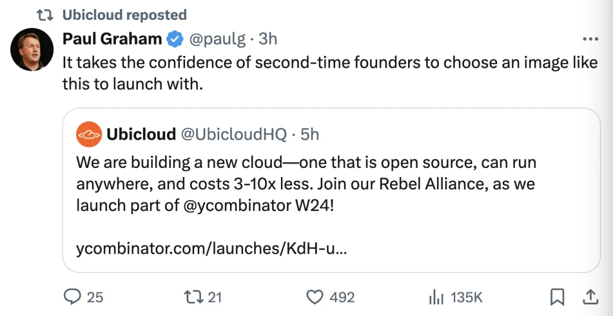
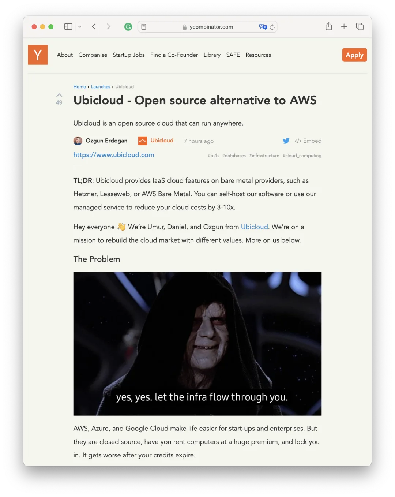
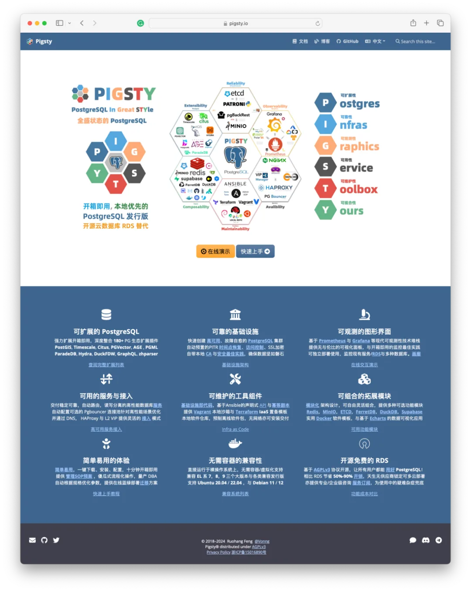

刚刚，Y Combinator 上发起的一个新的项目 Ubicloud 引起热议，旨在提供（整个） **AWS** 的开源替代方案。YC 教父 Paul Graham 转发评论。

这是下云成为历史潮流的又一个代表性的事件 —— 在创业公司眼中，公有云的企业形象已经从普惠的公共存储计算基础设施，变成了剥削血汗的赛博地主，构建**[杀猪盘](/cloud/debris/)**的邪恶帝国，是亟需革命与打倒的对象。而新的勇者已经出现。

---

云计算小传

云计算的历史，正是一部屠龙勇者变成新恶龙的故事。

在遥远的 IT 王国，有一条“企业级”解决方案的恶龙，这只恶龙以高昂的费用和繁琐的系统，剥削了王国人民的财富和汗水，被称为“[杀猪盘](/cloud/ebs/)”。王国中有一位名为马逊的勇士，他拥有强大的意志与敏捷的身法，立志要改变整个 IT 王国的面貌。

马逊勇士挥舞着云计算大棒，立志要挑战垄断王国的恶龙，砸烂它用于盘剥的杀猪盘。马逊和他的云计算小队最终成功了。云计算的蓬勃发展带来了前所未有的创新机遇，它成为了 “普惠基础设施”，供应着信息王国的基础资源 —— 网络、存储、计算。

然而随着时间的推移，马逊的心也发生了变化。他开始建立自己的规则和边界，慢慢地，他的服务变得高昂，而那些初衷和理想似乎也随风而去。这位曾经的屠龙英雄，逐渐变成了他曾经誓言打败的恶龙——一个新的“杀猪盘”，对臣民与佃户征收高昂的无专家税与“保护费”，吞噬着王国人民的财富和血汗。

而在鲜为人知的山林与荒野中，新的反叛联盟已经形成，新的勇者也已经出现，誓要将这邪恶帝国掀翻。

---

Ubicloud

Ubicloud 是一个可以在任何地方运行的开源云平台。简而言之：Ubicloud 在裸机提供商（如 Hetzner、Leaseweb 或 AWS 裸机）上提供 IaaS 云功能。您可以自托管我们的软件或使用我们的托管服务，将您的云成本降低 3-10 倍。

大家好 👋 我们是来自 Ubicloud 的 Umur、Daniel 和 Ozgun。我们的使命是以不同的价值观重建云计算市场。关于我们的更多信息见下文。

## 问题

AWS、Azure 和 Google Cloud 为初创企业与各种公司提供了便利。但它们是闭源的，迫使您以高额费用租赁电脑，并将您锁死在这里。在您的信用额度用尽后，情况会变得更糟。

虽然云计算能在早期带来节省，但市场已经演化为少数几个为非差异化服务收取高额费用的玩家。在标准且必要的服务上，他们不断推出越来越复杂的产品。每个云厂商都想方设法地封闭自己的生态，让客户在不兼容的云之间维护其应用和基础设施苦不堪言。

云计算是未来的趋势。我们相信一个更简单、安全、开源的版本将产生持久的影响。

## 解决方案

Ubicloud 提供了一个开源的替代方案，减少了您的成本，并将基础设施的控制权交还给您 —— 所有这些都不会牺牲云的好处。我们从弹性计算、虚拟网络、块存储（非复制）、托管 PostgreSQL 和强大的 IAM 开始。

我们的托管云运行在成本效益高的裸机提供商上，例如 Hetzner。结果是，您可以将成本降低 3-10 倍。比如说：

一、GitHub Action：修改一行配置，降本 10 倍\

二、批处理计算，运行 AI、科学计算、视频处理的数据管线，按需按量，加密处理，相比 AWS 虚拟机便宜 3 倍。

三、托管的 PostgreSQL：开源、可移植，使用本地 NVMe 获取更强大的性能，更强的分析能力，相比 AWS RDS 降本三倍。

## 团队

“永远不要告诉我概率是多少。” —— 汉·索洛

我们认为云计算银河系需要一个能代表开源价值观的解决方案。而我们将自己视作反叛军同盟的一部分（是的，需要一个同盟来战胜帝国)，来建立这些价值观。

Umur - 在初创公司工作了 5 年。然后共同创立并领导 Citus Data（S11）至 Microsoft 收购。在 Azure 内领导产品团队。过去两批 YC 访问合伙人

Ozgun - 在 Amazon 工作了 4 年。然后共同创立并领导 Citus Data（S11）至 Microsoft 收购。在 Azure 内领导工程团队。

Daniel - 在构建 Heroku PostgreSQL 中发挥了重要作用。在 Citus Data、Azure 和 Crunchy Bridge 构建托管云服务时，他的技能让每个人都感到惊讶。

## 我们的请求

1.帮助我们建立叛军同盟。在 X 上关注我们 (@UbicloudHQ) 并转发此推文！2.开始使用 Ubicloud 进行 GitHub Actions、安全虚拟机 或 托管 PostgreSQL。我们能降本 3 -10 倍，并且我们是开源的！

在 Twitter 上发帖和关注我们可以获得 5000 免费计算分钟。在演示日之前使用 Ubicloud 进行上述用例之一可以获取 1 万计免费计算分钟。

---

老冯点评\

在推翻云计算暴政这件事上，我举双手支持 Ubicloud 的观点。实际上我们绝对算是同道中人 —— 同样发现并坚定相信 [下云自建的关键在于数据库](/cloud/finops/)，而数据库的核心是 [**PostgreSQL**](/pg/pg-eat-db-world/)。

关于下云这件事，**[我已经呼吁了一年多](/cloud/debris/)**，并深度参与到其中来。我很欣慰地看到这一议题已经成功进入主流视野，成为公共议程，并且在真实世界产生了一些[**显著的影响**](/cloud/ecs/)。

除了技术意识形态上的工作。我们还提供了实践的工具与方案，即开源 [**RDS**](/cloud/rds/) 替代 [**Pigsty**](/pigsty/better-rds-alternative/)，我希望未来的世界人人都有自由使用优秀数据库服务的事实权利，而不是只能被圈养在几个公有云厂商提供的猪圈里坐井观天。

这就是我要做 Pigsty 的原因 —— 一个更好的，开源免费的 PostgreSQL RDS 替代。让用户能够在任何地方（包括云服务器）上，用 RDS 十分之一不到的成本，一键拉起有比云数据库更好的数据库服务。

咱们明人不说暗话，就是要用更好的开源免费替代，砸烂云数据库的饭碗。云计算领域的韩索罗，罗宾汉，宋江，李自成已经出现。是时候大干一场，掀翻云厂商的饭桌，把软件自由重新交还给用户了。\

---

[云计算泥石流](/cloud/debris/)曾几何时，“上云“近乎成为技术圈的政治正确，整整一代应用开发者的视野被云遮蔽。就让我们用实打实的数据分析与亲身经历，讲清楚公有云租赁模式的价值与陷阱 —— 在这个降本增效的时代中，供您借鉴与参考。

---

发布版本：[微信公众号](https://mp.weixin.qq.com/s/Fit7MtSDQdp9IcedmWdYQg)
