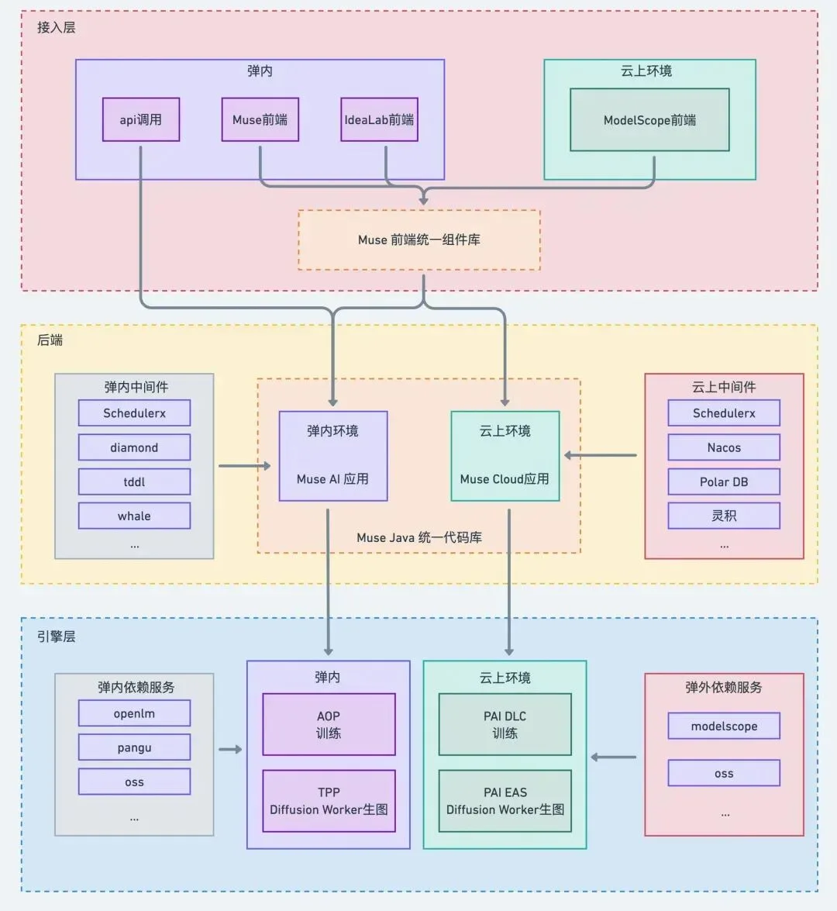
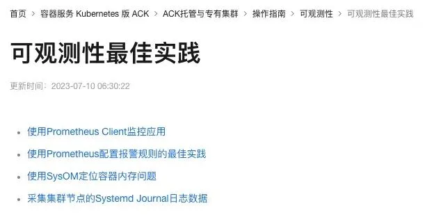
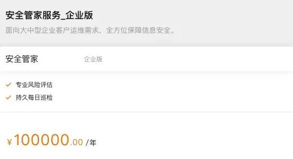
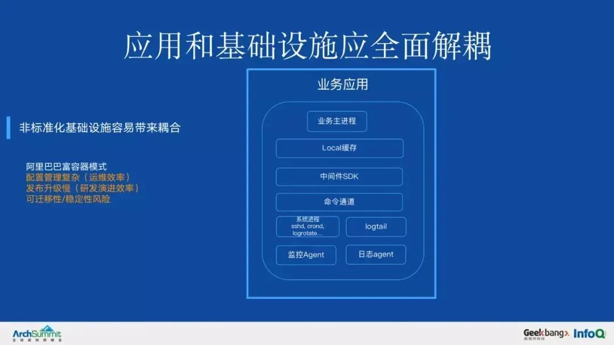
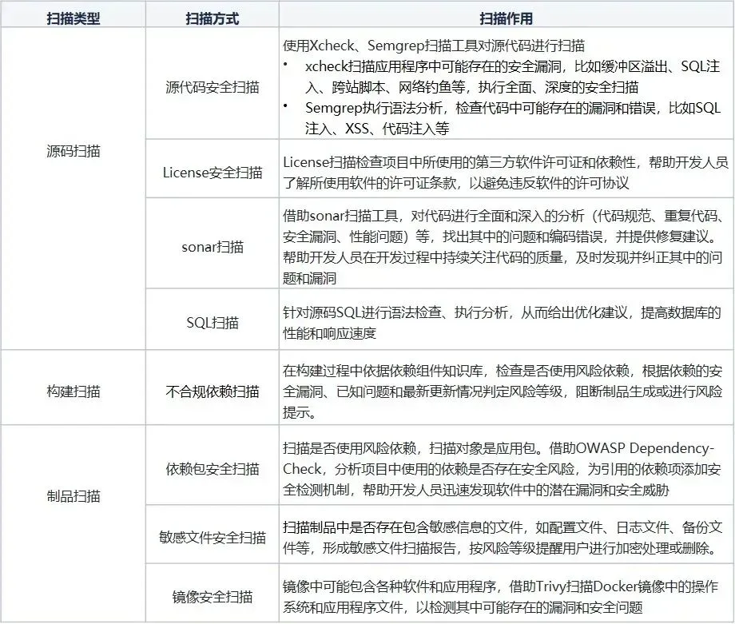

> 原作者：瑞典马工

## 降价，打折，优惠券

从事 IT 行业的朋友们，都有一个很具体的感受，云厂商的销售们手里没什么武器，无非就是三样：降价，打折扣，给优惠券。这技术含量还不如农贸市场卖豆腐的。买豆腐的要讲清楚水豆腐，油豆腐和攸县香干的区别；要提供客家酿豆腐菜谱；还要发明西汉淮南王制豆腐的故事。相比之下，卖云计算的所谓专家们只需要做一个事：把目录价格乘以从 0.2 到 0.95 不等的折扣数，所需要的全部技能是小学四年级算术。

这个现象也体现在云厂商的财务报表中。大多数云厂商是不盈利的。阿里云作为唯一公开宣称盈利的厂商，2025 财年第一季的 EBITA 利润率约为 8%，还不如做空调的美的利润高。产业转型升级做了这么多年，结果大家合力把高投入高回报的高科技行业硬生生干成了大规模低毛利的制造业。厂商不开心，用户也不爽，生态伙伴更是叫苦连天。

## 虚拟机就是大宗商品

为什么搞成这样子？我有一个不太全面但是可能很核心的解释：中国云计算被做成了无差别的大宗商品。云厂商卖虚拟机和 CDN 的方法，同大宗商品交易所卖小麦的方法，基本差不多：价格取决于并且只取决于规格。巴西的二级小麦和乌克兰的二级小麦没有区别，阿里云的 8C16G 和 火山引擎的 8C16G 也没有区别，都被市场视作同一个 SKU。这种产品的同质化使得厂商只在一个维度竞争：价格。

## 云计算缺席了客户开发过程

最近有两篇文章《[**大模型多云部署怎么玩？阿里创作平台 MuseAI 集团内外落地指南》**](https://mp.weixin.qq.com/s?__biz=MjM5MDE0Mjc4MA==&mid=2651232211&idx=2&sn=78fea82ba5960ada3450f94ac6a808ef&scene=21#wechat_redirect)和[**《显卡在偷懒？阿里大模型创作平台 MuseAI 极速模型切换技术提升 AI 创作效率》**](https://mp.weixin.qq.com/s?__biz=Mzg4NTczNzg2OA==&mid=2247507136&idx=1&sn=4a3f589481aa8b9808e4e37cd13684d9&scene=21#wechat_redirect)典型的显示，即使是是来自阿里集团的云用户，也没能受益于云服务，其开发速度和质量都没有得到明显提升。

文章较长，概要如下：爱橙科技为阿里集团开发了一个内部使用的 AIGC 产品 MuseAI，部署于阿里集团的基础设施上，受到欢迎。之后他们拓展集团外用户，对后台和前端代码做了大幅度的修改，前后花了半年时间。这个过程中，云厂商 — 具体地说是阿里云 — 不仅没有帮助，甚至还对他们造成了一些困扰。

MuseAI 是一个成功的产品，爱橙科技团队也非常有竞争力。本文主要是想和同行切磋云厂商在爱橙科技开发 MuseAL 过程的缺位。下文，我将称呼爱橙科技为客户。

### 云不是新业务的首选平台

如原文所述，云平台并非客户默认开发平台。客户集团内部有一套完整的内部中间件帮助产品团队开发部署新业务。

1. 客户的 DB 首选不是阿里云的 PolarDB 而是自研的 TDDL.

2. 配置管理首选不是阿里云的微服务引擎 MSE 而是自研的 Diamond。

3. 连最基础的存储，客户也不用阿里云的 OSS，而选择了没有外部生态的 Pangu。

4. 客户的 CI/CD 流水线也不支持阿里云。

5. 我推测原文说的弹内 Schedulerx 也不是阿里云的 Schedulerx 服务。

图一，MuseAI 一套代码库多端部署的结构

从这个过渡期架构图可以看出，实际上，阿里云完全可以提供 MuseAI 需要的所有中间件。如果一开始 MuseAI 就基于阿里云平台开发，团队就不需要做后续的集团外部署专项改造了，可以节省半年时间。

大集团往往有自建 PaaS 平台。这些平台和云平台相比，技术差一个时代，本来只应该承载旧业务。不过遗憾的是，尽管云平台的服务远胜于这些自建 PaaS 的服务，但是在惯性驱使下，新业务也继续使用它们。云平台在客户开发过程中严重缺位，沦为一个超大虚拟机资源池。

### 多租户服务缺位

MuseAI 最开始作为一个内部项目开发，只需要服务阿里员工，后来需要服务多个集团用户，团队就不得不做实现多租户系统（**Multitenancy[1]**）。原文作者说

> 无论采用哪种方案，都必然会面对一个问题：部分逻辑在不同环境的实现是有差异的。例如，用户体系的差异，内部通过 BUC 可以获取到用户信息，集团外可能是手机号注册等别的链路；

实际上，**阿里云的 IDaaS[2]** 正好是解决这个问题的专业服务。MuseAI 的业务代码可以不用和阿里集团的 BUC 系统直接交互，而是和 IDaaS 交互。IDaaS 则把阿里集团的 BUC 视作一个**身份提供方（IdP）[3]**接入其用户池。在这个架构下，阿里集团只是 MuseAI 的多个租户之一。这样 MuseAI 不仅可以获取更高质量的用户管理系统，而且可以零开发成本的接入其他集团租户。

### API 管理服务缺位

MuseAI 的另外一个重要改造内容是，为了让客户“基于 Muse 平台的 AI 生成能力二次开发垂类平台”，团队

> 针对二次开发，我们定义了 API 接入规范；

一般来说，云原生团队开发 Web 服务，都先定义 API，然后再去实现。API 是前端和后端以及不同的后端服务之间的合约。没有这个合约的话，团队只能依靠口头约定 URL，HTTP 方法，参数和返回值，沟通成本非常高。

阿里云的 API Gateway 服务，正可以帮助团队开发和管理 API。他们团队写的**《阿里 API 网关最佳实践》[4]**质量非常高。文档里建议的《**API 网关灰度发布最佳实践[5]**》正好可以帮助 MuseAI 团队管理他们迭代中的 API。可惜，这篇文档似乎写完就结束了，没看到它对客户有实在具体的影响。

如果阿里云在过去的几年有努力的推广 API 管理的最佳实践，MuseAI 上线的那一天，应该就已经发布一套比较稳定的 API 了，不至于在客户要求下才急急忙忙的补课。

### 可观测性服务缺位

一个 Web 服务上线只是第一步，要保证服务的持续进化和平稳运行，可观测性系统是不可或缺的。在笔者的经验中，云原生系统的可观测性开销，往往占到云开销的 15%-25%。阿里云有非常丰富的可观测性服务，包括日志服务 SLS，云监控 CloudMonitor，应用实时监控服务 ARMS。这些服务能够帮助团队在重构中快速定位问题，处理故障和提升客户体验。

鉴于文章完全没有提及可观测性，我猜测他们没有用这些服务。这显然不能责怪客户，因为阿里云虽然有 logs，metrics，APM 等各种服务，但是没有一个专家在研究和教育客户怎样做可观测性。阿里云容器服务的《**可观测性最佳实践[6]**》简陋到可笑的程度。

而阿里云文档的《**云原生可观测性最佳实践的相关内容[7]**〉更是一团糊，第一篇文章居然是莫名其妙的**最佳实践，近实时数据同步，增全量数据一体[8]**，第二篇文章则是**Fluid 数据缓存优化策略最佳实践[9]**。

这和可观测有一毛钱关系吗？

### 安全服务缺位

MuseAI 团队提到：

> 此外，集团内外对于安全管控的要求也不一样

这是一个非常实在的需求。MuseAI 服务内部客户的时候，安全性可以放松一些，用 IP 地址限制访问，用访问日志定位潜在恶意访问者，基本就差不多了。但是对外开放服务之后，会有新的威胁，比如 DDoS，网络爬虫，SQL 注入，恶意 Payload 上传等。阿里云上有丰富的服务帮助客户防范这些威胁，不仅有传统的 DDoS 防护和云盾服务，也有云原生的访问控制服务 RAM 和 云操作审计服务，还有云管家等人工服务。

阿里云的定位早已经不是站长们的建站工具了。春节联欢晚会和浙江政务服务网这类敏感服务能上云，不只是因为云上有上述安全服务，也因为云用户们能积极的采用这些服务，改变自己的流程和习惯，对抗公网上更加复杂的安全攻击。

很可惜，这么一块重要的工作内容，被 MuseAI 忽略了。无他，云厂商布道缺位。

综上所述，云服务绝不只是部署过程才需要关注的虚拟机池子加一个托管数据库，而是 IT infra 架构的基本组件。换言之，架构师，而不是运维组，应该很熟悉云平台的各项服务，以加速自己应用的构建，并且低成本的获取更高的可靠性和安全性。

列举上述缺位，笔者无意批评客户。实际上，唯一应该对这种缺位负责的就是云厂商。后发优势的云厂商在产品设计上走了捷径，直接 Copy 2 China，但是也落下了一个隐患：

云厂商自己的团队也不懂怎么用云，无法给客户做出良好的示范，更没有在行业里推广云原生架构，甚至说不出云原生架构的益处。

## 云厂商可疑的技术布道

阿里云的张瓅玶先生提出：应用和基础设施应全面解藕。

张先生表示：

> 阿里巴巴的应用上云前仍然存在应用和基础设施耦合问题，由于采用自建软件基础设施，配置管理、发布升级、监控观测、流量治理等与业务应用耦合在一起，对于运维效率、研发演进效率和稳定性都带来了挑战。
>
> 我们在上云过程中看到，实现标准的云基础设施和业务应用的全面解耦，将会带来全面的研发运维效率提升。

对此，笔者无法赞同。恰恰相反，大多数团队开发云原生系统时候，不再区分基础设施和应用代码：

1. 把基础设施作为代码管理，此即为 Infra as Code。工具有 Terraform，AWS CDK 和 Kubernetes 的 YAML。尽量避免手动在控制台修改配置。

2. 利用 CI/CD 把基础设施代码和应用代码的变更用同一个流程管理起来。举例来说，URL `https://magong.se/api/todos` 的域名 `magong.se` 可能取决于基础设施代码的 DNS 部分，路径 `api` 取决于基础设施代码的 API Gateway 部分，而路径 `todos` 则取决于应用层代码。对一个良好的 CI/CD 来说，修改基础设施代码和应用代码没什么区别，无非就是又一次部署而已。

3. 管理应用代码的 Dev 也管理基础设施代码。由于 DevOps 的演进，目前大多数云原生开发团队已经没有专门的运维组了。Infra 也是 Dev 在管理。

我和我的朋友们把这种基础设施和应用的耦合更推进一步，SealOS 的方海涛主张[《云本应该就是操作系统》](https://mp.weixin.qq.com/s?__biz=Mzg5ODkwNTc2Ng==&mid=2247488841&idx=1&sn=ab06e5d17b33f7fcdef9de140fdbe99a&scene=21#wechat_redirect)，ClapDB 的李令辉主张《[**云是一台新电脑**](/pg/pg-is-good/)》。在这个范式下，应用调用云 API 和调用 Syscalls 是类似的。没有人会说要解耦应用和操作系统，同理，也不应该提倡解耦应用和基础设施。

虽然我不赞同张先生的观点，但是他是阿里云为数不多能够和客户谈论云原生架构 — 请注意，不是念云原生经 — 的专家。业内还有大量的伪专家，只会念“云原生就是好来，就是好，就是好！“ 或者 ”阿里双十一，十万节点，一亿用户，千亿流量，牛逼牛逼牛牛逼！“

## 云厂商拱手相让

云厂商的专家无法引导业内技术潮流，給市场留下了权威空白。我的朋友冯若航非常巧妙的填补了这个真空。过去两年，他大量的撰写文章，辛辣的讽刺上云用户《[**花钱买罪受的大冤种：逃离云计算妙瓦底**](/cloud/patsy/)》，打造下云范例《[**DHH：下云超预期，能省一个亿**](/cloud/odyssey-done/)》，甚至弄个了《[**云计算泥石流：下云合订本**](/cloud/exit/)》。目前为止，没有看到一家云厂商有能力反驳他，一个下云个体户。这实在是行业莫大的讽刺。

## 客户自己也可以种小麦

但声音大的冯老板不是最致命的，更致命的是广大不言不语却在自研替换云厂商的基础架构部。

Bilibili 作为一个在线视频公司，花费人力去自研 DNS 系统，还分享为《[**B 站 HTTPDNS 自研降本之道**](https://mp.weixin.qq.com/s?__biz=Mzg3Njc0NTgwMg==&mid=2247492578&idx=1&sn=bb87b1171165720ecdd50f58c6013ba2&scene=21#wechat_redirect)》。

他们的理由非常直白：

> 根据内部的成本大佬们的估算，大约可以节省 80%-90% 的成本。收益上看非常可观！那还说什么，直接开搞。

这个决策过程，是不是很像上文所述的期货市场评估二级小麦？看并且只看价格。

## 客户自己种的小麦，口味还好很多

Vivo 是一家手机制造商，并非专业软件公司。但是[**他们自建的 CI/CD 平台非常不错**](https://mp.weixin.qq.com/s?__biz=MzI4NjY4MTU5Nw==&mid=2247498843&idx=1&sn=314aff57db845b164d2e70d0d58ad12a&token=789170263&lang=zh_CN&scene=21#wechat_redirect)。比如在安全扫描这个核心能力上，Vivo 自建的 CI/CD 平台覆盖得非常完善。

Vivo CI/CD 的

而阿里云的云效，其文档对应用安全不着一字。**云效的安全中心[10]**只覆盖 CI/CD 本身的安全。有经验的客户很难信任这个团队的安全素养。

进一步检查**云效推荐的几个客户案例[11]**，可以看到安全几乎是他们彻底忽略的一个建设内容。有心的读者可以自行去读一下他们的案例。

## 错误的软件交付认知

云厂商无法引导技术发展方向，没有体现出专业性。不仅外部客户自认为“彼可取而代之“，阿里集团的业务团队也产生一种错误的认知，认为云服务很容易做。

比如 MuseAI 团队就说：

> 我们积累了一套基于公有云的 Muse 部署方案。该方案具备一定的可复制性，可以允许新的客户在公有云上部署一套完全相同的产品。在 2024 年云栖大会期间，也的确有客户表达出了希望私有化部署一套 Muse 的诉求。因此展望一下未来，除了支撑集团内外的大量业务场景之外，Muse 也许可以作为一套整合公有云各类 IaaS、PaaS 层产品，可以独立部署的 AI 高阶 SaaS 应用。

这一段话很明显的混淆了交付软件，**BYOCloud[12]** 和全托管云服务的区别。作者完全没有考虑到版本管理，认为多个客户会“部署一套完全相同的产品”。作者甚至还相信私有化部署是可行的。任何做过云产品管理的人都能看出作者的天真，但是很可能无法阻止这个团队交学费。

## 不参与客户应用开发的云厂商，只配啃骨头

综上所述，云厂商虽然开发了几百个云服务，但是，由于服务质量达不到行业领先，或者团队本身不懂用云，或者团队缺乏定义新技术架构的能力，云厂商在客户应用的开发过程中严重缺席，往往只能派出虚拟机和 CDN 选手，从而被客户用唯一的价格指标所评估。这种定位下，丝毫不奇怪，销售们唯一能打的牌就是：

## 降价，打折扣，送优惠券，双十一大酬宾！

### 参考资料

[1]

Multitenancy: *<https://en.wikipedia.org/wiki/Multitenancy>*

[2]

阿里云的 IDaaS： *<https://cn.aliyun.com/product/idaas?from_alibabacloud=>*

[3]

身份提供方（IdP）： *<https://help.aliyun.com/zh/idaas/eiam/user-guide/idps/>*

[4]

《阿里 API 网关最佳实践》: *<https://static-aliyun-doc.oss-cn-hangzhou.aliyuncs.com/download%2Fpdf%2F68134%2F%25E6%259C%2580%25E4%25BD%25B3%25E5%25AE%259E%25E8%25B7%25B5_cn_zh-CN.pdf>*

[5]

API 网关灰度发布最佳实践： *<https://static-aliyun-doc.oss-cn-hangzhou.aliyuncs.com/download%2Fpdf%2F68134%2F%25E6%259C%2580%25E4%25BD%25B3%25E5%25AE%259E%25E8%25B7%25B5_cn_zh-CN.pdf>*

[6]

可观测性最佳实践： *<https://help.aliyun.com/zh/ack/ack-managed-and-ack-dedicated/user-guide/best-practices-for-observability/>*

[7]

云原生可观测性最佳实践的相关内容： *<https://help.aliyun.com/zh/arms/>*

[8]

最佳实践，近实时数据同步，增全量数据一体： *<https://help.aliyun.com/zh/maxcompute/user-guide/github-near-real-time-sync-and-full-and-incremental-data-analysis>*

[9]

Fluid 数据缓存优化策略最佳实践： *<https://help.aliyun.com/zh/ack/cloud-native-ai-suite/user-guide/best-practices-for-optimizing-fluid-data-caching-strategies>*

[10]

云效的安全中心： *<https://help.aliyun.com/zh/yunxiao/user-guide/security-center/>*

[11]

云效推荐的几个客户案例： *<https://cn.aliyun.com/product/yunxiao>*

[12]

BYOCloud: *<https://www.redpanda.com/blog/deploy-redpanda-clusters-cloud-aws-gcp>*

---

发布版本：[微信公众号转载页](https://mp.weixin.qq.com/s/Eo47Ssttcd0-GFEMEG8Ptg)
