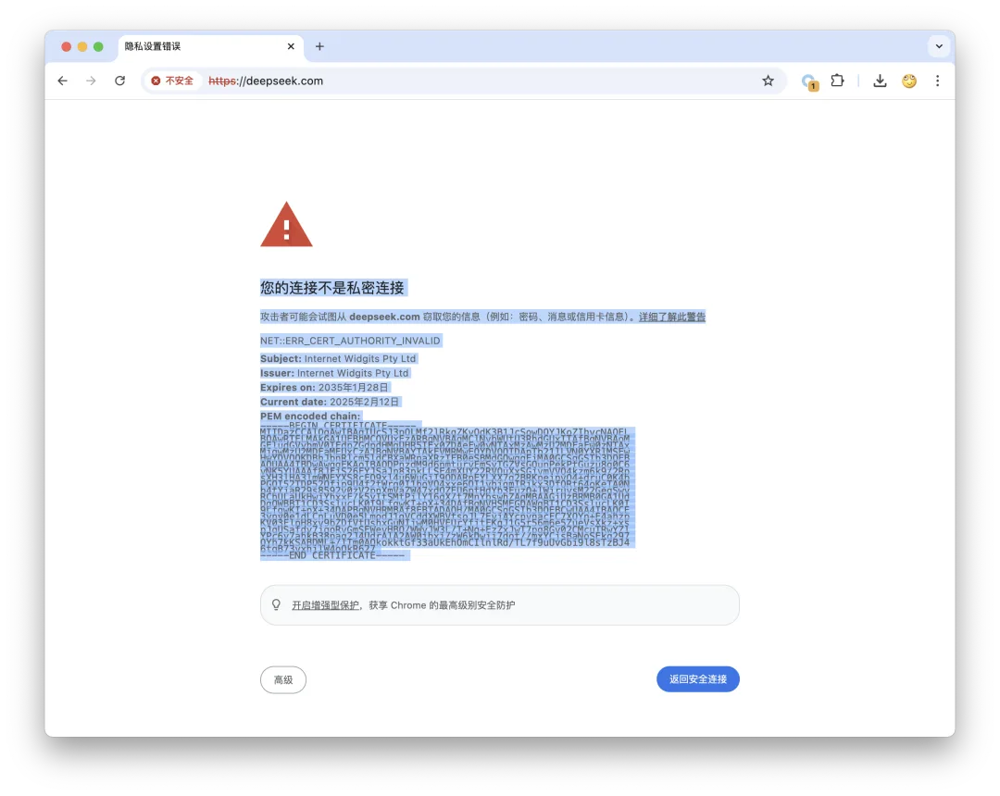
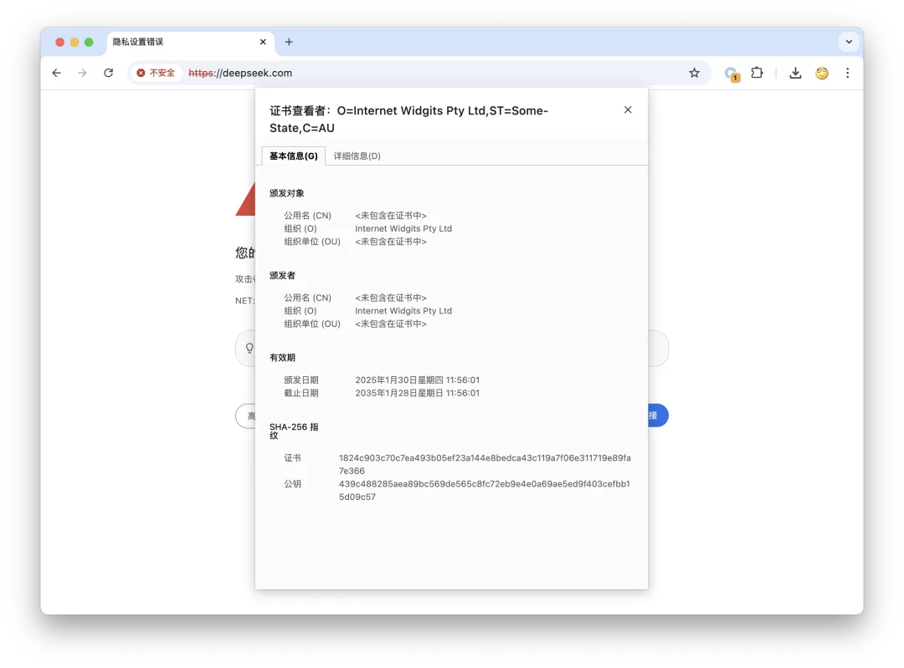

DeepSeek 主域名（deepseek.com）的证书无效，浏览器访问 <https://deepseek.com/> 会有错误提示：

看上去是 OpenSSL **默认自签名的 Internet Widgits Pty Ltd**。像这样的测试证书发到官网主域名上，确实是非常低级的错误了。

不过，访问 [www.deepseek.com](https://www.deepseek.com/) 与其他域名是正常的，使用的是 DigitalOcean 签发的有效证书。截至本文发布前，DeepSeek 已经将 `deepseek.com` 主域名 301 重定向到 [www.deepseek.com](https://www.deepseek.com/)，暂时绕过了这个问题。

无独有偶，就在前几天 Deepseek 还犯过另一个低级错误：[Wiz：DeepSeek 数据库暴露](/ai/deepseek-db-exposed/)。作为全村的希望，Deepseek AI 搞的没得说，但也确实应该加强一下基础设施建设了。全天才博士阵容，也得配些运维干活呀。

---

发布版本：[微信公众号](https://mp.weixin.qq.com/s/Q16wYXOdWgyopx2do41uHw)
