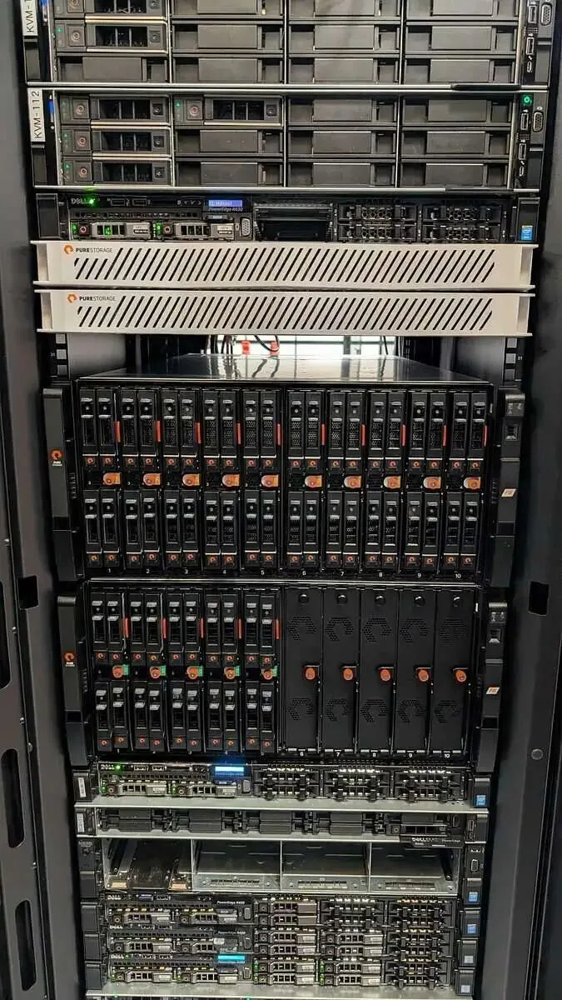
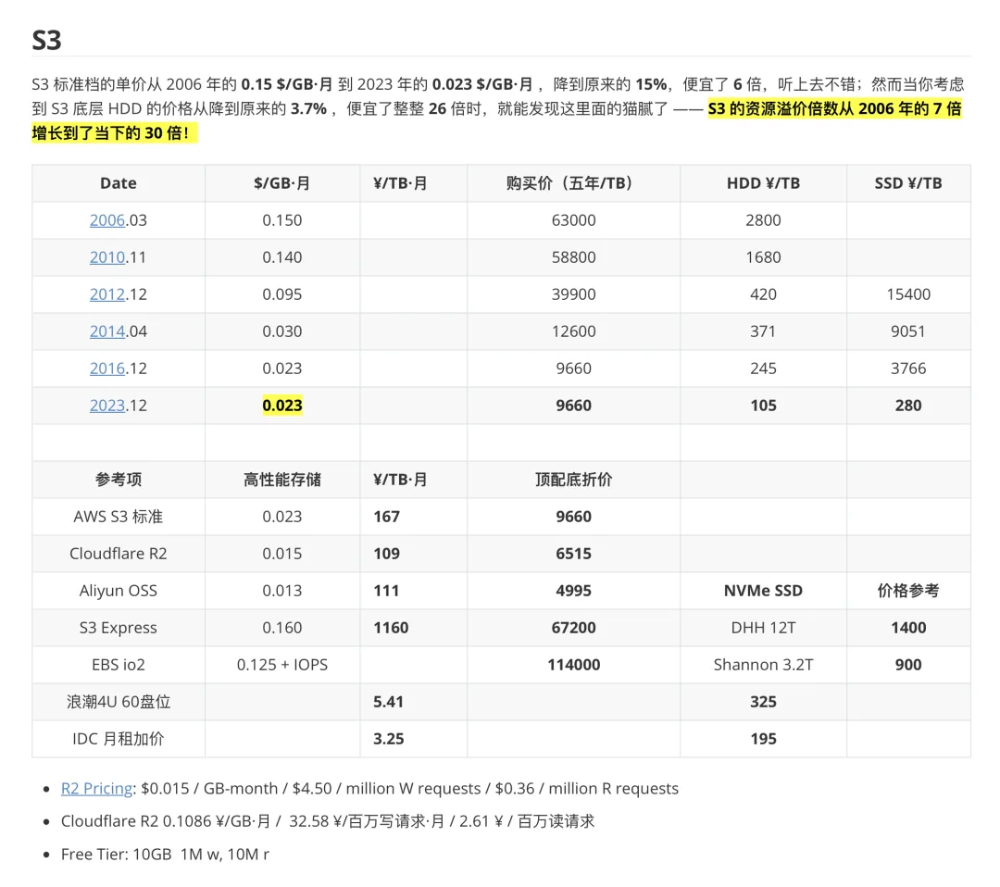
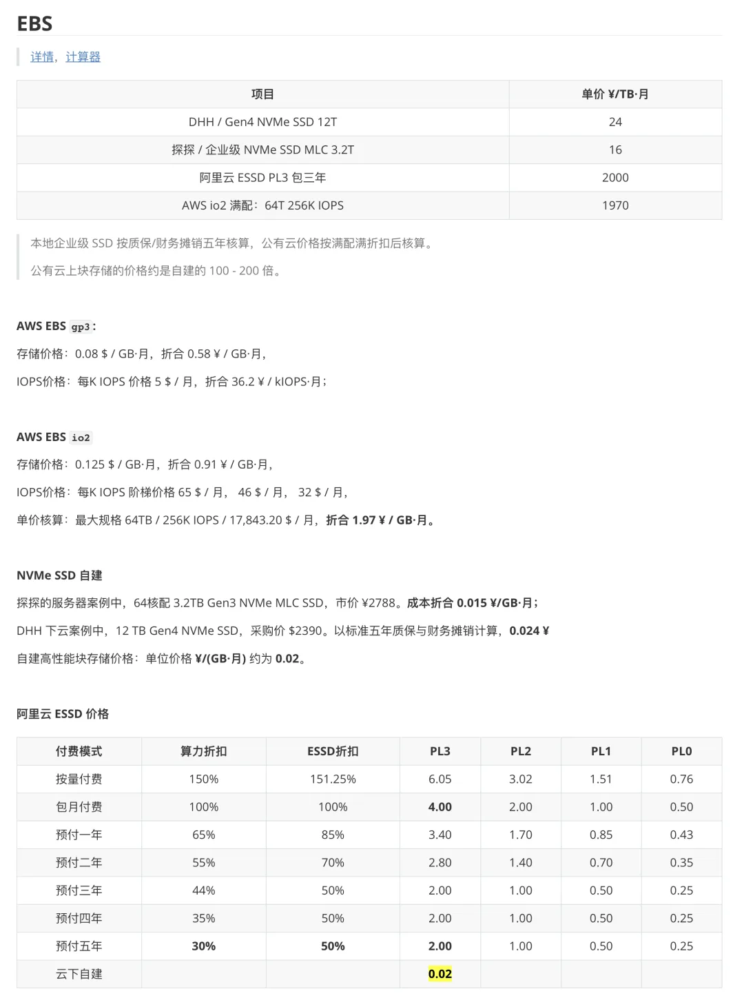
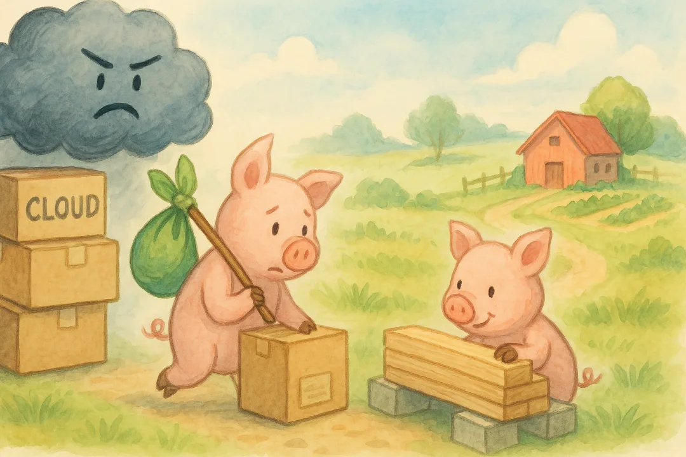

DHH 的下云已经真金白银地省下了几千万成本，在维持运营团队规模不变的前提下，用更低的成本获得了更好的效能。现在，最后一批 S3 即将下线，整个下云的史诗历程即将结束。如果你还在云上挥金如土，DHH 的故事很有可能会对你有所帮助。

如果错过 S3 下云窗口，每天要多掏四万块钱！

我们现在每年在 AWS S3 上的花费接近 150 万美元，用来存放 Basecamp、HEY 以及其他所有业务的文件。之所以能把价钱压得这么低，就是因为我们当初签了个四年的长约。可这份合约今夏 6 月 30 日就到期了——届时我们就要完成 “下云大挪移”的最后一步了！

目前，我们已经把替代方案 Pure Storage 搬进了两个主要数据中心。总共 18 PB 容量，跨越千里安全同步。那机柜摆在那儿，里面全是闪电般快速的 NVMe 存储，瞧着就高大上。机箱里 每张卡能存 150TB[1]，堪称性能猛兽。

Pure Storage 原生支持 S3 兼容 API，这就意味着我们不用再折腾 Ceph、Minio 或者其他一系列对象存储软件了——如果你想在普通硬件上自力更生，那可就要操不少心。对应用端来说，这种兼容 API 让我们轻松更换后端存储。

但接下来还有个大工程：我们得从 S3 里搬走差不多 6 PB 的数据。要是放在早几年，这个出站流量的账单足够让人见了都腿软，只能喊“救命”。好在 AWS 现在有个 60 天免费出站流量的窗口期，你想走就走，不收一分出站费。Nice！

不过，把这么多数据挪走可不是一蹴而就。即便我们留了条 40 Gbit 的粗管专门干这活儿，考虑到各种开销和“看管”流程，估摸着最少也得折腾三周吧。

这就是为什么 6 月 30 日这个日子这么关键。咱们来场数学速算，看看那笔“迟到费”有多扎心：要是到期了还没迁完 S3，那就得每天乖乖掏出四万块 (5000\$) 给亚马逊当租金。哎哟我的天，听上去就肉疼！

按周算的话就是二十五万一周！要是拖到一个月也就是每月 107 万！

对于我们这种规模的公司来说，这钱可不是个小数字。但能省下来的钱也相当可观。未来五年，我们大概能省将近 3600 万，甚至可能更多，得看客户文件需求的增长情况。买 Pure Storage 硬件大概一千万，五年保修和支持也不到七百万。

不过，这些几百万几百万的数字听着总有点抽象。相比之下，“要是过了截止日还没搬完，每天就要烧四万块钱” —— 就显得无比真实、生动且痛彻心扉！

> 作者：DHH，原文：It's five grand a day to miss our S3 exit[2] 译者：薛永杰，Pigsty 作者，云计算泥石流，数据库老司机

---

## 老冯评论

DHH 的下云故事又进入了全新的篇章，从两年前提出构想到现在，已经真金白银地省下了几千万的成本。在维持运营团队规模不变的前提下，用更低的成本获得了更好的效能。

[下云奥德赛](/cloud/odyssey/)

[是时候放弃云计算了吗？](/cloud/odyssey/)

[DHH：下云超预期，能省一个亿](/cloud/odyssey-done/)

[半年下云省千万：DHH 下云 FAQ 答疑](/cloud/cloud-exit-faq/)

如今，DHH 的下云运动即将迎来最终的大满贯，最后一批 S3 也将于六月底下线。从每年 1300 万的 S3，到五年一次性总投入不到 1800 万元的本地存储，500 天回本。更别提这是从 S3 乞丐云盘直接升级到了全闪存储，有着三个数量级的性能提升增益！如果是在中国运营，使用普通的 HDD 机械硬盘，那么平替的成本还要低整整一个数量级，回本周期不到三个月。

DHH 的例子再次说明认知的重要性 —— 仅仅是进行简单的小学数学运算把帐算清楚然后采取下云行动，就可以立竿见影的每年省下上千万的成本，同时实现数量级式的性能提升。

如果你和 DHH 一样有着几 PB 或者只是几 TB 数据放在云对象存储上，那么不妨看看 [扒皮对象存储：从降本到杀猪](/cloud/s3/)，仔细算一下帐，结果可能会让你惊掉下巴。

不论是 DHH 用的 Pure Storage 还是戴尔浪潮，都有很成熟的对象存储服务器产品线。如果你的业务能填满半个机柜，那么确实应该认真考虑一下下云 IDC 自建，或者租赁实价物理机自建了。

毕竟，赚到的钱和省下的钱都是钱，实际上省下的钱少交一道税，还要更值钱一点，那么为什么不好好优化一下在云上白白浪费的成本呢？

### References

- `[1]` 每张卡能存 150TB： <https://www.tomshardware.com/pc-components/storage/pure-storage-exec-teases-150tb-ssd-modules-volume-shipments-of-75tb-ssd-modules-have-only-just-begun>
- `[2]` It's five grand a day to miss our S3 exit: <https://world.hey.com/dhh/it-s-five-grand-a-day-to-miss-our-s3-exit-b8293563>

[云计算泥石流](/cloud/exit/)点一个关注 ⭐️，精彩不迷路\

#### DHH

[先优化碳基 BIO 核，再优化硅基 CPU 核](/db/bio-core-cpu-core/)

[单租户时代：SaaS 范式转移](/cloud/single-tenant-saas/)

[拒绝用复杂度自慰，下云也保稳定运行](/cloud/uptime/)

[是时候放弃云计算了吗？](/cloud/odyssey/)

[下云奥德赛](/cloud/odyssey/)

### 亚马逊

[Ahrefs 不上云，省下四亿美元](/cloud/ahrefs-saving/)

[云上黑暗森林：打爆云账单，只需要 S3 桶名](/cloud/s3-scam/)

[Redis 不开源是“开源”之耻，更是公有云之耻](/db/redis-oss/)

[RDS 阉掉了 PostgreSQL 的灵魂](/cloud/rds-castrates-pg/)

[扒皮对象存储：从降本到杀猪](/cloud/s3/)

[重新拿回计算机硬件的红利](/cloud/bonus/)

[是时候放弃云计算了吗？](/cloud/odyssey/)

[下云奥德赛](/cloud/odyssey/)

### 阿里云

[阿里云：高可用容灾神话的破灭](/cloud/aliyun-ha/)

[阿里云故障预报：本次事故将持续至 20 年后？](/cloud/aliyun-ha/)

[阿里云新加坡可用区 C 故障，网传机房着火](https://mp.weixin.qq.com/s?__biz=MzU5ODAyNTM5Ng==&mid=2247488345&idx=1&sn=684398668bdddc05d4218c42f5a383b0&scene=21#wechat_redirect "阿里云新加坡可用区C故障，网传机房着火")

[草台班子唱大戏，阿里云 RDS 翻车记](/cloud/rds-failure/)

[阿里云又挂了，这次是光缆被挖断了？](/cloud/aliyun-fiber-cut/)

[云计算：菜就是一种原罪](/cloud/cloud-incompetence/)

[taobao.com 证书过期](https://mp.weixin.qq.com/s?__biz=MzU5ODAyNTM5Ng==&mid=2247487367&idx=1&sn=d6e4abd2b2249d27bd8b8146b591b026&scene=21#wechat_redirect "taobao.com 证书过期")

[牙膏云？您可别吹捧云厂商了](/cloud/toothpaste-cloud/)

[罗永浩救不了牙膏云](/cloud/luo-live/)

[迷失在阿里云的年轻人](/cloud/lost-youth-at-aliyun/)

[剖析云算力成本，阿里云真的降价了吗？](/cloud/ecs/)

[从降本增笑到真的降本增效](/cloud/smile/)

[阿里云周爆：云数据库管控又挂了](/cloud/aliyun-weekly-crash/)

[我们能从阿里云史诗级故障中学到什么](/cloud/aliyun/)

[【阿里】云计算史诗级大翻车来了](/cloud/aliyun/)

[阿里云的羊毛抓紧薅，五千的云服务器三百拿](/cloud/cheap-ecs/)

[云厂商眼中的客户：又穷又闲又缺爱](/cloud/cloud-customers-poor-bored-lonely/)

### 腾讯云

[腾讯真的走通云原生之路了吗？](/cloud/tencent-cloud-native/)

[我们能从腾讯云故障复盘中学到什么？](/cloud/qcloud/)

[云 SLA 是安慰剂还是厕纸合同？](/cloud/sla/)

[腾讯云：颜面尽失的草台班子](/cloud/tencent-disgrace/)

[【腾讯】云计算史诗级二翻车来了](/cloud/tencent-epic-fail-2/)

[垃圾腾讯云 CDN：从入门到放弃](/cloud/cdn/)

### 其他云

[删库：Google 云爆破了大基金的整个云账户](/cloud/gcp-unisuper/)

[Oracle 云大翻车：传 6 百万用户认证数据泄漏](/cloud/oracle-cloud-leak/)

---

发布版本：[微信公众号](https://mp.weixin.qq.com/s/yQbtyDv1mc-r_bn9RNCSRA)
