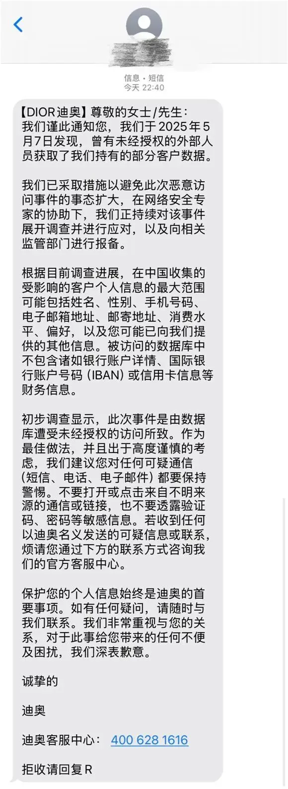
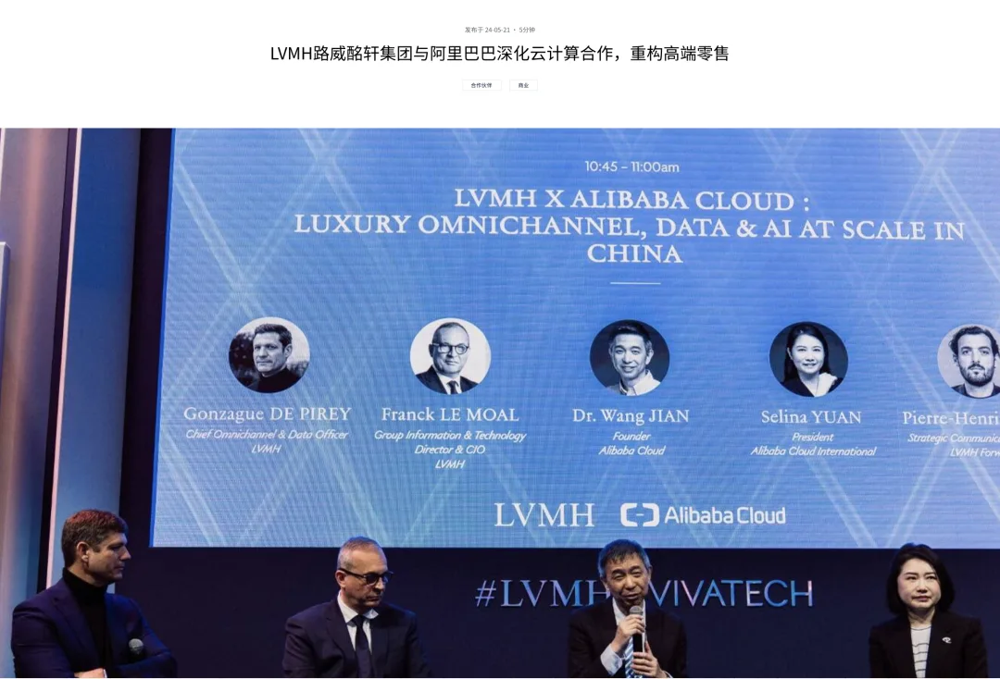
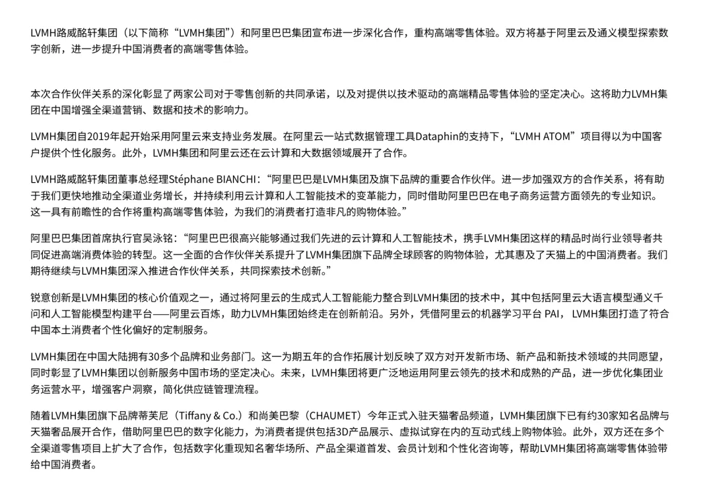
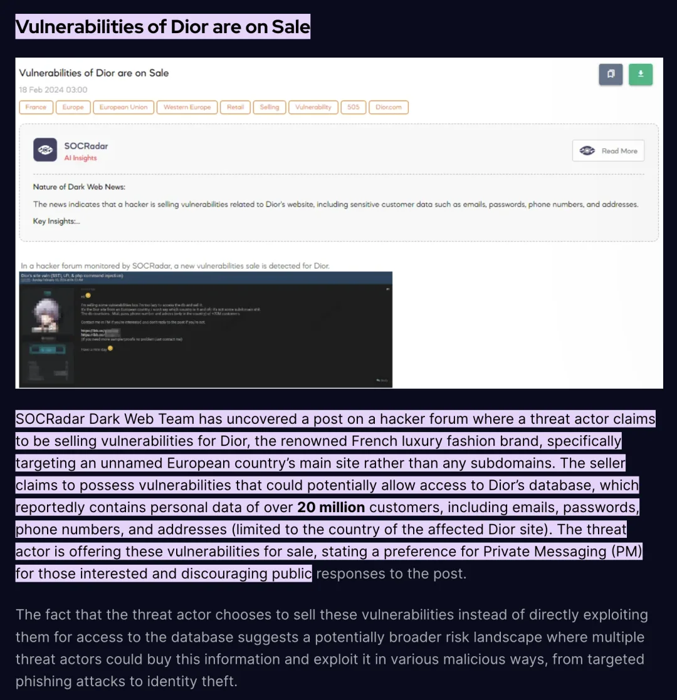
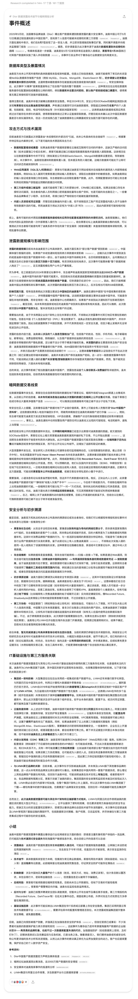
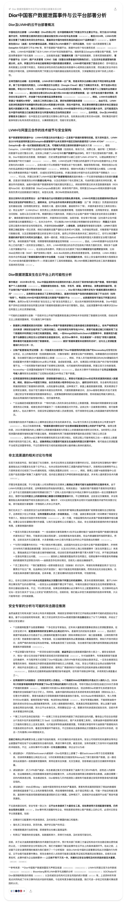

2025 年 5 月，法国著名奢侈品牌迪奥（Dior）遭遇了一场严重的客户数据泄露事件，中韩等地的受影响用户都收到了短信通知。老冯判断，这极有可能是一起引云上配置失当导致的重大数据安全事故。（啥，竟然又和[阿里云](/cloud/exit/)扯上关系啦？）

这场事故再次提醒我们：上云并非什么都不管的运维外包魔法，企业仍需注意在云上运营可能遇到的各种安全隐患。与此同时，数据安全已然成为衡量品牌价值的新标尺，再光鲜的奢侈品牌也无法只靠光环免疫攻击，唯有踏实做好安全防范，才能在数字时代基业长青。

## 摘要

**事件简要**：法国奢侈品品牌迪奥（Dior）于 2025 年 5 月 7 日发现其所持有的部分客户数据遭到未经授权的第三方访问，并在 5 月 12 日晚通过短信/邮件通知了包括中/韩在内的大中华地区受影响客户 news.sina.cn[1] / mk.co.kr[2]。

**泄露范围**：本次泄露并不局限于中国大陆。据报道，韩国等地的迪奥客户也收到了类似通知 mk.co.kr[3]，因此此次事件可能影响迪奥整个大中华区乃至亚太区域的客户数据。迪奥尚未公布确切涉及的用户数量，但确认仅向信息遭泄露的客户发送了通知，未收到通知的客户则未受影响 globaltimes.cn[4]。

**泄露方式**：泄露疑似因迪奥客户数据库被“拖库”所致。迪奥官方表示初步调查已证实涉事数据库遭到未经授权的访问 news.sina.cn[5]。外界怀疑，这很可能是由于云上 CRM 系统数据库配置不当或存在未修补的漏洞与设计缺陷，被不法分子加以利用入侵。

**后续风险**：迪奥提醒用户保持高度警惕，防范诈骗等次生危害。受影响客户可能会成为针对性的钓鱼诈骗目标，需提防假冒迪奥名义的可疑联系（短信、电话、邮件等）以避免进一步损失。同时，此次事件也使迪奥品牌面临信任危机，并已引起监管部门关注——迪奥已就事件向相关监管机构报备，后续可能面临合规调查或处罚 mk.co.kr[6]。

**根因分析**：LVMH 在华业务明确使用阿里云作为主要云平台，建设了名为 “LVMH ATOM” 的平台，用于为中国消费者提供个性化服务。老冯认为，既然是 CRM 数据泄漏，可以合理推断，这有相当大的概率是一起因云上配置失当引发的数据安全事故。

> AI 声明：本文事实核查部分内容由 GPT o3 深度研究生成，以下为使用的相关研究材料

## 泄露范围与影响规模

迪奥本次数据泄露事件影响了相当数量的亚洲客户。2025 年 5 月 12 日晚，迪奥通过短信通知了其中国大陆的客户发生数据泄露 news.sina.cn[7]。仅被确认信息遭泄露的用户才收到了该通知 globaltimes.cn[8]。由此推测，此次事件可能涉及迪奥中国区相当大比例的会员或消费者数据，但具体人数并未公开。本事件似乎并非仅限于大陆地区：韩国媒体报道迪奥已于 5 月 13 日通过邮件通知韩国客户有关此次黑客入侵和信息泄露的情况 mk.co.kr[9]。这表明此次泄露影响范围跨越国界，**可能涵盖迪奥在整个大中华区乃至亚太地区的客户**。

从迪奥披露的信息看，被未授权访问的客户数据包含相当广泛的个人信息类别，包括姓名、性别、手机号码、电子邮箱、邮寄地址、消费金额、购物偏好，以及客户曾向迪奥提供的其他个人资料 news.sina.cn[10] 信息。被访问的数据库中不包含诸如银行账户详情、国际银行账户号码（IBAN）或信用卡信息等财务信息。)。换言之，这几乎涵盖了品牌在客户关系管理（CRM）中收集的大部分数据。如迪奥短信中所述，所幸**财务信息并未受影响**：被攻破的数据库不包含客户的银行账户详情、IBAN 国际银行账号或信用卡号码等敏感金融数据 globaltimes.cn[11]。这一点对于控制事态和安抚客户情绪至关重要，因为财务信息泄露往往意味着更直接的经济风险。

值得关注的是，迪奥调查发现本次数据泄露**并非即时发生**。根据韩国方面报道，迪奥管理层是在 5 月 7 日才察觉异常，但进一步调查显示**早在 2025 年 1 月 26 日**就发生了这起数据侵入 [mk.co.kr](https://www.mk.co.kr/en/business/11315273)。也就是说，黑客可能早在数月前就已成功获取了相关数据，而直到四个月后迪奥才发现。这段潜伏期之长令人担忧：攻击者在此期间可能有充足时间对所窃取的数据加以整理、利用甚至转卖。不过截至目前，并没有黑客组织公开宣称对此次迪奥数据泄露负责，暗网社区中也未出现迪奥客户数据被公开出售的消息。迪奥选择在确认漏洞并采取补救措施后，及时通知受影响客户并上报监管，这符合中国《个人信息保护法》（PIPL）的要求，也是危机控制的必要一步。

## 迪奥官方回应与媒体报道

事件曝光后，迪奥方面迅速作出回应，表示已控制事态并展开调查。5 月 13 日，迪奥中国通过官方客服对媒体确认：“我们确有发生一起安全漏洞，导致未经授权的一方访问了我们持有的部分客户信息。一经发现问题，我们立即采取措施加以遏制”globaltimes.cn[12]。迪奥强调公司已经启动内部调查，并聘请网络安全专家协助，查明事件来龙去脉 news.sina.cn[13]。同时，迪奥称已将该事件向相关监管部门报备，表现出配合监管、履行法定义务的态度 news.sina.cn[14]。

面对公众质疑，迪奥中国在给媒体的声明中致歉，强调“客户数据的机密性和安全性始终是迪奥的首要任务”shine.cn[15]。迪奥表示正逐一通知受影响的客户，对因此事可能给客户造成的不便“深表歉意”shine.cn[16]。据悉，迪奥于 5 月 12 日晚通过短信向中国大陆客户发出了通知，5 月 13 日又向韩国等地的客户发送了电子邮件 news.sina.cn[17]mk.co.kr[18]。通知中详细说明了数据泄露的情况、涉及的信息类型以及迪奥已采取的措施，并再次 **重申财务信息未受波及** globaltimes.cn[19]。这一点在迪奥的公开回应和客服答复中被反复强调，旨在缓解客户对支付卡被盗用的恐慌情绪 news.sina.cn[20]

除了官方声明，各大媒体也对此事进行了广泛报道和分析。《环球时报》英文版指出，迪奥已提醒中国客户对可疑消息提高警惕，避免点击不明链接或泄露验证码、密码等敏感信息 globaltimes.cn[21]。上海的英文媒体《Shanghai Daily》（上海日报）报道了迪奥向中国媒体**界面新闻**发表的致歉，引用迪奥中国方面的话称“我们对由此事件可能给客户造成的担忧和不便，深表歉意” shine.cn[22]。迪奥方面还强调已在事发后立即封堵漏洞，并联络网络安全公司进行彻查 news.sina.cn[23]。

中国国内媒体例如澎湃新闻、观察者网等也纷纷跟进。澎湃新闻援引迪奥短信内容披露了具体泄露的信息范围和公司应对措施，并报道迪奥官方客服确认了短信通知的真实性 [news.sina.cn](https://news.sina.cn/minsheng/2025-05-13/detail-inewkrue7222097.d.html?from=wap)[24]。一些报道中提到迪奥已经**“采取措施以避免此次恶意访问事件事态扩大”**，说明迪奥在发现入侵后第一时间进行了隔离和补救[25]。还有媒体分析称，此次事件对迪奥品牌形象是一次冲击，呼吁加强用户个人信息保护。

总的来说，迪奥的公关反应相对迅速且措辞谨慎：既承认了问题的存在和严重性，也强调了公司所做的努力（遏制漏洞、通知客户、配合调查）以减轻外界的疑虑。这种快速透明的回应在一定程度上有助于平息公众和客户的不安情绪，但真正能挽回信任的关键还在于后续整改和防范措施的落实。

## 历史事件：迪奥及 LVMH 的数据安全教训

此次并非迪奥第一次遭遇安全事件。事实上，近几年奢侈品行业屡屡发生数字安全事故，迪奥自身及其母公司 LVMH 集团旗下品牌也有前车之鉴。

**迪奥社交账号入侵（2025 年 2 月）**：就在几个月前，迪奥的官方 Instagram 账户曾被黑客攻陷，引发轩然大波 spikerz.com[26]。2025 年 2 月 19 日，黑客短暂控制了拥有 4680 万粉丝的迪奥 Instagram 账号，在上面发布迪奥所谓“官方加密货币”的诈骗信息，诱导粉丝点击链接购买假冒的“Dior 币”spikerz.com[27]。尽管迪奥随后很快夺回账号控制权并删除了不实内容，但仍有部分用户受骗，经济损失惨重。这次社交媒体入侵事件暴露了迪奥在账号保护方面的漏洞（例如第三方应用权限或员工钓鱼防范不足），也提醒品牌方社交媒体渠道同样需要严密的安全防护。老冯认为，虽然 Instagram 被攻破与本次客户数据泄露属于不同范畴的安全事件，一个侧重账号控制，一个涉及数据库，但两者都反映出迪奥在整体网络安全体系上可能存在薄弱环节，需要引起管理层的警觉。

**Sephora 数据泄露事件（2019 年）**：迪奥所在的 LVMH 集团此前也出现过客户数据外泄的案例。2019 年 7 月，LVMH 旗下美妆零售品牌 Sephora（丝芙兰）曝出大规模数据泄露：亚太地区包括新加坡、马来西亚、印尼、泰国、菲律宾、澳大利亚和新西兰等**八个市场**的线上客户信息被黑客窃取，总计约**370 万名客户**的个人资料在暗网上被出售 nzherald.co.nz[28]。泄露的数据包含客户姓名、出生日期、性别、邮箱地址、种族信息、美妆偏好以及账户密码等 nzherald.co.nz[29]。有安全公司（Group-IB）在暗网论坛发现了两个疑似与 Sephora 泄露相关的数据库在出售，售价仅约 1900 美元 nzherald.co.nz[30]。这一事件与此次迪奥数据泄露有诸多相似之处：都是面向亚洲消费者的大型奢侈品集团旗下品牌，泄露信息涉及客户个人喜好和联系渠道，好在都未包含支付卡等敏感财务数据。当年 Sephora 事件发生后，丝芙兰方面同样通过邮件通知了受影响顾客并强制重置密码，同时向包括新加坡隐私委员会在内的监管机构报告情况。最终，Sephora 在多个国家/地区受到监管调查，并承担了一定的法律责任。Sephora 事件为迪奥等 LVMH 旗下品牌敲响警钟：客户数据保护不到位将直接侵蚀品牌价值，并带来法律合规风险。

除了迪奥自身，近期奢侈品和时尚零售行业的其他公司也接连遭遇数据泄露攻击，说明这已成为行业性风险。

**雅诗兰黛（Estée Lauder）黑客入侵（2023 年 7 月）**：美国高端美妆集团雅诗兰黛在 2023 年中旬遭遇严重网络攻击。两股知名黑客势力（ALPHV/BlackCat 勒索团伙和 Clop 组织）几乎同时入侵了雅诗兰黛的内部系统，在暗网勒索网站上公开其为受害者 bleepingcomputer.com[31]bleepingcomputer.com[32]。雅诗兰黛随后在向美国证券交易委员会（SEC）的披露中证实，黑客确实访问了公司的部分系统并可能窃取了数据 bleepingcomputer.com[33]。调查显示，Clop 组织利用当时曝出的**MOVEit 文件传输系统高危漏洞**攻入雅诗兰黛网络，并声称窃取了**131GB**的敏感数据 bleepingcomputer.com[34] / bleepingcomputer.com[35]。与此同时，BlackCat 也在其泄露名单上添加了雅诗兰黛，并对公司拒绝回应勒索感到不满 bleepingcomputer.com[36]。雅诗兰黛不得不紧急关闭部分 IT 系统以阻止攻击扩散，并聘请第三方安全公司调查善后。此次事件表明，即使是顶级奢侈品公司也可能因为**第三方软件漏洞**而遭殃，黑客会通过供应链薄弱环节攻破企业防线。雅诗兰黛作为同行前车之鉴，提示迪奥等品牌需要关注自身和合作方使用的软件服务安全性，及时安装补丁，防范已知漏洞。

**Hot Topic 数据泄露事件（2024 年）**：2024 年 10 月，北美潮流服饰零售商 Hot Topic 被曝出发生特大数据泄露事故，其影响之广、原因之典型令行业震惊。据多个消息源证实，黑客攻入了 Hot Topic 的云端数据仓库，窃取了约**5700 万**名顾客的个人信息 cpomagazine.com[37] 和会员积分记录 cpomagazine.com[38]。更严重的是，黑客随后在地下论坛以约 2 万美元起价出售这批包含多达 3.5 亿条记录的数据，并试图向 Hot Topic 勒索 10 万美元以停止泄露 cpomagazine.com[39]。由于迟迟未能得到满足，攻击者最终以大幅折价约 4000 美元继续在黑市出售数据 cpomagazine.com[40]。经调查，此次事件的根源在于 Hot Topic 一处**云服务账户缺乏多重认证（MFA）保护**，黑客通过暗网购买的员工凭证登陆了该云账户，进而获取了储存在云数据库中的用户资料 cpomagazine.com[41]。具体来说，安全公司 Hudson Rock 发现 Hot Topic 的一家数据聚合服务供应商员工电脑感染信息窃取木马，导致云数据库的访问密钥泄露 cpomagazine.com[42]cpomagazine.com[43]。攻击者利用此密钥登录 Hot Topic 使用的 Snowflake 云数据平台，因未启用 MFA，黑客得以轻易绕过身份验证，直接下载海量客户数据 cpomagazine.com[44]。Hot Topic 事件被普遍认为是“云配置不当+凭证管理不善”的典型案例，突显出**云端身份权限管理**的重要性。如果迪奥此次泄露的幕后黑手采用了类似手法，那么漏洞极可能出在人为的配置纰漏上，而非阿里云等基础设施本身的失职。

综上，近期行业内发生的多个案例（无论是社交媒体被攻破、数据库被拖库，还是第三方漏洞和云凭证被滥用）都表明：奢侈品牌数字化运营所面临的安全挑战日益严峻。用户个人信息对于这些高端品牌而言既是财富也是隐患，一旦保护不周，造成的负面影响往往波及范围极广。从迪奥自身的 Instagram 被黑到 Sephora 和 Hot Topic 的用户数据外泄，每一件都在提醒业内：**网络安全必须前置考虑，不能因一时大意让多年苦心经营的品牌信誉付诸东流。**

## 漏洞成因剖析：云端数据库安全与“共享责任”

本次迪奥客户数据泄露的直接原因已经明确：**黑客通过未授权的方式访问了迪奥的客户数据库**。但更深层的原因值得探讨——为何黑客能够成功入侵这套数据库？老冯认为，问题可能出在迪奥对云上数据库的安全配置和访问管理上存在纰漏，与**账户权限**或**数据库配置**的疏忽有关。

根据迪奥官方表述，受影响的数据存储在其自有的客户信息数据库中。迪奥中国近年来高度依赖数字化的客户数据平台来提升用户体验和营销效果。其中值得注意的是，迪奥的母公司 LVMH 集团自 2019 年起就与阿里巴巴集团展开了深度技术合作，建立了名为**“LVMH ATOM”**的中国区客户数据平台 lvmh.com[45]。该平台由 LVMH 定制，运行在阿里云上，采用了阿里云的 Dataphin 数据管理工具和 PAI 机器学习平台，为 LVMH 旗下包括迪奥在内的各大品牌在中国市场收集和分析客户数据提供支持 lvmh.com[46]。简单来说，迪奥中国的客户信息（如会员资料、消费记录、偏好等）极可能托管在阿里云的数据库或数据仓库中，通过 ATOM 平台进行整合利用。

如果此次泄露确实发生在阿里云环境中，那么按照云安全的“共享责任模型”，**云服务商负责提供安全可靠的基础设施**，而**租户企业负责保护好自己在云上的数据、应用及账户访问**。也就是说，阿里云本身会保障底层物理和网络的安全，但迪奥需要做好账户权限管理、数据库加密、防火墙和日志监控等配置。一旦迪奥在这些方面有所疏忽，例如使用弱密码、未对重要账户开启多因素认证 MFA、误将数据库端口暴露在公网、或忽视漏洞补丁等，黑客就有机可乘。

从类似 Hot Topic 事件可以看到，哪怕是先进的云平台，如果用户未开启 MFA 等关键保护措施，黑客窃取到凭证后依然能够如入无人之境地获取数据 cpomagazine.com[47]。阿里云官方也多次强调，**身份和权限管理是云上安全的重中之重**，如果凭证管理不善将导致凭证泄漏，进而引发数据泄露等严重事故 cnbeta.com.tw[48]。

因此，本次迪奥数据泄露很可能也是由于某个云上账户（如迪奥中国的管理员账户、数据库访问密钥等）被盗用或某处配置错误，被黑客扫描发现后加以利用。例如，黑客有可能通过网络钓鱼攻击获取了迪奥内部员工的阿里云账号凭证，或利用迪奥官网的应用漏洞取得了数据库的访问权限。再结合 SOCRadar 等安全情报公司的发现可以印证这一推测：

早在 2024 年 2 月，SOCRadar 的暗网监控团队就发现在黑客论坛上有人公开叫卖**迪奥官网的漏洞**，声称掌握可入侵迪奥数据库的手段，可以访问其中**超过 2000 万名顾客**的个人数据（包括邮箱、密码、电话和地址等）socradar.io[49]。该卖家指明其漏洞针对的是迪奥某欧洲国家官网的主站点，而非子域应用 socradar.io[50]。尽管这与中国区此次泄露属不同区域，但也从侧面反映出迪奥的数字系统中可能存在未被及时修补的安全漏洞。一旦类似漏洞被别有用心者发现并利用，就有可能造成数据库被拖库。

此外，黑客在入侵后选择“悄无声息”地窃取数据而非立即破坏系统，导致迪奥长期未察觉，这也透露出迪奥在**安全监控和日志审计**方面可能有所欠缺。如果迪奥的数据库访问日志、异常行为监测能够更加敏锐，也许可以更早发现今年 1 月发生的异常访问，从而大幅缩短黑客潜伏和数据外泄的时间窗口，降低损失。

需要强调的是，将系统部署在云上并不意味着把所有安全责任都“外包”给了云厂商。云服务商（如阿里云）和用户企业之间有明确的安全职责边界。在 IaaS/PaaS 层面，云提供商确保硬件和底层软件的安全运行，而**企业必须为其云上资源的配置和使用安全负责**。此次事件中，无论是因为迪奥自身应用存在漏洞，还是员工账号被钓鱼导致云端数据库被攻破，根源都指向迪奥一方对**云上访问控制**的管理不足。换言之，这可能并非阿里云基础设施的漏洞，而是迪奥在使用云服务过程中的安全策略执行不到位。

老冯认为，通过此次教训，迪奥和 LVMH 有必要审视其在华客户数据平台的安全现状。包括但不限于：彻查所有相关账户的访问记录和权限设定，排查是否仍存在未修补的应用漏洞；升级数据库的访问控制策略，例如限定只能通过内网或 VPN 访问、启用严格的访问控制列表和异常行为检测；审计与收紧第三方技术集成的接口权限，防止类似 MOVEit 那样的供应链漏洞；以及全面加强员工安全意识培训和身份验证措施，杜绝钓鱼攻击得逞的可能性。

## FIN：数据安全即品牌价值

经历此次数据泄露风波后，迪奥应当意识到：**数据安全就是品牌价值的生命线**。奢侈品牌所销售的不仅是商品，更是一种信任和承诺。客户愿意提供个人信息、建立会员关系，正是因为信任品牌会妥善保护这些信息、用于提升服务。如果这层信任被安全事故反复冲击，品牌多年累积的无形资产就会快速贬值。对于迪奥这样的顶级奢侈品牌而言，用户数据的安全性与品牌调性一样，都是不可或缺的核心价值之一。

再光鲜的奢侈品牌也无法只靠光环免疫网络攻击，唯有苦练“内功”——构筑坚实的数据库安全堡垒，落实云上安全责任，才足以保护品牌长青基业。数据安全，已然成为衡量品牌价值的新标尺。唯有守住这条底线，才能在赢得消费者芳心的同时长青于数字时代。

### References

- `[1]` news.sina.cn: <https://news.sina.cn/minsheng/2025-05-13/detail-inewkrue7222097.d.html>
- `[2]` mk.co.kr: <https://www.mk.co.kr/en/business/11315273>
- `[3]` mk.co.kr: <https://www.mk.co.kr/en/business/11315273>
- `[4]` globaltimes.cn: <https://www.globaltimes.cn/page/202505/1333930.shtml>
- `[5]` news.sina.cn: <https://news.sina.cn/minsheng/2025-05-13/detail-inewkrue7222097.d.html>
- `[6]` mk.co.kr: <https://www.mk.co.kr/en/business/11315273>
- `[7]` news.sina.cn: <https://news.sina.cn/minsheng/2025-05-13/detail-inewkrue7222097.d.html?from=wap#:~:text=5月12日晚，法国奢侈品巨头迪奥（Dior）向中国客户发送短信表示，公司于2025年5月7日发现，曾有未经授权的外部人员获取了其持有的部分客户数据>
- `[8]` globaltimes.cn: <https://www.globaltimes.cn/page/202505/1333930.shtml>
- `[9]` mk.co.kr: <https://www.mk.co.kr/en/business/11315273>
- `[10]` news.sina.cn: <https://news.sina.cn/minsheng/2025-05-13/detail-inewkrue7222097.d.html>
- `[11]` globaltimes.cn: <https://www.globaltimes.cn/page/202505/1333930.shtml>
- `[12]` globaltimes.cn: <https://www.globaltimes.cn/page/202505/1333930.shtml>
- `[13]` news.sina.cn: <https://news.sina.cn/minsheng/2025-05-13/detail-inewkrue7222097.d.html?from=wap#:~:text=迪奥表示，已采取措施以避免此次恶意访问事件的事态扩大，在网络安全专家的协助下，公司正持续对该事件展开调查并进行应对，以及向相关监管部门进行报备>
- `[14]` news.sina.cn: <https://news.sina.cn/minsheng/2025-05-13/detail-inewkrue7222097.d.html?from=wap#:~:text=迪奥表示，已采取措施以避免此次恶意访问事件的事态扩大，在网络安全专家的协助下，公司正持续对该事件展开调查并进行应对，以及向相关监管部门进行报备>
- `[15]` shine.cn: <https://www.shine.cn/news/nation/2505137499/>
- `[16]` shine.cn: <https://www.shine.cn/news/nation/2505137499/#>
- `[17]` news.sina.cn: <https://news.sina.cn/minsheng/2025-05-13/detail-inewkrue7222097.d.html?from=wap#:~:text=5月12日晚，法国奢侈品巨头迪奥（Dior）向中国客户发送短信表示，公司于2025年5月7日发现，曾有未经授权的外部人员获取了其持有的部分客户数据>
- `[18]` mk.co.kr: <https://www.mk.co.kr/en/business/11315273#>
- `[19]` globaltimes.cn: <https://www.globaltimes.cn/page/202505/1333930.shtml#>
- `[20]` news.sina.cn: <https://news.sina.cn/minsheng/2025-05-13/detail-inewkrue7222097.d.html?from=wap>
- `[21]` globaltimes.cn: <https://www.globaltimes.cn/page/202505/1333930.shtml>
- `[22]` shine.cn: <https://www.shine.cn/news/nation/2505137499/#>
- `[23]` news.sina.cn: <https://news.sina.cn/minsheng/2025-05-13/detail-inewkrue7222097.d.html?from=wap#:~:text=迪奥表示，已采取措施以避免此次恶意访问事件的事态扩大，在网络安全专家的协助下，公司正持续对该事件展开调查并进行应对，以及向相关监管部门进行报备>
- `[24]` news.sina.cn: <https://news.sina.cn/minsheng/2025-05-13/detail-inewkrue7222097.d.html?from=wap#:~:text=5月12日晚，法国奢侈品巨头迪奥（Dior）向中国客户发送短信表示，公司于2025年5月7日发现，曾有未经授权的外部人员获取了其持有的部分客户数据>
- `[25]` news.sina.cn: <https://news.sina.cn/minsheng/2025-05-13/detail-inewkrue7222097.d.html?from=wap#:~:text=迪奥表示，已采取措施以避免此次恶意访问事件的事态扩大，在网络安全专家的协助下，公司正持续对该事件展开调查并进行应对，以及向相关监管部门进行报备>
- `[26]` spikerz.com: <https://www.spikerz.com/blog/what-diors-hack-reveals-about-your-social-media-risks#:~:text=Image>
- `[27]` spikerz.com: <https://www.spikerz.com/blog/what-diors-hack-reveals-about-your-social-media-risks#>
- `[28]` nzherald.co.nz: <https://www.nzherald.co.nz/business/companies/retail/sephora-data-breach-customers-personal-data-for-sale-on-the-dark-web/RWK7HUI6LJ4WOEWM73TQEMQJ6I/>
- `[29]` nzherald.co.nz: <https://www.nzherald.co.nz/business/companies/retail/sephora-data-breach-customers-personal-data-for-sale-on-the-dark-web/RWK7HUI6LJ4WOEWM73TQEMQJ6I/>
- `[30]` nzherald.co.nz: <https://www.nzherald.co.nz/business/companies/retail/sephora-data-breach-customers-personal-data-for-sale-on-the-dark-web/RWK7HUI6LJ4WOEWM73TQEMQJ6I/>
- `[31]` bleepingcomputer.com: <https://www.bleepingcomputer.com/news/security/est-e-lauder-beauty-giant-breached-by-two-ransomware-gangs/>
- `[32]` bleepingcomputer.com: <https://www.bleepingcomputer.com/news/security/est-e-lauder-beauty-giant-breached-by-two-ransomware-gangs/>
- `[33]` bleepingcomputer.com: <https://www.bleepingcomputer.com/news/security/est-e-lauder-beauty-giant-breached-by-two-ransomware-gangs/>
- `[34]` bleepingcomputer.com: <https://www.bleepingcomputer.com/news/security/est-e-lauder-beauty-giant-breached-by-two-ransomware-gangs/>
- `[35]` bleepingcomputer.com: <https://www.bleepingcomputer.com/news/security/est-e-lauder-beauty-giant-breached-by-two-ransomware-gangs/>
- `[36]` bleepingcomputer.com: <https://www.bleepingcomputer.com/news/security/est-e-lauder-beauty-giant-breached-by-two-ransomware-gangs/>
- `[37]` cpomagazine.com: <https://www.cpomagazine.com/cyber-security/hot-topic-data-breach-impacts-57-million-retail-customers/>
- `[38]` cpomagazine.com: <https://www.cpomagazine.com/cyber-security/hot-topic-data-breach-impacts-57-million-retail-customers/>
- `[39]` cpomagazine.com: <https://www.cpomagazine.com/cyber-security/hot-topic-data-breach-impacts-57-million-retail-customers/>
- `[40]` cpomagazine.com: <https://www.cpomagazine.com/cyber-security/hot-topic-data-breach-impacts-57-million-retail-customers/>
- `[41]` cpomagazine.com: <https://www.cpomagazine.com/cyber-security/hot-topic-data-breach-impacts-57-million-retail-customers/#:~:text=Hot>
- `[42]` cpomagazine.com: <https://www.cpomagazine.com/cyber-security/hot-topic-data-breach-impacts-57-million-retail-customers/#>
- `[43]` cpomagazine.com: <https://www.cpomagazine.com/cyber-security/hot-topic-data-breach-impacts-57-million-retail-customers/>
- `[44]` cpomagazine.com: <https://www.cpomagazine.com/cyber-security/hot-topic-data-breach-impacts-57-million-retail-customers/>
- `[45]` lvmh.com: <https://www.lvmh.com/en/news-lvmh/lvmh-redefines-luxury-retail-experience-in-china-with-a-new-extended-partnership-with-alibaba>
- `[46]` lvmh.com: <https://www.lvmh.com/en/news-lvmh/lvmh-redefines-luxury-retail-experience-in-china-with-a-new-extended-partnership-with-alibaba>
- `[47]` cpomagazine.com: <https://www.cpomagazine.com/cyber-security/hot-topic-data-breach-impacts-57-million-retail-customers/>
- `[48]` cnbeta.com.tw: <https://www.cnbeta.com.tw/articles/tech/1499164.htm#:~:text=迪奥中国客户信息遭泄露官方回应>
- `[49]` socradar.io: <https://socradar.io/sales-of-bfbot-stealer-knight-ransomware-source-code-dior-vulnerabilities-passport-leaks-and-more/>
- `[50]` socradar.io: <https://socradar.io/sales-of-bfbot-stealer-knight-ransomware-source-code-dior-vulnerabilities-passport-leaks-and-more/>

---

发布版本：[微信公众号](https://mp.weixin.qq.com/s/TBdgm8pnZPCyysAKW7SsEw)
