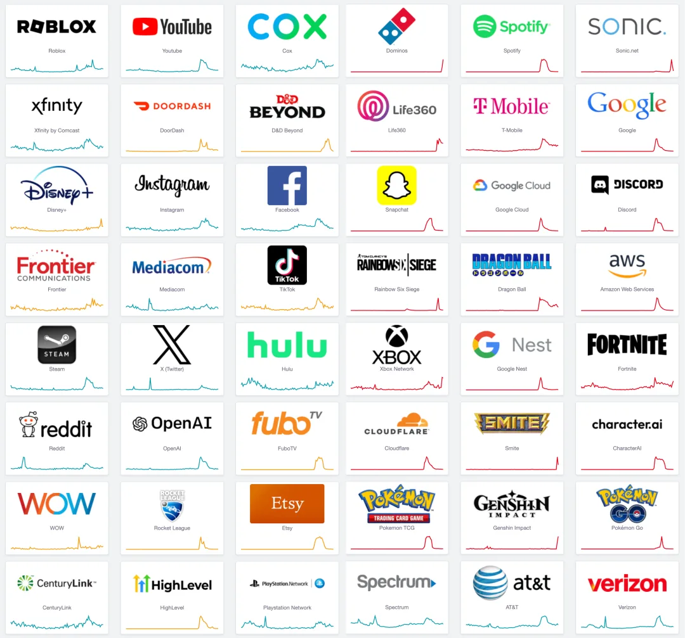
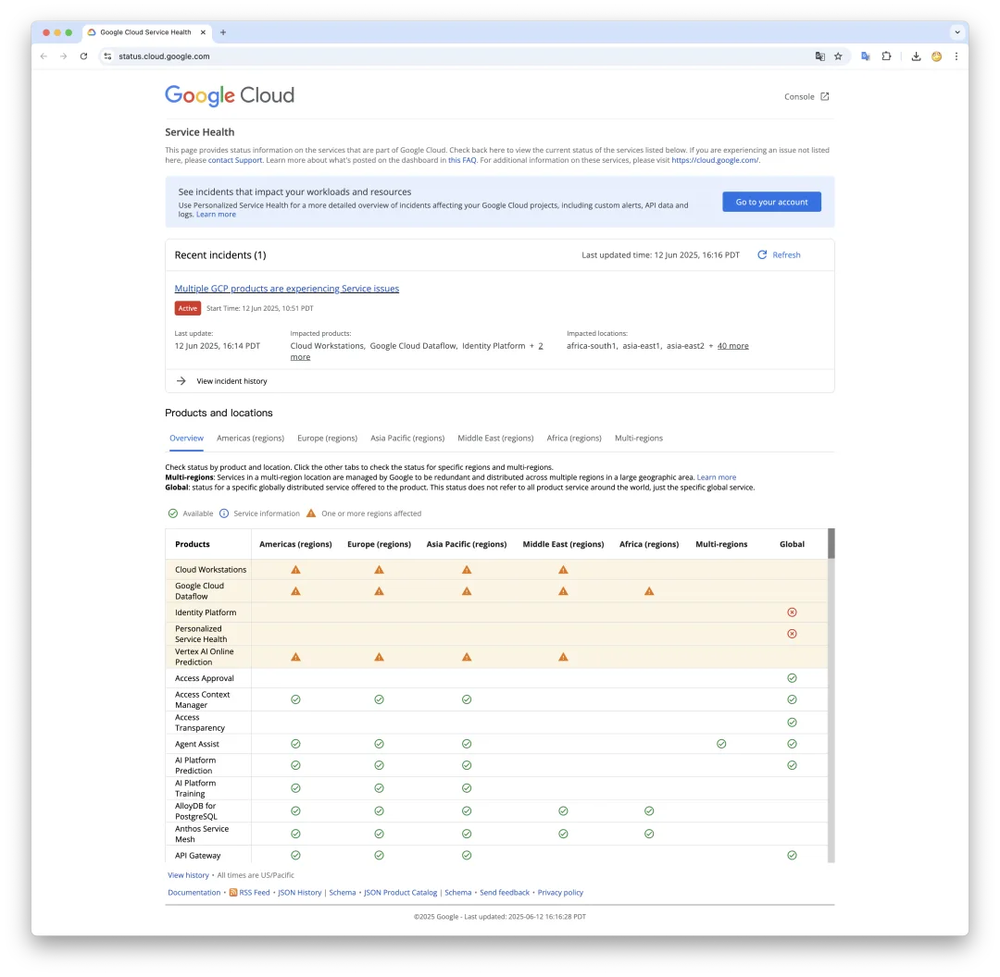
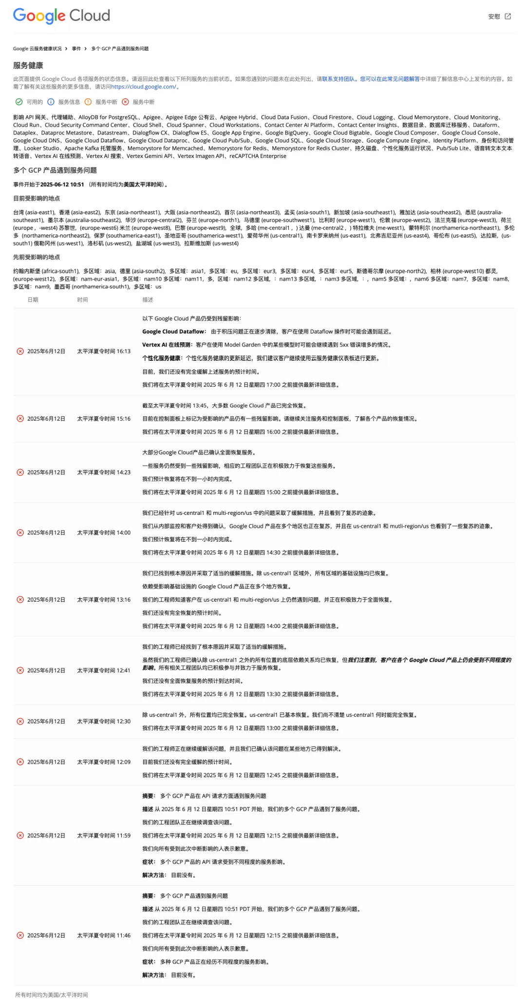
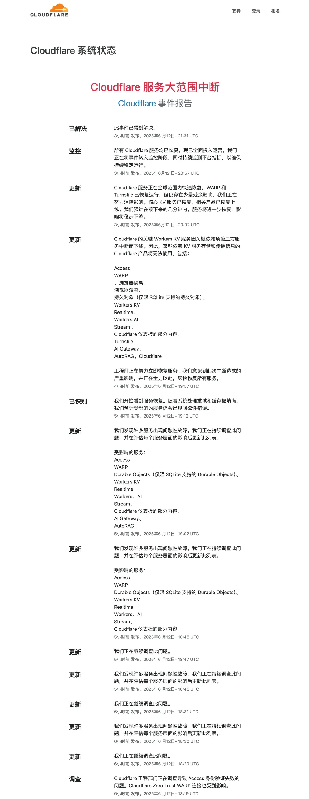

就是现在，根据 DownDetector 故障检测器的报告，几乎你能想到的主要互联网服务供应商都出现了显著故障与错误。背后的线索全部指向 Google 云平台 GCP 上的一场全局性大故障。

GCP 疑似因为核心的身份和访问管理（IAM）服务（内部名为 Chemist）出现全球地域，全局性的服务不可用。这场故障的原因几乎与前年 [阿里云史诗故障](/cloud/aliyun/) 如出一辙。

GCP 的故障影响到 Cloudflare 的关键服务，进一步导致承载了全球互联网 20% 的流量的云平台 Cloudflare 出现故障。CF 故障进一步将故障放大到互联网的各个角落。包括 Cursor，Claude，Spotify，Discord，Snapchat，Supabase 等诸多知名应用与服务都收到影响。

## 事件时间线

同时，Cloudflare 也发布了故障报告：

## 故障根本原因分析

根据 Google 在故障初期发布的信息，此次中断是由**身份和访问管理（Identity and Access Management，IAM）服务的问题**引起 （theregister.com[1] 有相关报道）

这次故障的原因，与阿里云在 2023 年双十一 [史诗级故障](/cloud/aliyun/) 的原因类似，都是由于身份验证、权限检查的核心服务发生故障，进而导致几乎所有的云产品故障。

事故发生后不久，Google 状态页直接提示“多项 GCP 产品因 IAM 服务问题而受到影响。这一点也在后续各种迹象中得到印证：许多用户报告调用 GCP API 时出现诸如“**visibility check failed**”（可见性检查失败）或“**cannot load policy**”（无法加载策略）之类的错误。这些错误信息表明，请求被阻断在权限/策略验证的环节，即**云请求在到达目标服务前就因为权限或策略检查无法通过而失败**。因此，可以推断根因在于**Google Cloud 内部的全局权限控制/策略服务**出现异常。

Hacker News 等技术社区的讨论挖掘出更多细节。一位疑似 Google 内部人士的评论提到，Google Cloud 内部有一个代号为**“Chemist”**的核心服务，正是负责所有 API 请求的项目状态和策略检查。根据 Google 官方文档描述：Chemist 在每个 API 请求到来时，会检查项目是否激活、帐户有无欠费或被封禁、服务启用状态、地域访问限制、VPC 服务控制策略、超额配额（SuperQuota）以及其他各种策略；在请求完成后还会记录遥测数据用于计费和监控

## 触发因素分析

**触发因素分析**：截至目前（事故发生次日），Google 尚未公布详细的事后分析报告（RCA），仅表示将在内部调查完成后对外发布分析。因此具体的触发原因只能根据现有信息推断。

老冯认为此次故障最大可能是因为 **配置或软件更新错误导致的**：大型云服务商的全球性事故，常常源于**配置变更或代码更新**的失误。考虑到此次事故在**太平洋时间上午**突然发生，可能恰逢某个全球发布窗口或变更操作。

一种合理推测是：Google 对 IAM/策略服务进行了某项更新（例如推送了错误的配置规则或部署了有缺陷的软件版本），结果导致该服务崩溃或拒绝请求，例如，阿里云 IAM 大故障的原因就是更新了 IAM 黑白名单配置导致其 依赖的 OSS 无法访问导致的。

历史上 Google 也发生过类似情况：如 2020 年 12 月的全球宕机事故，就源于内部身份认证系统因为**存储配额配置变更**而触发 bug，最终让身份服务瘫痪 45 分钟。此次 2025 年故障的症状与之相似——都是**核心身份/权限系统**出了问题。很可能一次不当的变更使 Chemist 或相关 IAM 服务无法正常允许请求，从而“一票否决”了各项云操作。Google 官方在事故中后期的表述也支持这一点：工程师**发现了根本原因**并采取措施，表明他们找到问题所在并进行了回滚或修复

另外的可能触发因素包括： **网络路由（BGP）故障**，边界/骨干网络中断，**Google 云内部 SDN（如 Andromeda）问题**。但似乎都没有更多证据可以证明这一点。

## 结论

本次事故有极大概率是 **Google 自身软件或配置失误**引发的一场控制平面灾难，而非外部攻击或纯粹硬件故障。Google 官方和多家媒体均未提及任何安全事件迹象。没有证据表明发生了恶意入侵、DDoS 等攻击。一切线索都指向**人为操作失误**：不是配置错误，就是软件 Bug。

另一个值得警醒的现象是，Cloudflare 作为一家云厂商，却对第三方 GCP 云平台有着依赖，在这次故障中被间接拖垮，这确实是一件非常奇怪的事情。

这场故障揭示出大型公有云平台的脆弱性：Google 这次的控制服务故障，其影响都超出了单个公司的范畴，成为全网用户共同承受的“多米诺骨牌”式中断。这警示着整个科技行业：大型公有云厂商已经成为互联网世界的 “单点”，而这可并不是互联网发明的初衷。

许多仅依赖自有服务器的独立网站都在此次事故中完好无损 —— 大多数公司最好投资一些 IT 人员，而不是将系统全部交给某个专有且极其复杂的云环境。否则，你会越来越依赖于你不认识、无法控制、也无法直接沟通的人与服务。

### References

- `[1]` : <https://cloud.google.com/service-infrastructure/docs/service-management/reference/rpc/google.api#control>
- `[2]` : <https://status.cloud.google.com/>
- `[3]` : <https://www.cloudflarestatus.com/incidents/25r9t0vz99rp>

---

发布版本：[微信公众号](https://mp.weixin.qq.com/s/yZOUzoEHQdBuNFrSIXVB9w)
