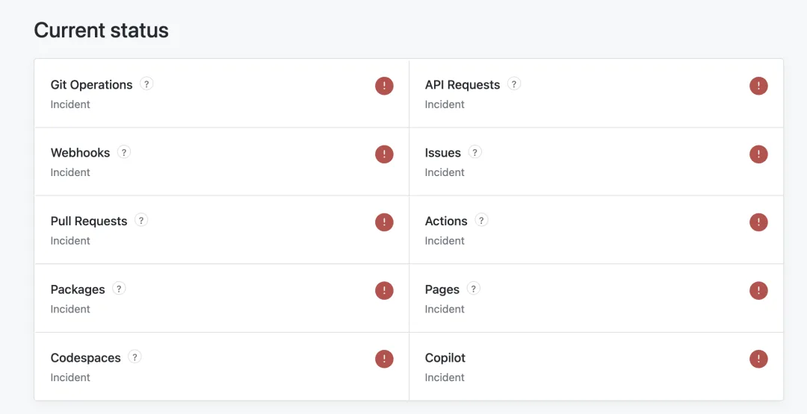
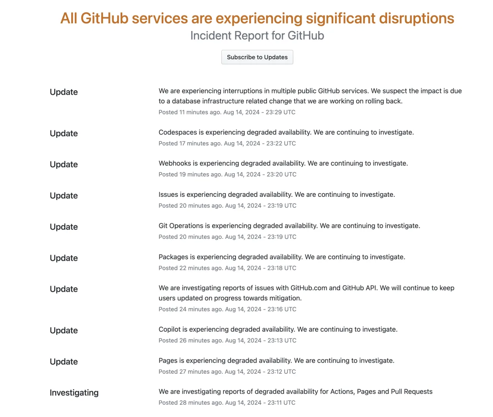

早上正在刷 GitHub，突然就遇见独角兽 —— GitHub 全站挂了，甚至连主页都无法加载。截止到本文发出时，已经过去半个小时，服务还没有恢复。

根据 <https://www.githubstatus.com/> 的状态页消息，本次影响范围为 GitHub 全站所有服务。

根据 GitHub Status 的消息，这次故障与**数据库基础设施上的变更**有关。

无状态的服务有许多恢复手段，即时挂了也比较容易恢复。而有状态的数据库一旦出问题，就是大问题。我们尚不知道是哪种数据库故障，与哪种数据库基础设施变更导致的故障。

---

发布版本：[微信公众号](https://mp.weixin.qq.com/s/nOzSFkULOJeuQ4NChGxE5w)
