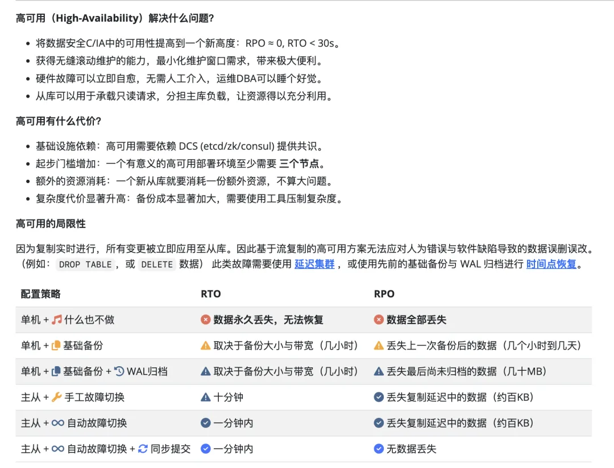

昨天，各八卦群中流传出一则《江教在线数据库删库》的消息。据称被删库的网站是江西教育系统的江教在线（www.know.edu.cn），也是江西高考成绩查询的网站 —— 出的问题是数据库被格式化，而且没有备份，甚至都没有数据库表结构，导致连拉起一套新的应用都不能。

中间的图片字是：“虽然说是他们格式化的服务器，但是我们没做异地备份”。

作为验证，访问江教在线网站提示《网站维护中》。刷新后可见一则 “迁移公告”，是否为删库请自行判断真伪。截至发稿，公示的新域名 [www.forsee.com.cn](http://www.forsee.com.cn/)[2] 目前仍然无法访问。江教在线应该庆幸的是，这次故障不是发生在暑假高考查分的时候，否则估计天都要捅穿了。

作为数据库老司机，我见过许许多多删库跑路的案例，并不感到稀奇，许多这类信息系统建设的项目其实都是纸糊的，数据库也许就是 yum install，systemctl start 或者什么祖传脚本与面板拉起来的，密码有可能就是 123456 这种。不翻车在服务器格盘上，也早晚会翻车在其他什么地方，主打一个拼八字拼运气。

---

那么正规的系统应该怎么做呢？通常来说，成熟的数据库需要高可用与时间点恢复来对数据进行兜底。高标准的集群还会使用到延迟从库，异地 S3 冷备，或者 Kafka 侧的日志副本。最不济最不济，一个单机运行的系统，也应该定期做冷备份，放到其他地方去（咱就别说异地了，放到另一台服务器或者另一块硬盘上都是好的）

光是数据库本身的 HA 和 PITR，对于普通开发者来说就已经是是有不小门槛与学习成本的事了。所以我在做开源 PostgreSQL 发行版 Pigsty 的时候，就默认把高可用和 PITR 搞进去了，并封装简化为默认启用无需配置的特性。目的就是，**让这些数据库用户不要再重复翻车在这种低级阴沟错误里了**：

## References

- `[1]` 江教在线（江西省高考成绩查询网站，原域名 `www.know.edu.cn` 已下线）
- `[2]` 新域名： <http://www.forsee.com.cn/>

---

发布版本：[微信公众号](https://mp.weixin.qq.com/s/b1b2mLIxnDImvM7Whlyuew)
